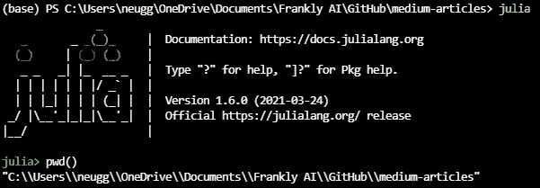
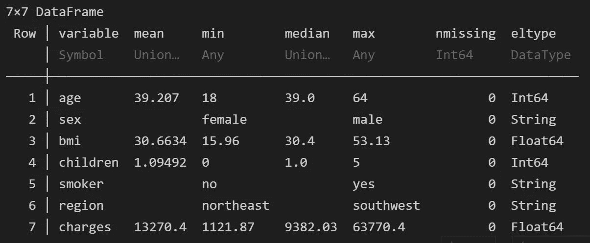
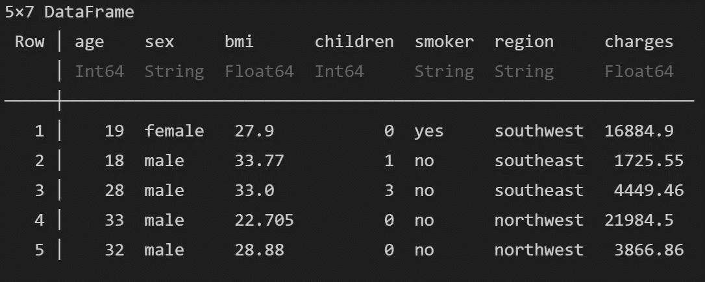
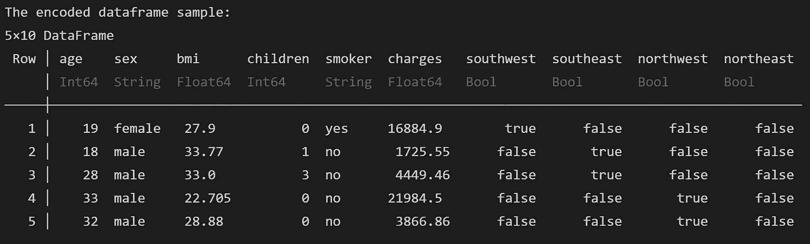
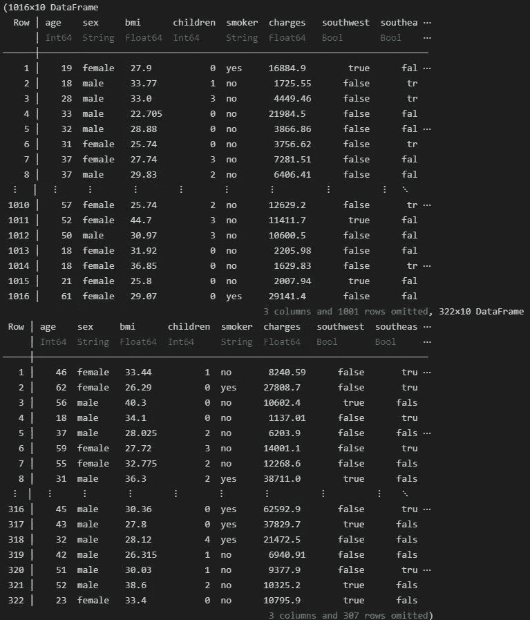
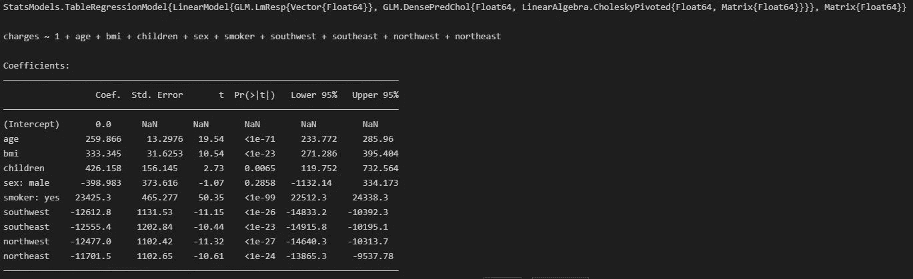

# Python 与 Julia——线性回归

> 原文：<https://towardsdatascience.com/python-vs-julia-linear-regression-49738b5de383?source=collection_archive---------19----------------------->

## 意见

## Python 程序员的视角

[王力普](https://unsplash.com/@king_lip?utm_source=medium&utm_medium=referral)在 [Unsplash](https://unsplash.com?utm_source=medium&utm_medium=referral) 上拍照

我的数据科学之旅始于我在贝尔维尤大学(Bellevue University)攻读数据科学硕士学位期间，在那里我学习了 R 和 Python。虽然我是 Python 的忠实拥护者，但它并不是我用过的最快的编程语言(也不是最慢的)。但是我听说了很多关于 Julia 的速度，所以我开始试验它。我甚至写了一篇 Medium.com 的文章，介绍如何与茱莉亚开始交往。我必须承认，我离开那篇文章时并没有对朱莉娅留下什么真正的印象，因为我没有对它做任何有用的事情。

但是正如我在以前的文章中所说，我喜欢竞争。那个激励了我。让游戏从我能理解的事情开始——建立一个线性回归模型，看看哪个更快、更好、更容易。(注意这种偏见的健康剂量，因为我已经每天使用 Python。)

## 导入包

在 Julia 中导入包非常类似于 R——如果包不在那里，我也可以添加包，如果在那里，就使用它。`Pkg`包允许我添加包，就像 Python 中的`pip`一样。

## 第一印象——朱莉娅

Julia 和 R 对于 imports(更确切地说，`using`)的相似性立刻让我开始怀疑 Julia 是不是 Python 和 R 的混血儿(如果是，我想我明白为什么人们会挖掘 Julia 了)。

但在这一点上，我没有真正显著的印象，只是怀疑我会喜欢上 Julia，因为比起 Python，我真的更喜欢 R 的直觉。

## 装载 CSV

我为此使用的数据来自 R GitHub 的*机器学习数据，可以在这里[找到](https://github.com/stedy/Machine-Learning-with-R-datasets/blob/master/insurance.csv)。Julia 和 Python 之间有一点*是相同的，那就是目录路径在 Visual Studio 代码中并不完全直接，所以在我指定数据文件的路径之前，我必须弄清楚解释器在什么目录中。如果你想知道我是如何让 Julia 使用 Visual Studio 代码的，请查看我之前提到的[入门文章](https://medium.com/codex/getting-started-with-uipath-77040b3f486f)。**

为了找出 Julia 中当前的工作目录，我在终端中使用`julia`命令启动了 REPL(它是解释器，相当于键入`python`)。然后我输入了`pwd()`，和 Python 一模一样的命令。(命令行开始的图形是如此的 20 世纪 80 年代-爱死它了。)

在 Julia 中使用 pwd()。图片作者。

在 Julia 中加载一个. csv 文件非常简单，然后在一个数据类型中使用它就更容易了。事实上，在 Julia 中有一个 DataFrames 包，有点像熊猫。

## 描述数据

朱莉娅`describe()`函数就像熊猫数据帧中的`describe()`和`info`的组合。看起来没有任何东西和熊猫`info()`完全一样，但是考虑到茱莉亚的`describe()`输出，这并不是必需的。

Julia describe()函数输出—作者图片

我并不讨厌`describe()`输出，但我认为我更喜欢 Python 中的`info()`和`describe()`分离——可能只是按行读取数据。(也可能只是熟悉度偏差。)

在 Julia 和 Python 之间，显示第一个行数也是相似的。不过，Julia 的语法有点不同。

`**println(first(insurance_df,5))**`

Julia first()函数输出-作者图片

我真的很喜欢这种方式，它为每一列指定了行和数据类型，格式也很好。**等等。哦，不。我以为我的好日子已经一去不复返了。五个字母就够了，为什么还要用七个字母呢？哦，好吧——印刷体在朱莉娅中是`println`。**

在我忘记之前，如果你对在 Visual Studio Code Jupyter 笔记本中使用 Julia 感兴趣，请确保获得[Visual Studio Code-Insiders](https://code.visualstudio.com/insiders/)。(蛮甜的。)

## 特征工程(轻型)

在这一点上，我不打算用 Julia 太深入地研究探索性数据分析，因为这会淡化 Julia 和 Python 在回归方面的比较。(我打算以后再深入探讨这个问题。)

然而，我必须对分类特征进行一次性编码。对于 Python，这意味着性别、吸烟者和地区。然而，Julia 可以处理二进制字符串，如 yes/no 男性/女性，true/false，而无需工程。(外加一个朱丽娅。)这仅留下了用于独热编码的区域特征。

为此，我将使用`Lathe`包的`OneHotEncoder`函数。Lathe 是 Julia 的 ML / stats 包(老实说，这是我所知道的全部)。

## 一键编码

Julia 和 Python 之间的独热编码非常相似(如果我把它比作熊猫`get_dummies()`——如果我把它比作 scikit，Julia 更简短——学习 OneHotEncoder)。

即使与`get_dummies().`相比，输出也明显不同

朱莉娅·OHE 输出—作者图片

注意，所有二进制特性的字符串都保持不变——包括编码的`region`特性。我更喜欢这样，因为读起来更直观。

## 建模阶段

和 Python 一样，我仍然需要分割数据用于训练和测试。车床有一个 TestTrainSplit 对象，它是先前通过`using`命令添加的。

`**train, test = TrainTestSplit(insurance_df,.75)**`

这里有几件事是不同的:

1.  百分比是相反的——使用 scikit-learn `train_test_split`函数，测试集的大小被指定。没什么大不了的，但是要记住
2.  x 和 y 不区分(特征和目标)。其原因将很快变得显而易见
3.  运行这一行代码有一个输出(与 scikit-learn 不同)——这个输出是必不可少的，就像对训练和测试数据运行`describe()`一样

Julia TrainTestSplit 输出-作者图片

拟合和测试模型是 Julia 的类 R 本质真正显现出来的地方。

我不是 R "@ "函数语法的粉丝(当我回忆起我作为 Lotus Notes 开发人员的日子时，我的眼睛在抽搐)。然而，它足够简单，也同样容易预测(但我更喜欢像 Python 中那样显式调用`fit`和`predict`)。

在拟合和测试模型时，有些东西是不同的——有自动输出，包括函数和系数。(我很喜欢那部分——也很像 R。)

Julia 在训练和拟合线性回归模型时自动输出-图片由作者提供

## 模型评估

对于这个简单的(多重)线性回归，我用 R2 评估了模型，只用了一行代码，就像用 Python 一样简单。

`**println(“\nR2 for the linear regressor: “, r2(linear_regressor))**`

输出是:

`R2 for the linear regressor: 0.7514530856688412`

有趣的是，用 Python 创建的同一个模型的输出是:

`R2 for the linear regressor: 0.7424`

我的猜测是，小的 R2 差异是因为有更少的独热编码，因此在朱莉娅数据中用于训练的维度更少。

## 正误表

一些不属于数据科学过程本身的值得一提的事情:

1.  我没有注意到任何性能差异，但数据足够小，这不是决定性的
2.  我并不认为其中一个比另一个更好——但我仍然有动力继续前进(我现在更加好奇)
3.  类似 R 的语法有好有坏(或者说我是真正面向 Python 的)
4.  这迫使我挑选 Visual Studio 代码内部人员——光是入场费就足够了

我希望你和我一样喜欢这一半。

## 参考

[1]辛格，卡比尔。(N.D.) *朱莉娅*中的线性回归。[https://www . machine learning plus . com/linear-regression-in-Julia/](https://www.machinelearningplus.com/linear-regression-in-julia/)