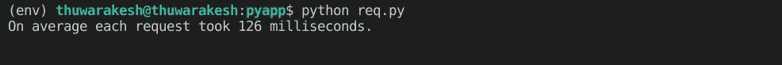
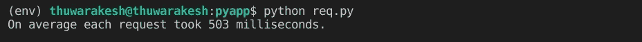

# Python Web 应用对于分析项目来说是一个糟糕的想法。

> 原文：<https://towardsdatascience.com/python-web-apps-are-a-terrible-idea-for-analytics-projects-36f1bd33e84b?source=collection_archive---------2----------------------->

## 纯 Python 栈忽略了严重的缺点。以下是如何弥补的方法。


蒂姆·高在 [Unsplash](https://unsplash.com?utm_source=medium&utm_medium=referral) 上拍摄的照片

这是本能。我们数据科学家热爱 Python。因此，我们在每个应用程序中都倾向于 Python 框架。万能的语言似乎在大多数情况下也能很好地工作。其中一个场景是为您的分析项目构建 web 应用程序。

其中的关键词是“大多数情况”Python 是一门漂亮的语言，几乎可以用在任何问题上。然而，仔细观察可能会发现一些细微的差别，这些差别可能会使 Python 在某些情况下变得无关紧要。

多年来，我一直是姜戈的粉丝。它是构建 web 应用程序最流行的 python 框架。Django 提供了一个典型的 web 框架所需要的一切——认证、数据库迁移、管理界面等等。集成一个机器学习算法是毫不费力的，因为两者都在同一种语言中。

然而，在发现关于这个框架的可怕事实后，我不得不改变我的想法。更具体地说，它在数据科学项目中的使用。但这不是姜戈的事；是 Python。即使您使用其他 Python web 框架，如 Flask，也必须面对同样的问题。

但是在匆忙抛弃 Django/Flask 之前，我不得不说这不是一个死胡同。我们可以让 Python 再次变得伟大；作为一个网络框架。

在本文中，我们将讨论

*   Flask 与 ExpressJS 执行长时间运行任务的比较；
*   调查 python web 应用在分析项目中失败的原因，以及；
*   使 Python web 应用程序更好地满足请求的变通方法。

# Python 和 JavaScript web 应用程序。

与 JavaScript 相比，我们需要一个演示来理解 Python 的问题。

因此，让我们在每种语言中使用两种流行的框架来完成相同的任务——计算第 30 个斐波那契数。下面是我们如何使用 Flask (Python。)

Python (Flask)服务于第 30 个斐波那契数——作者。

要运行上述任务，您可以在终端中使用以下命令:

```
pip install flask # if Flask is not installed yet.
flask app.py
```

现在让我们用 Express JS (JavaScript)做同样的事情:

JavaScript (ExpressJS)服务于第 30 个斐波那契数——作者。

以下是使用 node 启动服务器的方法:

```
npm install express --save # if express is not installed already
node app.js
```

如你所见，两者在各方面都很相似。它在请求中不接受任何参数，计算第 30 个斐波那契数，并返回相应的值。

我们在单个线程中以开发模式启动这两个应用程序。这正是我们所需要的，因为我们在单个线程中测量它们的性能。

最后，让我们通过向服务器发出多个请求并记录时间流逝来模拟真实世界。下面的代码在 10 个并行线程中向我们的服务器发送 1000 个请求。该计划还将打印平均耗时毫秒。

使用 10 个线程计算 1000 个请求的平均响应时间。

让我们比较一下结果。以下是节点服务器服务时的结果:



使用 JavaScript 服务器计算第 30 个斐波那契数 1000 次所用的平均时间截图——来自[作者](https://thuwarakesh.medium.com/)。

当 Flask 为请求提供服务时，情况也是如此:



使用 Python 服务器计算第 30 个斐波那契数 1000 次所用的平均时间截图——来自作者[。](https://thuwarakesh.medium.com/)

多次做这个实验会得到几乎相似的结果。Express (JavaScript)处理请求的速度比 Flask (Python)快近四倍。)

计算第 30 个斐波那契数并不是一个长期运行的任务。但这足以帮助我们理解这个问题的重要性。

# 是什么让 Python 服务器变慢了？

你去一家名为“Sync”的餐厅，那里的服务员叫 Python。一个陌生人先点他的食物。Python 去了厨房，二十分钟后回来，给陌生人上菜。然后他走过来问你:“先生，你要点什么？”

如果你现在点菜，你将不得不再等二十分钟。

出于无奈，你离开了那家餐厅，去了另一家名为“Async”的餐厅。在那里，水的名字是 JavaScript。同样，一个陌生人先点他的食物。JavaScript 去了厨房，一会儿就回来。他对陌生人叽叽喳喳地说了些什么，然后沿着你的路走过来，问道:“先生，你要点什么？”

你点了你的食物；陌生人在接下来的 18 分钟内得到了他的，而你在 20 分钟内得到了你的。

这就是 Python 和 JavaScript 的工作方式。Python 以同步的方式一次处理一个任务。然而，当已经有一个请求正在处理时，JavaScript 接受了另一个请求。这种异步行为使得基于 JavaScript 的 web 应用程序速度更快。

# 如何让 Python web 应用更好地执行分析？

只要您只有短暂的请求或长期运行的任务，并且只有少量来自用户的预期请求，那么您就做得很好。像 Flask 和 Django 这样的 Python 框架是理想的，因为你可以用一种语言——Python 来保存所有的东西。

当您有大量需求的长时间运行的任务时，复杂性就会增加。为了保持服务器正常运行，您可能需要部署多个实例并很好地平衡负载。这种变通方法在大多数情况下是不可持续的。它把成本飙升到一个疯狂的高度。

数据科学项目经常伴随着这种长时间运行的任务。没有异步行为的繁重计算可能需要更多的计算能力。然而，在转移到不同的框架之前，您可以尝试一些变通方法。

## 将计算从请求-响应周期中分离出来。

无论如何，将高性能计算与 web 服务器结合在一起是一个糟糕的想法。即使是异步服务器也不应该在请求-响应周期内为它们服务。如果是这样，Instagram 和 Spotify 这样的巨型平台是如何处理海量计算的？这里有一篇文章可以回答这个问题。

[](/how-to-serve-massive-computations-using-python-web-apps-590e51624bc6) [## 如何使用 Python Web 应用服务于大规模计算？

### 克服 Python 的局限性，并通过 web 请求将其用于繁重的数据分析和机器学习。

towardsdatascience.com](/how-to-serve-massive-computations-using-python-web-apps-590e51624bc6) 

这个想法是向运行在独立线程上的计算引擎发送消息。web 服务器不需要等到计算完成才发送响应。相反，计算引擎更新数据库。web 服务器可以使用单独的端点随时读取其值。

## 尝试优化您的代码。

不管您将使用哪种框架，如果您总是试图优化您的代码，那将是最好的。最近的一个库似乎在优化 Python 程序方面非常有效。

Tuplex 将您的 Python 代码转换为本地 LLVM，并并行运行它。该库背后的团队在一篇研究文章中显示，它的速度大约快了 91 倍。下面是我之前写的一篇关于这个话题的详细文章:

[](/how-to-speed-up-python-data-pipelines-up-to-91x-80d7accfe7ec) [## 如何将 Python 数据管道加速到 91X？

### 一个 5 分钟的教程可以为您的大数据项目节省数月时间。

towardsdatascience.com](/how-to-speed-up-python-data-pipelines-up-to-91x-80d7accfe7ec) 

## 引入异步行为。

Flask 和 Django 都有引入异步行为的方法。对于潜在的耗时任务，这种变通方法是一个很好的选择。

然而，这两个框架在它们的文档中都提到它们有几个缺点。因此，在所有的 web 请求中使用它们是不明智的。

标准 Python 库 asyncio 帮助您异步转换一些函数。尽可能使用它。

因为 Python 本身不是异步的，所以所有这些解决方法都依赖于运行一个无限事件循环。尽管它们在许多方面并不完美，但在迁移之前考虑它们是值得。

# 最后的想法

Python 是一种非常棒的数据科学编程语言。因为它是一种通用语言，Python 的应用并不局限于数据科学。但这并不意味着它是所有用例的完美语言。

因为大多数数据科学家已经爱上了 Python，所以我们选择 Flask 和 Django 这样的框架来构建 web 应用。然而，其同步行为可能导致生产中严重的成本劣势。

JavaScript 本质上是异步的，对于长时间运行的任务表现更好。但是，python 框架也有一些变通方法来提高它们的性能。因此，在决定迁移之前考虑它们是值得的。

如果你仍然喜欢 Python web 应用程序而不是你的数据科学项目，那么试试 streamlit。

[](/how-to-create-stunning-web-apps-for-your-data-science-projects-c7791102134e) [## 如何为您的数据科学项目创建出色的 Web 应用程序

### 数据科学家不必学习 HTML、CSS 和 JavaScript 来构建网页。

towardsdatascience.com](/how-to-create-stunning-web-apps-for-your-data-science-projects-c7791102134e) 

> 谢谢你的阅读，朋友。看来你和我有许多共同的兴趣。一定要看看我的个人博客。
> 
> ***向我问好*** 上[LinkedIn](https://www.linkedin.com/in/thuwarakesh/)[Twitter](https://twitter.com/Thuwarakesh)[中](https://thuwarakesh.medium.com/subscribe)。我会为你打破僵局。

还不是中等会员？请使用此链接 [**成为**](https://thuwarakesh.medium.com/membership) 会员。你可以享受成千上万的有见地的文章，并支持我，因为我赚了一点佣金介绍你。