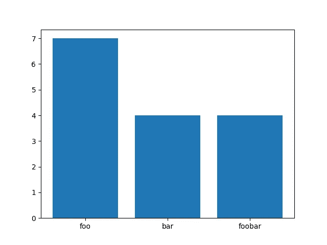

# Pythonic 计数:概述

> 原文：<https://towardsdatascience.com/pythonic-counting-an-overview-4266edbb0001?source=collection_archive---------27----------------------->

## 计算元素非常重要！学会如何雄辩地做到！


克里斯·贾维斯在 [Unsplash](https://unsplash.com?utm_source=medium&utm_medium=referral) 上的照片

在 Python 或任何其他编程语言中，当试图解决问题和/或操作数据集时，计算具有给定属性的元素的数量是一项经常发生的任务。在数据科学项目中，通过循环操作数据通常需要了解正在处理多少项(即计数)。因此，了解一种简单易行的方法来实现这一点非常重要。Python 有许多不同的方法来实现这一点，在本文中，我们将介绍一种基本的方法，以及一些更有说服力的方法来进行计数操作。


由[伊莎贝拉和 Zsa Fischer](https://unsplash.com/@twinsfisch?utm_source=medium&utm_medium=referral) 在 [Unsplash](https://unsplash.com?utm_source=medium&utm_medium=referral) 拍摄的照片

## 循环内计数:

在计数操作的核心，分配一个变量来表示计数，通常是整数数据类型。如上所述，在循环 a 中，如果满足特定标准，计数器变量将被要求增加 1。下面的代码块给出了一个简单的例子:

```
**# Option #1**
list = ['foo', 'bar', 'foo', 'foo', 'bar', 'foobar']
counter = {}

for item in list:
    if item not in counter:
        counter[item] = 0
    counter[item] += 1

In[1]: counter
Out[1]: {'foo': 3, 'bar': 2, 'foobar': 1}
```

在上面的例子中，没有将计数器设置为一个普通的整数变量，而是使用了一个字典来生成被计数项的键值对及其各自的计数。这是一个很好的将它加入字典的附加功能，但是下面有两个例子来说明如何做同样的事情，但是更简洁一些。

```
**# Option #2**
list = ['foo', 'bar', 'foo', 'foo', 'bar', 'foobar']
counter = {}
for item in list:
    counter[item] = counter.get(item,0) + 1In[2]: counter
Out[2]: {'foo': 3, 'bar': 2, 'foobar': 1}**# Option #3**
from collections import defaultdict

list = ['foo', 'bar', 'foo', 'foo', 'bar', 'foobar']
counter = defaultdict(int)
for item in list:
    counter[item] += 1In[3]: counter
Out[3]: defaultdict(int, {'foo': 3, 'bar': 2, 'foobar': 1})
```

因此，上面的选项 2 和 3 都提供了循环内计数的一些干净的替代方法。第二个选项使用 dict.get()方法，并将初始值指定为 0。通过循环，当遇到给定的键时，会添加“+ 1”部分，使值增加 1。仔细看看第三个选项，我们可以看到 defaultdict 项是从 collections 库中导入的，它被初始化为一个整数数据类型的对象。这个循环很简单，当 deafultdict 遇到列表中的条目时，条目(dict 中的键)的值增加 1。因为它是一个 deafultdict，所以任何新项(或键)的初始值默认为 0。所以这里我们有 3 种方法来利用计数操作和变量循环，后一个例子稍微简化了代码。


亚历克斯·丘马克在 [Unsplash](https://unsplash.com?utm_source=medium&utm_medium=referral) 上的照片

## Python 的计数器子类

幸运的是，由于计数在项目中是如此重要的一个过程，Python 在 dict 对象中构建了一个 Counter 子类。它的特别之处在于，对于可散列对象的序列，它会自动构建并输出一个元素及其计数的字典。我们可以在下面的例子中看到，Counter 子类进一步简化了事情。

```
from collections import Counter

list = ['foo', 'bar', 'foo', 'foo', 'bar', 'foobar']
count = Counter(list)In[4]: count
Out[4]: Counter({'foo': 3, 'bar': 2, 'foobar': 1})
```

不需要遍历列表，因为这是计数器固有的功能。有趣的是，在列表中，您可以在计数器中为项目赋值，以获得 0 值甚至负值(这将取决于您的约定或过程，如出库清单)。

计数器的一个非常好的特性是，一旦你指定了一个变量来计算一些东西，如果有状态变化，你想更新所有东西的计数，有一个更新方法。更新允许已经执行的计数被新的字典或计数对象更新。下面的例子说明了如何应用这种方法。

```
from collections import Counter

list = {'foo': 4, 'bar': 3, 'foobar': 1}
count = Counter(list)

new_list = {'foo': 3, 'bar': 1, 'foobar': 3}
count.update(new_list)

In[5]: count
Out[5]: Counter({'foo': 7, 'bar': 4, 'foobar': 4})
```

注意，最后 count 的输出是通过 update 方法得到的列表和新列表的总和。


由[拉克伦·唐纳德](https://unsplash.com/@lox?utm_source=medium&utm_medium=referral)在 [Unsplash](https://unsplash.com?utm_source=medium&utm_medium=referral) 上拍摄的照片

## 有用的计数器功能:

可以从计数器中提取的另外两个东西是获取唯一项的计数，以及获取列表中前“n”项的排序列表。要获得一个唯一项的计数，只需使用一个括号，括号内的项的名称跟在分配给计数器的变量后面。most_common 方法也可以与内的参数一起应用，将输出限制为列表中的前“n”项。下面可以看到这两个东西的例子。

```
# Count of Named Element
In[6]: count['foo']
Out[6]: 7# Example of Top 'n' items
In[7]: count.most_common(2)
Out[7]: [('foo', 7), ('bar', 4)]
```

请注意，most_common 方法将按降序对列表进行排序，并将计数限制为用作参数的数字。


[活动创建者](https://unsplash.com/@campaign_creators?utm_source=medium&utm_medium=referral)在 [Unsplash](https://unsplash.com?utm_source=medium&utm_medium=referral) 上拍摄的照片

## 直方图和曲线图:

通过了解如何构建自定义计数方法，您可以通过可视化数据将数据带到下一个级别。在下面的简单示例中，我们采用了我们一直在使用的相同数据，并对数据应用了一个简单的条形图。我稍微修改了一下示例，使语法更加清晰，并且在参数中不使用字符串，但是结果是一样的。下面的代码显示了我如何获取从计数器创建的字典，并将它们分配给变量，然后我可以使用这些变量来绘图。

```
from collections import Counter
import matplotlib.pyplot as plt

count = Counter(foo=4, bar=3, foobar=1)

new_list = Counter(foo=3, bar=1, foobar=3)
count.update(new_list)

x = count.keys()
y = count.values()

plt.bar(x,y)
plt.show()
```



计数示例的简单直方图

请注意，还可以增加更多的复杂性，可视化的类型也可以增加。

## 总结:

我只是想以展示计数是一个简单的概念性问题来结束，我们可能需要这样做来检查和可视化我们的数据集，并且在 Python 中有多种方法来为猫剥皮，以及在核心 Python 中有许多很酷的内置功能。