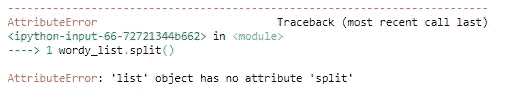
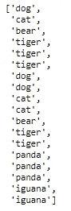
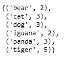
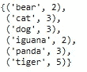
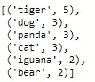
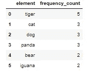

# Pythonic 提示和技巧—频率提取

> 原文：<https://towardsdatascience.com/pythonic-tip-tricks-frequency-extraction-5ecc23b73c16?source=collection_archive---------53----------------------->

## 毒蛇之路

## 如何从列表中构造数据帧


照片由 [Unsplash](https://unsplash.com?utm_source=medium&utm_medium=referral) 上的 [Stijn Swinnen](https://unsplash.com/@stijnswinnen?utm_source=medium&utm_medium=referral) 拍摄

Python 是一门优秀的语言，适合新程序员学习。它的直观性质使大多数人很容易快速理解代码和算法实际上在做什么。在这篇文章和以后的许多文章中，我们将讨论使用 Python 解决初学者练习中更复杂问题的许多方法。请注意，对于所有这些文章，我将使用 Jupyter 笔记本来显示代码的结果。

我们开始吧！

因此，让我们想象一下，给你一个单词列表，你必须从中提取特定的指标。你会怎么做？

## **文字**

```
wordy_list = ['dog cat bear tiger tiger tiger dog dog cat cat bear   
               tiger tiger panda panda panda iguana iguana']
```

你可能注意到的第一件事是上面的列表不太适合数据分析。一个关键问题是数据被保存为单个字符串。然后，我们的第一步是将字符串分解成单词列表。为此，我们使用 Python 中可靠的 *split()* 函数。

```
list_of_words = wordy_list.split()
```



属性错误

哦，不，似乎我们有一个错误。原因很简单。如果我们看这个变量，它在技术上是一个列表，然而它是一个只包含一个字符串作为元素的列表。这种问题在数据科学领域非常普遍，因此我们必须保持警惕，尽早发现这种问题。为了避免这个错误，我们可以简单地将 split()函数与索引结合使用。

```
list_of_words = wordy_list[0].split()
```



构建的单词列表

很好，这个列表非常适合数据分析。所以让我们从一些基本任务开始。

## 计算每个单词出现的次数

在您的数据科学之旅中，您会多次遇到一个相当简单的任务，那就是频率分析。下面的函数将返回一个列表的所有元素，作为一组带有 *(element，element frequency)* 的元组:

```
def word_counter(word_list):
    new_list = []
    for w in word_list:
        number = word_list.count(w)
        datapoint = (w, number)
        new_list.append(datapoint)
    return set(new_list)counted_list = word_counter(list_of_words)
```



功能输出

太好了，任务现在完成了！

但假设你想给你的老板和学校留下深刻印象。你不应该给他们这样的代码。虽然代码实现了它的功能，但是有更多美观的方式来编写它。下面是一个代码示例，它执行完全相同的任务，但是写得非常干净。

```
def word_counter(word_list):
    return set([(element, word_list.count(element)) 
               for element in word_list])counted_list = word_counter(list_of_words)
```



完全相同的输出

我们可以看到，这个函数现在已经简化为一行代码。代码不仅保留了所有的功能，而且看起来简单而优雅。

## 计算每个单词出现的次数，并从最频繁到最不频繁排列输出

现在，您的老板希望您构建频率计数，但也希望您返回从最频繁出现的单词到最不频繁出现的单词排列的数据。当然，我们可以在返回数据后简单地处理它，但是为了节省时间，让我们将这个特性构建到函数中。为此，让我们利用 *sorted()* 函数以及 *lambda 函数*。

```
def word_counter(word_list):
    new_list = [(element, word_list.count(element)) 
                for element in set(word_list)]
    return sorted(new_list, key = lambda j: j[1], reverse  = True)counted_list = word_counter(list_of_words)
```



排列列表

太好了，我们现在已经完成了任务。

## 最后一分钟改变！！！

假设你的老板早上 7 点打电话给你，迫切需要你修改你的代码。

“有什么问题？”你可能会问。

“我们需要将数据从最频繁到最不频繁排列，然后按字母顺序排列，我们还需要将它存储为一个数据框”你的老板说。

相信我，这种情况在数据科学领域非常普遍。让我们答应这个要求吧。下面的代码确保输出按最频繁到最不频繁的元素排列，然后按字母顺序对元素排序。此外，我们将数据加载到 pandas 数据框架中。注意，我们必须导入 pandas 模块。

```
import pandas as pddef word_counter(word_list):
    new_list = [(element, word_list.count(element)) 
                for element in set(word_list)]
    return pd.DataFrame(sorted(new_list, 
                               key=lambda x:(-x[1], x[0])),
                        columns = ['element', 'frequency_count'])df_counted = word_counter(list_of_words)
```



频率数据帧

太好了，这应该会让我们的老板和其他股东满意。

**总之**

我们已经看到了 Python 可以帮助简化数据分析的一些方式。对于本文，我使用的样本列表非常短，但是实际上这样的任务会涉及到成千上万的非结构化数据点。在未来的课程中，我们将回顾使用 Python 来帮助我们进行数据分析的其他方法，但现在，我希望我能够给你一个关于如何将 Python 应用于简单任务的想法。