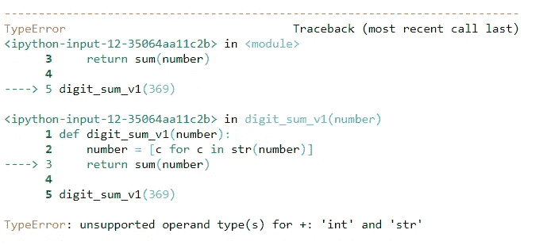
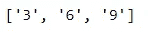
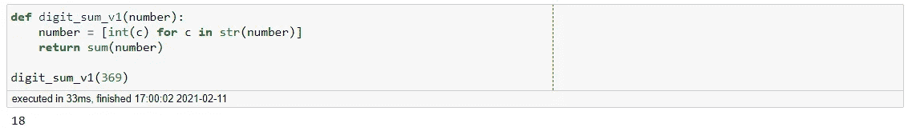
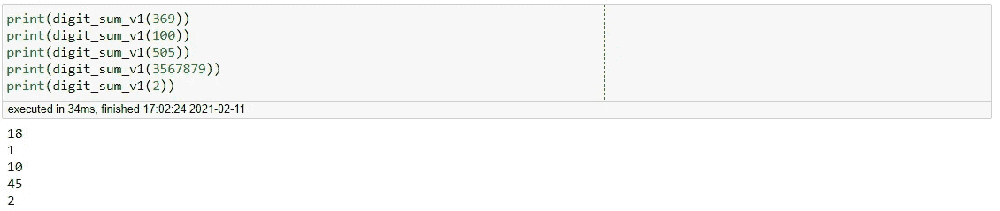
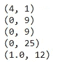
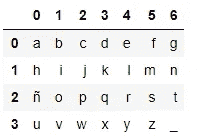
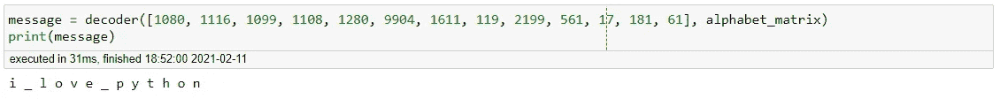

# Pythonic 提示和技巧—基本密码学

> 原文：<https://towardsdatascience.com/pythonic-tips-tricks-basic-cryptography-361d8cd39071?source=collection_archive---------38----------------------->

## 地下室的故事

## 使用 Python 解密编码信息


[阿吉特](https://unsplash.com/@arget?utm_source=medium&utm_medium=referral)在 [Unsplash](https://unsplash.com?utm_source=medium&utm_medium=referral) 上拍摄的照片

成为数据科学家的挑战之一是解决让大多数人摸不着头脑的独特问题。这些范围从看似无害的教科书练习到多年未解的复杂谜题。在本文中，我们将讨论一些中间问题，这将有助于您更好地理解如何解密加密消息。然后，我们将应用我们的知识来解决一个基本的破译练习。

## 获取整数中所有数字的总和

假设这个问题是:

> "得到一个整数中所有数字的总和，使解决方案足够一般化，以适用于任何整数"

假设给我们的数字是一个*整数*，我们可以简单地将它转换成一个字符串，然后简单地使用 split 函数得到一个数字列表。我们所要做的就是使用 *sum* 函数。

```
def digit_sum_v1(number):
    number = [c for c in str(number)]
    return sum(number)

digit_sum_v1(369)
```



函数输出

看来我们遇到了一个错误。幸运的是，这个问题很容易解决。在求和之前，我们只需要看看函数的输出。



函数输出

我们可以看到列表中的所有元素实际上都是字符串。这意味着，要修复我们的函数，我们只需在执行 sum 函数之前，将列表中的每个元素转换成一个整数。

```
def digit_sum_v1(number):
    number = [int(c) for c in str(number)]
    return sum(number)digit_sum_v1(369)
```



校正输出

太好了，我们的函数做了我们想要它做的事情。让我们做一个理智检查。



对函数进行健全性检查

一切似乎都很好。这是一个相当简单的练习，现在让我们把这个练习变得复杂一点。

## 合并 If-Else 逻辑时，获取整数中所有数字的总和

假设这个问题是:

> “得到整数中所有偶数数字的**和所有奇数数字**的**乘积。如果整数大于 5000，取所有偶数**的**乘积和所有奇数**的**和。使解决方案足够一般化，可以处理任何整数”**

咻，那肯定变得复杂多了。实际上，这比简单的数字求和函数更接近数据科学家的要求。因此，让我们来解决这个挑战。

```
from numpy import prod
def digit_sum_v2(number):
    digit_even = [int(c) for c in str(number) if (int(c)%2 == 0)]
    digit_odd = [int(c) for c in str(number) if (int(c)%2 != 0)]

    if number > 5000:
        even = prod(digit_even)
        odd = sum(digit_odd)
    else:
        even = sum(digit_even)
        odd = prod(digit_odd)
    return even, odd
```

注意，我们必须利用 NumPy 中的 *prod* 函数。本质上，我们正在做的是创建两个不同的列表，一个由所有偶数数字填充，另一个由所有奇数数字填充。然后，我们根据整数的大小执行 sum 和 prod 函数。

让我们通过几个整数运行我们的函数，看看它是否给出我们想要的。

```
print(digit_sum_v2(1212))
print(digit_sum_v2(1313))
print(digit_sum_v2(3131))
print(digit_sum_v2(1515))
print(digit_sum_v2(5151))
```



函数的输出

很好，我们的功能正常工作。请注意，我们函数的一个特性是它不知道数字的位置。这意味着数字完全相同的数字应该产生完全相同的结果，**除非**其中一个数字大于 5000。

现在你可能会问自己，这和编码信息有什么关系？让我们再一次提高这个最后问题的复杂性。

> “得到一个整数中所有小于等于 5 的数字的**和所有大于 5** 的数字的**积。如果大于 5000，取所有小于等于 5 位的**和大于 5 位的**之和的**乘积。****
> 
> 按照以下逻辑将结果映射到字母数据帧:
> 
> 5 输出下方的**索引数据帧**行****
> 
> 5 输出上方的**索引数据帧**列****
> 
> 通过数据帧**循环的两个输出索引**
> 
> 你应该只使用一个**单一函数**，它将把一个**整数列表**和**字母数据帧**作为输入

```
import numpy as np
import pandas as pd
alphabet_matrix = pd.DataFrame(np.array(list('abcdefghijklmnñopqrstuvwxyz_'))
             .reshape(4,7))
alphabet_matrix
```



字母数据帧

请注意，在本练习中，下划线代表空格。好吧，让我们来解决这个问题。

```
def decoder(list_of_ints, df_reference):
    references = []
    for i in list_of_ints:
        below_5 = [int(c) for c in str(i) if (int(c) <= 5)]
        above_5 = [int(c) for c in str(i) if (int(c) > 5)]
        if i > 5000:
            bel_5 = prod(below_5)
            abv_5 = sum(above_5)
        else:
            bel_5 = sum(below_5)
            abv_5 = prod(above_5)
        references.append((bel_5, abv_5))

    final_message = [df_reference
                    [r[1]%(df_reference.shape[1])]
                    [r[0]%(df_reference.shape[0])]
                    for r in references]

    return ' '.join(final_message)
```

让我们运行这个函数，看看隐藏的消息是什么。

```
message = decoder([1080, 1116, 1099, 1108, 1280, 9904, 1611, 119, 2199, 561, 17, 181, 61], alphabet_matrix)
print(message)
```



多甜蜜啊

**总之**

我们构造了一些有趣的函数来帮助我们破译加密信息。可以想象，大多数加密的信息不会这么容易被解码。尽管如此，我相信这篇文章足以让您对如何着手研究密码学领域有一个基本的了解。在以后的文章中，我们将讨论更复杂的函数，并应对更有趣的挑战。