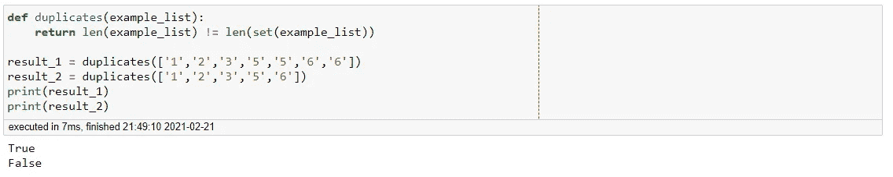
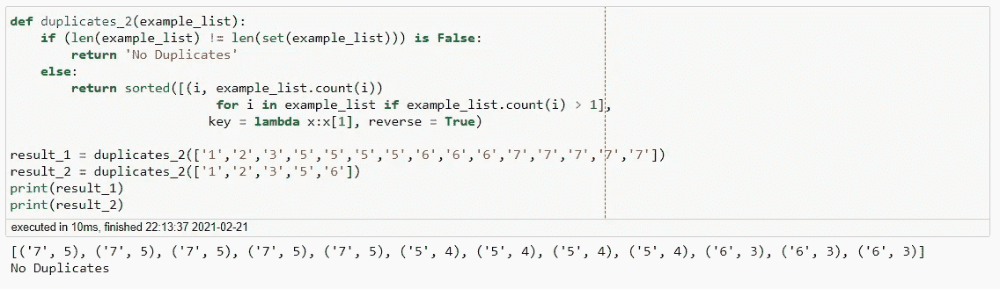
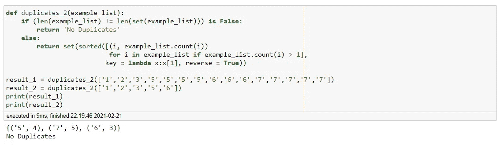
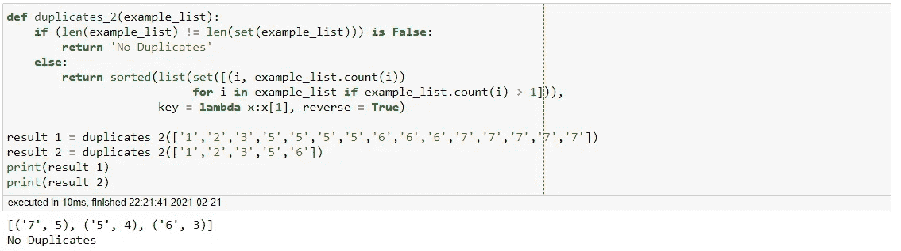
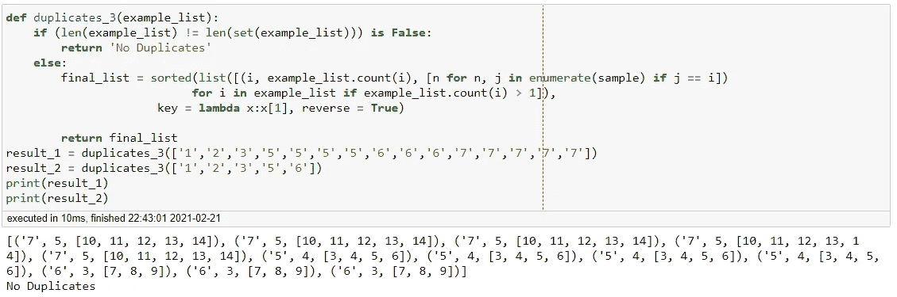
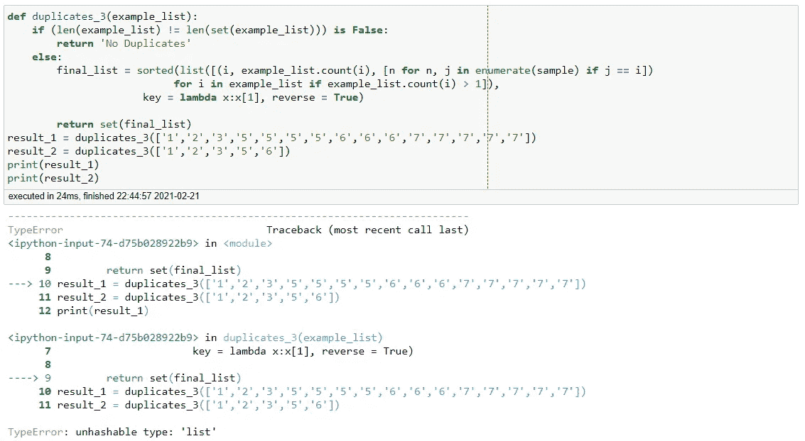
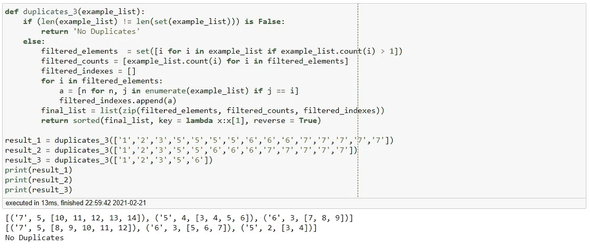

# Pythonic 提示和技巧—识别和索引重复项

> 原文：<https://towardsdatascience.com/pythonic-tips-tricks-checking-and-indexing-duplicates-d62fdfea9eec?source=collection_archive---------35----------------------->

## 毒蛇之路

## 如何识别和索引列表中的重复项


Wolfgang Hasselmann 在 [Unsplash](https://unsplash.com?utm_source=medium&utm_medium=referral) 上拍摄的照片

重复检测和索引是每个数据科学家都应该具备的基本技能。在处理任何数据集时，识别和定位相同的值非常重要。在这篇文章中，我们将看看你可以使用的几种技术。

我们开始吧！

假设你收到了下面的问题。

> "创建一个函数来检查列表中是否有重复值，如果有重复值，将它们全部列出。如果列表没有重复项，返回“**没有重复项**”。

相当简单的问题，让我们看看如何编码。

```
def duplicates(example_list):
    return len(example_list) != len(set(example_list))result_1 = duplicates(['1','2','3','5','5','6','6'])
result_2 = duplicates(['1','2','3','5','6'])
print(result_1)
print(result_2)
```



产出 1

上面的代码能够检查输入的列表是否包含任何重复项。如果列表确实有重复项，它将返回“真”,如果没有，则返回“假”。然而，这仅仅回答了我们问题的一半。

让我们想办法让它返回重复的值。要做到这一点，我们可以利用 If-Else 语句结合一些列表理解。

```
def duplicates_1(example_list):
    if (len(example_list) != len(set(example_list))) is False:
        return 'No Duplicates'
    else:
        return set([i for i in example_list 
                    if example_list.count(i) > 1])

result_1 = duplicates_1(['1','2','3','5','5','6','6'])
result_2 = duplicates_1(['1','2','3','5','6'])
print(result_1)
print(result_2)
```


产出 2

太好了，我们的函数正是问题所要求的。但是如果我们想从列表中提取更多的数据呢？

> 创建一个函数来检查列表中是否有重复的值，如果有重复的值，列出它们以及它们对应的频率。以元组列表的形式返回结果，从最频繁到最不频繁排列。如果列表没有重复项，返回“**没有重复项**”。

这是一个比你想象的稍微复杂的问题。下面的代码让我们完成了一半，但是有一个明显的缺陷。

```
def duplicates_2(example_list):
    if (len(example_list) != len(set(example_list))) is False:
        return 'No Duplicates'
    else:
        return sorted([(i, example_list.count(i)) 
                           for i in example_list if 
                           example_list.count(i) > 1], 
                      key = lambda x:x[1], reverse = True)

result_1 = duplicates_2(['1','2','3','5',
'5','5','5','6','6','6','7','7','7','7','7'])
result_2 = duplicates_2(['1','2','3','5','6'])
print(result_1)
print(result_2)
```



产出 3

我们可以看到，该函数返回重复项的所有实例，而实际上我们只需要一个元组。让我们尝试通过使用将列表转换为集合来解决这个问题。



产出 4

我们可以看到，虽然我们能够生成集合，但顺序已经改变。为了解决这个问题，我们将函数重新编码如下。

```
def duplicates_2(example_list):
    if (len(example_list) != len(set(example_list))) is False:
        return 'No Duplicates'
    else:
        return sorted(list(set([(i, example_list.count(i)) 
                           for i in example_list if 
                           example_list.count(i) > 1])),
                      key = lambda x:x[1], reverse = True)

result_1 = duplicates_2(['1','2','3','5','5','5','5','6','6','6','7','7','7','7','7'])
result_2 = duplicates_2(['1','2','3','5','6'])
print(result_1)
print(result_2)
```



产出 5

我们看到，通过简单地改变操作的顺序，我们可以得到我们想要的列表。让我们再一次尝试增加函数的复杂度。

> 创建一个函数来检查一个列表是否有重复值，如果有重复值，列出所有重复值及其对应的频率和每个重复值的索引。
> 
> 将结果作为元组的**列表返回，从最频繁到最不频繁排列。如果列表没有重复项，返回“**没有重复项**”。**

同样，这比你想象的要稍微困难一些。

```
def duplicates_3(example_list):
    if (len(example_list) != len(set(example_list))) is False:
        return 'No Duplicates'
    else:
        final_list = sorted(list([(i, example_list.count(i), 
                    [n for n, j in enumerate(sample) if j == i])
                           for i in example_list if 
                           example_list.count(i) > 1]),
                      key = lambda x:x[1], reverse = True)

        return final_list
result_1 = duplicates_3(['1','2','3','5','5','5','5',
'6','6','6','7','7','7','7','7'])
result_2 = duplicates_3(['1','2','3','5','6'])
print(result_1)
print(result_2)
```



产出 6

我们再次看到这个函数做了我们想要的，唯一的问题是它返回了所有重复的值，而实际上我们只需要其中的一个。直观的解决方法是简单地将输出转换成一个集合。然而，我们遇到了这个问题。



产出 7

鉴于错误的性质，我们必须找到另一种方法来创建函数。下面的代码对函数进行了重大修改。

```
def duplicates_3(example_list):
    if (len(example_list) != len(set(example_list))) is False:
        return 'No Duplicates'
    else:
        filtered_elements  = set([i for i in example_list if 
                                  example_list.count(i) > 1])
        filtered_counts = [example_list.count(i) for i in 
                           filtered_elements]
        filtered_indexes = []
        for i in filtered_elements:
            a = [n for n, j in enumerate(example_list) if j == i]
            filtered_indexes.append(a)
        final_list = list(zip(filtered_elements, filtered_counts,
                          filtered_indexes))
        return sorted(final_list, key = lambda x:x[1], 
                      reverse = True)

result_1 = duplicates_3(['1','2','3','5','5','5','5',
'6','6','6','7','7','7','7','7'])
result_2 = duplicates_3(['1','2','3','5','5','6','6','6','7','7','7','7','7'])
result_3 = duplicates_3(['1','2','3','5','6'])
print(result_1)
print(result_2)
print(result_3)
```



产出 8

很好，我们的函数现在返回我们需要的数据。

**总之**

虽然看起来很简单，但是在一个列表中定位和索引重复项是非常棘手的。我们已经看到，如果我们没有正确地构造函数，就会出现意外错误。我希望这篇文章能够帮助您更好地了解如何最好地解决需要重复标识的问题。尽管我们在本文中使用的示例看起来微不足道，但它们确实展示了您在数据科学之旅中将会遇到的挑战。在以后的文章中，我们将学习如何将这些函数应用到实际数据中。