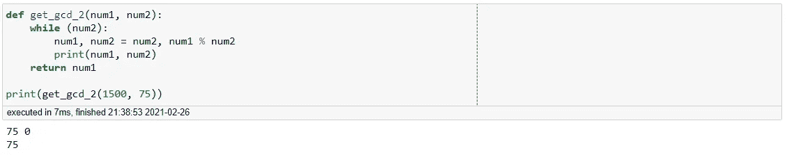

# Pythonic 提示和技巧—寻找 GCD 和 LCM

> 原文：<https://towardsdatascience.com/pythonic-tips-tricks-finding-the-gcd-and-lcm-34b08b6e232b?source=collection_archive---------34----------------------->

## 毒蛇之路

## 如何使用 Python 获得最大公分母和最小公倍数


Photo by [浮萍 闪电](https://unsplash.com/@vsmilelx?utm_source=medium&utm_medium=referral) on [Unsplash](https://unsplash.com?utm_source=medium&utm_medium=referral)

对于我们大多数人来说，寻找数字之间的最大公分母是小学数学中的一个常见练习。然而，在现实世界中，寻找 gcd 可以成为我们算法和分析的一个组成部分。在本文中，我们将讨论如何在不同的场景下获得 gcd。

我们开始吧！

> "创建一个函数，将两个整数作为输入，并找到它们的最大公分母."

听起来很简单，让我们看看一个典型的算法，找到两个整数的 GCD。一种常见的算法如下:

```
def get_gcd_1(num1, num2):
    while num1 != num2: 
        if num1 > num2:
            num1 = num1 - num2
        else:
            num2 = num2 - num1
    return num1print(get_gcd_1(25, 5))
print(get_gcd_1(5, 20))
print(get_gcd_1(30, 10))
print(get_gcd_1(1500, 75))
print(get_gcd_1(20, 35))
```


图一。第一 GCD 函数

这是一个相当简单的算法，并给出了 GCD。然而，有更好的方法和更有效的方法来构造算法。首先，让我们看看该算法找到 GCD 需要多少次迭代。

```
def get_gcd_1(num1, num2):
    while num1 != num2: 
        if num1 > num2:
            num1 = num1 - num2
        else:
            num2 = num2 - num1
        print(num1, num2)
    return num1print(get_gcd_1(1500, 75))
```


图二。迭代直到找到 GCD

我们可以看到，在找到 GCD 之前，该算法将经历 20 次迭代。如果我们要在一个大得多的数据集上运行这个算法，那么大量的迭代肯定是一个问题。

相反，让我们尝试一个简单得多的算法。

```
def get_gcd_2(num1, num2):
    while num2 != 0:
        num1, num2 = num2, num1 % num2
    return num1print(get_gcd_2(25, 5))
print(get_gcd_2(5, 20))
print(get_gcd_2(30, 10))
print(get_gcd_2(1500, 75))
print(get_gcd_2(20, 35))
```


图 3。第二 GCD 函数

第二个函数明显比第一个干净。我们还使用了 *%* 或*模块化*操作符。它实际上是返回两个数之间的余数。如果第一个数字能被第二个数字整除，那么运算将返回 0。

```
print(10 % 5)
print(20 % 7)
print(100 % 99)
print(1000 % 10)
print(25 % 6)
```


图 4。模运算符示例

现在让我们检查一下第二个 GCD 函数在返回 GCD 之前要经历多少次迭代。

```
def get_gcd_2(num1, num2):
    while num2 != 0:
        num1, num2 = num2, num1 % num2
        print(num1, num2)
    return num1print(get_gcd_2(1500, 75))
```


图 5。迭代直到找到 GCD

太神奇了！我们可以看到，这个算法只需要 2 次迭代就可以得到 GCD。这比我们的第一个函数效率高得多。我们实际上可以对函数再做一次改进。线 num2！= 0 其实是多余的。我们可以简化为 while (num2)。我们得到的函数如下。

```
def get_gcd_2(num1, num2):
    while (num2):
        num1, num2 = num2, num1 % num2
        print(num1, num2)
    return num1print(get_gcd_2(1500, 75))
```



图 6。缩短功能

太好了，我们找到了一个非常有效的算法来搜索 GCD。从这里我们实际上可以找到最小公倍数(LCM)。

> "创建一个函数，将两个整数作为输入，并找出它们的最小公倍数."

简单来说，最小公倍数就是能被两个或两个以上的数整除的最小数。为了构造一个可以搜索它的函数，我们可以利用我们的 GCD 函数。

```
def get_lcm(num1, num2):
    return (num1*num2)/ get_gcd_2(num1,num2)print(get_lcm(1500, 75))
print(get_lcm(117 , 33))
print(get_lcm(56, 5))
```


图 7。最小公倍数函数

我们可以看到，最小公倍数函数能够检索出正确的数字。现在让我们推广我们的函数，使它们能够处理任何数量的数字。

> "创建一个函数，该函数将整数列表作为输入，并找到它们的最大公分母和最小公倍数。"

为了做到这一点，我们必须从 functools 库中导入 *reduce* 函数。

```
from functools import reduce
def get_gcd_lcm(list_of_ints):
    help_func = lambda x,y : x if y == 0 else g(y, x % y)  
    gcd = reduce(lambda x,y : help_func(x,y), list_of_ints)
    lcm = reduce((lambda x, y: x * y), list_of_ints) / gcd
    return gcd, lcm

results = get_gcd_lcm([75,1500,25,50,100])
print(f'GCD : {results[0]} LCM : {results[1]}')
```


图 8。广义 GCD 和 LCM 函数

很好，我们能够生成一个函数，它可以接受一个列表并生成 GCD 和 LCM。

**总之**

在本文中，我们能够成功地创建函数来查找整数列表的 GCD 和 LCM。这两个值对于数据科学家来说都非常有用，因为它们允许我们更好地了解我们正在处理的数据。尽管这篇文章非常笼统，但在以后的文章中，我们将回顾这些统计数据的许多用途，并将它们应用到真实世界的数据中。现在，我希望您能够找到对您当前任务有用的信息。