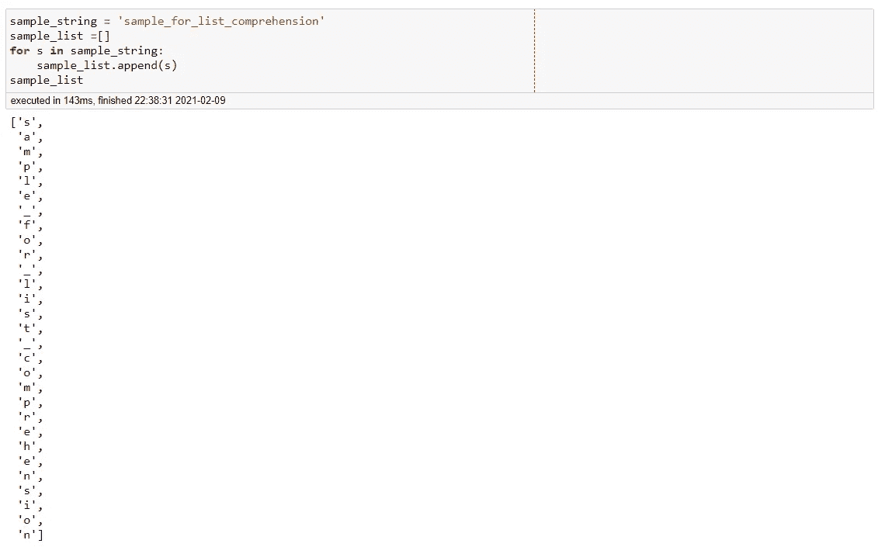
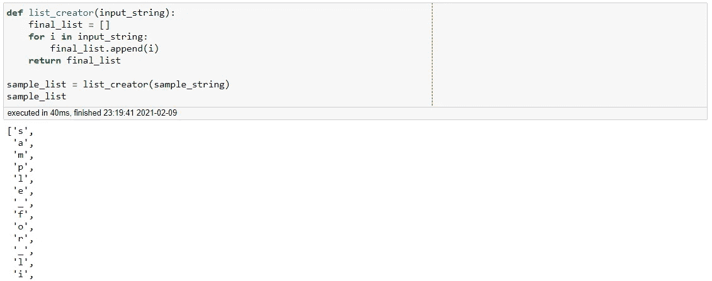
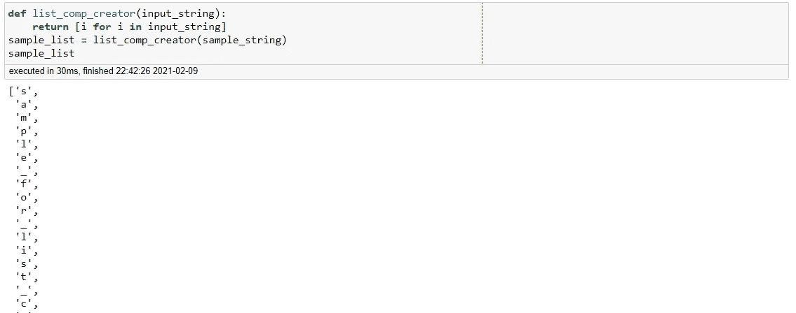
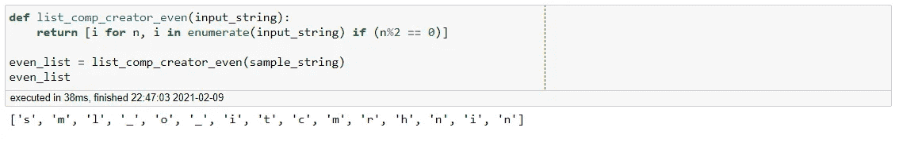
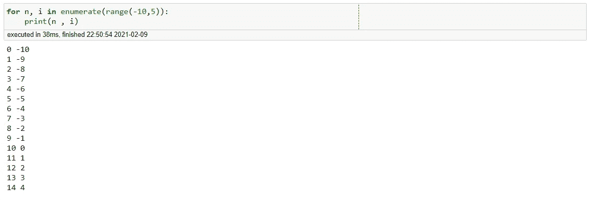
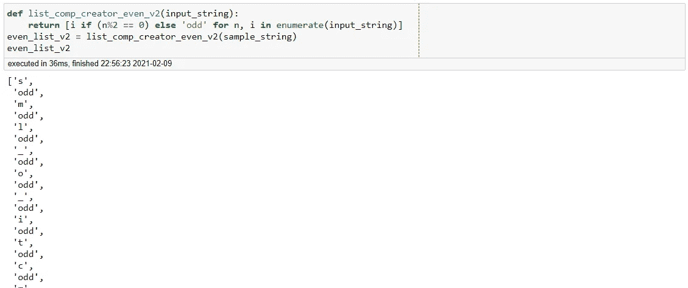
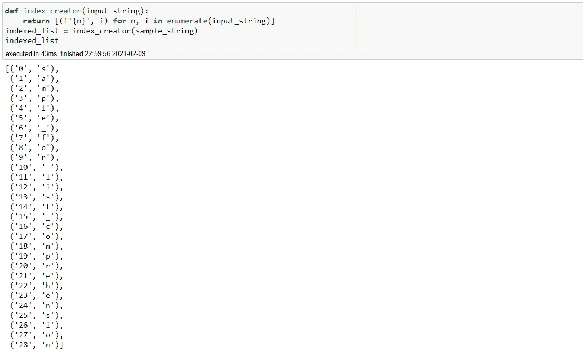
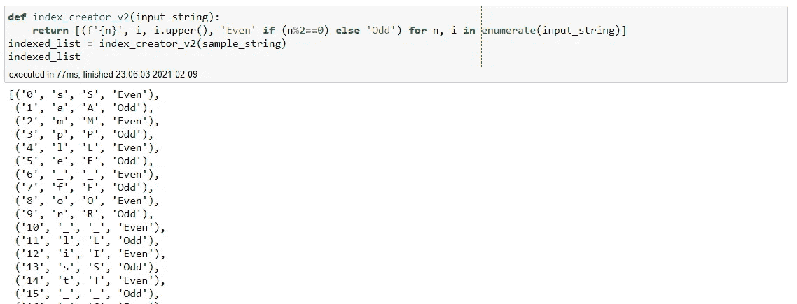
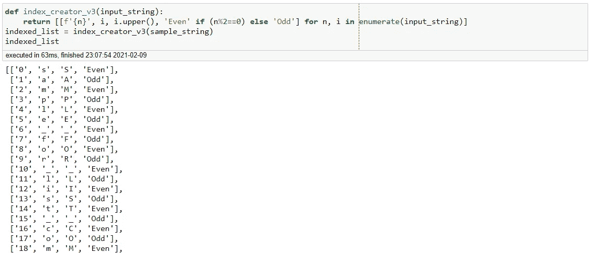
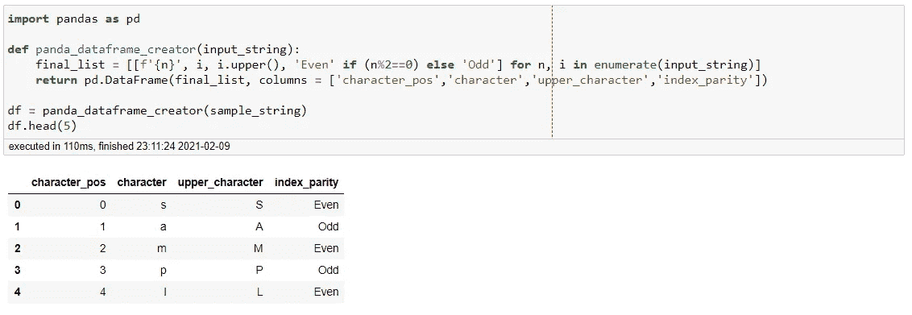

# Pythonic 提示和技巧——使用理解

> 原文：<https://towardsdatascience.com/pythonic-tips-tricks-using-comprehension-e7e91d6769f0?source=collection_archive---------41----------------------->

## 毒蛇之路

## 使用列表理解的有趣方法


凯瑟琳·拉威利在 [Unsplash](https://unsplash.com?utm_source=medium&utm_medium=referral) 上拍摄的照片

列表理解是一个强大的工具，它允许 Python 程序员以极其简洁的方式编写代码。在这篇文章中，我们将讨论如何使用列表理解来简化复杂的函数。

我们开始吧！

首先，让我们创建一个示例字符串。

```
sample_string = 'sample_for_list_comprehension'
```

现在让我们创建一个 Python 列表，其中包含该字符串的每个字符作为其元素。

```
sample_list =[]
for s in sample_string:
    sample_list.append(s)
sample_list
```



创建列表

我们实际上可以将这段代码一般化，并将其转换成一个 Python 函数。下面的代码就是这么做的。

```
def list_creator(input_string):
    final_list = []
    for i in input_string:
        final_list.append(i)
    return final_listsample_list = list_creator(sample_string)
sample_list
```



Python 函数

虽然这个函数完成了它的任务，但是我们实际上可以通过使用列表理解以一种更简洁的方式来编写它。下面的代码就是这么做的。

```
def list_comp_creator(input_string):
    return [i for i in input_string]
sample_list = list_comp_creator(sample_string)
sample_list
```



列表理解功能

我们看到这个函数现在基本上是一行程序。当然，这个例子相当简单。现在让我们用列表理解来完成更复杂的任务。

## 集成 If-Else 逻辑

我们实际上可以构建我们的列表理解来包含 If-Else 逻辑。例如，让我们创建一个只返回偶数索引字符的函数(注意 Python 编程语言从 0 开始)。

```
def list_comp_creator_even(input_string):
    return [i for n, i in enumerate(input_string) if (n%2 == 0)]even_list = list_comp_creator_even(sample_string)
```



集成逻辑

注意我们是如何使用*枚举*函数的。对于那些不熟悉这个函数的人来说，它实际上是一个计数器。如果它所属的函数有一个 For 循环，*枚举*函数将返回它当前所在的迭代。这可以通过下面的代码来演示。

```
for n, i in enumerate(range(-10,5)):
    print(n , i)
```



枚举输出

左边的数字代表索引，本质上它们显示了我们的函数当前处于 For 循环的哪个阶段。注意 Python 的枚举是如何从 0 开始的。这使我们能够编写代码，如前面的列表理解函数。为了更进一步，让我们明确地编码当遇到奇数索引字符时函数应该做什么。

```
def list_comp_creator_even_v2(input_string):
    return [i if (n%2 == 0) else 'odd' 
            for n, i in enumerate(input_string)]even_list_v2 = list_comp_creator_even_v2(sample_string)
```



集成 If-Else 逻辑

我们可以看到，该函数现在将返回所有偶数索引的字符，并用字符串**‘odd’**替换所有奇数索引的字符。

## 创建元组列表

列表理解不仅仅是创建一个简单的列表。我们实际上也可以使用列表理解来生成更复杂的输出。以下代码将接受输入字符串并返回包含(字符索引，字符)的元组列表。

```
def index_creator(input_string):
    return [(f'{n}', i) for n, i in enumerate(input_string)]
indexed_list = index_creator(sample_string)
indexed_list
```



创建元组列表

很好，我们已经使用列表理解创建了一个元组列表。虽然这已经很有用了，但是让我们试着增加复杂性。让我们创建一个包含(*字符索引，字符，大写字符，索引奇偶校验*)的元组列表。

```
def index_creator_v2(input_string):
    return [(f'{n}', i, i.upper(), 'Even' if (n%2==0) else 'Odd') 
             for n, i in enumerate(input_string)]
indexed_list = index_creator_v2(sample_string)
indexed_list
```



复杂列表理解

注意，我们不局限于简单地创建一个元组列表，我们还可以创建一个列表列表。

```
def index_creator_v3(input_string):
    return [[f'{n}', i, i.upper(), 'Even' if (n%2==0) else 'Odd'] 
             for n, i in enumerate(input_string)]
indexed_list = index_creator_v3(sample_string)
indexed_list
```



列表输出列表

太好了，我们确实进入了列表理解的更复杂的一面。

## 将列表加载到熊猫数据帧中

当然，为了便于数据分析，让我们将输出加载到 pandas 数据框架中。

```
import pandas as pddef panda_dataframe_creator(input_string):
    final_list = [[f'{n}', i, i.upper(), 'Even' if (n%2==0) 
                   else 'Odd'] for n, i in enumerate(input_string)]
    return pd.DataFrame(final_list, 
                        columns =['character_pos','character',
                                  'upper_character','index_parity'])df = panda_dataframe_creator(sample_string)
df.head(5)
```



作为熊猫数据帧加载的列表列表

**总之**

对于任何使用 Python 语言的数据科学家来说，列表理解都是一个极其强大的工具。这篇文章只是触及了它的可能性的表面。在以后的文章中，我们将处理更具挑战性和更复杂的问题，这些问题需要我们利用列表理解。