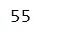
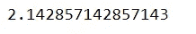
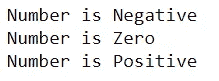
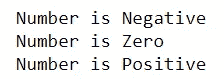
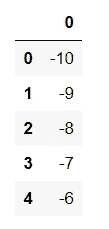
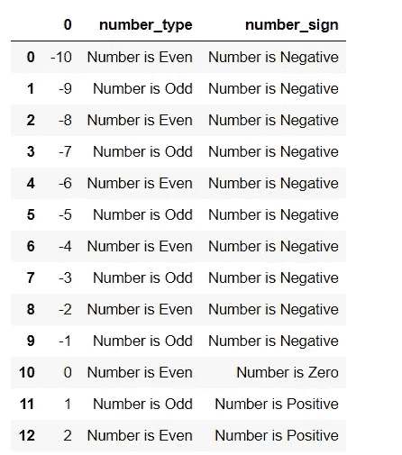

# Pythonic 提示和技巧—使用 Lambda

> 原文：<https://towardsdatascience.com/pythonic-tips-tricks-working-with-lambda-987444d80517?source=collection_archive---------44----------------------->

## 毒蛇之路

## 如何在 Python 中应用 Lambda 函数


蒂姆·马歇尔在 [Unsplash](https://unsplash.com?utm_source=medium&utm_medium=referral) 上的照片

Python 语言最有趣的方面之一是 Lambda 函数。对于擅长将代码简化为简单逻辑语句的程序员来说，Lambda 函数有助于大幅减少代码行数。在这篇文章中，我们将介绍什么是 Lambda 函数，以及如何在 Python 中以实用的方式应用它们。

我们开始吧！

## Lambda 的优势

假设你有一个函数，可以将你输入的任何数字乘以 10。

```
def mult_ten(original):
    return original * 10number = mult_ten(5)
```


功能输出

这个函数实际上可以写成一行文字。这通过使用*λ*来实现。

```
mult_ten = lambda i : i * 10
print(mult_ten(5))
```


完全相同的输出

但是等等，更复杂的函数呢，比如下面这个:

```
def mult_int(original, multiplier):
    return original * multipliernumber = mult_int(5, 11)
```



二元函数的输出

这也可以浓缩成一个 lambda 函数。

```
mult_int = lambda i, j : i * j
print(mult_int(5, 11))
```


完全相同的输出

事实上，我们可以有任意多的变量。下面是一个更复杂的函数的例子。

```
def complicated_function(a, b, c, d, e):
    return ((a+b) / (c+d)) * enumber = complicated_function(1, 2, 3, 4, 5)
```



复杂函数的输出

同样，我们可以将整个函数浓缩成一个λ函数。

```
complicated_function = lambda i,j,k,l,m : ((i + j) / (k + l)) * m
print(complicated_function(1, 2, 3, 4, 5))
```


完全相同的输出

## 使用 IF-ELIF-ELSE 逻辑应用 Lambda 函数

当然我们并不局限于纯数学运算。我们可以使用 If-Else 语句来创建更有趣的函数。以下面的函数为例。它将一个数字分类为奇数**还是偶数**或**偶数**。

```
def odd_even(figure):
    if figure % 2 == 0:
        return 'Number is Even'
    else:
        return 'Number is Odd'number = odd_even(2)
```


功能输出

这也可以折叠成一行*λ*函数。**

```
**odd_even_lambda = lambda i: 'Number is Even' if i % 2 ==0 
                             else 'Number is Odd'
new_num = odd_even_lambda(3)**
```

****

**正确输出**

**现在让我们尝试加入一个 *elif* 元素。下面的函数将告诉我们这个数字是负数、正数还是零。**

```
**def pos_neg(figure):
    if figure < 0 :
        return 'Number is Negative'
    elif figure == 0:
        return 'Number is Zero'
    else:
        return 'Number is Positive'
print(pos_neg(-1))
print(pos_neg(0))
print(pos_neg(1))**
```

****

**功能输出**

**实际上没有直接的方法将 *elif* 元素合并到 lambda 函数中。但是我们可以通过使用嵌套 if 的*来达到同样的效果。***

```
**pos_neg_lambda = lambda i: 'Number is Negative' if i < 0  else ('Number is Zero' if i == 0 else 'Number is Positive')
print(pos_neg_lambda(-2))
print(pos_neg_lambda(0))
print(pos_neg_lambda(2))**
```

****

**完全相同的输出**

## **将 Lambda 应用于熊猫数据帧**

**当然，要真正体会 lambda 的强大，我们必须看到它的实际应用。下面是一个通过 NumPy 和 Pandas 创建的数据帧的示例。**

```
**import pandas as pd
import numpy as np
df = pd.DataFrame(np.arange(-10,11,1))
df.head(5)**
```

****

**构建的数据框架**

**利用 lambda 的强大功能，我们可以基于引用列创建包含元素的新列。**

```
**df['number_type'] =  df[0].apply(odd_even_lambda)
df['number_sign'] = df[0].apply(pos_neg_lambda)**
```

****

**编辑数据帧**

**仅用两行代码，我们就能够为数据帧生成新列。这展示了 lambda 函数能够以简洁优雅的方式将逻辑应用于大量数据的能力。**

****总之****

**Lambda 函数是 Python 编程语言的一个非常强大的特性。经常使用它们可以训练你的思维，将你的编程逻辑提炼到它的核心元素。这是一项不仅在 Python 编程语言中，而且在大多数编程语言中都有帮助的技能。尽管我们讨论的例子非常基础，但我希望它们足以激起您的兴趣，并让您习惯于使用 lambda。**