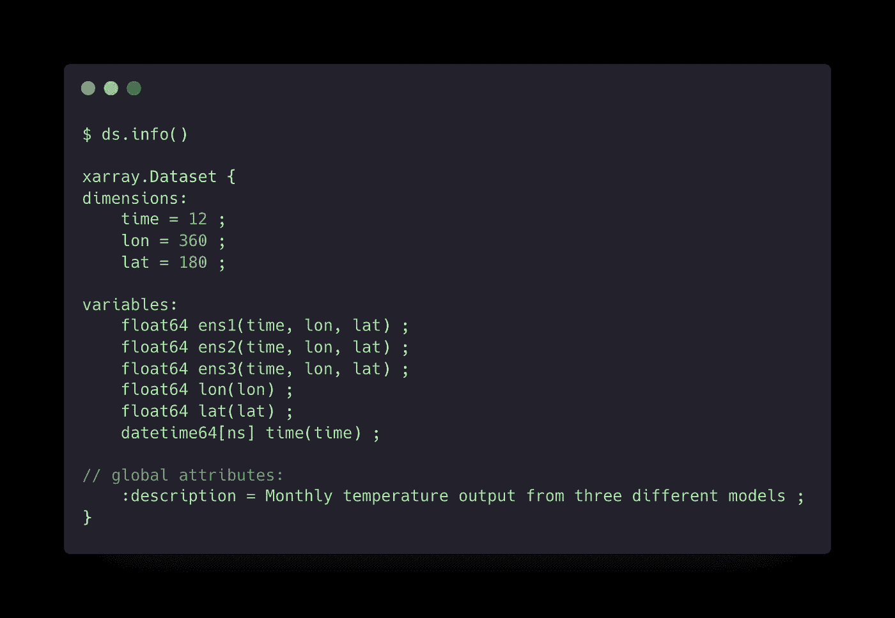
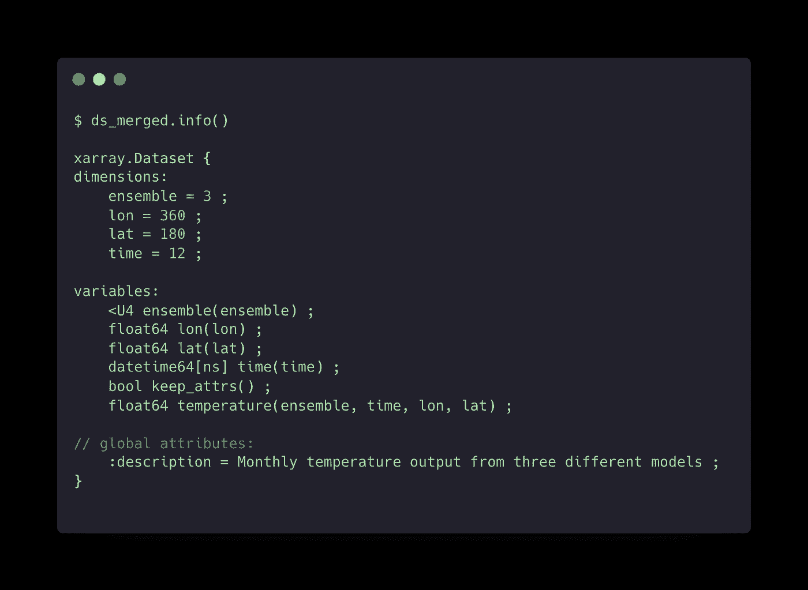

# 使用 Xarray 跨多个变量执行统计的 Pythonic 方式

> 原文：<https://towardsdatascience.com/pythonic-way-to-perform-statistics-across-multiple-variables-with-xarray-d0221c78e34a?source=collection_archive---------25----------------------->

## 气候数据科学

## 首先在数据集中创建一个分类维度


pawel szvmanski 在 [Unsplash](https://unsplash.com?utm_source=medium&utm_medium=referral) 上拍摄的照片

考虑到这一点，您有一个存储在数据集(`ds`)中的模型集合，每个集合成员存储为一个不同的变量。你觉得总体平均水平如何？如果你有三个成员(`ens1`、`ens2`、`ens3`)，一种方法是这样做:

```
ens_mean = (ds['ens1'] + ds['ens2'] + ds['ens3']) / 3
```

虽然这对于小型合奏来说没什么问题，但是有一种更 Pythonic 化的方法可以做到这一点。让我们假设每个成员代表地球上每个位置的月温度，我们真正想要的是这样的代码:

```
ens_mean = ds['temperature'].mean('ensemble')
```

这是干净的，需要键入的字符更少，代码要完成的任务也很清楚。

在这篇文章中，我将演示如何操作一个`Xarray`数据集，这样你就可以对一个新的分类变量进行平均。我希望任何使用`Xarray`分析地理空间数据或集合模型的人都能在这篇文章中找到相关性。

# 1.创建一个示例数据集

如果你想继续，我将使用一个包含合成数据的数据集来解释这个概念。这个数据集的代码如下。让我们假设这个数据集以 1 度的空间分辨率表示来自不同模型的月温度输出。

数据集的`info()`如下所示。请注意，每个系综成员(`ens1`、`ens2`、`ens3`)都是不同的变量。



将集合成员显示为不同变量的数据集输出。(图片由作者提供)

# 2.将变量合并到一个新维度

现在我们有了一个示例数据集，让我们将所有成员合并到一个名为`temperature`的变量中，该变量具有维度(`ensemble`、`time`、 `lat`、`lon`)，其中新的`ensemble`坐标将提供对每个成员的访问。下面的代码完成了这项任务。

## 2.1 每行的含义

这里发生了很多事情，让我们一行一行地来看一下。

*   `variables = list(ds)` →这将创建数据集中所有变量名的列表。如果您不需要所有的变量，那么您可以简单地硬编码一个变量名列表。

第二行做了三件事:

1.  `expand_dims(‘ensemble’, axis=0)` →获取每个变量，并在第一个轴位置添加一个新尺寸。
2.  `assign_coords(ensemble=[var])` →创建一个与上一步中的新尺寸同名的新坐标。这也将变量名分配给坐标
3.  `rename("temperature")` →将变量重命名为`temperature`

注意，这是通过列表理解对每个变量进行的。如果这令人困惑，我鼓励你在单个变量上运行这个程序，看看对象在每一步之后是如何变化的。下面的代码可以对此有所帮助。

```
var = 'ens1'
expand = ds[var].expand_dims('ensemble',axis=0)
assign = expand.assign_coords(ensemble=[var])
rename = assign.rename('temperature')
```

然后，您可以输出`expand`、`assign`和`rename`来查看对象在每一步之后如何变化。

一旦我们有了一个数据数组列表，我们需要使用`xr.merge()`沿着集合维度将它们缝合在一起。

*   `xr.merge(da_list)` →这将所有数据阵列合并成一个数据集。新的数据集只有一个变量(`temperature`)，所有的数据数组沿着`ensemble`坐标合并

最后两行可能没有必要。这些行保留了`ds`中的全局属性。

```
global_attrs = ds.attrs
ds_merged.attrs = global_attrs
```

最终数据集将如下所示:



包含一个变量(温度)和存储在新坐标(集合)中的每个集合成员的合并数据集输出。(图片由作者提供)

## 2.2 合并变量的另一种方法

有多种方法可以将变量合并到一个新的维度上。这是另一种方法。

## 2.3 使用我们的合并数据集

现在我们有了合并的数据集，我们可以很容易地跨集合成员进行统计。

*   `ds_merged[‘temperature’].mean(‘ensemble’)`
*   `ds_merged[‘temperature’].var(‘ensemble’)`

如果我们只想绘制`ens1`，我们可以像这样选择它

```
ds_merged.sel(ensemble='ens1')
```

虽然访问单个集合成员稍微麻烦一些，但我认为能够在整个集合中执行统计的好处更重要。

# 3.概括代码

在这一节中，我将描述两种方法来推广这种技术。我给出的代码仅仅是为了给你一些如何扩展这篇文章的想法。

## 3.1 选项 1-使用管道()

第一种方法是将函数`[pipe()](https://xarray.pydata.org/en/stable/generated/xarray.Dataset.pipe.html)`到数据集。这更适合于将多个功能链接在一起。但是，根据具体情况，您可能想要`pipe()`单一功能。

## 3.2 选项 2-注册访问者

另一种选择是[通过](https://xarray.pydata.org/en/stable/internals/extending-xarray.html)[注册一个访问器](https://xarray.pydata.org/en/stable/generated/xarray.register_dataset_accessor.html)来扩展 Xarray 。实际上，这是通过简单地添加一个类装饰器来实现的。如果您正在处理一组特殊用途的函数，这种方法是合适的。例如，也许你正在研究一类处理集合模型的方法。下面的代码展示了如何装饰一个具有`var_merger()`函数的类。

请记住，一旦注册了访问者，就不能对其进行更改。例如，如果您在笔记本中运行这段代码，然后决定向该类添加另一个函数并重新运行它，则该新函数将不会向访问器注册。您必须首先重启内核才能使它生效。因此，注册访问器放在代码库中更合适。

您可以在数据集(`ds`)上使用新的访问器，如下所示:

```
ds_merged = ds.ensemble.var_merger()
```

注意，类名是不相关的，因为它是我们提供给数据集的访问器名。

# 4.最后的想法

希望本教程能帮助你更有效地使用合奏。在撰写本文时，我无法在[文档](https://xarray.pydata.org/en/stable/index.html)以及它们的“[How I…](https://xarray.pydata.org/en/stable/howdoi.html)”部分中找到像这样合并变量的单行方法。

`Xarray`功能极其强大，许多“我该怎么做”的问题都可以用现有的功能来解决。话虽如此，找到正确的功能并以正确的方式将它们链接在一起以实现期望的目标可能会很棘手。

如果你对如何改进这篇文章有任何意见或建议，请告诉我。此外，请让我知道，如果你知道一个更优雅的解决方案，将变量合并到一个共同的坐标。

一如既往，我很乐意帮助解决您可能遇到的任何问题。

*感谢阅读和支持媒体作者*

[](https://lukegloege.medium.com/membership) [## 通过我的推荐链接加入 Medium-Luke Gloege 博士

### 作为一个媒体会员，你的会员费的一部分会给你阅读的作家，你可以完全接触到每一个故事…

lukegloege.medium.com](https://lukegloege.medium.com/membership)