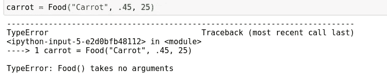

# Python 的数据类被低估了

> 原文：<https://towardsdatascience.com/pythons-data-classes-are-underrated-cc6047671a30?source=collection_archive---------9----------------------->

## 看看 Python 中的数据类以及它们如何节省大量时间


(src =[https://pixabay.com/images/id-1076536/](https://pixabay.com/images/id-1076536/)

# 介绍

在计算机编程的世界里，有许多程序员为了节省时间而使用的技术。在软件工程的世界里，时间总是一个问题，而且期限很难达到。因此，节省时间的技术非常受欢迎，更重要的是，非常有用。虽然 Python 可能是一种编写速度很快的语言，但是有一些方法可以加快编写 Python 的过程，甚至变得更快。记住这一点，请允许我向您介绍 Pythonic 编程的概念和对象:

> 数据类。

Python 中的数据类是使用标准库中的工具修饰的类。dataclass 装饰器@dataclass 可用于向用户定义的类添加特殊方法。这样做的好处是，这是自动完成的，这意味着您可以更多地关注类中的函数，而不是关注类本身。

> [笔记本](https://github.com/emmettgb/Emmetts-DS-NoteBooks/blob/master/Python3/Python%20DataClasses.ipynb)

# 创建数据类

虽然 dataclass decorator 包含在标准库中，但像 Python 的许多其他组件一样，它包含在自己独特的模块中。记住，创建数据类的第一步是实际导入模块。

```
import dataclass
```

现在我们可以创建一个保存任意数据的新类，并用@dataclass 装饰器来装饰这个类。我们将使用 [PEP526](https://www.python.org/dev/peps/pep-0526) 中描述的注释来定义这个类中的数据。

```
from dataclasses import dataclass[@dataclass](http://twitter.com/dataclass)
class Food:
    name: str
    unit_price: float
    stock: int = 0

    def stock_value(self) -> float:
        return(self.stock * self.unit_price)
```

现在我们可以通过调用这个构造函数来创建一个新类，如下所示:

```
carrot = Food("Carrot", .45, 25)
```

现在让我们看看如果我们不使用 dataclass 装饰器编写相同的代码会发生什么:

```
class Food:
    name: str
    unit_price: float
    stock: int = 0

    def stock_value(self) -> float:
        return(self.stock * self.unit_price)carrot = Food("Carrot", .45, 25)
```



我们看到，当我们调用这个构造函数时，我们得到了一个类型错误。这是因为现在我们的数据仅仅被存储为成员变量。因此，我们的 __init__ 函数采用默认形式。默认表单不包含任何参数，这是我们试图创建数据时调用的函数。为了解决这个问题，我们需要为我们的类编写一个新的 _ _ init _ _ 函数:

```
class Food:
    name: str
    unit_price: float
    stock: int = 0

    def __init__(self, name: str, unit_price: float, stock: int):
        self.name, self.unit_price, self.stock = name, stock, unit_price

    def stock_value(self) -> float:
        return(self.stock * self.unit_price)
```

现在我们看到，我们可以成功地创建我们的食物类型:

```
carrot = Food("Carrot", .45, 25)
```

我们刚刚添加到函数中的所有代码都是由我们的 dataclass 装饰器自动添加的。不用说，这是相当可怕的！

# 他们为什么伟大？

现在我们对这个装饰器的作用有了基本的了解，让我们考虑一下为什么您可能想要将它应用到您的代码中。首先，您将需要编写许多不太特殊的方法。这可以节省时间，提高你的工作效率。在上面的例子中，如果我没有在一行中完成所有的自我赋值，我们可以节省四行代码。此外，每当我们调用 dataclass 装饰器时，这不是唯一生成的特殊函数。这意味着我们的类在编写更少的代码的同时，在特殊函数方面会更有说服力。

使用这个装饰器的一个非常有效的优点是它避免了类中的许多混乱。将 Python 类中的每个值赋给成员变量的例子实际上非常普遍。当这完全可以通过简单地使用装饰器来避免时，没有什么理由用大量的`self.x = x`来编写整个函数。这也可以使一个类更具可读性。很容易理解为什么会这样

```
[@dataclass](http://twitter.com/dataclass)
class Food:
    name: str
    unit_price: float
    stock: int = 0

    def stock_value(self) -> float:
        return(self.stock * self.unit_price)
```

可能比这更具可读性

```
class Food:
    name: str
    unit_price: float
    stock: int = 0

    def __init__(self, name: str, unit_price: float, stock: int):
        self.name = name self.stock = stock
        self.unit_price = unit_price

    def stock_value(self) -> float:
        return(self.stock * self.unit_price)
```

此外，使用 dataclass decorator 还可以将焦点放在这个函数中真正重要的地方。因为在这个类的初始化中不需要做任何事情，所以把一个大的 __init__ 函数放在中间是没有意义的。这里的重点应该是类内部的数据和处理这些数据的函数。

最后，需要注意的是，这并不是装饰者所做的全部工作。数据类可以用来快速创建一些非常复杂的惊人结构。例如，我们也可以使用 dataclasses 作为 JSON 数据的 Pythonic 方法。在很多方面，我们可以把它们想象成 Javascript 中的数据数组。不用说，这在 Python 编程中很方便。考虑这个例子:

```
[@dataclass](http://twitter.com/dataclass)
class Point:
     x: int
     y: intp = Point(10, 20)
assert dataclasses.asdict(p) == {'x': 10, 'y': 20}
```

在这里，我们将一个类转换成一个包含这两个值的字典。这两个基本上已经成为等价的数据类型，它们的定义需要大约相同的时间。编写一个比字典还快的类似乎是不可能的，但是在上面的例子中我们做到了。不用说，这些肯定会派上用场。对于我们这些处理大量数据的人来说尤其如此。

# 结论

总的来说，数据类太棒了！如果你想了解更多关于数据类的内容，你可以查看 [PEP557](https://www.python.org/dev/peps/pep-0557/) 来获得关于数据类和使用它们的全面的信息来源。有很多很好的理由将这些实现到您的代码中。这不仅可以让你的代码更容易阅读，而且也让你的代码更容易编写！感谢您的阅读，我希望这个装饰器将带您踏上 Python 之旅！