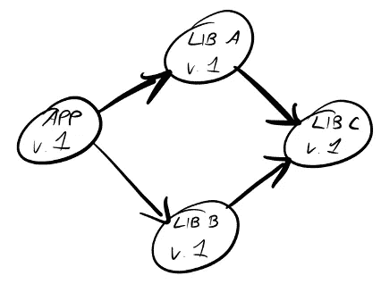
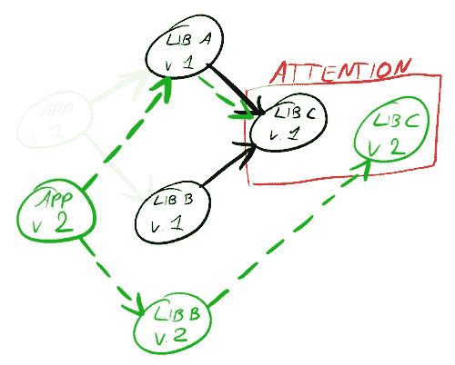

# Python 的依赖性冲突剥夺了数据科学家的睡眠

> 原文：<https://towardsdatascience.com/pythons-dependency-conflicts-are-depriving-data-scientists-of-sleep-ff52c5689336?source=collection_archive---------2----------------------->

## 关于掌握你的个人数据科学项目中的依赖关系并找到一种可能的方法来处理新出现的冲突的指南。

*照片由*[*alt umcode*](https://unsplash.com/@altumcode?utm_source=unsplash&utm_medium=referral&utm_content=creditCopyText)*[*Unsplash*](https://unsplash.com/photos/dC6Pb2JdAqs)*

# *介绍*

*分享知识是我所在的 FH Kufstein Tirol 主数据科学智能分析博客项目的核心。在[https://FH-kuf stein . AC . at/Studieren/Master/Data-Science-Intelligent-Analytics-BB](https://fh-kufstein.ac.at/Studieren/Master/Data-Science-Intelligent-Analytics-BB)查看该程序。*

*让我们实话实说:图书馆是一切的解决方案！你在一个项目中遇到了问题，或者需要一个特殊的功能，而你不想自己编写代码？可能会有人以前遇到过同样的问题，并且可能已经为此开发了一个库！然而，正如生活中经常发生的那样，并非所有闪光的东西都是金子。*

*当然，库是非常有用的，但是它们会很快把你带到一个你不得不处理一些**“依赖冲突”**的境地。迟早，几乎每一个软件开发人员都会发现自己到了那一步。如果项目仍然很小，避免它会容易一点，但是一旦项目变大，你肯定需要更加小心。*

*用哪种编程语言编写代码并不重要；不幸的是，它可以发生在几乎每一个人身上。例如，Python 是一种众所周知的编程语言，大多数人听到“依赖冲突”时都会想到它。*

# *什么是依赖冲突？*

*首先，让我们从澄清软件开发上下文中的术语“依赖性”开始。依赖是指一个软件，例如一个包或库，依赖于另一个软件，通常是由他人编写的(第三方代码)。一般来说，每当您在项目中使用新的包或库时，您也在添加它的依赖项。[1]*

*我会给你一个简单的例子，看起来像什么依赖关系。*

*你开始着手一个新的软件项目；让我们简单地称它为当前版本 1 的 APP。在这个应用程序中，您需要某些功能，您可以通过添加新的库 LIB A(版本 1)和 LIB B(版本 1)来包含这些功能。LIB A 和 LIB B 都在代码中使用了另一个功能，LIB C(版本 1)。*

**

*使用库的应用程序(图片由作者提供)*

*有一天，LIB B 获得了版本 2 的更新，它实现了 LIB C 的最新版本 2。到目前为止，它并不影响您的应用程序，因为它仍然使用版本 1 的 LIB A 和 LIB B。*

**

*特定库的新版本(图片由作者提供)*

*当您想要将应用程序更新到包含最新版本的 LIB B 的版本 2 时，依赖性冲突就出现了。现在这将导致一个问题，因为 LIB A 仍然使用版本 1 的 LIB C，而 LIB B 已经依赖于 LIB C(版本 2)——但同时只能使用一个版本的 LIB C。*

**

*应用程序更新一个库，这可能会由于依赖性问题而导致问题(图片由作者提供)*

*为了摆脱这个依赖问题，现在必须包含最新版本的 LIB A，希望它和 LIB B 依赖于相同版本的 LIB C。如果使用最新的 LIB C 版本还不支持 LIB A——欢迎来到一个充满依赖冲突的世界！*

# *为什么会发生依赖冲突？*

*正如我在上一节中试图向您展示的简化版本，一个原因可能是不同的库或包之间的不兼容性。通常，如果有许多不同的库和包在使用，它们是由许多不同的人在不同的时间点开发的，并且在许多情况下，那些库不再被维护。*

*你几乎无法控制所有这些图书馆。如果您正在使用的某个库的开发者决定更新他们的库，添加功能或删除部分代码(不管出于什么原因)，这可能是新的依赖冲突的开始。*

*由于第三方库可能没有使用编写良好的代码，或者可能缺少该库的良好文档，也可能会发生冲突。在这两种情况下，当一个 bug 突然出现，但你没有(或几乎没有)机会摆脱它时，它会非常烦人。*

# *但是我能避免吗？*

*理论上，当然，你可以避免它。但是——特别是如果你在一些编程语言中没有使用包管理器，比如‘Anaconda’——要真正避免依赖冲突几乎是不可能的。尽管如此，还是有一些小贴士可以帮助你尽可能避免这种情况。所以，我们开始吧:*

***使用库之前:***

*   *有没有可能使用像“Anaconda”这样的包管理器？如果答案是肯定的，强烈建议这么做。*
*   *想想你要解决的问题。独自编写代码需要付出多大的努力？你有可能(现在或者在开发的后期)在某个时候去掉那个特定的库吗？*
*   *如果可能，检查下载计数器和库的分级。它是一个已经被很多人使用的受欢迎的工具，还是不那么出名？*
*   *这个库也包含很多依赖项吗？如果是这样的话，它可能会更快地导致冲突。*
*   *检查文档:它是否写得很好，是否足够详细，足以让您使用这个库？*
*   *到目前为止，这个库发布了多少版本/更新/错误修复？是维护的很好，定期更新，还是还有 0.0.1 版本，十年前就发布了，再也没碰过？*

***使用库时:***

*   *如果您添加/删除了许多包和库，请检查清单。清单是否与您真正使用的包相匹配？*
*   *还有其他提供相同功能的库吗？(也许这一步包括一些代码调整。)如果是，您可以替换这些库。*
*   *如果可能的话，你可以尝试派生和修复开源库，推动这些变化，并希望维护者接受补丁。*

***再来两个提示:***

*   *监视该库如何影响应用程序的性能。是否提高了性能？还是对它产生了不好的影响？也许有一个更轻便的。*
*   *您可以对项目进行版本锁定，这无疑有助于避免依赖冲突。然而，这一步意味着您不能再实现正在使用的库的新特性或改进，因为您需要坚持使用所选择的版本。[2]*

# *如何管理您的依赖性*

*现在，您已经听到了一些您可能会在下一个数据科学项目中考虑的提示。下一步，让我告诉你一些可能的方法，告诉你如何以适当的方式管理你的依赖关系。*

*首先，有必要在团队内部建立一些指导方针，指导你如何处理依赖关系。您是否希望在知道某个特定版本可能存在漏洞的情况下坚持使用它？或者，您是否承担了更新依赖项所带来的风险？[3]制定每个团队成员都必须遵守的规则；这将有助于你的项目，并防止挫折肯定！*

*区分依赖关系的优先级也非常重要。不是每一个都和另一个一样重要。如果可能，尝试先更新您的优先依赖关系。这有几个好处:您可以更好地了解仍然需要更新的依赖项和那些您已经更新的依赖项，这些更新可能会修复潜在的安全问题。*

*使用 Anaconda 管理依赖关系可能会容易一点，因为它会关注您正在使用的环境。然而，如果不注意你的环境，它会在短时间内变得很大。*

# *概述*

*几乎在每个软件开发项目中都会发生依赖冲突。在一个项目中长时间使用大量第三方库(尤其是那些可能没有以适当方式维护的库)的组合可能会导致一些问题，这些问题与那些库的不同版本有关，这是由于可传递的依赖性。完全避免陷入这种情况确实很难，但是也许你在这篇文章中读到的一些提示会有所帮助。*

*   *如果可能，使用**包管理器***
*   *试着将**的**去掉一个**特有的**库*
*   *使用**流行的**库*
*   *尝试**避免**已经有**很多依赖项的库***
*   *检查**文档**的质量*
*   *使用维护良好的**库***
*   *留意你的**清单***
*   *使用具有相同功能的**其他库***
*   ***自行修复开源**库*
*   *如果可能，使用**轻量级**库*
*   ***版本锁定**你的项目*

# *结论*

*库、包、依赖项——使用它们是并且可能永远是开发人员、数据科学家或软件工程师的一部分。通常，与从头开始编写重要的功能相比，它们可以节省我们大量的时间。依赖性冲突一开始可能看起来很可怕，甚至更容易发现自己在处理它们，但是如果你记住几个简单的技巧，你就能够战胜冲突并掌握依赖性！*

*我希望你喜欢阅读这篇文章，也许它会对你的下一个项目有一点帮助。谢谢大家！*

# *参考*

*[1] Prana，G.A.A .，Sharma，a .，沙尔山，L.K. *等*眼不见，心不烦？易受攻击的依赖项如何影响开源项目。 *Empir 软件工程* **26，** 59 (2021)。[https://doi.org/10.1007/s10664-021-09959-3](https://doi.org/10.1007/s10664-021-09959-3)*

*[2] *田边 y，青谷 t，增原 H. 2018。一种面向上下文的编程方法来解决依赖地狱。《第十届面向上下文编程国际研讨会论文集:运行时组合的高级模块化》(COP '18)。计算机械协会，纽约，纽约州，美国，8-14。土井:*[*https://doi.org/10.1145/3242921.3242923*](https://doi.org/10.1145/3242921.3242923)*

*[3] *帕先科一世、武德、马萨奇 F. 2020。依赖管理及其安全含义的定性研究。2020 年 ACM SIGSAC 计算机和通信安全会议论文集(CCS '20)。计算机械协会，纽约，纽约州，美国。土井:*https://doi.org/10.1145/3372297.3417232*T42**