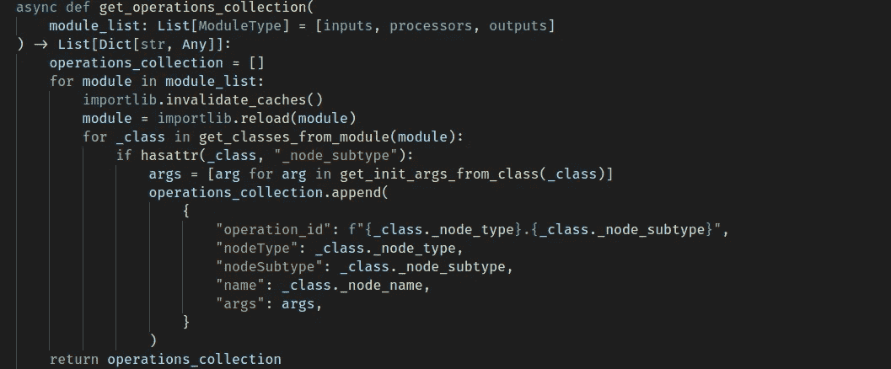
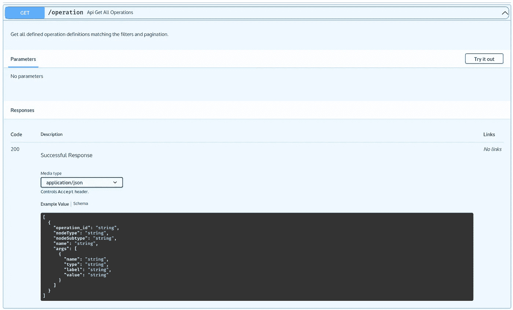

# Pythons inspect 模块——如何在您的下一个 python 项目中节省时间和精力

> 原文：<https://towardsdatascience.com/pythons-inspect-module-how-to-save-time-and-effort-in-your-next-python-project-8f2d269b8ed?source=collection_archive---------15----------------------->

## 检查所有的东西！节省配置！现在技术债务减少了 30%!

作者图片

目前，我正在用 Python 后端构建一个 web 应用程序。本质上，后端对 Pandas 数据帧执行操作，而前端是一个 react 应用程序，它允许一个拖放界面来构建操作图，以处理和分析数据！

作为该应用程序的一部分，我需要一种方法来定义该应用程序中使用的处理节点的类型。这意味着前端和后端都需要知道定义了哪些节点以及每种不同类型的节点所需的参数。最初，我通过在 Python 后端将节点维护为类，并在前端分别保存每个节点的 JSON 模板来解决这个问题。这是一个概念验证，但是当我在后端定义一个新的节点类或者更改一个现有节点所需的参数时会发生什么呢？我需要在前端添加或更新 JSON。这意味着每次我想更新后端时，我都需要部署新版本的前端。

在考虑解决这个问题时，我意识到几乎所有前端需要的东西都已经在后端类中定义了！在适当的时候，我用默认参数编写类型暗示的 python 代码。我只是需要一种方法来“检查”这些类并提取相关信息。如果我可以获得这些信息，那么我就可以将它作为 API 端点暴露给前端，这样每当我在后端添加或更改一个节点时，就可以有效地消除对前端进行新部署的需求。

Python 的 inspect 模块从 Python 2.x 时代就已经内置，直到现在，对我来说，它是一颗藏在毛料中未被充分利用的钻石。inspect 模块允许对“活动对象”进行分析，本质上使其成为一种提取当前 python 代码片段信息的编程方式。这个模块对于手头任务的相关动作归结为识别模块中定义的类，提取这些类上函数的参数、类型提示和默认值。使用下面的代码可以从 python 模块中提取类。

从 python 模块中提取类

现在我们有了一种从模块中获取类的方法；我们需要提取这些类中函数的参数、类型提示和默认值。我做了一个设计选择，在操作节点类的 __init__()方法中定义操作的所有必需参数。这意味着我需要为每个操作节点类只提取那个函数的参数。我们可以使用下面的代码来提取参数名、类型提示和默认值。

从函数中提取参数

我对上面的代码不太满意。那些查找字典看起来很麻烦，但是它们很有用，我不认为自己必须频繁地更新它们，除非我想开始向操作节点类传递更奇特类型的参数。在定义这个的时候，EMPTY_MAP 是我的痛处。在前端处理它是有意义的，因为它应该是解释空值意味着什么的部分。然而，我不太喜欢它给我的 API 客户机代码增加的臃肿。此后，我选择通过后端处理它，但这可能会反复几次，直到我很高兴自己做出了正确的设计选择。

将前面这两个方法结合在一起的实际代码称为 FastAPI 依赖项。这段代码导入(重新导入)相关的模块，然后使用预定义的函数提取 classes/init 参数，并构建一个操作元数据集合。

现在，您可能会注意到从这些类中提取了一些独特的属性。这些是普通类定义中缺少的信息。我首先尝试了一些不同的方法，包括使用超类名和其他类似的东西，但是它们没有用自己的类型/子类型和显示名来注释每个类那样灵活。下面定义了一个输出 CSV 类的例子，看看我是如何添加这些额外的属性的。

最后，将它暴露给前端的 FastAPI 端点会是什么样子？请参见下面的代码以获得一个快速示例:

作者图片

我希望这已经被证明是有用的，并且作为一个很好的例子来展示 Python 的 inspect 内置模块的巨大效用。

请不吝赐教，与我分享您在本模块中完成的其他一些令人兴奋和独特的事情！