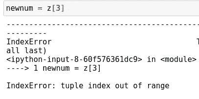

# Python 最令人困惑的操作符

> 原文：<https://towardsdatascience.com/pythons-most-confusing-operator-96c67d6e661a?source=collection_archive---------14----------------------->

## 有趣地看看 Python 的加等于运算符的怪癖和特性


(src =[https://pixabay.com/images/id-534103/](https://pixabay.com/images/id-534103/)

# 介绍

运算符是现代编程中绝对重要的组成部分。它们通常用于数学运算，但也可用于变异不同类型的泥沼并比较这些类型。Python 编程语言有一系列不同的操作符，新的操作符也在不断增加，最新的是 Python 3.8 中添加的 walrus 操作符。实际上，我写了一篇关于该操作符的文章，这篇文章还包括了一些其他有趣改进的亮点，对于感兴趣的人来说可能值得一读:

[](/my-favorite-new-features-in-python-3-8-a95d7a0a31c9) [## Python 3.8 中我最喜欢的新特性

### Python 3.8 在几周前发布了，与其匆忙谈论新特性，我决定…

towardsdatascience.com](/my-favorite-new-features-in-python-3-8-a95d7a0a31c9) 

一个具有一些有趣功能和怪癖的操作符是加号-equals 操作符。乍一看，这似乎只是加法和断言操作符的基本组合。虽然可能是这种情况，但是有一些真正有趣的特性使这个操作符与众不同。今天，我将展示这个操作符的一些有趣的特性，并演示是什么让它如此有趣。如果您想看看这些古怪的行为，您也可以从这里获得我用来演示这些代码的笔记本的副本:

[](https://github.com/emmettgb/Emmetts-DS-NoteBooks/blob/master/Python3/interesting%20plus-equals.ipynb) [## emmett GB/Emmetts-DS-笔记本电脑

### 各种项目的随机笔记本。通过创建帐户，为 emmettgb/Emmetts-DS 笔记本电脑的开发做出贡献…

github.com](https://github.com/emmettgb/Emmetts-DS-NoteBooks/blob/master/Python3/interesting%20plus-equals.ipynb) 

# 加号-等号概述

在我们深入这个操作符的古怪之处之前，我们可能应该熟悉一下这个操作符在语言中通常是如何使用的。在这种意义上，加号-等号可以被认为是加法和断言的捷径。而不是做一些像

```
x = 5
x = x + 5
print(x)10
```

我们可以做些类似的事情

```
x = 5
x += 5
print(x)
```

当然，这个运算符的这种使用方式归结为个人喜好。一些用户可能更喜欢后一种添加数字的方法，但是在我的主观意见中，我总是发现加号-等号运算符可以使这样的表达式更加简洁。

# 加号-等于和变异元组

您可能熟悉 Python 中的元组和列表数据结构。这是 Python 中两种不同类型的可迭代一维数组，它们之间有一个关键区别。元组是不可变的结构，这意味着一旦被定义，元组就不能被改变。列表当然是可变的等价物，包含 append()之类的方法。

虽然元组不是可变的对象，但是有一个关键的区别是许多程序员忽略了的。虽然元组本身可能不是可变的，但其中的类型仍然是可变的。元组仍然是一种数据结构，并且该元组中的数据仍然属于其各自的类型。然而，Python 仍然拥有人们可能期望的来自尝试改变不可变类型的抛出。考虑到这个功能，我们可以预期下面的代码会抛出一个错误，指出元组是不可变的。

```
z = (5, 10, 15)
z[4] = 15
```

然而，为了证明我的观点，即元组中包含的数据仍然是可变的，如果我们要从元组中取出一些数据，我们可以对其进行变异:

```
newnum = z[3]
```



> 愚蠢的 Julia 程序员，在 Python 中索引从零开始。

```
newnum = z[2]
newnum += 5
print(newnum)20
```

考虑下面的列表元组:

```
letters = (["S", "T"],
                 ["A", "D"])
```

元组本身是不可变的类型。然而，其中的列表，一个是字母表中 L 后面的字母，另一个是前面的字母，仍然是可变的。如果我们现在尝试在列表中添加一个新字母，你认为会发生什么？

```
letters[0] += "Q"
```


不出所料，我们得到了另一个类型错误，因为元组一旦创建就不能变异。然而，只有在数据结构上调用我们的操作符之后，才会抛出这种类型错误。换句话说，我们可能遇到了一个异常，但是如果我们现在从元组中打印出我们的列表，我们将看到该元素实际上已经被追加到我们的列表中:

```
print(letters[0])['S', 'T', 'Q']
```

关于这一点需要注意的一点是，它不能直接处理数据类型。关于 Python 有趣的事情是，基本上在库内的数据类型和我们可能在库外使用的数据类型之间没有关键的区别。这意味着我们可以用纯 Python 重写这些类型。这与大多数语言不同，大多数语言通常包含基本的数据类型，而这些数据类型不是语言本身结构化的。

信不信由你，这种类型错误和元组可变性是 Python 的一个特性，而不是 bug。乍一看，这里似乎犯了某种错误，但是考虑到 Python 的方法论，这在某种程度上确实是有意义的。这都与 Python 如何处理数据有关，更重要的是，plus-equals 如何处理不同的数据类型。这也是加号-equals 如此棒的部分原因！

# 看看加号等于

既然我们知道了加等于运算符有多奇怪，那么让我们来看看运算符实际上是如何工作的，以便更好地理解其用法中的奇怪现象是如何产生的。当然，这将是 Python 在这个操作符上实现相同功能的一个更粗糙的版本。代码看起来就像我们期望的那样:

```
def plusequals(num1, num2):
    total = num1.__iadd__(num2)
    num1 = total
```

然而，每当我们处理更大的表达式，而不是简单的数据类型时，我们可以认为代码看起来更像这样:

```
def plusequals(x[0], element): total = x[0].__iadd__(element)
   x[0] = total
```

当然，正如我们前面提到的，对于从元组中提取的元素，加法是完全可能的。然而，每当我们将 x 的第一个(第零个)索引赋给新的总数时，就会遇到元组的类型错误。

# 结论

加号-等号运算符肯定比第一次看到的要多。简单的代码允许它做一些非常有趣和古怪的事情，它甚至可以用来提供对 Python 编程的更坚实的理解。之所以认为这是一个特性，而不是一个错误，是因为事实上这正是操作符的工作方式。简单数据类型(如整数)的基本操作实际上完全依赖于这一点，因此它不是必须改变的东西是有意义的。也就是说，虽然它有点古怪和令人困惑，但它确实很酷！感谢您的阅读！