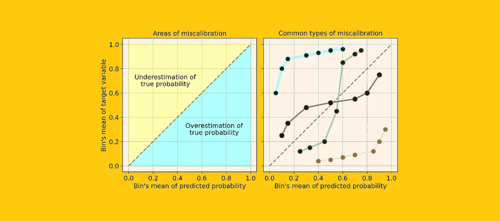
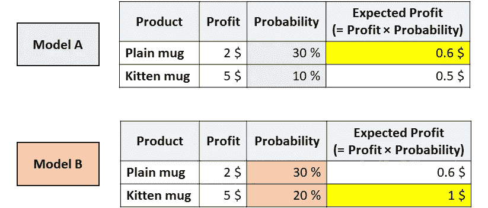
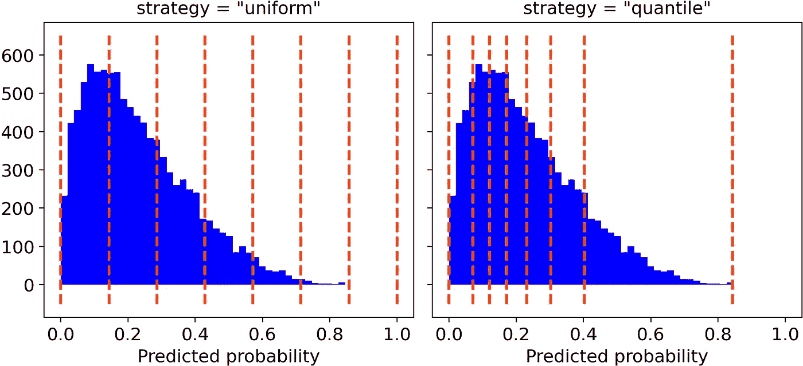
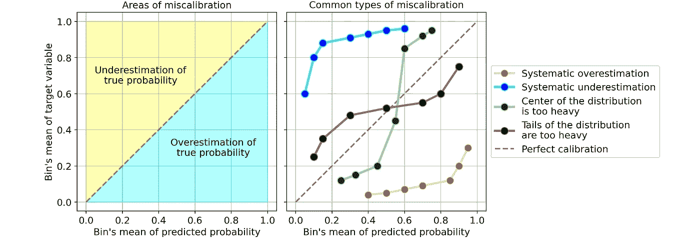
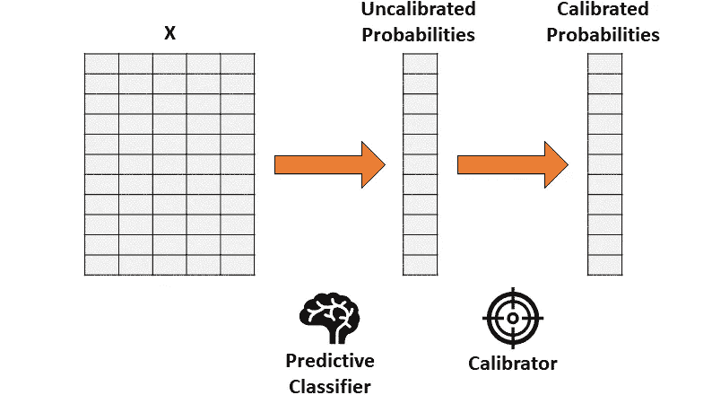
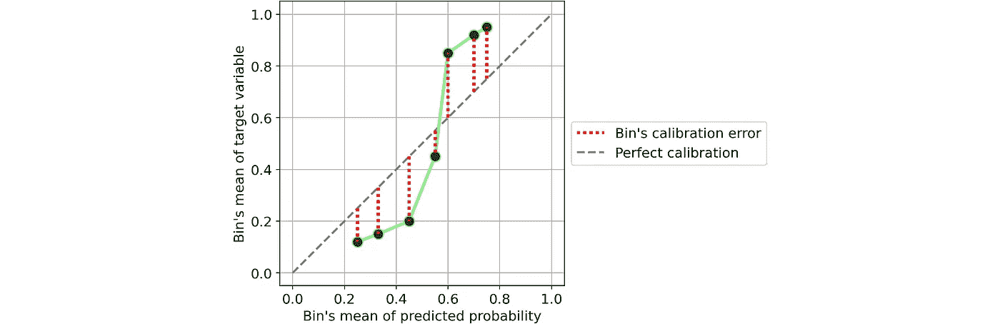
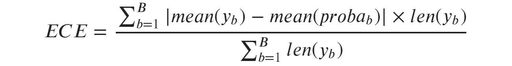
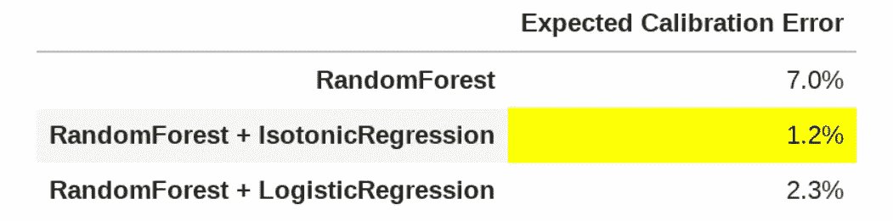

# Python 的 predict_proba 实际上并不预测概率(以及如何修复它)

> 原文：<https://towardsdatascience.com/pythons-predict-proba-doesn-t-actually-predict-probabilities-and-how-to-fix-it-f582c21d63fc?source=collection_archive---------0----------------------->

## [实践教程](https://towardsdatascience.com/tagged/hands-on-tutorials)

## 如何评估和修复校准误差概率



[图片由作者提供]

数据科学家通常根据准确度或精确度来评估他们的预测模型，但很少问自己:

> "我的模型能够预测真实的概率吗？"

然而，**从商业的角度来看，对概率的准确估计是非常有价值的** ( **有时甚至比精确的预测**更有价值)。想要个例子吗？

假设你的公司正在出售 2 个马克杯，一个是普通的白色马克杯，另一个上面有一只小猫的图片。你必须决定向给定的顾客展示哪个杯子。为了做到这一点，你需要预测一个给定的用户购买它们的概率。所以你训练了几个不同的模型，你得到了这些结果:



ROC 相同但校准不同的模型。[图片由作者提供]

现在，你会向这位用户推荐哪个杯子？

两个模型都认为用户更有可能购买普通的杯子(因此，模型 A 和模型 B 在 ROC 下具有相同的面积，因为该度量仅评估排序)。

但是，根据模型 A，你会通过推荐普通杯子来最大化预期利润。然而，根据模型 B，小猫杯使预期利润最大化。

在像这样的应用中，找出哪个模型能够估计更好的概率是至关重要的。

> 在本文中，我们将看到如何测量概率校准(视觉上和数字上)以及如何“修正”现有模型以获得更好的概率。

# **predict_proba** 怎么了

Python 中所有最流行的机器学习库都有一个方法叫做 predict_proba : Scikit-learn(例如 LogisticRegression，SVC，RandomForest，…)，XGBoost，LightGBM，CatBoost，Keras…

但是，**尽管名字如此，predict_proba 并不能完全预测概率**。事实上，不同的研究(尤其是[这一个](https://www.researchgate.net/publication/221344679_Predicting_good_probabilities_with_supervised_learning)和[这一个](https://arxiv.org/abs/1706.04599))表明，最流行的预测模型都没有经过校准。

> 一个数在 0 和 1 之间的事实不足以称之为概率！

**但是，我们什么时候才能说一个数字实际上代表了一种概率呢？**

想象一下，你训练了一个预测模型来预测一个病人是否会患癌症。现在假设，对于一个给定的病人，模型预测有 5%的可能性。原则上，我们应该在多个平行宇宙中观察同一个病人，看看他是否有 5%的几率患癌症。

因为我们不能走那条路，最好的替代方法是选取所有大约 5%概率的患者，并计算他们中有多少人患了癌症。如果观察到的百分比实际上接近 5%，我们说模型提供的概率是“校准的”。

> 当预测的概率反映真实的潜在概率时，它们被称为“校准的”。

但是如何检查你的模型是否经过校准呢？

# 校准曲线

评估模型校准的最简单方法是通过一个名为“校准曲线”(也称为“可靠性图表”)的图表。

这个想法是将观察结果分成概率箱。因此，属于同一仓的观测值共享相似的概率。此时，对于每个箱，校准曲线将预测平均值(即预测概率的平均值)与理论平均值(即观察到的目标变量的平均值)进行比较。

Scikit-learn 通过函数“calibration_curve”为您完成所有这些工作:

```
from sklearn.calibration import calibration_curvey_means, proba_means = calibration_curve(y, proba, n_bins, strategy)
```

您只需在以下选项中选择箱数和(可选)宁滨策略:

*   “均匀”，间隔 0-1 被分成等宽的*n _ bin*；
*   “分位数”，箱边缘被定义为使得每个箱具有相同数量的观察值。



宁滨的策略，箱数= 7。[图片由作者提供]

出于绘图目的，我个人更喜欢“分位数”方法。事实上，“统一的”宁滨可能会产生误导，因为一些箱可能包含非常少的观测值。

Numpy 函数返回两个数组，每个数组包含目标变量的平均概率和平均值。因此，我们需要做的就是绘制它们:

```
import matplotlib.pyplot as pltplt.plot([0, 1], [0, 1], linestyle = '--', label = 'Perfect calibration')
plt.plot(proba_means, y_means)
```

**假设你的模型有很好的精度，校准曲线会单调递增**。但这并不意味着模型校准良好。的确，**只有当校准曲线非常接近平分线**(即灰色虚线)时，您的模型才校准良好，因为这意味着预测概率平均接近理论概率。

让我们来看一些常见类型的校准曲线示例，它们表明您的模型存在校准错误:



校准错误的常见例子。[图片由作者提供]

最常见的校准错误类型有:

*   **系统性高估**。与真实分布相比，预测概率的分布被推向右侧。当您在很少有正面结果的不平衡数据集上训练模型时，这种情况很常见。
*   **系统性低估**。与真实分布相比，预测概率的分布被向左推。
*   **中心的分配太重**。当“支持向量机和提升树等算法倾向于将预测概率推离 0 和 1 时”(引用自[用监督学习预测良好概率](https://www.researchgate.net/publication/221344679_Predicting_good_probabilities_with_supervised_learning))就会发生这种情况。
*   **分布的尾部太重**。例如，“朴素贝叶斯等其他方法具有相反的偏向，倾向于推动预测更接近 0 和 1”(引用自[使用监督学习预测良好概率](https://www.researchgate.net/publication/221344679_Predicting_good_probabilities_with_supervised_learning))。

# 如何修复校准错误(Python 中)

假设你训练了一个分类器，它能产生精确但未经校准的概率。概率校准的想法是建立**第二个模型(称为校准器),能够将它们“校正”成真实概率**。

> 注意，校准应该**而不是**在已经用于训练第一分类器的相同数据上执行。



通过两步方法进行概率校准。[图片由作者提供]

> 因此，校准在于**将(未校准概率的)一维向量转换成(校准概率的)另一维向量的函数**。

两种方法主要用作校准品:

*   **等渗回归**。一种非参数算法，将非递减自由形式线拟合到数据。该行是非递减的这一事实是最基本的，因为它尊重原始排序。
*   **逻辑回归**。

让我们在玩具数据集的帮助下，看看如何在 Python 中实际使用校准器:

```
from sklearn.datasets import make_classificationX, y = make_classification(
    n_samples = 15000, 
    n_features = 50, 
    n_informative = 30, 
    n_redundant = 20,
    weights = [.9, .1],
    random_state = 0
)X_train, X_valid, X_test = X[:5000], X[5000:10000], X[10000:]
y_train, y_valid, y_test = y[:5000], y[5000:10000], y[10000:]
```

首先，我们需要安装一个分类器。让我们使用随机森林(但是任何具有 predict_proba 方法的模型都可以)。

```
from sklearn.ensemble import RandomForestClassifierforest = RandomForestClassifier().fit(X_train, y_train)proba_valid = forest.predict_proba(X_valid)[:, 1]
```

然后，我们将使用分类器的输出(验证数据)来拟合校准器，并最终预测测试数据的概率。

*   **等渗回归**:

```
from sklearn.isotonic import IsotonicRegressioniso_reg = IsotonicRegression(y_min = 0, y_max = 1, out_of_bounds = 'clip').fit(proba_valid, y_valid)proba_test_forest_isoreg = iso_reg.predict(forest.predict_proba(X_test)[:, 1])
```

*   **逻辑回归**:

```
from sklearn.linear_model import LogisticRegressionlog_reg = LogisticRegression().fit(proba_valid.reshape(-1, 1), y_valid)proba_test_forest_logreg = log_reg.predict_proba(forest.predict_proba(X_test)[:, 1].reshape(-1, 1))[:, 1]
```

此时，我们有三个预测概率的选项:

1.  平原随机森林，
2.  随机森林+保序回归，
3.  随机森林+逻辑回归。

但是我们如何评估哪一个是最校准的呢？

# 量化误差

每个人都喜欢情节。但是除了校准图之外，我们需要一种定量的方法来测量(误)校准。最常用的指标称为**预期校准误差**。它回答了这个问题:

> 平均来说，我们的预测概率离真实概率有多远？

让我们以一个分类器为例:



单仓校准。[图片由作者提供]

很容易定义单个库的**校准误差:它是预测概率的平均值和同一库内阳性分数的绝对差值**。

如果你仔细想想，这是非常直观的。取一个 bin，假设其预测概率的平均值为 25%。因此，我们预计该仓中的阳性部分约等于 25%。该值离 25%越远，该容器的校准越差。

因此，**预期校准误差(ECE)是单个箱**校准误差的加权平均值，其中每个箱与其包含的观测值数量成比例加权:



预期校准误差。[图片由作者提供]

其中 *b* 标识一个箱，并且 *B* 是箱的数量。请注意，分母只是样本总数。

但是这个公式给我们留下了定义箱数的问题。为了找到尽可能中性的度量，我建议根据[**弗里德曼-迪康尼斯规则**](https://en.wikipedia.org/wiki/Freedman%E2%80%93Diaconis_rule) (这是为**找到使直方图尽可能接近理论概率分布**的箱数而设计的统计规则)来设置箱数。

在 Python 中使用 Freedman-Diaconis 规则极其简单，因为它已经在 numpy 的 histogram 函数中实现了(将字符串“fd”传递给参数“bins”就足够了)。

以下是预期校准误差的 Python 实现，默认采用 Freedman-Diaconis 规则:

```
def **expected_calibration_error**(y, proba, bins = 'fd'): import numpy as np bin_count, bin_edges = np.histogram(proba, bins = bins)
  n_bins = len(bin_count) bin_edges[0] -= 1e-8 # because left edge is not included
  bin_id = np.digitize(proba, bin_edges, right = True) - 1 bin_ysum = np.bincount(bin_id, weights = y, minlength = n_bins)
  bin_probasum = np.bincount(bin_id, weights = proba, minlength = n_bins) bin_ymean = np.divide(bin_ysum, bin_count, out = np.zeros(n_bins), where = bin_count > 0)
  bin_probamean = np.divide(bin_probasum, bin_count, out = np.zeros(n_bins), where = bin_count > 0) ece = np.abs((bin_probamean - bin_ymean) * bin_count).sum() / len(proba) return ece
```

现在我们有了一个校准的度量标准，让我们比较一下上面获得的三个模型的校准(测试集上的**):**



模型的预期校准误差。[图片由作者提供]

在这种情况下，就校准而言，保序回归提供了最好的结果，平均距离真实概率只有 1.2%。如果你考虑到普通随机森林的 ECE 是 7%,这是一个巨大的进步。

# 参考

如果你想深化概率校准的主题，我推荐一些有趣的论文(本文基于这些论文):

*   Caruana 和 Niculescu-Mizil 于 2005 年在监督学习下预测好的概率。
*   【关于现代神经网络的标定】郭等 (2017)。
*   [nae ini 等人使用贝叶斯宁滨](https://people.cs.pitt.edu/~milos/research/AAAI_Calibration.pdf) (2015)获得校准良好的概率。

感谢您的阅读！我希望这篇文章对你有用。

我感谢反馈和建设性的批评。如果你想谈论这篇文章或其他相关话题，你可以发短信给我[我的 Linkedin 联系人](https://www.linkedin.com/in/samuelemazzanti/)。