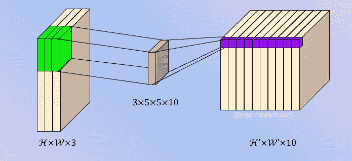
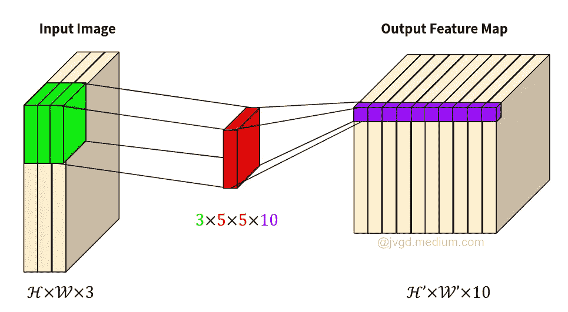
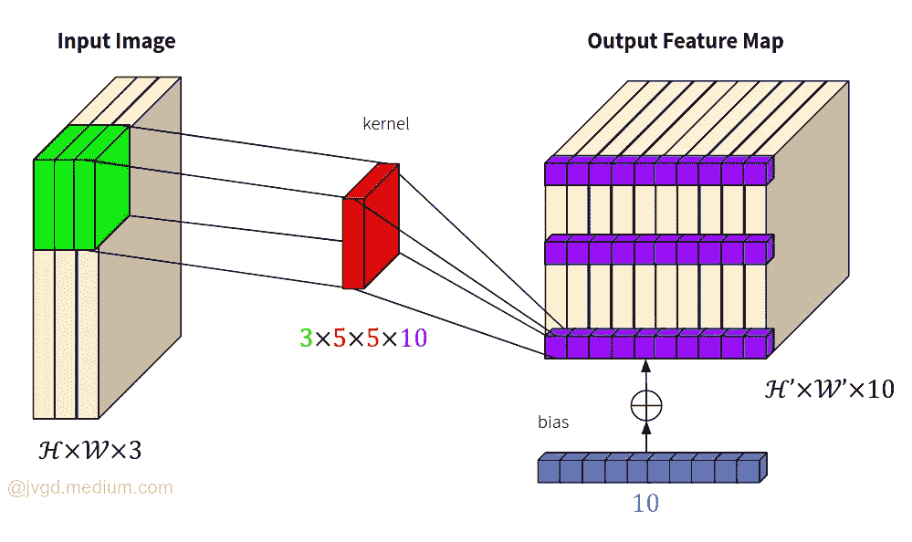
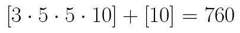
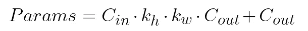

# Pytorch Conv2d 砝码说明

> 原文：<https://towardsdatascience.com/pytorch-conv2d-weights-explained-ff7f68f652eb?source=collection_archive---------2----------------------->



作者图片

## 了解重量尺寸、可视化、参数数量和臭名昭著的尺寸不匹配

在我使用 Pytorch 的过程中，我发现的最常见的问题之一是在向我的模型上传权重时出现尺寸不匹配错误。如您所知，Pytorch 在您保存模型权重时不会保存模型的计算图(与 TensorFlow 相反)。因此，当您训练具有不同配置(不同深度、宽度、分辨率……)的多个模型时，经常会拼错权重文件，并为您的目标模型上传错误的权重。

这个拼写错误转化为 Conv2d 权重的臭名昭著的 Pytorch 错误:大小不匹配。这就是你要的:

```
In [11]: conv_layer = nn.Conv2d(3, 15, 5,5)
In [12]: conv_layer.load_state_dict(weights)
----------------------------------------------------------
RuntimeError    Traceback (most recent call last)[... Traceback ommited for this post... @jvgd]RuntimeError: Error(s) in loading state_dict for Conv2d:
 size mismatch for weight: copying a param with shape torch.Size([10, 3, 5, 5]) from checkpoint, the shape in current model is torch.Size([15, 3, 5, 5]).
 size mismatch for bias: copying a param with shape torch.Size([10]) from checkpoint, the shape in current model is torch.Size([15]).
```

听起来熟悉吗？如果是这样，我可能会有一些见解与您分享，关于 Pytorch Conv2d 权重如何以及您如何理解它们。

# Conv2d

Conv2d 层可能是计算机视觉中最常用的层(至少在变形金刚出现之前是这样)。如果您曾经在 Pytorch 中实例化过该层，您可能会编写类似以下的代码:

```
In [5]: conv_layer = nn.Conv2d(in_channels=3, out_channels=10, kernel_size=5)
```

你和我通常会使用该层，而不会过多地检查它，但既然我们在这里弄脏了我们的手，让我们看看引擎盖下。如果继续检查层权重，您可以检查权重尺寸:

```
In [6]: conv_layer.weight.shape
Out[6]: torch.Size([10, 3, 5, 5])
```

那么这个怎么解读呢？

为什么权重张量有 4 个维度？不应该是二维张量，因为它是二维平面上的卷积。好吧，让我们先把它形象化，然后再分析它。



作者图片

如果你给这个卷积层输入一个图像[H，W，3]，你会得到一个输出特征图[H '，W '，10]。这个操作的卷积层的权重可以如上图所示。

在图中可以看到 5×5 核是如何与来自输入图像的所有 3 个通道(R、G、B)进行卷积的。从这个意义上来说，我们需要 5×5 内核来为每个输入通道设置权重。这自然转化为形状张量[3，5，5]。

在输出端，我们设置了 10 个通道的输出特性图。这意味着，对于每个卷积步骤，我们都希望得到[1，1，10]的输出(图中的紫色张量)。这种从输入到输出通道的扩展由额外的权重支持。所以我们卷积层权重的最终张量是:[3，5，5，10](按照我们习惯的从左向右读)。

那么，为什么代码片段中的权重输出形状具有[10，3，5，5]的形状呢？公平的问题。这是由于实现问题。您已经知道 Pytorch 采用渠道优先的方法。这意味着为了处理一个输入图像，你需要把它转换成一个张量[C，H，W]。这对我们来说并不自然，但有助于实现。因此，当我们读取 Pytorch 卷积层的权重形状时，我们必须将其视为:

```
[out_ch, in_ch, k_h, k_w]
```

其中 k_h 和 k_w 分别是内核高度和宽度。

好的，但是卷积层不是也有偏差参数作为权重吗？是的，你是对的，让我们检查一下:

```
In [7]: conv_layer.bias.shape
Out[7]: torch.Size([10])
```

偏置项 it 只是添加到卷积输出的输出通道的相同维度的单个向量。视觉上:



作者图片

所以最后，我们考虑了所有的事情:

*   [H，W，3]的输入张量
*   由[3，5，5，10]的张量卷积
*   给出[H '，W '，10]的输出特征图
*   其中层偏置[10]被添加到每个通道分量

这就是所有的重量。那么，下一个问题是:我用这一层给我的模型增加了多少参数？这个问题的答案非常简单。首先让我们用数字计算一下:

```
In [8]: sum(param.numel() for param in conv_layer.parameters())
Out[8]: 760
```

您可能已经猜到，这只是重量尺寸加上偏差的结果:



作者图片

计算每个卷积层的参数数量的自然概括是:



作者图片

看过这一切之后，我们可以回到介绍帖子的错误:

```
RuntimeError: Error(s) in loading state_dict for Conv2d:
 size mismatch for weight: copying a param with shape torch.Size([10, 3, 5, 5]) from checkpoint, the shape in current model is torch.Size([15, 3, 5, 5]).
 size mismatch for bias: copying a param with shape torch.Size([10]) from checkpoint, the shape in current model is torch.Size([15]).
```

了解了 Pytorch Conv2d 层之后，我们已经知道错误告诉了我们什么:

*   我们正在尝试加载卷积层的权重，该卷积层期望 3 个通道的输入图像，并且将返回 10 的具有核[5，5]的特征图
*   然而，当前模型有一个卷积层，与前一个模型类似，它期望一个具有[5，5]内核的 3 通道输入图像，但它将返回 15 的特征图，而不是 10 的特征图

所以最后，这几乎总是由拼写错误引起的，但是如果我们要调试我们的模型，我们需要真正挖掘它们内部是如何构建的。

今天我们已经看到了 Conv2d 层，在未来，如果我能够腾出一些时间，我会写另一篇关于其他著名 Pytorch 层的帖子。