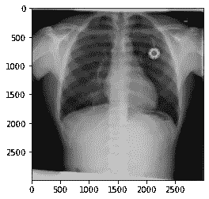

# PyTorch 分发:所有你需要知道的

> 原文：<https://towardsdatascience.com/pytorch-distributed-all-you-need-to-know-a0b6cf9301be?source=collection_archive---------25----------------------->

## 用 PyTorch 编写分布式应用程序:一个真实的例子

图片来自 [Pixabay](https://pixabay.com/?utm_source=link-attribution&utm_medium=referral&utm_campaign=image&utm_content=163715)

深度神经网络(DNNs)一直是机器学习领域大多数最新进展背后的主要力量。dnn 改变了我们解决各种使用案例挑战的方式，从图像分类到语言翻译，从内容推荐到药物研发。

最近的进步主要是由于我们处理的数据量，这是保持深度学习引擎运行的燃料。因此，将模型训练扩展到更多计算资源的需求比以往任何时候都高。

[RANZCR 剪辑](https://www.kaggle.com/c/ranzcr-clip-catheter-line-classification)挑战赛—图片由作者提供

在之前的[文章](/distributed-deep-learning-101-introduction-ebfc1bcd59d9)中，我们关注于基础知识，并实现了一个简单的示例来巩固基础。在这个故事中，我们编写了一个 PyTorch 分布式应用程序，它解决了一个真实世界的用例:我们将通过接管 [RANZCR CLiP](https://www.kaggle.com/c/ranzcr-clip-catheter-line-classification) Kaggle 挑战来扩展我们的限制。

</distributed-deep-learning-101-introduction-ebfc1bcd59d9>  

> [学习率](https://www.dimpo.me/newsletter?utm_source=medium&utm_medium=article&utm_campaign=pytorch_distributed_ranzcr)是为那些对 AI 和 MLOps 的世界感到好奇的人准备的时事通讯。你会在每周五收到我关于最新人工智能新闻和文章的更新和想法。在这里订阅！

# 关于比赛

作为一个图像分类问题，RANZCR CLiP 竞赛是挑战我们分布式深度学习技能的完美候选。

在这个比赛中，我们应该在胸部 x 光片上检测导管和线的存在和位置。我们有 40，000 张图像可供处理，超过 12GB 的数据可用于了解试管放置不当的情况。

如需了解更多信息，如评估指标，请访问[竞赛](https://www.kaggle.com/c/ranzcr-clip-catheter-line-classification/overview)的页面。此外，您可以在 [GitHub](https://github.com/dpoulopoulos/examples/tree/master/distributed/ranzcr) 上找到以下示例的代码。使用`feature-group-shuffle-split`分支跟随。

# 使用 PyTorch 进行分布式培训

PyTorch 提供了几个工具来帮助我们扩展培训过程。本文将让您从分布式数据并行开始，这是分布式深度学习应用程序中最常见的方法。

这个概念很简单:

1.  在每个 GPU 上复制模型
2.  分割数据集并使模型适合不同的子集
3.  在每次迭代中交流梯度，以保持模型同步

让我们一步一步地通过 PyTorch 代码来实现这个算法。

## 主要功能

`main`函数标志着我们脚本的开始。它的主要目标是解析我们传递的参数并产生不同的进程。

我们感兴趣的是第 59 行。在这一行中，`multiprocessing`模块产生了许多进程。多少？尽可能多的 GPU，我们已经声明我们想要使用(当然，我们可以使用)。但是每个过程中运行的是什么呢？答案就是这个`train`函数里面的东西。最后，它将参数(`args`)传递给每个进程。

## 训练功能

train 函数完成了大部分工作。它初始化过程组，创建模型，开始训练，在每个时期后评估模型，最后保存模型。

请记住，这个函数运行在每个 GPU 上。首先，它在第 33 行初始化进程组，因此每个进程将通过一个主进程进行协调。以下是`setup`功能的内容。

然后，在第 46 行，我们将模型传递给`DistributedDataParallel`类构造函数，它在向后传递中透明地同步渐变。这意味着我们可以继续实施我们的培训循环，而无需任何更改！

然而，有两点需要注意:(I)如何创建数据加载器，以及(ii)如何检查模型。

为了确保模型副本在它们专有的原始数据集的子集上工作，我们需要使用 PyTorch 提供的`[DistributedSampler](https://pytorch.org/docs/stable/data.html#torch.utils.data.distributed.DistributedSampler)`。因此，让我们看看 like 58 上的`create_loaders`功能是什么样子的。

最后，我们应该额外注意如何在每个时期后检查我们的模型。为了确保我们的模型保持同步，我们应该遵循以下步骤:

1.  保存驻留在第一个 GPU 上的模型
2.  在继续训练之前，将保存的模型加载到其他 GPU 上

然而，当我们试图保存位于第一个 GPU 上的模型时，运行在其他 GPU 上的进程继续执行。因此，假设保存模型有一些延迟，其他过程可能加载不同的或过时的模型。

为了缓解这个问题，我们添加了一个对`dist.barrier()`函数的调用。现在，直到每个进程都到达这个函数，执行才停止。这样，我们可以确保在第一个流程保存模型后，其他流程会加载该模型。

我们准备好了；我们需要做的就是运行`main`函数！不要忘记；你可以在 [GitHub](https://github.com/dpoulopoulos/examples/tree/feature-group-shuffle-split/distributed/ranzcr) 上找到代码和任何其他实用函数的功能。

# 结论

深度神经网络(DNNs)一直是机器学习领域大多数最新进展背后的主要力量。像这样的突破主要是由于我们可以处理的数据量，这增加了将训练过程扩展到更多计算资源的需求。

在这个故事中，我们研究了如何使用 PyTorch 来解决一个真实世界的用例，以分发培训过程。

# 关于作者

我的名字是[迪米特里斯·波罗普洛斯](https://www.dimpo.me/?utm_source=medium&utm_medium=article&utm_campaign=pytorch_distributed_ranzcr)，我是一名为[阿里克托](https://www.arrikto.com/)工作的机器学习工程师。我曾为欧洲委员会、欧盟统计局、国际货币基金组织、欧洲央行、经合组织和宜家等主要客户设计和实施过人工智能和软件解决方案。

如果你有兴趣阅读更多关于机器学习、深度学习、数据科学和数据操作的帖子，请关注我的 [Medium](https://towardsdatascience.com/medium.com/@dpoulopoulos/follow) 、 [LinkedIn](https://www.linkedin.com/in/dpoulopoulos/) 或 Twitter 上的 [@james2pl](https://twitter.com/james2pl) 。此外，请访问我的网站上的[资源](https://www.dimpo.me/resources/)页面，这里有很多好书和顶级课程，开始构建您自己的数据科学课程吧！