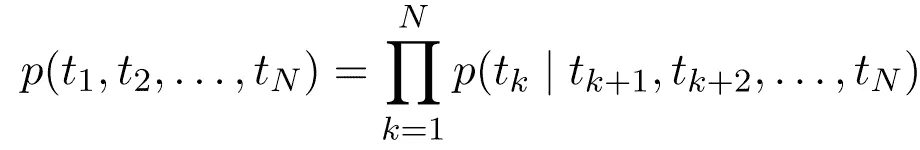

# PyTorch ELMo，从零开始训练

> 原文：<https://towardsdatascience.com/pytorch-elmo-844d2391a0b2?source=collection_archive---------8----------------------->

## 使用 AllenNLP 在您自己的语料库上学习强大的上下文单词嵌入


照片由[雷诺·莱蒂恩](https://unsplash.com/@renolaithienne?utm_source=medium&utm_medium=referral)在 [Unsplash](https://unsplash.com?utm_source=medium&utm_medium=referral) 上拍摄

**E**embeddings from**L**anguage**Mo**del(ELMo)是一种功能强大的上下文嵌入方法，可在广泛的自然语言处理任务中找到应用。ELMo 和其他人一起开创了在 NLP 中预先训练上下文单词嵌入的趋势。该技术保持简单和直观，允许其自身容易地添加到现有模型中。

在本文中，我们将讨论**如何使用我们自己的文本语料库**从头开始训练 ELMo 嵌入，并解释**如何在幕后工作**。我们将使用 [AllenNLP](https://allennlp.org/) ，这是一个基于 PyTorch 的 NLP 框架，它提供了许多现成的最新模型。如果您只对使用预先训练的 ELMo 嵌入感兴趣，请随意跳到最后一节— [*在下游任务*](#7e4d) 中使用 ELMo。

# 目录

1.  [从零开始训练埃尔莫](#b484)
2.  [理解实施](#d881)
3.  [在下游任务中使用 ELMo](#7e4d)

# 从头开始训练 ELMo

我知道你等不及了，所以让我们开始训练吧。在下一节中，我们将逐步完成培训，了解 ELMo 是如何在 AllenNLP 中实施的。

## 属国

首先，我们来安装`[allennlp-models](https://github.com/allenai/allennlp-models)`。这个包包含了在 AllenNLP 框架中实现的所有奇特的模型。安装这个包应该也能找到 PyTorch 和 AllenNLP 所需的正确版本。

```
pip install allennlp-models=v2.0.1
```

## 文集

接下来，我们获取用于训练的语料库数据。出于演示目的，我们使用原始语料库—[10 亿字语言模型基准](http://www.statmt.org/lm-benchmark/)。你也可以使用任何你选择的语料库。

```
wget [http://www.statmt.org/lm-benchmark/1-billion-word-language-modeling-benchmark-r13output.tar.gz](http://www.statmt.org/lm-benchmark/1-billion-word-language-modeling-benchmark-r13output.tar.gz)tar -xzf [1-billion-word-language-modeling-benchmark-r13output.tar.gz](http://www.statmt.org/lm-benchmark/1-billion-word-language-modeling-benchmark-r13output.tar.gz)export BIDIRECTIONAL_LM_DATA_PATH=$PWD'/1-billion-word-language-modeling-benchmark-r13output'export BIDIRECTIONAL_LM_TRAIN_PATH=$BIDIRECTIONAL_LM_DATA_PATH'/training-monolingual.tokenized.shuffled/*'
```

## 词汇

出于索引和性能的目的，AllenNLP 需要预处理的`Vocabulary`，它从一个包含`tokens.txt`的目录中读取，该目录包含每行上的所有唯一标记。(`Vocabulary`的内部工作实际上要复杂一点，但我们假设这是为了简单起见。)

在这里，我们下载预处理词汇。如果你用的是自己的语料库，看一下`tokens.txt`了解一下它的格式。请特别注意前三个标记— `</S>`、`<S>`、`@@UNKNOWN@@`。它们对于 ELMo 了解词汇之外的句子和单词的界限至关重要。

```
pip install awscli mkdir vocabulary 
export BIDIRECTIONAL_LM_VOCAB_PATH=$PWD'/vocabulary' 
cd $BIDIRECTIONAL_LM_VOCAB_PATH aws --no-sign-request s3 cp s3://allennlp/models/elmo/vocab-2016-09-10.txt . cat vocab-2016-09-10.txt | sed 's/<UNK>/@@UNKNOWN@@/' > tokens.txt
rm vocab-2016-09-10.txt echo '*labels\n*tags' > non_padded_namespaces.txt
```

## 培养

我们已经到了从头开始训练 ELMo 的最后一步。在这一步中，我们使用预先组合的配置文件开始培训。

```
wget [https://raw.githubusercontent.com/allenai/allennlp-models/main/training_config/lm/bidirectional_language_model.jsonnet](https://raw.githubusercontent.com/allenai/allennlp-models/main/training_config/lm/bidirectional_language_model.jsonnet)allennlp train bidirectional_language_model.jsonnet --serialization-dir output_dir/
```

## 不满意？

以上步骤大量借鉴了官方 AllenNLP HowTo 。如果您想要调整底层架构或者想要将自己的语料库处理成想要的格式，这可能看起来很不清楚。在提供惊人的简单性的同时，AllenNLP 扫除了大量关于数据和架构的潜在假设。

在您等待培训结束时，我们将从 AllenNLP 框架的角度来看看 ELMo 是如何工作的。

# 了解实现

为了理解 ELMo 架构以及它是如何实现的，我们仔细看一下`bidirectional_language_model.jsonnet`，它本质上是一个配置文件，在一个非常高的层次上指定了一切。它允许我们轻松地定义如何处理数据(令牌化和嵌入)以及架构是什么样子。

注意:在 JSON 对象中，我们看到许多带有键`"type”`的对象。这是 AllenNLP 注册自定义类的语法。通过使用它的 [register decorator](https://docs.allennlp.org/main/api/common/registrable/#register) ，我们向 AllenNLP 公开了我们的类，使我们能够在我们的配置中使用它们。

## 数据集阅读器

*将自然语言连接到自然数*


简单语言建模数据集阅读器

我们关心的第一件事是数据如何从我们磁盘上的自然语言文本流入模型。数据首先由一个`Tokenizer`标记，在空格处分割句子。然后，通过`TokenIndexer`将单个令牌转换成数字。

在许多情况下，将单词转换成词汇表中它们各自的 id 就足够了。因为我们使用字符级 CNN 来捕获子词信息，所以我们需要额外按每个字符转换单词。

模型和数据集读取器之间的界限在于内部状态是否可以学习。更具体地说，从标记到索引号的转换是一个固定的过程，通常依赖于查找表，因此它属于数据集读取器。

## 模型—嵌入器

*将索引连接到非文本化嵌入*


ELMo 架构概述

然而，将这些索引号转换成非文本化的嵌入是一个可学习的过程，与技术无关(例如，嵌入表、字符卷积等)。)

注意`token_embedders`如何与`token_indexers`共享相同的密钥。这允许模型在内部与数据集读取器连接。

在 ELMo 中，我们只使用字符级的无上下文嵌入。因此，单词的索引被`empty`嵌入器丢弃，而字符的索引被送入`character_encoding`嵌入器。


字符卷积

让我们仔细看看字符嵌入器。在内部，它用一个学习嵌入矩阵将字符索引转换成字符嵌入。然后，对于每个单词，它使用 CNN 通过卷积各个单词的字符嵌入来学习其单词嵌入。这样做给了我们一个包含子词信息的无语境的单词嵌入。

无语境的单词嵌入已经存在很长时间了。像 [word2vec](https://arxiv.org/abs/1301.3781) 、 [GloVe](https://nlp.stanford.edu/projects/glove/) 这样的嵌入一直是 NLP 中的标准特性。这种嵌入的一个长期存在的问题是上下文的丢失。在非语篇化嵌入中,“bank”在“river bank”和“bank account”中的嵌入是相同的。然而，我们知道这些词有完全不同的意思。接下来，我们来看看 ELMo 如何用它的上下文器处理这个问题。

## 模型——语境化者

*通过查看句子轻推单词嵌入*


biLSTM 语境化器

在最初的论文中，Peters 等人使用了一个 **biLSTM** 作为上下文组织器。前进的 LSTM 从前面的单词中捕捉上下文；落后的 LSTM 从后面的单词中捕捉上下文。

例如，为了将一个嵌入的 xₜ语境化，向前的 LSTM 看着 x₁，…，xₜ₋₁并创造一个隐藏的状态；落后的 LSTM 看着 xₜ₊₁，…，xₙ，创造了另一个隐藏的国家。通过连接两个隐藏状态，我们获得了考虑前向上下文和后向上下文的上下文化嵌入。

在随后的研究中，Peters 等人发现 LSTM 在下游任务中享有更高的准确性，而 transformer 在性能略有下降的情况下享有更快的推理速度。因此，实现使用了基于转换器的上下文化器。直观上，它实现了 LSTM 试图实现的相同目标——将句子上下文添加到每个单词嵌入中。

这就完成了 ELMo 架构，也就是说，我们在下游任务中使用由此产生的上下文嵌入。我们要讨论的最后一个部分是它的训练目标——双向语言模型丢失。

## 模型—损失

*用以前的话来预测 ____*

> 给定 n 个标记的序列，(t₁，t₂，…，tₙ)，正向语言模型通过对给定历史(t₁，…，tₖ₋₁)的标记 tₖ的概率建模来计算序列的概率



向前和向后 LM 从[到*深层语境化的词语表征*到](https://arxiv.org/abs/1802.05365)

同样，我们可以推导出反向语言模型。我们最终的双向语言模型目标只是我们语料库中所有句子的两个对数概率之和。

在 AllenNLP 中，损耗被嵌入到`language_model`模型中，因此我们只需在配置中将参数`bidirectional`设置为`true`。我们还可以通过设置`num_samples`使用采样的 softmax 损耗来加快速度。

把所有东西放在一起

咻！这就是 ELMo 架构及其在 AllenNLP 中的实现。当你在阅读的时候，你的模型可能已经完成了训练(好吧，可能没有)。在下一节中，我们将使用经过训练的 ELMo 来嵌入一些文本！

# 在下游任务中使用 ELMo

现在您已经完成了训练，您应该能够在`output_dir/`中看到每个时期的指标，在这里您还可以找到训练好的模型权重`model.tar.gz`。或者，您可以抓取一个[预训练的权重](https://allennlp.org/elmo)并将其集成到您的模型中。

要将 ELMo 集成到您的 AllenNLP 模型配置中，我们只需将其用作另一个`token_embedder`:

使用 ELMo 从零开始训练

使用预先训练的 ELMo

不想使用配置文件？也可以用 Python 直接调用 ELMo:

你已经坚持到最后了！虽然 AllenNLP 的语法可能仍然让您感到困惑，但我们确实看到了它在从零开始用 0 行代码训练一个基于 PyTorch 的 ELMo 方面的威力！它还包括许多开箱即用的惊人的 NLP 模型。如果你有兴趣使用它们，看看它的[官方指南](https://guide.allennlp.org/)和[文档](https://docs.allennlp.org/v2.0.1/)。

# 参考

1.  [*深度语境化的文字表述*](https://arxiv.org/abs/1802.05365) 首创 ELMo 架构。它获得了当时许多 NLP 任务的最新技术，而该架构仍然可以很容易地集成到其他模型中。
2.  [*剖析上下文单词嵌入:架构与表示*](https://arxiv.org/abs/1808.08949) 进一步研究了 ELMo 架构。它试图说明预训练的语境嵌入是如何以及为什么如此有效。在这项研究中，通过使用不同的上下文环境(LSTM、变形金刚、门控 CNN)进行实验，发现了速度和准确性之间的折衷。报告了网络深度和捕获的信息之间的关系，其中较低层捕获句法特征，而较高层捕获语义特征。
3.  [*长短期记忆*](https://www.bioinf.jku.at/publications/older/2604.pdf) 首先被引入以捕获序列中的长期依赖性，并解决传统 RNNs 中的消失梯度问题。ELMo 使用 LSTM 生成隐藏状态的方式来将单词嵌入上下文化。关于 LSTM 更复杂的解释，请查看科拉的博客。
4.  [*关注是你所需要的*](https://arxiv.org/abs/1706.03762) 将变形金刚引入世界。它使用自我关注来捕获令牌之间的依赖关系，使其大规模并行化。HavardNLP 在[带注释的 transformer](https://nlp.seas.harvard.edu/2018/04/03/attention.html) 中深入探讨了它的实现，而 Jay Alammar 在他的[带插图的 transformer](http://jalammar.github.io/illustrated-transformer/) 中提供了一个很好的直觉。
5.  [*AllenNLP:深度语义自然语言处理平台*](https://arxiv.org/abs/1803.07640) 为我们带来了 AllenNLP 框架。它提供了许多处理文本数据的常见抽象，并智能地处理诸如批处理和填充之类的事情。我个人认为它非常有用，因为它收集了大量的 NLP 模型。欲了解更多信息，请查看其[官方指南](https://guide.allennlp.org/)、[文档](https://docs.allennlp.org/v2.0.1/)，以及[开源模型](https://github.com/allenai/allennlp-models)的 GitHub repo。