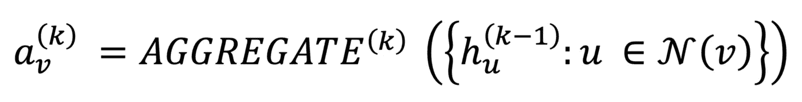
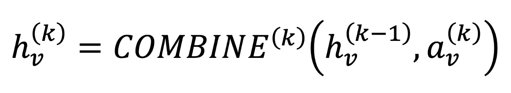
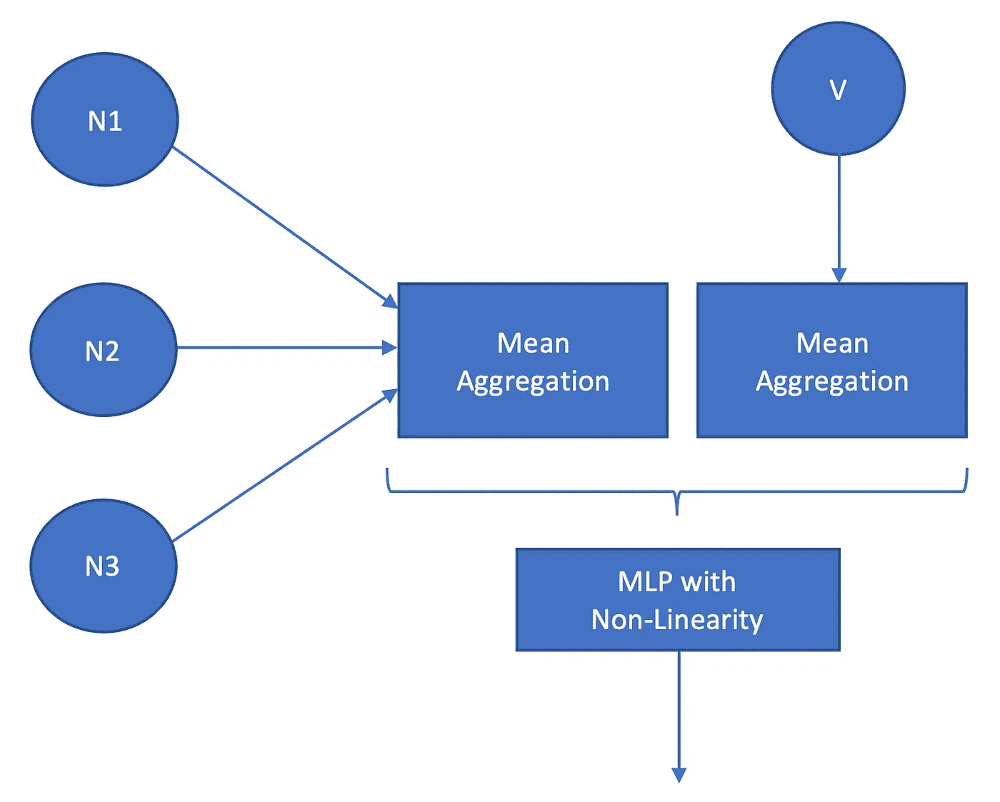
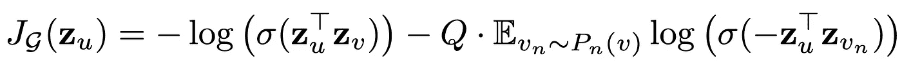
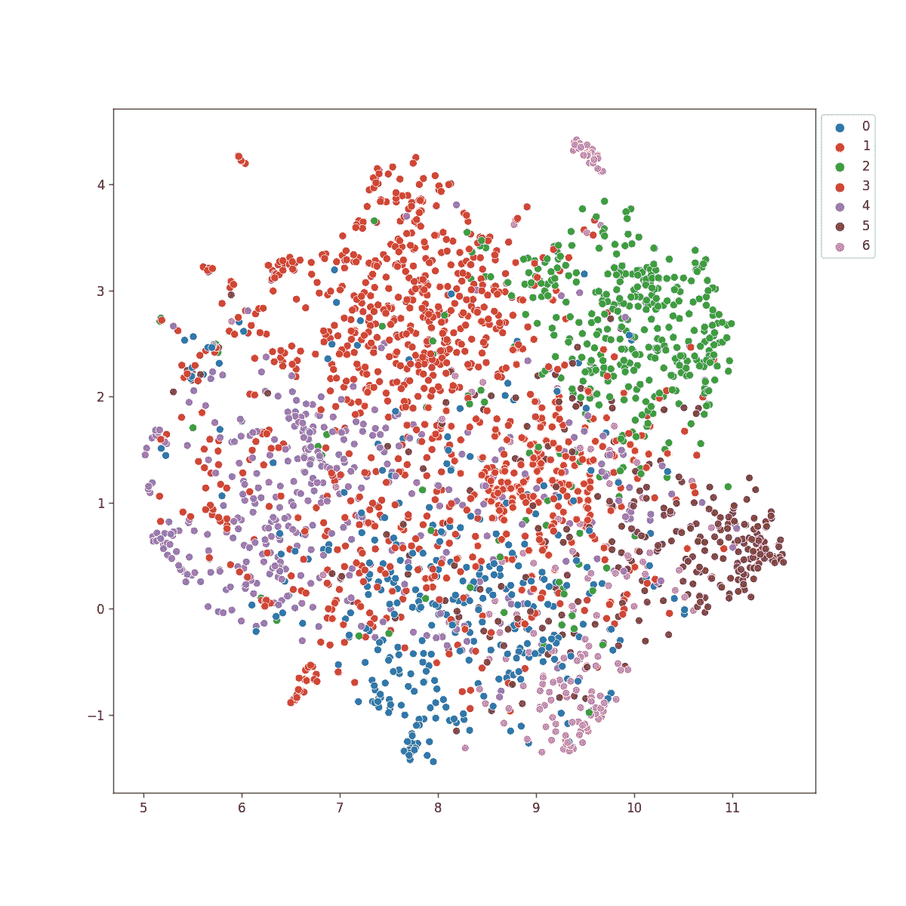
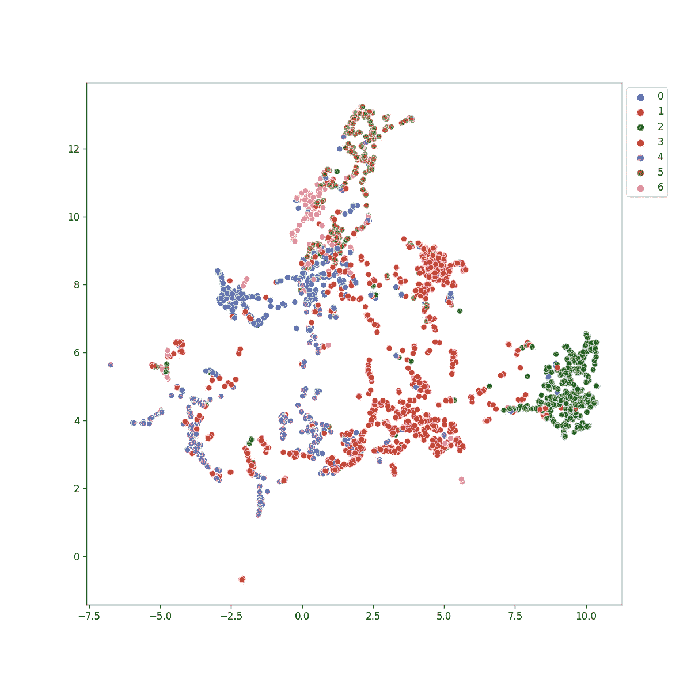

# PyTorch 几何图形嵌入

> 原文：<https://towardsdatascience.com/pytorch-geometric-graph-embedding-da71d614c3a?source=collection_archive---------9----------------------->

## 使用 **PyTorch 几何**模块中的 SAGEConv 嵌入图形

图形表示学习/嵌入通常是用于将图形数据结构转换为更结构化的向量形式的过程的术语。这通过提供更易管理的固定长度向量来实现下游分析。理想情况下，除了节点特征之外，这些向量还应包含图结构(拓扑)信息。我们使用图形神经网络(CNN)来执行这种转换。要对 GNNs 有一个基本的高级概念，您可以看一下下面的文章。

[](/what-can-you-do-with-gnns-5dbec638b525) [## 你能用 GNNs 做什么

### 图形神经网络的操作、效用和优势

towardsdatascience.com](/what-can-you-do-with-gnns-5dbec638b525) 

在本文中，我将讨论 GraphSAGE 架构，它是消息传递神经网络(MPNN)的一种变体。MPNN 是一个描述 gnn 如何有效实现的奇特术语。

# 广义 GNN 表示

任何 MPNN 都可以用两个函数**集合**和**组合**来正式表示。



作者引用的等式([https://arxiv.org/pdf/1810.00826.pdf](https://arxiv.org/pdf/1810.00826.pdf))

**聚合**函数控制如何为给定节点收集或聚合邻居信息。



作者引用的等式([https://arxiv.org/pdf/1810.00826.pdf](https://arxiv.org/pdf/1810.00826.pdf))

**combine** 函数控制节点本身的信息如何与来自邻居的信息相结合。

# 图表法

GraphSAGE 代表图形样本和集合。让我们首先定义 GraphSAGE 的聚合和组合函数。

**合并** —使用相邻要素的元素均值

**聚合** —将聚合的特征与当前节点特征连接起来

# 图形解释

GraphSAGE 层可以直观地表示如下。对于给定的节点 v，我们使用平均聚合来聚合所有邻居。结果与节点 v 的特征连接在一起，并通过多层感知(MLP)以及类似 RELU 的非线性反馈。



作者图片

人们可以很容易地使用 PyTorch geometric 这样的框架来使用 GraphSAGE。在我们开始之前，让我们建立一个用例来继续。嵌入图形的一个主要重要性是可视化。因此，让我们用 GraphSAGE 构建一个 GNN 来可视化 Cora 数据集。请注意，这里我使用的是 [PyTorch 几何知识库](https://github.com/rusty1s/pytorch_geometric/blob/master/examples/graph_sage_unsup.py)中提供的例子，没有什么技巧。

# 图表用法细节

GraphSAGE 的核心思想是采样策略。这使得该架构能够扩展到非常大规模的应用。采样意味着，在每一层，仅使用最多 **K** 个邻居。像往常一样，我们必须使用一个顺序不变的聚合器，如均值、最大值、最小值等。

# 损失函数

在图形嵌入中，我们以无人监督的方式操作。因此，我们使用图的拓扑结构来定义损失。



来自 GraphSAGE 论文:【https://arxiv.org/pdf/1706.02216.pdf 

这里 **Zu** 展示了节点 **u** 的最终层输出。 **Zvn** 表示负采样节点。简单来说，等式的第二项表示负(节点 **u** 和任意随机节点 **v** )的求反点积应该最大化。换句话说，随机节点的余弦距离应该更远。对于节点 **v** 来说，第一项说的是另外一种情况，这是一个我们需要嵌入得更靠近 **u** 的节点。这个 **v** 被称为正节点，通常使用从 **u** 开始的随机行走来获得。 **Evn~Pn(v)** 表示负节点取自负采样方法。在实际实现中，我们将直接邻居作为正样本，随机节点作为负样本。

# 构建图嵌入网络

我们可以从导入以下 python 模块开始。

```
import torch
import torch.nn as nn
import torch.nn.functional as F
from torch_cluster import random_walk
from sklearn.linear_model import LogisticRegressionimport torch_geometric.transforms as T
from torch_geometric.nn import SAGEConv
from torch_geometric.datasets import Planetoid
from torch_geometric.data import NeighborSampler as
                                    RawNeighborSamplerimport umap
import matplotlib.pyplot as plt
import seaborn as sns
```

初始化 Cora 数据集；

```
dataset = 'Cora'
path = './data'
dataset = Planetoid(path, dataset, transform=T.NormalizeFeatures())
data = dataset[0]
```

请注意，dataset 对象是一个子图列表。对于 Cora，我们有一个，所以我们选择索引为 0 的图。

采样器组件(这里我们扩展 NeighborSampler 类的 sample 方法，用正负样本创建批次)；

```
# For each batch and the adjacency matrix
pos_batch = random_walk(row, col, batch, 
                          walk_length=1,
                          coalesced=False)[:, 1]
# row are source nodes, col are target nodes from Adjacency matrix
# index 1 is taken as positive nodes# Random targets from whole adjacency matrix
neg_batch = torch.randint(0, self.adj_t.size(1), (batch.numel(), ),
                                  dtype=torch.long)
```

GNN 可以在 PyTorch 宣布如下；

```
class SAGE(nn.Module):
    def __init__(self, in_channels, hidden_channels, num_layers):
        super(SAGE, self).__init__()
        self.num_layers = num_layers
        self.convs = nn.ModuleList()

        for i in range(num_layers):
            in_channels = in_channels if i == 0 else hidden_channels
            self.convs.append(**SAGEConv(in_channels,
                                   hidden_channels)**) def forward(self, x, adjs):
        for i, (edge_index, _, size) in enumerate(adjs):
            x_target = x[:size[1]]  
            x = self.convs[i]((x, x_target), edge_index)
            if i != self.num_layers - 1:
                x = x.relu()
                x = F.dropout(x, p=0.5, training=self.training)
        return x def full_forward(self, x, edge_index):
        for i, conv in enumerate(self.convs):
            x = conv(x, edge_index)
            if i != self.num_layers - 1:
                x = x.relu()
                x = F.dropout(x, p=0.5, training=self.training)
        return x
```

注意，我们使用 PyTorch 几何框架中的 SAGEConv 层。在前向传递中，邻居采样器为我们提供要在每一层中传递的数据作为数据索引。这是一个相当复杂的模块，所以我建议读者阅读论文(第 12 页)中的 [Minibatch 算法和 PyTorch Geometric](https://arxiv.org/pdf/1706.02216.pdf) 中的 [NeighborSampler 模块文档。](https://pytorch-geometric.readthedocs.io/en/latest/modules/data.html?highlight=neighborsampler#torch_geometric.data.NeighborSampler)

# 形象化

在没有使用图形结构的情况下，下面是 UMAP 图。



作者图片

当我们使用 GraphSAGE 嵌入时，我们可以有如下更好的嵌入:



作者图片

我们可以看到，与朴素 UMAP 嵌入相比，这些嵌入要好得多，并且分离得很好。然而，这并不完美，需要更多的工作。但我希望这是一个足够好的演示来传达这个想法。😊

希望你喜欢这篇文章！

完整的代码和 Jupyter 笔记本可从[这里](https://gist.github.com/anuradhawick/904e7f2d2101f4b76516d04046007426)获得。