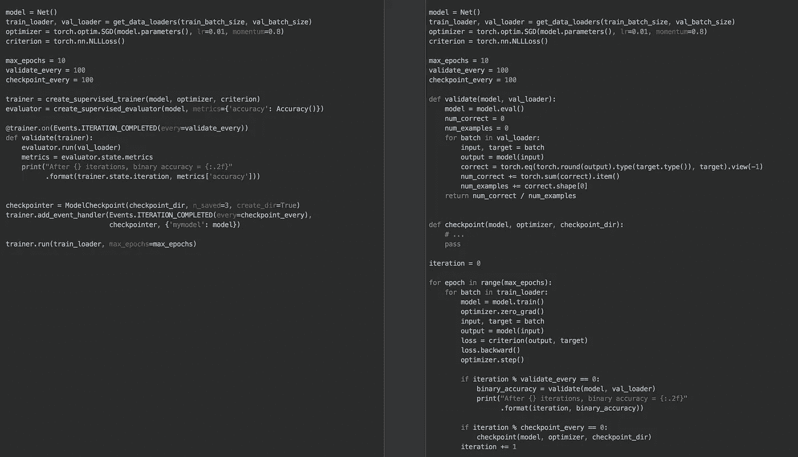
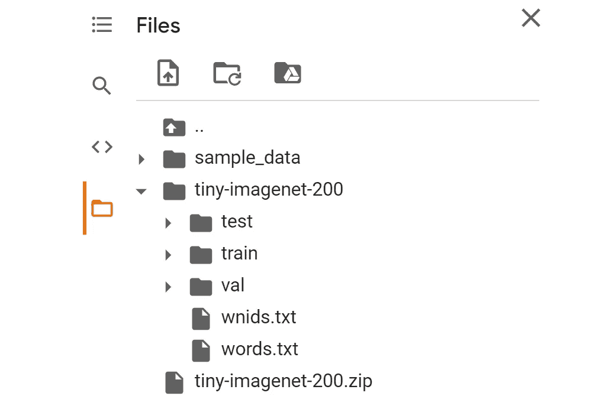
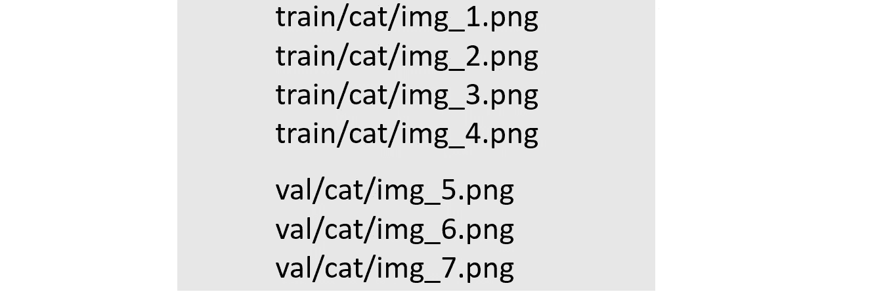
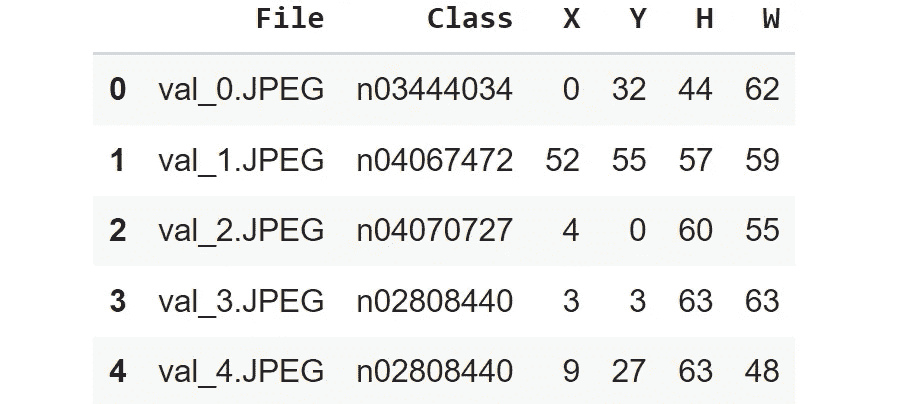
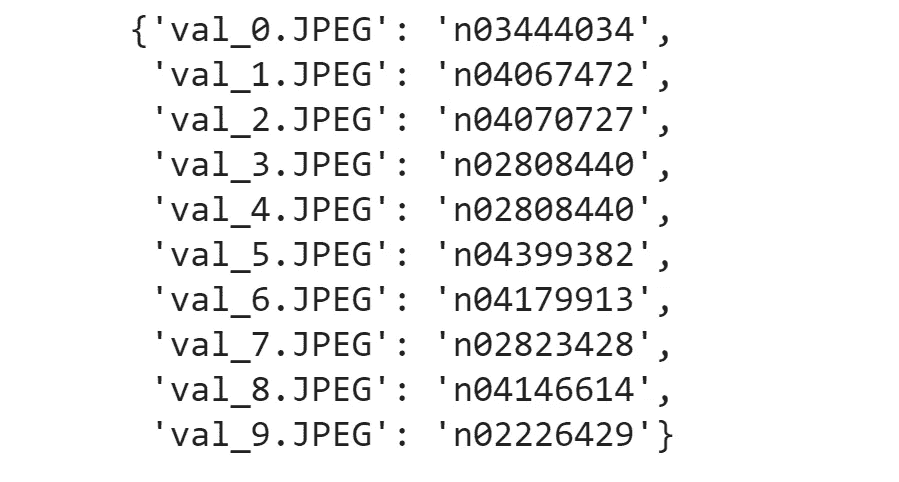
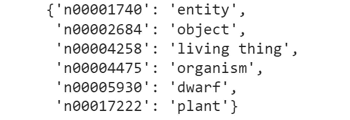
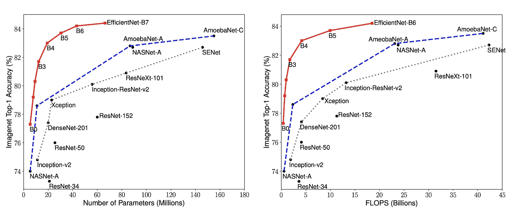
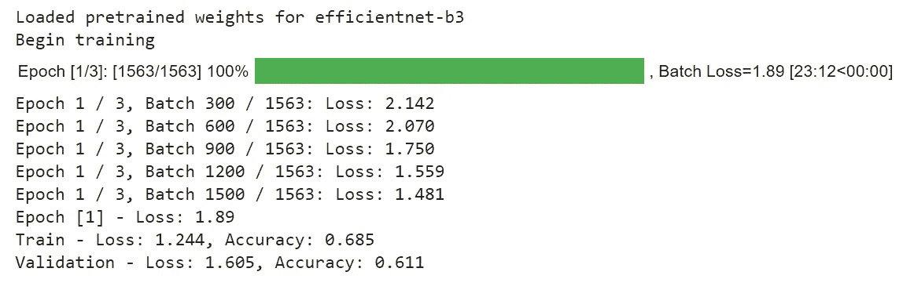
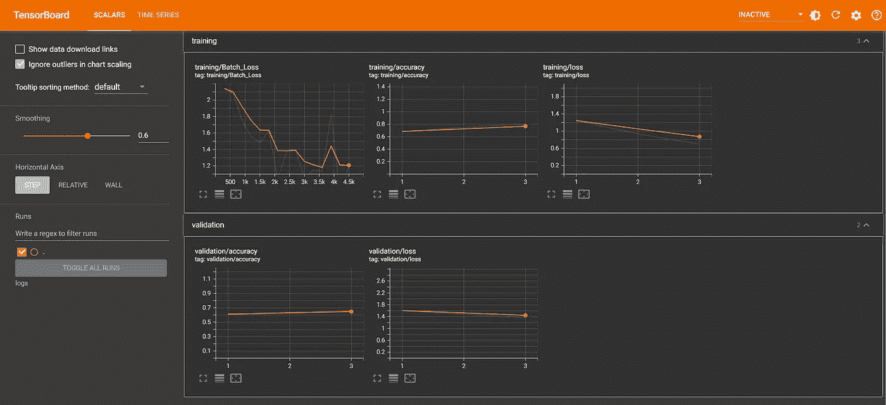

# PyTorch Ignite 教程—使用高效网络对微型图像网络进行分类

> 原文：<https://towardsdatascience.com/pytorch-ignite-classifying-tiny-imagenet-with-efficientnet-e5b1768e5e8f?source=collection_archive---------6----------------------->

## [实践教程](https://towardsdatascience.com/tagged/hands-on-tutorials)

## 使用 PyTorch **Ignite** 简化您的 PyTorch 深度学习实施的分步指南


照片由 [Olga Bast](https://unsplash.com/@olgabast?utm_source=medium&utm_medium=referral) 在 [Unsplash](https://unsplash.com?utm_source=medium&utm_medium=referral) 拍摄

**PyTorch** 是一个强大的深度学习框架，已经被科技巨头采用，如[特斯拉](https://analyticsindiamag.com/tesla-pytorch-self-driving-computer-vision-karpathy-elon-musk-ai/)、 [OpenAI](https://openai.com/blog/openai-pytorch/) 和[微软](https://visualstudiomagazine.com/articles/2021/06/03/pytorch-enterprise.aspx)用于关键的研究和生产工作负载。

它的开源特性意味着 PyTorch 的功能也可以被公众所利用。

深度学习实现的一个问题是，代码可能会快速增长，变得重复和过于冗长。这引发了[高级](https://en.wikipedia.org/wiki/High-_and_low-level)库的创建，以简化这些 PyTorch 代码，其中之一就是 [PyTorch Ignite](https://pytorch.org/ignite) 。

本文就如何使用 **PyTorch Ignite** 来简化 PyTorch 中深度学习模型的开发提供了一个解释清楚的演练。

## 内容

> ***(1)***[*关于 PyTorch 点燃*](#9c28)***(2)***[*分步实施*](#4195)***(3)***[*把东西包起来*](#312b)

# 关于 PyTorch Ignite


在 [BSD 3 条款许可](https://github.com/pytorch/ignite/blob/master/LICENSE)下使用的图像

PyTorch Ignite 是一个高级库，可以灵活透明地帮助训练和评估 PyTorch 中的神经网络。

它减少了构建深度学习模型所需的代码量，同时保持了简单性和最大程度的控制。



**PyTorch** **点燃**代码(**左** ) vs 纯 PyTorch 代码(**右** ) |图片在 [BSD 三条款许可下使用](https://github.com/pytorch/ignite/blob/master/LICENSE)

上图展示了 PyTorch Ignite 将纯 PyTorch 代码压缩到更简洁的程度。

除了消除低级代码，PyTorch Ignite 还提供了对度量评估、实验管理和模型调试的实用支持。

# 逐步实施

本教程的演示任务是在 **Tiny ImageNet** 数据集上建立一个图像分类深度学习模型。

Tiny ImageNet 是著名的 [ImageNet 大规模视觉识别挑战赛](https://image-net.org/challenges/LSVRC) (ILSVRC)中 ImageNet 数据集的子集。

数据集包含 100，000 张缩小到 64×64 彩色图像的 **200 类**(每类 500 张)图像。每个类有 500 幅训练图像、50 幅验证图像和 50 幅测试图像。


来自微型 ImageNet 数据集的样本图像|作者提供的图像

让我们详细介绍使用 PyTorch 和 Ignite 尽可能准确地对这些图像进行分类的步骤。

## 步骤 1 —初始设置

我们将使用 [Google Colab](https://colab.research.google.com/) ，因为它提供对 GPU 的免费访问，我们可以随时使用。请随时跟随本 [**完成演示的 Colab 笔记本**](https://colab.research.google.com/drive/15eS8Evij9iYBcj-OrOfg7c2iRA56FTZZ?usp=sharing) **。**

确保您已经将 Colab 运行时设置为 **GPU** 。完成后，执行以下步骤作为初始设置的一部分:

1.  **安装**和**导入**必要的 Python 库

2.**定义** GPU 对 PyTorch 的支持(即使用 [CUDA](https://blogs.nvidia.com/blog/2012/09/10/what-is-cuda-2/) )。

## 步骤 2 —下载微型 ImageNet 数据集

有两种方法下载微型 ImageNet 数据集，即:

*   用[*open datasets*](https://pypi.org/project/opendatasets/)*库直接从 Kaggle 下载*
*   *使用 GNU [*wget*](https://www.gnu.org/software/wget/) 包从斯坦福官方网站下载*

*对于这个项目，我使用 *wget* 来检索原始数据集(在一个 zip 文件中)。下载后，我们可以解压缩 zip 文件，并为提取的图像设置各自的文件夹路径。*

*如果操作正确，您应该会看到文件夹出现在 Colab 侧边栏上:*

**

*作者图片*

## *步骤 3 —设置助手功能*

*我们定义辅助函数是为了让我们以后的生活更轻松。创建了两组功能，它们是:*

*   ***显示单个或一批样本图像***

*这使我们能够可视化我们正在处理的图像的随机子集。*

*   ***为图像数据集创建数据加载器***

*数据加载器的工作是从数据集生成小批量数据，让我们可以灵活地选择不同的采样策略和批量大小。*

*在上面的代码中，我们使用了来自 *torchvision.datasets* 的`ImageFolder`函数来生成数据集。为了使`ImageFolder`工作，训练和验证文件夹中的图像必须按照以下结构排列:*

**

*图像数据的预期文件夹结构:*根/标签/文件名* |作者图像*

## *步骤 4-组织验证数据文件夹*

*您会注意到培训文件夹符合**步骤 3** 中`ImageLoader`所需的结构，但是**验证文件夹不符合。***

*验证文件夹中的图像都保存在一个文件夹中，因此我们需要根据它们的标签将它们重新组织到子文件夹中。*

*验证文件夹包含一个***val _ annotations . txt***文件，该文件由六个制表符分隔的列组成:文件名、类标签和边界框的细节(x，y 坐标、高度、宽度)。*

**

*val_annotations.txt 文件中的数据|作者图片*

*我们提取前两列，将成对的文件名和相应的类标签保存在字典中。*

**

*每个验证图像的相应标签|按作者分类的图像*

*要了解每个类标签的含义，可以阅读 *words.txt* 文件。例如:*

**

*相应类别标签代码的标签描述符示例|作者图片*

*之后，我们执行文件夹路径重组:*

## *步骤 5 —定义图像预处理转换*

*所有预训练的 Torchvision 模型都希望输入图像以相同的方式归一化(作为预处理要求的一部分)。*

*它要求这些图像为 shape (3 x H x W)的 3 通道 RGB 格式，其中 H(高)和 W(宽)至少为 **224 像素**。*

*然后需要根据 **(0.485，0.456，0.406)** 的**均值**值和 **(0.229，0.224，0.225)** 的**标准差**值对像素值进行归一化。*

*除此之外，我们可以引入各种变换(例如，中心裁剪、随机翻转等。)来[扩充](/top-python-libraries-for-image-augmentation-in-computer-vision-2566bed0533e)图像数据集并提高模型性能。*

*我们将这些转换放在一个 *Torchvision* `Compose`包装器中，将它们链接在一起。*

## *步骤 6-创建数据加载器*

*我们在**步骤 3** 中描述了数据加载器的概念，并为设置数据加载器创建了一个帮助函数。是时候通过为**训练集和**验证集创建数据加载器来很好地利用这个函数了。*

*我们在**步骤 5** 中指定转换步骤，并定义 **64** 的批量。这意味着 DataLoader 每次被调用时将推出 64 个图像。*

## *步骤 7 —定义模型架构*

*火炬视觉[模型子包](https://pytorch.org/vision/stable/models.html) `torchvision.models`包含了大量预先训练好的模型供我们使用。这包括流行的架构，如 ResNet-18、VGG16、GoogLeNet 和 ResNeXt-50。*

*我们将为这个项目做一些不同的事情，在 Torchvision 模型的默认列表中选择一个**而不是**的预训练模型。特别是，我们将使用 **EfficientNet** 。*

*EfficientNet 是 Google 在 2019 年开发的卷积神经网络架构和缩放方法。它超越了最先进的精度，效率提高了 10 倍(即更小、更快)。*

*下图说明了 EfficientNet ( *红线*)在准确性(在 ImageNet 上)和计算资源方面如何优于其他架构。*

**

*在 [Apache 2.0 许可下使用的图像](https://github.com/lukemelas/EfficientNet-PyTorch/blob/master/LICENSE)*

*不同版本的 EfficientNet (b0 到 b7)基于模型参数的数量而有所不同。参数数量越多，精度越高，但代价是训练时间越长。*

*在本教程中，我们将使用高效网络的 PyTorch 实现来建立一个**高效网络-B3** 架构。我选择 **B3** 是因为它在准确性和训练时间之间提供了一个很好的平衡。*

*更新的 EfficientNet v2 的 PyTorch 实现即将推出，请继续关注[GitHub repo](https://github.com/lukemelas/EfficientNet-PyTorch)的最新更新。*

## *步骤 8-定义损失函数、超参数和优化器*

*最适合图像分类任务的损失函数是**分类交叉熵损失**。*

*我们将使用一组模型参数的基线值，例如学习率、时期数、日志记录频率和优化器类型。*

## *步骤 9-实例化教练引擎*

*Ignite 框架的主要本质是`**Engine**`类，它对输入数据执行处理功能并返回输出。*

*当我们创建一个**训练器引擎**时，我们正在初始化一个类，该类将被重复调用，以根据数据加载器生成的批量数据训练模型。*

*PyTorch Ignite 自带内置助手函数，只需单行代码即可创建训练器引擎。对于我们的监督图像分类用例，我们利用了`create_supervised_trainer`函数。*

*这些引擎还允许我们附加有用的[事件处理程序](https://pytorch.org/ignite/handlers.html)，比如监控训练的进度条。*

## *步骤 10 —定义评估指标*

*用于图像分类模型评估的[度量](https://pytorch.org/ignite/metrics.html)是**准确度**(用于我们解释模型的性能)和**交叉熵损失**(用于模型迭代改进)。*

*在将指标附加到引擎之前，您也可以创建自己的自定义指标。例如， **F1 分数**可以从默认精度和召回指标中通过算术方法得出:*

```
***from** ignite.metrics **import** **Precision,** **Recall**

**precision** **=** **Precision(average=False)**
**recall** **=** **Recall(average=False)**
**F1** **=** **(precision** ***** **recall** ***** 2 **/** **(precision** **+** **recall)).mean()****F1.attach(engine,** "F1"**)***
```

## *步骤 11-实例化评估引擎*

*在定义评估指标之后，我们可以初始化评估器引擎来**评估**模型性能。**评估引擎**将把模型和评估指标(来自**步骤 10** )作为参数。*

*我们为训练集定义了一个评估器引擎，为验证集定义了一个单独的评估器引擎。这是因为他们在整个模型训练过程中的角色不同。*

*验证评估器将用于保存基于验证指标的最佳模型，而训练评估器将只记录训练集中的指标。*

## *步骤 12—创建事件处理程序*

*为了提高`[**Engine**](https://pytorch.org/ignite/generated/ignite.engine.engine.Engine.html#ignite.engine.engine.Engine)`的**和**的灵活性，引入了一个事件系统，以便于在训练运行的每一步进行事件互动，例如:*

*   *发动机启动/完成*
*   *纪元开始/完成*
*   *批量迭代开始/完成*

*在 decorators 的帮助下，我们可以创建被称为**事件处理程序**的定制代码。事件处理程序是在特定事件发生时执行的函数。例如，我们可以在每次迭代(`Events.ITERATION_COMPLETED`)和时期(`Events.EPOCH_COMPLETED`)完成时记录度量。*

*此外，我们想要一个[检查点](https://pytorch.org/ignite/generated/ignite.handlers.checkpoint.Checkpoint.html#ignite.handlers.checkpoint.Checkpoint)处理程序来保存我们最好的模型(如[)。pt 文件](https://pytorch.org/tutorials/beginner/saving_loading_models.html))基于验证准确度。这可以通过[公共](https://pytorch.org/ignite/_modules/ignite/contrib/engines/common.html)模块中的辅助方法`save_best_model_by_val_score`轻松完成。*

*在伴随每个事件的函数中，您会注意到我们使用了在前面的步骤中已经构建好的变量和引擎。*

## *步骤 13 —设置 Tensorboard*

*[Tensorboard](https://www.tensorflow.org/tensorboard/) 作为机器学习实验的一部分，是一个跟踪和可视化指标(如损失和准确性)的有用工具包。*

*PyTorch 与 Tensorboard 集成在一起，因此我们可以从创建一个 [Tensorboard logger](https://pytorch.org/ignite/generated/ignite.contrib.handlers.tensorboard_logger.html) 处理程序并指定存储日志的目录开始。*

*初始化 Tensorboard logger 后，我们可以附加输出处理程序来指定事件和相应的度量，以保存供以后可视化。*

*虽然我们在这里使用 Tensorboard，但我们可以轻松地使用其他流行的日志工具，如 Weights and Biases、ClearML 和 MLflow。查看[通用模块文档](https://pytorch.org/ignite/_modules/ignite/contrib/engines/common.html)了解更多信息。*

## *步骤 14-开始模型训练*

*我们终于到了可以开始实际模型训练的阶段了。我们通过让**训练器引擎**在训练集数据加载器上运行来做到这一点。*

*这是 Colab 中第一个训练纪元的样子:*

**

*作者图片*

*仅用一个纪元，B3 效率网就已经取得了令人印象深刻的验证准确度 **61.1%** 。*

*训练完成后，我们可以运行以下代码来获得验证集的最终评估指标:*

```
*print(evaluator.state.metrics)*
```

*三个时期后得到的最终准确率得分为 **66.57%** 。*

## *步骤 15 —在 Colab 中查看 Tensorboard*

*我们调用一组神奇的命令来加载 Colab 笔记本中的 Tensorboard。*

*执行上述命令后，Colab 笔记本中将加载以下 Tensorboard 接口。这个可视化仪表板为我们提供了从训练运行中获得的指标信息。*

**

*Tensorboard 截图|图片作者*

# *包装东西*

*在本教程中，我们介绍了利用 Ignite 框架的灵活性和简单性来构建 PyTorch 深度学习模型的步骤。*

*PyTorch Ignite 具有许多其他功能来满足更复杂的神经网络设计的需求，因此可以随意浏览[文档](https://pytorch.org/ignite/index.html)和[示例笔记本](https://pytorch.org/ignite/examples.html)。*

*例如，代替先前使用的静态学习率，我们可以结合一个[学习率调度器(LRScheduler)处理程序](https://pytorch.org/ignite/generated/ignite.handlers.param_scheduler.LRScheduler.html)到在训练期间调整学习率值。灵活性也意味着我们可以在设置中包含其他算法，如 [FastAI 的学习率查找器](https://github.com/pytorch/ignite/blob/master/examples/notebooks/FastaiLRFinder_MNIST.ipynb)。*

***项目链接***

*   *[GitHub 回购](https://github.com/kennethleungty/PyTorch-Tiny-ImageNet-Classification)*
*   *[Colab 笔记本](https://colab.research.google.com/drive/1HWfA_JrjoehfZ1zP60MWKo85fBeKccRg?usp=sharing)*

**

*照片由[阿齐兹·阿查基](https://unsplash.com/@acharki95?utm_source=medium&utm_medium=referral)在 [Unsplash](https://unsplash.com?utm_source=medium&utm_medium=referral) 上拍摄*

## *在你走之前*

*欢迎您**加入我的数据科学学习之旅**。跟随这个[媒体](https://kennethleungty.medium.com/)页面并查看我的 [GitHub](https://github.com/kennethleungty) 以了解实用和教育数据科学内容。同时，祝你考试顺利！*

## *参考*

*   *[PyTorch 点燃 GitHub](https://github.com/pytorch/ignite)*
*   *[PyTorch 点火文档](https://pytorch.org/ignite/index.html)*
*   *[efficient net-py torch GitHub](https://github.com/lukemelas/EfficientNet-PyTorch)*