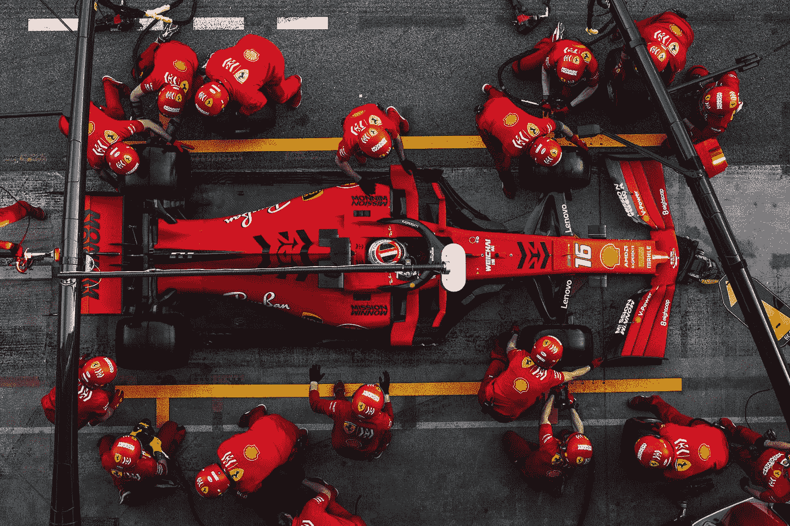
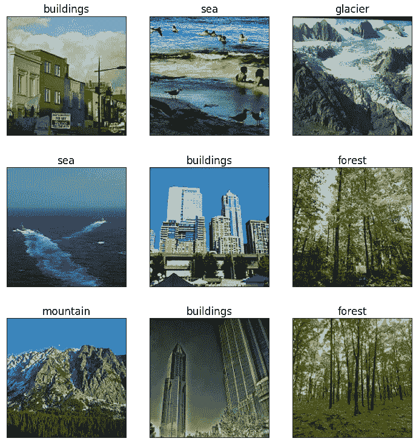
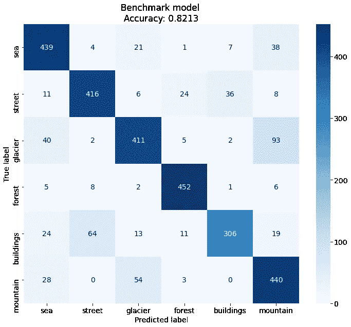
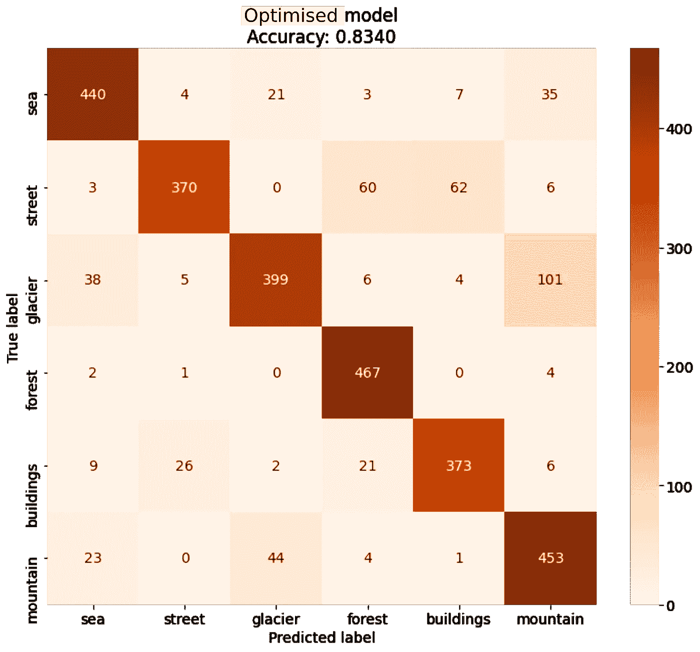

# PyTorch Lightning 和 Optuna:多 GPU 超参数优化

> 原文：<https://towardsdatascience.com/pytorch-lightning-and-optuna-multi-gpu-hyperparameter-optimisation-7b42c3c28df0?source=collection_archive---------14----------------------->

## 如何使用 PyTorch Lightning 快速设置用于超参数优化的多 GPU 训练

古斯塔沃·坎波斯在 [Unsplash](https://unsplash.com?utm_source=medium&utm_medium=referral) 上的照片

可能大多数阅读这篇文章的人都至少训练过一次 ML 模型，花了相当多的时间。当我在[为高精度文本分类微调 RoBERTa](/fine-tuning-bert-and-roberta-for-high-accuracy-text-classification-in-pytorch-c9e63cf64646) 时，情况确实如此。根据数据和模型，利用 GPU 进行训练可以将训练时间缩短一个数量级。对于卷积神经网络(CNN)和图像或视频流数据，如果将一批数据传递给 GPU 比传递给模型花费的时间更少，这种情况就很常见。

一个脑袋好，两个更好。当不止一个 GPU 可用时就是这种情况。对我来说, [PyTorch Lightning](https://github.com/PyTorchLightning/pytorch-lightning) 最吸引人的特性之一是无缝的多 GPU 训练能力，这需要最少的代码修改。PyTorch Lightning 是 PyTorch 之上的一个包装器，旨在标准化 ML 模型实现的常规部分。额外的 GPU 带来的额外速度提升对于耗时的任务来说尤其方便，例如超参数调整。在这篇文章中，我想分享我使用 PyTorch Lightining 和 Optuna 的经验，这是一个用于自动超参数调优的 python 库。

# 数据和预处理

在本例中，我选择了 Kaggle 提供的[英特尔图像分类](https://www.kaggle.com/puneet6060/intel-image-classification)数据集。完整的代码可以在这个[笔记本](https://colab.research.google.com/drive/1WEY9FpANY7ZAqfGtT4dgUgqJTQ78aMXx?usp=sharing)里找到。数据集被分成训练和测试子集，每个子集有 14034 幅图像。数据集中有六个类:山脉、冰川、海洋、街道、建筑物和森林。以下是一些示例图像:

大多数图像是 150×150 像素，在宽度上有少量异常值。Pytorch Lightning 提供了一个基类 [LightningDataModule](https://pytorch-lightning.readthedocs.io/en/0.9.0/datamodules.html) 来下载、准备和为模型提供数据集。它定义了在训练、验证和测试期间调用的方法。我的子类是这样的:

其中`transforms`是从`torchvision`导入的。随机水平翻转仅用于训练数据的增强；`ToTensor()`在预处理变换中，将所有通道缩放至[0，1]间隔(除以 255)。该类还将训练数据分为训练集和验证集，其中 20%的图像属于后者。PyTorch Lightning 的另一个优点是，初始化`IntelDataModule`时不需要指定设备，因为一切都是由训练员稍后自动完成的。

# 基准模型

首先，让我们来看一个基本的 CNN。它将作为比较优化模型的基准。为了减少代码重复，让我们为我们的模型引入一个基本的构建块

这只是一个卷积层，有一个可选的批范数和一个激活函数。基准模型应该是这样的

该模型没有任何`Linear`层，并且是完全卷积的，这是一个很好的技巧，从 Aurelien Geron 的书“[用 scikit-learn，Keras 和 Tensorflow](https://www.oreilly.com/library/view/hands-on-machine-learning/9781492032632/) 实践机器学习”中增加了一点 GPU 的速度。基类`LightningModule`的类方法`..._step`和`..._epoch_end`分别定义了在训练/验证/测试步骤和时期结束时要采取的动作。这是将输出传递到感兴趣的度量、日志数量的地方。我选择不在每一步之后记录，而是在一个时期结束时记录。这也是计算指标的地方，可以节省一点计算时间。在 PyTorch Lightning 中训练模型是通过一个训练器类来完成的，就像这样简单

大多数论证都是自明的，用`deterministic`参数控制再现性。出于演示的目的，我为 20 个时期选择了固定的学习率 0.0001。这个基准模型在测试数据集上达到了 0.8213 的精度，这是混淆矩阵

作者图片

这个模型似乎经常混淆冰川和山脉。因为前者常常以群山为背景，所以很难指责它。总的来说，这是一个不错的结果，但可能不是最好的结果。改善的方法之一是通过超参数调谐。

# 多 GPU 训练和超参数优化

使用 Pytorch 的`nn.ModuleDict`模块可以简化超参数(包括层类型)的自动选择:

其中`Residual`是来自[论文](https://arxiv.org/abs/1512.03385)的[全卷积模块](https://gist.github.com/aramakus/ab6e8b8da532c36d2cdf3dda9e2f3cac)。要优化的可调模型如下所示

在上面的代码中,`..._epoch_end`方法与基准模型相同，为了简洁起见被省略了。不过，还需要定义一些额外的方法`..._step_end`。在每个设备上评估了批次的所有部分后，调用这些方法，并在此汇总结果。`backbone`是将被优化的模型组件。它是通过从预定义的集合中选择超参数并将其传递给`conv_block`的功能创建的

每个参数的概率分布由 [Optuna](https://optuna.org/) 控制，Optuna 是一个瑞士军刀库，用于微调 Pytorch、Tensorflow、Scikit-learn 等模型。它设置简单，易于使用。它需要一个用户定义的目标函数，接受一个`trial`对象，负责超参数选择。它从选定的超参数中创建一个模型，并使用它返回要优化的分数。在上面的函数`create_backbone`为一个模型实例创建了一个可调组件之后，它被训练，验证的准确性被用作一个客观的分数:

上述函数中的每个模型都在两个 GPU 上训练，由`gpus=2`和`accelerator='dp'`参数控制。值`'dp'`表示所有的 GPU 都位于一台计算机上。定义`objective`后，运行调谐程序很简单

[上式中的采样器对象](https://optuna.readthedocs.io/en/stable/reference/samplers.html?)决定了采样超参数的策略。`TPESampler`从具有获得较高分数的超参数的区域中采样更多的点，并在每次`trial`后更新这些区域。与 Sklearn 的`GridSearchCV`类似，可以使用`study.best_score`和`study.best_params`提取最佳参数和分数。通过优化参数，精确度提高了 1.27%，达到 0.8340:

作者图片

# 摘要

我当然喜欢 PyTorch Lightning，因为它有简化和标准化 ML 模型创建的崇高目标。几乎免费获得的分布式培训的无缝可扩展性尤其有用。一个明显的应用训练速度增益的地方是超参数优化，Optuna 帮助实现。虽然 Optuna 是许多这样的库之一，但它很容易为来自几乎任何框架的模型进行设置。我希望这个小例子能帮助你攀登挡在优秀和优秀模特之间的大山！