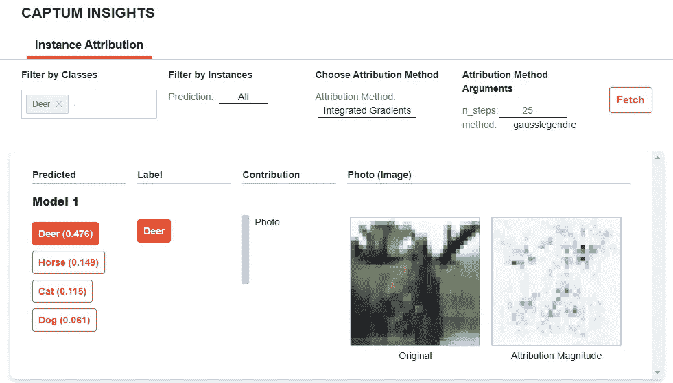
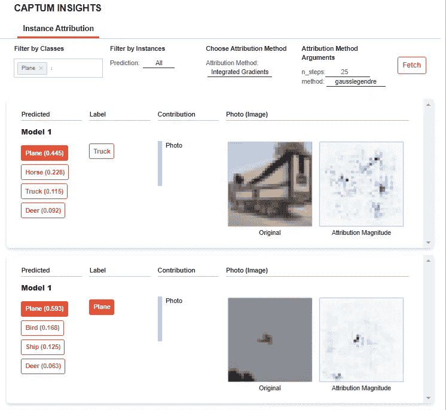

# Pytorch 模型视觉解释

> 原文：<https://towardsdatascience.com/pytorch-model-visual-interpretation-7133383bb6ae?source=collection_archive---------23----------------------->

## 用 Captum 解释 Pytorch 模型



来源:作者

Pytorch 是一个开源的 python 库，用于创建深度学习/机器学习模型，是继 TensorFlow 之后使用最多的库之一。它基于 Torch 库，主要用于计算机视觉和 NLP 应用。

根据我们正在开发的应用程序，我们可以使用不同的预训练 PyTorch 模型。但问题是，我们真的了解这个黑匣子里到底有什么吗？模型解释很重要，因为我们需要了解模型是如何工作的，以及我们如何改进模型。

Captum 是一个开源 python 库，用于解释 PyTorch 模型。它在模型理解和可解释性方面创造了透明性。它有助于理解数据所具有的最重要的特征，以及它如何影响模型的输出。

在本文中，我们将为 PyTorch 模型解释创建一个 Captum insights 仪表板。

让我们开始吧…

# 安装所需的库

我们将从使用 pip 安装 flask_compress 和 Captum 开始。下面给出的命令可以做到这一点。

```
!pip install flask_compress 
!pip install captum
```

# 导入所需的库

在这一步中，我们将导入创建 PyTorch 模型所需的库和用于模型解释的 Captum 仪表板。在这篇文章中，我不会讨论如何创建一个模型。

```
import osimport torch
import torch.nn as nn
import torchvision
import torchvision.transforms as transformsfrom captum.insights import AttributionVisualizer, Batch
from captum.insights.attr_vis.features import ImageFeature
```

# 创建模型

对于本文，我将使用一个预先训练好的模型来创建我们的模型。

```
def get_classes():
    classes = [
        "Plane",
        "Car",
        "Bird",
        "Cat",
        "Deer",
        "Dog",
        "Frog",
        "Horse",
        "Ship",
        "Truck",
    ]
    return classesdef get_pretrained_model():
    class Net(nn.Module):
        def __init__(self):
            super(Net, self).__init__()
            self.conv1 = nn.Conv2d(3, 6, 5)
            self.pool1 = nn.MaxPool2d(2, 2)
            self.pool2 = nn.MaxPool2d(2, 2)
            self.conv2 = nn.Conv2d(6, 16, 5)
            self.fc1 = nn.Linear(16 * 5 * 5, 120)
            self.fc2 = nn.Linear(120, 84)
            self.fc3 = nn.Linear(84, 10)
            self.relu1 = nn.ReLU()
            self.relu2 = nn.ReLU()
            self.relu3 = nn.ReLU()
            self.relu4 = nn.ReLU()def forward(self, x):
            x = self.pool1(self.relu1(self.conv1(x)))
            x = self.pool2(self.relu2(self.conv2(x)))
            x = x.view(-1, 16 * 5 * 5)
            x = self.relu3(self.fc1(x))
            x = self.relu4(self.fc2(x))
            x = self.fc3(x)
            return xnet = Net()
    net.load_state_dict(torch.load("cifar_torchvision.pt"))
    return netdef baseline_func(input):
    return input * 0def formatted_data_iter():
    dataset = torchvision.datasets.CIFAR10(
        root="data/test", train=False, download=True, transform=transforms.ToTensor()
    )
    dataloader = iter(
        torch.utils.data.DataLoader(dataset, batch_size=4, shuffle=False, num_workers=2)
    )
    while True:
        images, labels = next(dataloader)
        yield Batch(inputs=images, labels=labels)
```

# 创建模型解释仪表板

这是最后一步，将创建用于模型理解和解释的仪表板。

```
normalize = transforms.Normalize((0.5, 0.5, 0.5), (0.5, 0.5, 0.5))
model = get_pretrained_model()
visualizer = AttributionVisualizer(
    models=[model],
    score_func=lambda o: torch.nn.functional.softmax(o, 1),
    classes=get_classes(),
    features=[
        ImageFeature(
            "Photo",
            baseline_transforms=[baseline_func],
            input_transforms=[normalize],
        )
    ],
    dataset=formatted_data_iter(),
)#Visualize Model
visualizer.render()
```



仪表板(来源:作者)

在这里，您可以清楚地看到模型是如何工作的，您可以选择您想要解释的类，类似地选择归因方法和参数。它清楚地显示了归属量级、标签和预测。

继续尝试使用不同的数据集，并创建漂亮的 Captum 仪表板来解释模型。如果您发现任何困难，请在回复部分告诉我。

本文是与 [Piyush Ingale](https://medium.com/u/40808d551f5a?source=post_page-----7133383bb6ae--------------------------------) 合作完成的。

# 在你走之前

***感谢*** *的阅读！如果你想与我取得联系，请随时通过 hmix13@gmail.com 联系我或我的* [***LinkedIn 个人资料***](http://www.linkedin.com/in/himanshusharmads) *。可以查看我的*[***Github***](https://github.com/hmix13)**简介针对不同的数据科学项目和包教程。还有，随意探索* [***我的简介***](https://medium.com/@hmix13) *，阅读我写过的与数据科学相关的不同文章。**