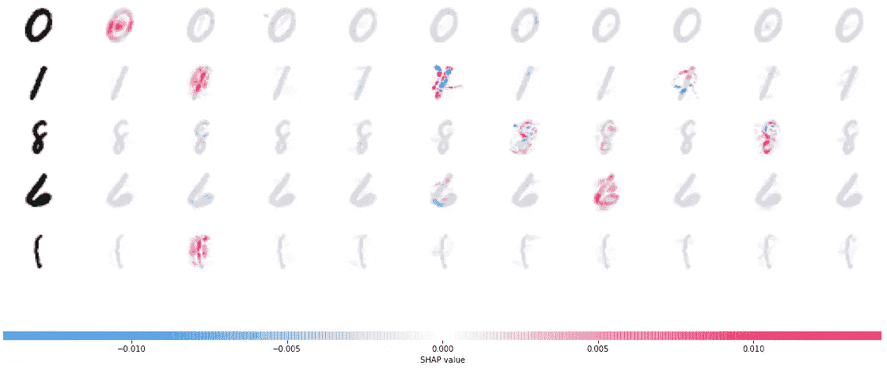

# PyTorch + SHAP =可解释的卷积神经网络

> 原文：<https://towardsdatascience.com/pytorch-shap-explainable-convolutional-neural-networks-ece5f04c374f?source=collection_archive---------16----------------------->

## 学习如何用 PyTorch 和 SHAP 解释卷积神经网络的预测

由 [Fernand De Canne](https://unsplash.com/@fernanddecanne?utm_source=unsplash&utm_medium=referral&utm_content=creditCopyText) 在 [Unsplash](https://unsplash.com/s/photos/network?utm_source=unsplash&utm_medium=referral&utm_content=creditCopyText) 上拍摄的照片

黑盒模型已经成为过去——即使有了深度学习。你可以用 SHAP 来解释深度学习模型的预测，而且只需要几行代码。今天，您将在著名的 MNIST 数据集上了解如何操作。

卷积神经网络可能很难理解。网络从图像中学习最佳特征提取器(内核)。这些特征对于检测任何帮助网络正确分类图像的模式是有用的。

你的大脑没什么不同。它还使用一系列模式来识别你面前的物体。例如，是什么使一个数零成为零？它是一个圆形到椭圆形的轮廓形状，里面什么也没有。这是卷积层背后的内核试图学习的一般模式。

如果你想直观地表达你的模型的解释，只需看看 SHAP(SHapely Additive explaining)——一种解释任何机器学习模型输出的博弈论方法。你可以参考[这篇文章](/shap-how-to-interpret-machine-learning-models-with-python-2323f5af4be9)获得完整的初学者指南。

这篇文章的结构如下:

*   定义模型架构
*   训练模型
*   解释模型
*   结论

这里可以下载相应的笔记本[。](https://github.com/daradecic/BDS-articles/blob/main/006_CNN_Explanations_with_SHAP.ipynb)

# 定义模型架构

您将使用 PyTorch 训练一个简单的手写数字分类器。这是深度学习的首选 Python 库，无论是在研究还是商业领域。如果你之前没有用过 PyTorch 但是有一些 Python 的经验，会觉得很自然。

在定义模型架构之前，您必须导入几个库。这些大多和 PyTorch 有关，后面会用到`numpy`和`shap`:

模型架构很简单，借鉴了[官方文档](https://github.com/slundberg/shap/blob/master/notebooks/image_examples/image_classification/PyTorch%20Deep%20Explainer%20MNIST%20example.ipynb)。请随意声明您自己的架构，但是这个架构已经足够满足我们的需求了:

下一节将向您展示如何训练模型。

# 训练模型

让我们从声明几个变量开始:

*   `batch_size`–一次向模型显示多少幅图像
*   `num_epochs`–通过训练数据集的完整次数
*   `device`–指定训练是在 CPU 还是 GPU 上完成的。如果你没有兼容 CUDA 的 GPU，用`cpu`代替`cuda:0`

接下来，您将声明几个函数— `train()`和`test()`。这些将用于在单独的子集上训练和评估模型，并打印中间结果。

完整的代码片段如下所示:

接下来，您可以使用`torchvision.datasets`模块下载数据集。然后，数据集被加载和转换(转换为张量和归一化)并分批组织:

现在你已经为模特训练做好了一切准备。以下是如何实例化该模型并针对之前声明的历元数对其进行训练:

您将看到在培训阶段打印出来的中间结果。这是它们在我的机器上的样子:

图 1 —使用 PyTorch 进行模型训练—中间结果(图片由作者提供)

请记住，在您的机器上，实际值可能略有不同，但是您应该在测试集上达到 95%以上的准确度。

下一步——与 SHAP 一起演绎！

# 解释模型

预测解释现在就像写几行代码一样简单。以下代码片段从测试集中加载了一批随机图像，并解释了其中五幅图像的预测:

执行上述代码片段后，您将看到下图:

图 2 — SHAP 对手写数字分类器的解释(图片由作者提供)

输入图像显示在左边，每门课的解释显示在右边。任何红色的东西都会增加模型输出(模型对分类更有信心)，而任何蓝色的东西都会减少输出。

这就是 SHAP 对卷积神经网络的解释。让我们在下一部分总结一下。

# 结论

今天，您已经学习了如何使用 PyTorch 创建一个用于分类手写数字的基本卷积神经网络模型。您还学习了如何解释模型做出的预测。

现在，将这种解释技能引入您的领域就像改变数据集和模型架构一样简单。解释代码应该是相同的，或者需要最小的改变来适应不同的子集。

感谢阅读。

*喜欢这篇文章吗？成为* [*中等会员*](https://medium.com/@radecicdario/membership) *继续无限制学习。如果你使用下面的链接，我会收到你的一部分会员费，不需要你额外付费。*

<https://medium.com/@radecicdario/membership>  

# 了解更多信息

*   [SHAP:如何用 Python 解读机器学习模型](/shap-how-to-interpret-machine-learning-models-with-python-2323f5af4be9)
*   [莱姆:如何用 Python 解读机器学习模型](/lime-how-to-interpret-machine-learning-models-with-python-94b0e7e4432e)
*   [莱姆与 SHAP:哪个更好地解释机器学习模型？](/lime-vs-shap-which-is-better-for-explaining-machine-learning-models-d68d8290bb16)
*   [Python 中计算特性重要性的 3 种基本方法](/3-essential-ways-to-calculate-feature-importance-in-python-2f9149592155)
*   新的 M1 macbook 对数据科学有好处吗？让我们来了解一下

# 保持联系

*   在[媒体](https://medium.com/@radecicdario)上关注我，了解更多类似的故事
*   注册我的[简讯](https://mailchi.mp/46a3d2989d9b/bdssubscribe)
*   在 [LinkedIn](https://www.linkedin.com/in/darioradecic/) 上连接
*   查看我的[网站](https://www.betterdatascience.com/)

*原载于 2021 年 2 月 1 日 https://www.betterdatascience.com**T21*[。](https://www.betterdatascience.com/shap-explain-cnn/)