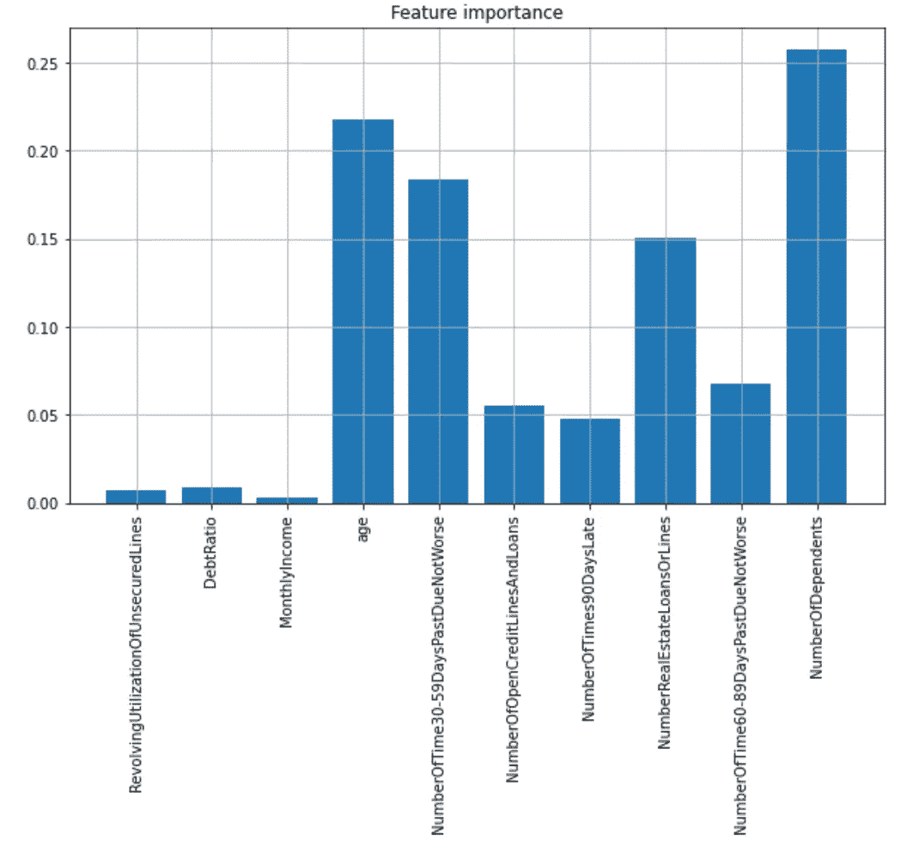
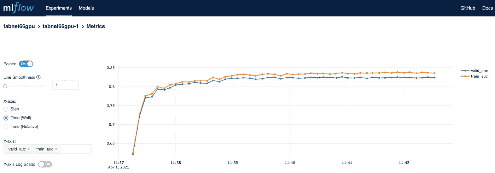

# PyTorch TabNet:与 MLflow 集成

> 原文：<https://towardsdatascience.com/pytorch-tabnet-integration-with-mlflow-cb14f3920cb0?source=collection_archive---------21----------------------->

**TabNet** 是一个用于表格数据的现代神经网络架构。在本文中，我想让大家关注一个很好的开源实现，它基于 PyTorch，以及我如何将它与 **MLflow** 集成在一起。

# 深度学习和表格数据。

**TabNet** 是一种神经网络架构，专门设计用于充分管理我们以**表格**格式处理数据的所有情况。

想想看，对于许多公司(如银行和政府机构)来说，绝大多数数据都属于这一类。当然，所有由事务性应用程序“生产”并浓缩到“数据仓库”中的数据都是这种类型的。

在最近十年中，深度学习在非结构化数据上显示出了非凡的结果，例如在图像识别和对象检测(图像)领域，在自然语言处理(文本)领域，在“语音到文本”领域，经常被证明能够达到并克服“人类级别的性能”。

但到目前为止，普遍的想法是，对于表格数据，使用不基于神经网络的算法，如**梯度推进**算法，通常更容易、更快地获得结果。事实上，在 Kaggle 上分析这些类型的数据就足够了:使用实现可以获得最好的结果，这些实现也可以在 GPU 上快速运行，如 XGBoost，LightGBM，CatBoost。

TabNet 是一种专用于表格形式的结构化数据的神经网络架构。它于 2020 年底推出，其最佳描述可以在常见的**ArXiv**:[https://arxiv.org/pdf/1908.07442.pdf](https://arxiv.org/pdf/1908.07442.pdf)上的文章中找到

# TabNet 上的一些信息。

介绍用 Python 开发神经网络的书籍中充满了处理表格数据的例子。原因是样本数据集通常很小，最大为几百 MB，因此网络训练不需要很大的计算能力。当您继续处理图像时，维度会变成(甚至数百)GB 的量级，很快就解释了使用 GPU 的必要性。

在上面提到的那种例子中，网络架构几乎总是一个**全连接**网络。每一层由一定数量的神经元组成，与前一层的所有神经元相连。

为这样的网络编写代码很容易，但是这些网络不能很好地处理结构化(表格)数据有几个原因。

一个例子:通常这种类型的数据包含相关的特征，特别是当我们有很多的时候。网络总是可以将一些权重置零，但是这个问题会导致过度拟合的问题。

描述 TabNet 的内部结构并不容易，那些想了解其内部结构的人最好读一下我链接的文章。

最有趣的设计元素之一是 TabNet(具有编码器-解码器架构)提供了一系列模块(在编码器部分)，数量与超参数 N_STEP 相等，每个模块都有一个**顺序注意机制**，用于选择(或至少尝试)哪些功能最重要。

与注意力机制直接相关的另一个因素是，TabNet 一旦被训练，就可以很容易地为“**可解释性**”提供有用的信息。特别是，获得相对的特性重要性或多或少需要一行代码。在下图中，我展示了一个结果的例子。

相对特征重要性(图片由作者提供)。

最后，TabNet 管理并使用**嵌入**来处理高维分类特征。并且既可以用于**分类问题**也可以用于**回归**问题。

对这种架构的关注与日俱增。一个迹象是 Kaggle 上越来越多的人开始尝试使用 TabNet。

# 如何使用 TabNet？

与关于 ArXiv 的文章一起提供的代码实际上并不能用于具体的应用程序。

但是一家名为 [**DreamQuark**](https://www.dreamquark.com/) 的公司的一个团队已经开发出了一个开源实现，这个实现叫做 [pythorch-tabnet](https://github.com/dreamquark-ai/tabnet)

这个实现也可以从通常的 pypi (pip install pytorch-tabnet)上下载，从 pypi 的统计数据中可以看出，它非常有趣(每月有 9500 次下载)。

一个疑问可能会出现(它出现在我面前，因为我更喜欢使用 TensorFlow，很少使用 PyTorch):但是要使用它，我必须使用并了解 PyTorch 吗？

不。PyTorch TabNet 的开发者已经提供了一个兼容的 scikit-learn 接口。只需实例化 **TabNetClassifier** 类或 **TabNetRegressor** 类，传递正确的参数，并在无需远程了解 PyTorch 的情况下使用。

非常详细的例子包含在 GitHub 库中。最好从这些开始。

PyTorch-TabNet 在幕后悄悄地使用 GPU 。在我的 Oracle 云环境中，我所要做的就是启动笔记本电脑。从日志中可以看出他在用 CUDA，显然训练速度更快。

然而，在本文中，我想关注另一个方面:我想说明我已经实现的将 TabNet 与我最喜欢的工具 **MFlow** 集成的解决方案。

# MLflow 集成。

**MLflow** 是 Databricks 开展的一个开源工具和项目。

GitHub 库位于 URL:[https://github.com/mlflow/mlflow](https://github.com/mlflow/mlflow)

设计师给的定义是:“一个管理机器学习模型生命周期的平台”。它可以做很多事情，甚至可以在你的 MacBook 上使用。

在我的例子中，我用它来跟踪和**追踪**在**超参数优化阶段**完成的所有“实验”的进度，通常与 **Optuna** 结合使用。

特别是如果您有大量数据，超参数的优化阶段可能需要大量测试和时间，并且以有组织和结构化的方式跟踪所有结果**是很重要的，以便能够重建哪些变化有效，哪些变化无效。**

MLflow 可以很容易地安装在 Ubuntu VM 上(需要半个小时),并在 REST 端点上公开一个跟踪 API。

我所做的是:

在 Ubuntu 虚拟机上安装跟踪服务器，使用一个漂亮的 MySQL 数据库作为存储库

在我的笔记本上使用 **MLflow Python API**

特别是当培训持续很长时间(几个小时)时，在 MLflow 提供的指标图上实时跟踪进度会更加舒适和有趣。

但是让我们来看看与 TabNet 的集成。

TabNet 允许您在 TabNetClassifier 和 TabNetRegressor 类的参数中指定在训练周期中“插入”的**回调**。

对于了解 TensorFlow 的人来说，这些回调遵循相同的模式:它们必须是定义方法的类:

**on_train_begin**

**on_train_end**

**on_epoch_end**

但是，它们扩展了**py torch _ tabnet . callbacks . callback**类。

**总的来说，我的解决方案**使用了 MLFlow 跟踪 API 和:

以 **on_train_begin** 方法开始实验和运行

在相同的方法中，它将包含我正在试验的参数的字典发送到 MLFlow，以跟踪它们并将所使用的值与获得的性能相关联

使用 **on_epoch_end** 中的 MLFlow API 更新指标(例如:准确度、AUC)

在 **on_train_end 方法**中标记运行的结束

下面是回调的完整代码:

使用 PyTorch TabNet 的完整代码是:

为了满足你合理的好奇心，这是我在一个**信用评分**模型上运行的图表:

MLflow，训练的进度(图片由作者提供)。

# 一些安全措施。

对于那些真正希望在自己的云环境中实施这种类型的解决方案的人来说，有一个重要的细节。

如果您在 Linux 机器上安装 MLflow，您将暴露一个端点，而没有任何形式的安全性。因此，建议使用代理，如 NGINX，在代理上实现安全性，并公开 NGINX 端点，而不是直接公开 MLflow。

但我同意，这不太像是数据科学家的工作。您可以从在 Web 应用程序和安全性方面更有经验的同事那里获得帮助。

在我的示例代码中，我没有展示如何传递凭证，但它是有文档记录的。

# 总之…

我真的认为，我们将看到越来越多有趣的新想法的一个领域是神经网络在表格数据中的应用。

TabNet 是一个有趣的解决方案，有一个很好的开源实现，基于 PyTorch。

(好的)开源的好处是很容易找到文档并将其集成到整个管道中。

我试图展示与 MLflow 集成是多么容易。希望你会感兴趣。