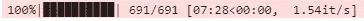
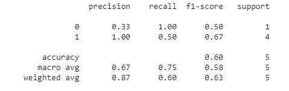

# Pytorch 培训技巧和提示

> 原文：<https://towardsdatascience.com/pytorch-training-tricks-and-tips-a8808ebf746c?source=collection_archive---------15----------------------->

## 在 Pytorch 中优化深度学习模型训练的技巧/提示


在 [Unsplash](https://unsplash.com?utm_source=medium&utm_medium=referral) 上 [ActionVance](https://unsplash.com/@actionvance?utm_source=medium&utm_medium=referral) 拍照

在这篇文章中，我将描述并展示我个人发现的 4 种不同 Pytorch 训练技巧的代码，以改善我的深度学习模型的训练。

## 16 位精度

在常规训练循环中，PyTorch 以 32 位精度存储所有浮点变量。对于使用严格约束来训练他们的模型的人来说，有时，这可能导致他们的模型占用太多的内存，迫使他们使用较小的模型和较小的批量进行较慢的训练过程。但是，以 16 位精度存储模型中的所有变量/数字可以改善并修复大多数这些问题，例如显著降低模型的内存消耗并加快训练循环，同时仍然保持模型的相同性能/准确性。

在 Pytorch 中将所有计算转换为 16 位精度非常简单，只需要几行代码。以下是方法:

```
scaler = torch.cuda.amp.GradScaler()
```

用和我上面一样的方法创建一个渐变缩放器。在你写你的训练循环之前这样做。

```
optimizer.zero_grad()
with torch.cuda.amp.autocast():
   output = model(input).to(device)
   loss = criterion(output, correct_answer).to(device)
scaler.scale(loss).backward()
scaler.step(optimizer)
scaler.update()
```

当您使用 loss 和优化器进行反向传播时，您需要执行 scaler.scale(loss)，而不是 loss.backward()和 optimizer.step()。向后和 scaler.step(优化器)。这使得您的定标器可以转换所有梯度，并以 16 位精度进行所有计算。

当您以 16 位精度执行所有操作时，可能会出现一些数值不稳定的情况，从而导致您可能使用的一些函数无法正常工作。在 16 位精度下，只有某些操作才能正常工作。[这里](https://pytorch.org/docs/stable/amp.html#ops-that-can-autocast-to-float16)是这方面的更多信息。

## 进度条

有一个进度条来表示每个时期已经完成的训练的百分比是非常有用的。为了获得进度条，我们将使用 tqdm 库。以下是下载和导入它的方法:

```
pip install tqdmfrom tqdm import tqdm
```

在培训和验证循环中，您必须这样做:

```
for index, batch in tqdm(enumerate(loader), total = len(loader), position = 0, leave = True):
```

仅此而已。一旦您为您的训练和验证循环做了这些，您将得到一个进度条，它代表您的模型已经完成的训练的百分比。它应该是这样的:



在图中，691 表示我的模型必须完成多少批，7:28 表示我的模型在 691 批上训练/评估所用的总时间，1.54 it/s 表示我的模型一批所用的平均时间。

## 梯度累积

如果您遇到 CUDA 内存不足错误，这意味着您已经超出了您的计算资源。要解决这个问题，您可以做几件事情，包括将所有内容转换为 16 位精度，正如我上面提到的，减少模型的批量大小，以及在创建数据加载器时减少 num_workers 参数:

```
train_loader = DataLoader(dataset=train_data, batch_size=batch_size, shuffle=True, num_workers=0)
```

但是，有时，切换到 16 位精度并减少 num_workers 可能无法完全解决问题。解决这个问题最直接的方法是减少批量，但是假设你不想减少批量。如果你不想减少你的批量，你可以使用梯度积累来刺激你想要的批量。请注意，CUDA 内存不足问题的另一个解决方案是简单地使用多个 GPU，但这是许多人无法实现的选项。

假设您的机器/型号只能支持 16 的批处理大小，增加它会导致 CUDA 内存不足错误，而您想要 32 的批处理大小。梯度累积的工作方式是，以 16 的批量运行模型两次，累积为每批计算的梯度，最后在这两次正向传递和梯度累积后执行优化步骤。

为了理解梯度累积，重要的是理解在训练神经网络中完成了什么特定功能。假设您有以下训练循环:

```
model = model.train()
for index, batch in enumerate(train_loader):
    input = batch[0].to(device)
    correct_answer = batch[1].to(device)
    optimizer.zero_grad()
    output = model(input).to(device)
    loss = criterion(output, correct_answer).to(device)
    loss.backward()
    optimizer.step()
```

查看上面的代码，需要记住的关键是 loss.backward()创建并存储模型的渐变，但是 optimizer.step()实际上更新权重。在调用 optimizer 累积梯度之前，调用 loss.backward()两次。以下是如何在 PyTorch 中实现渐变累积:

```
model = model.train()
optimizer.zero_grad()
for index, batch in enumerate(train_loader):
    input = batch[0].to(device)
    correct_answer = batch[1].to(device)
    output = model(input).to(device)
    loss = criterion(output, correct_answer).to(device)
    loss.backward()
    if (index+1) % 2 == 0:
       optimizer.step()
       optimizer.zero_grad()
```

如您所见，以上面的例子为例，我们的机器只能支持 16 个批次，而我们想要 32 个批次，我们实际上是计算 2 个批次的梯度，然后更新实际重量。这导致有效的批量大小为 32。

做 16 位精度的梯度累加很像。

```
model = model.train()
optimizer.zero_grad()
for index, batch in enumerate(train_loader):
    input = batch[0].to(device)
    correct_answer = batch[1].to(device)
    with torch.cuda.amp.autocast():
         output = model(input).to(device)
         loss = criterion(output, correct_answer).to(device)
    scaler.scale(loss).backward()
    if (index+1) % 2 == 0:
       scaler.step(optimizer)
       scaler.update()
       optimizer.zero_grad()
```

## 对结果的评估

在大多数机器学习项目中，人们倾向于手动计算他们用于评估的指标，然后报告它们。尽管计算准确度、精确度、召回率和 F1 等指标并不难，但在某些情况下，您可能希望使用这些指标的某些变体，如宏观/微观精确度、召回率和 F1，或者加权精确度、召回率和 F1。计算这些可能需要更多的工作，有时，您的实现可能是不正确的。要高效、快速、无误地计算所有这些指标，可以使用 sklearns classification_report 库。这是一个专门为计算这些指标而设计的库。这是你如何使用它。

```
from sklearn.metrics import classification_report
y_pred = [0, 1, 0, 0, 1]
y_correct = [1, 1, 0, 1, 1]print(classification_report(y_correct, y_pred))
```

上面的代码是用于二进制分类的。您可以为更多目的配置/使用该功能。第一个列表代表模型的预测，第二个列表代表正确答案。上面的代码会输出:



## 结论

在这篇文章中，我讨论了 4 种优化深度神经网络训练的方法。16 位精度减少了内存消耗，梯度累积允许您通过模拟更大的批处理大小来解决任何内存限制，tqdm 进度条和 sklearns 分类报告库是两个方便的库，允许您轻松跟踪模型的训练并评估模型的性能。就我个人而言，我总是用上面所有的训练技巧来训练我的神经网络，并且在必要的时候使用梯度累积。

我希望您发现这些内容易于理解且信息丰富。如果你有任何问题，请在评论中告诉我。