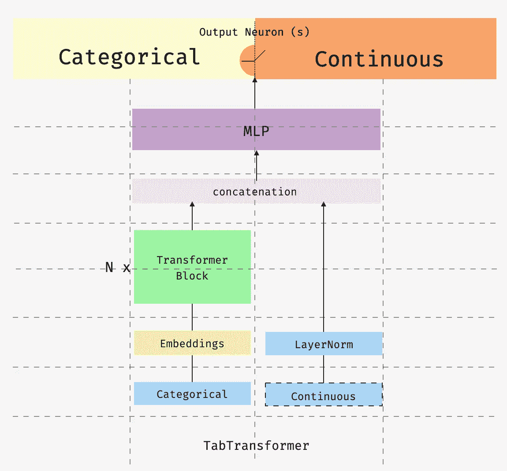
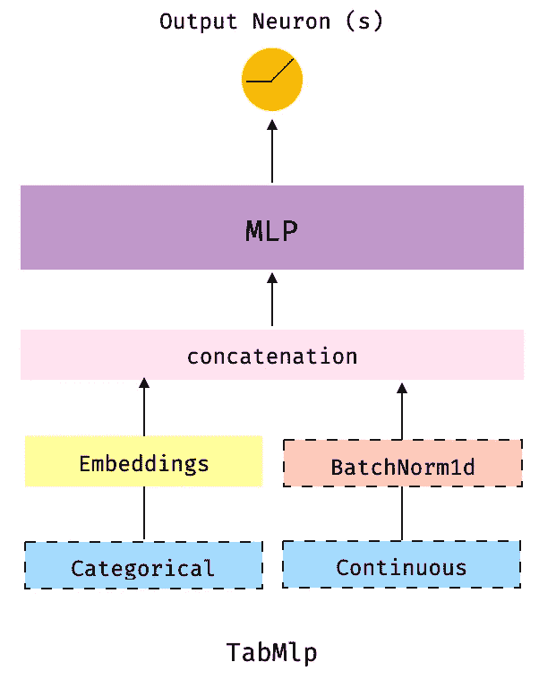
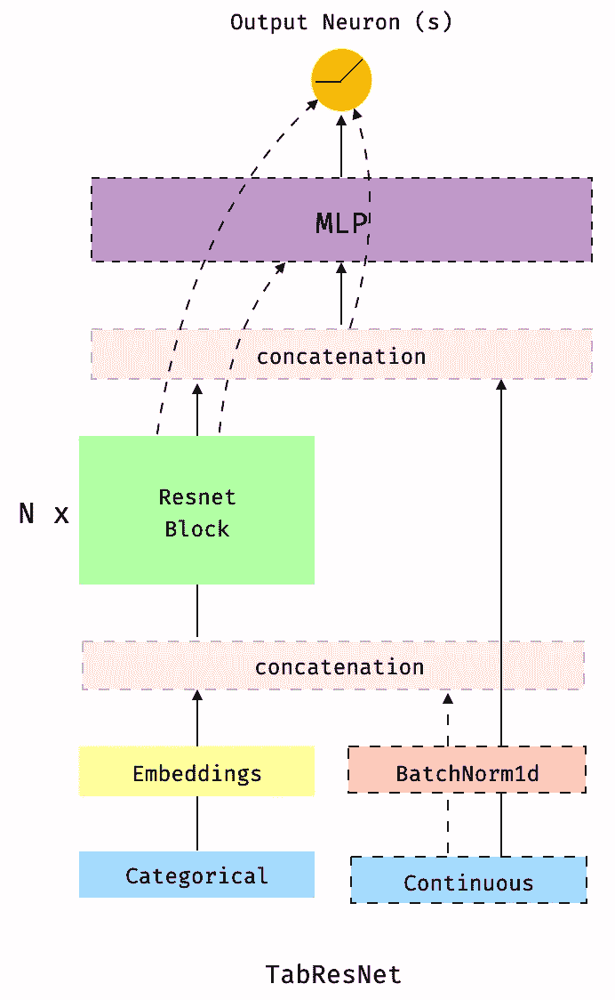
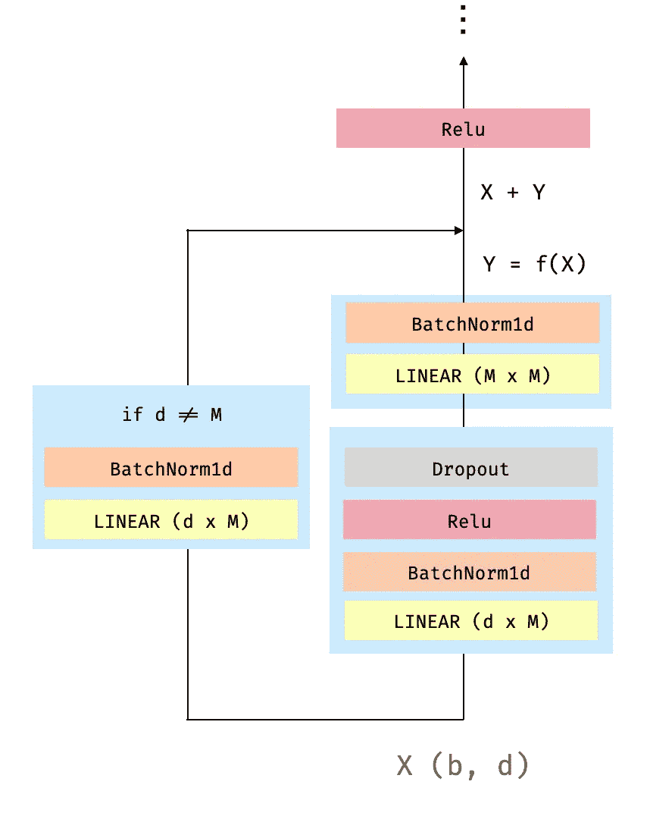
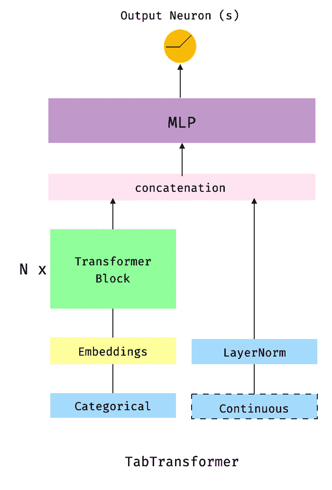
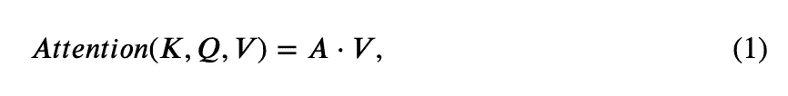
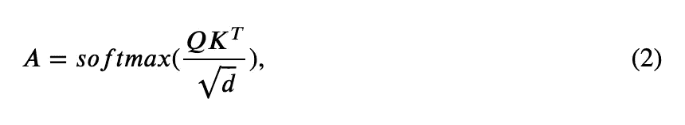
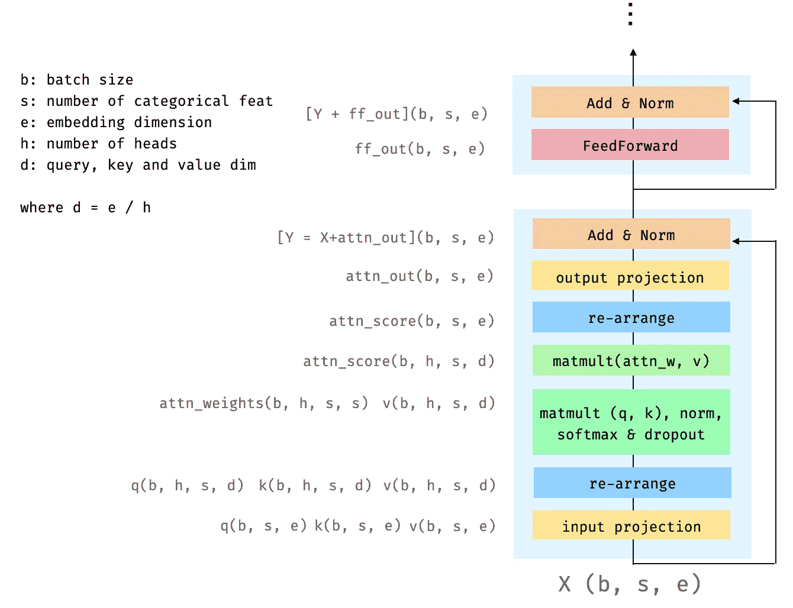
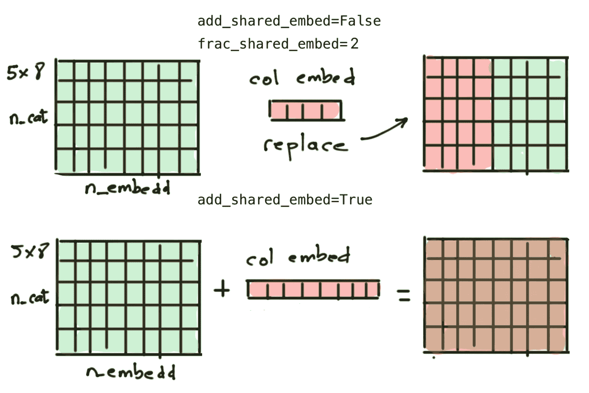
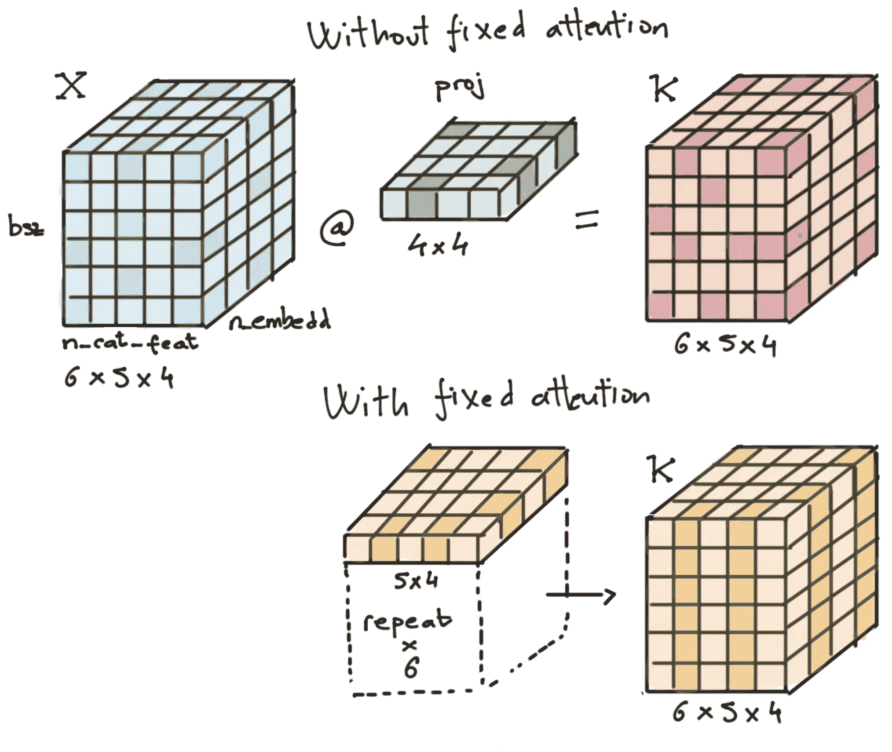

# pytorch-widedeep:表格数据的深度学习

> 原文：<https://towardsdatascience.com/pytorch-widedeep-deep-learning-for-tabular-data-9cd1c48eb40d?source=collection_archive---------16----------------------->



这是[系列文章](https://jrzaurin.github.io/infinitoml/)的第三篇，介绍了`[pytorch-widedeep](https://github.com/jrzaurin/pytorch-widedeep)`一个将表格数据与文本和图像相结合的灵活包(它也可以单独用于“标准”表格数据)。之前的两篇帖子，以及[这篇帖子](https://jrzaurin.github.io/infinitoml/2021/02/18/pytorch-widedeep_iii.html)的原始版本都托管在我自己的[博客](https://jrzaurin.github.io/infinitoml/)里，以防万一。

在写这篇文章的时候，我假设读者不熟悉前两篇[文章](https://jrzaurin.github.io/infinitoml/)。当然，阅读它们会有所帮助，但是为了理解这篇文章的内容，然后能够在表格数据上使用`pytorch-widedeep`，这不是必需的。

首先，一如既往，只需安装软件包:

```
pip install pytorch-widedeep
```

这将安装`v0.4.8`希望是最后一个测试版本*。在代码方面，我认为这可能已经是`v1`，但在此之前，我想在更多的数据集中尝试一下，并选择好的默认值。此外，我还打算实现其他算法，特别是[TabNet](https://arxiv.org/abs/1908.07442)【1】，已经有一个非常好的[实现](https://github.com/dreamquark-ai/tabnet)。

继续，正如我前面提到的，`pytorch-widedeep`的主要目标是通过宽和深的模型促进图像和文本与表格数据的结合。为此，[宽和深模型](https://pytorch-widedeep.readthedocs.io/en/latest/model_components.html)可以用多达四个模型组件构建:`wide`、`deeptabular`、`deeptext`和`deepimage`，它们将处理不同类型的输入数据集(“标准”表格，即数字和分类特征、文本和图像)。这篇文章只关注所谓的`deeptabular`组件，以及该库中可用于构建该组件的 3 种不同模型。尽管如此，为了完整起见，我将首先简要描述其余的组件。

宽深模型的`wide`组件只是一个线性模型，在`pytorch-widedeep`中，这样的模型可以通过`[Wide](https://pytorch-widedeep.readthedocs.io/en/latest/model_components.html#pytorch_widedeep.models.wide.Wide)`类创建。对于`deeptext`组件，`pytorch-widedeep`提供了一个模型，可通过`[DeepText](https://pytorch-widedeep.readthedocs.io/en/latest/model_components.html#pytorch_widedeep.models.deep_text.DeepText)`类获得。`DeepText`构建一个简单的 LSTMs 堆栈，即标准的 DL 文本分类器或回归器，具有使用预训练单词嵌入、全连接头(FC-Head)等的灵活性。对于`deepimage`组件，`pytorch-widedeep`包括两种选择:预训练的 Resnet 模型或从头开始训练的 CNN 的“标准”堆栈。这两个都可以通过`[DeepImage](https://pytorch-widedeep.readthedocs.io/en/latest/model_components.html#pytorch_widedeep.models.deep_image.DeepImage)`类获得，和`DeepText`的情况一样，在构建架构时提供了一些灵活性。

为了澄清术语“*模型*”和“w *ide 和深度模型组件*”的用法(以防有一些混淆)，让我们看一下下面的代码:

```
wide_model = Wide(...)
text_model = DeepText(...)
image_model = DeepImage(...)

# we use the previous models as the wide and deep model components
wdmodel = WideDeep(
    wide=wide_model, 
    deeptext=text_model, 
    deepimage=image_model
)

...
```

简单地说，一个宽而深的模型有模型组件，这些组件(当然)就是模型本身。请注意，四个宽和深模型组件中的任何一个**都可以是用户定制的模型。事实上，虽然我推荐使用在`pytorch-widedeep`中可获得的模型用于`wide`和`deeptabular`组件，但是用户很可能想要使用他们自己的模型用于`deeptext`和`deepimage` 组件。这是完全可能的，只要定制模型有一个名为`output_dim`的属性，该属性具有最后一层激活的大小，这样就可以构造`WideDeep`(参见回购中的这个[示例笔记本](https://github.com/jrzaurin/pytorch-widedeep/blob/master/examples/07_Custom_Components.ipynb))。此外，**四个组件中的任何一个都可以单独使用**。例如，您可能想只使用一个`wide`组件，它只是一个线性模型。为此，简单来说:**

```
wide_model = Wide(...)

# this would not be a wide and deep model but just wide
wdmodel = WideDeep(wide=wide_model)

...
```

如果您想了解更多有关不同模型组件和`pytorch-widedeep`中可用模型的信息，请查看回购中的[示例](https://github.com/jrzaurin/pytorch-widedeep/tree/master/examples)文件夹、[文档](https://pytorch-widedeep.readthedocs.io/en/latest/model_components.html)或[配套帖子](https://jrzaurin.github.io/infinitoml/)。现在让我们深入了解一下`deeptabular`组件可用的模型

**如果您使用的是 Mac、python 3.8 或 Pytorch 1.7+，请检查*[*repo*](https://github.com/jrzaurin/pytorch-widedeep)*或此*[*post*](https://jrzaurin.github.io/infinitoml/2020/12/06/pytorch-widedeep.html)*以了解安装中的注意事项。注意，这是* ***与*** *包没有直接关系，而是 Mac 与 OpenMP 之间的相互作用，以及 Mac 的* `multiprocessing` *库的新默认值)。*

# 1.`deeptabular`组件

当我开发这个包的时候，我意识到也许`pytorch-widedeep`中最有趣的产品之一与`deeptabular`组件可用的模型有关(也许…)。请记住，每个组件都可以独立使用。考虑到这一点，构建一个只包含一个`deeptabular`组件的`WideDeep`模型通常被称为表格数据的 DL。当然，这样的模型不是一个又宽又深的模型，是“仅仅”深的。

目前，`pytorch-widedeep`提供三种型号可以用作`deeptabular`组件。按复杂程度排列，它们是:

*   `TabMlp`:这与 fantastic [fastai](https://docs.fast.ai/) 库中的[表格模型](https://docs.fast.ai/tutorial.tabular.html)非常相似，只不过是表示分类特征的嵌入，与连续特征连接，然后通过 MLP 传递。
*   `TabRenset`:这与之前的模型类似，但是嵌入是通过一系列用密集层构建的 ResNet 块来传递的。
*   `TabTransformer`:关于 TabTransformer 的详细信息可以在: [TabTransformer:使用上下文嵌入的表格数据建模](https://arxiv.org/pdf/2012.06678.pdf)中找到。同样，这与之前的模型类似，但嵌入是通过一系列转换器编码器模块进行的。

已经有(并且正在有)很多关于使用 DL 处理表格数据的文章，当然每个模型本身都应该有一个帖子。在这里，我将尝试详细描述它们，并举例说明它们在`pytorch-widedeep`中的用法。在不久的将来，将进行一次适当的基准测试。

# 1.1 `TabMlp`

下图说明了`TabMlp`模型架构。



**图一**。`TabMlp.` (图片作者)

`TabMlp`是 simples 架构，非常类似于 fantastic fastai 库中可用的表格模型。事实上，MLP 的密集层的实现与该库中的实现基本相同。图中的虚线框表示这些组件是可选的。例如，如果我们愿意的话，我们可以使用不带分类成分或者不带连续成分的`TabMlp`。

让我们看看这个模型是如何与众所周知的[成人人口普查数据集](http://archive.ics.uci.edu/ml/datasets/Adult)一起使用的。我假设您已经下载了数据并将其放置在`data/adult/adult.csv.zip`。以下片段是数据的简单准备，与`pytorch-widedeep`没有直接关系(记住，你可以运行的笔记本可以在[这里](https://jrzaurin.github.io/infinitoml/)找到):

片段 1。

现在我们只需要定义将被表示为嵌入的列和数字(也称为连续)列。`pytorch-widedeep`附带了一系列方便的[预处理](https://pytorch-widedeep.readthedocs.io/en/latest/preprocessing.html)工具，为我们准备数据:

片段 2

到此为止的代码对所有型号都是通用的，对`TabTransformer`做了一些小的改动。在内部，`TabPreprocessor` label 对“嵌入列”进行编码，并对数字列进行标准化。请注意，您可以选择不标准化数字列，然后在构建模型时使用`BatchNorm1D`层。这也是一种有效的方法。或者，你可以两者都用，就像我一样。

在这一阶段，数据已经准备好，我们可以开始构建模型了

片段 3

在我继续之前，有一件重要的事情要提一下，对所有模型来说都是一样的，那就是`pytorch-widedeep`模型(在这种情况下是`TabMlp`)不建立最后的连接，即与输出神经元的连接，这取决于这是一个回归、二进制还是多类分类。这样的连接是由`WideDeep`“constructor”类构建的。这意味着即使我们想使用单组件模型，这个模型仍然需要用`WideDeep`类来构建。

这是因为这个库是先验的，旨在构建`WideDeep`模型(因此得名)。一旦模型建立，它就被传递给`Trainer`(正如我们现在将看到的)。`Trainer`类被编码为接收类`WideDeep`的父模型，其子模型是模型组件。这对图书馆的许多方面都非常方便。

这实际上只需要一行额外的代码(代码片段 3 中的第 10 行)

让我们看看我们刚刚构建的模型，以及它与图 1 的关系(注意，为了保持 post 的大小“易处理”，我将只打印`TabMlp`模型的架构。如果你想看`TabRenset`和`TabTransformer`的建筑，可以看看最初的[帖子](https://jrzaurin.github.io/infinitoml/2021/02/18/pytorch-widedeep_iii.html)。

```
modelWideDeep(
  (deeptabular): Sequential(
    (0): TabMlp(
      (embed_layers): ModuleDict(
        (emb_layer_education): Embedding(17, 8, padding_idx=0)
        (emb_layer_marital_status): Embedding(8, 6, padding_idx=0)
        (emb_layer_occupation): Embedding(16, 8, padding_idx=0)
        (emb_layer_race): Embedding(6, 6, padding_idx=0)
        (emb_layer_relationship): Embedding(7, 6, padding_idx=0)
        (emb_layer_workclass): Embedding(10, 6, padding_idx=0)
      )
      (embedding_dropout): Dropout(p=0.1, inplace=False)
      (norm): BatchNorm1d(4, eps=1e-05, momentum=0.1, affine=True, track_running_stats=True)
      (tab_mlp): MLP(
        (mlp): Sequential(
          (dense_layer_0): Sequential(
            (0): Dropout(p=0.1, inplace=False)
            (1): Linear(in_features=44, out_features=200, bias=True)
            (2): ReLU(inplace=True)
          )
          (dense_layer_1): Sequential(
            (0): Dropout(p=0.1, inplace=False)
            (1): Linear(in_features=200, out_features=100, bias=True)
            (2): ReLU(inplace=True)
          )
        )
      )
    )
    (1): Linear(in_features=100, out_features=1, bias=True)
  )
)
```

我们可以看到我们的`model`是由单个组件`deeptabular`构成的`WideDeep`类的对象，T5 本身是`TabMlp`类的模型。`TabMlp` 由一系列将被表示为嵌入(例如`emb_layer_education`)的列组成，这些列被连接以形成 dim `(bsz, 40)`的张量，其中`bsz`是批量大小。然后，“*batch formed*”连续列也与该张量连接，产生 dim `(bsz, 44)`张量，该张量将被传递给`tab_mlp`，即 2 层 MLP `[200 -> 100]`。最后，dim `(bsz, 100)`的输出张量被“插入”到最后一个神经元中。总结一下:嵌入+连续+ MLP。

我们现在准备训练它。下面的代码只是用默认值运行。人们可以使用任何`torch`优化器、学习率调度器等。看看回购中的[文档](https://pytorch-widedeep.readthedocs.io/en/latest/trainer.html)或[示例](https://github.com/jrzaurin/pytorch-widedeep/tree/master/examples)文件夹即可。

片段 4

一旦我们理解了`TabMlp`是做什么的，那么`TabResnet`应该非常简单

# 1.2 `TabResnet`

下图说明了`TabResnet`模型架构。



**图二**`TabResnet.` (图片作者)

`TabResnet`模型类似于`TabMlp`，但是嵌入(或者嵌入和连续特征的连接，标准化或未标准化)通过一系列由密集层构建的 Resnet 块。虚线框表示组件是可选的，虚线表示不同的路径或连接，这取决于我们决定包含哪些组件。

这可能是本文讨论的三个模型中最灵活的，因为可以通过参数定义许多变量。例如，我们可以选择将连续的特征(通过`BatchNorm1d`层标准化或未标准化)与嵌入连接起来，然后通过一系列 Resnet 块传递这种连接的结果。或者，我们可能更喜欢将连续的特性与通过 Resnet 块传递嵌入的结果连接起来。另一个可选组件是输出神经元之前的 MLP。如果不存在 MLP，来自 Resnet 块的输出或者将该输出与连续特征(标准化或未标准化)连接的结果将直接连接到输出神经元。

每个 Resnet 块由以下操作组成:



**图 3** 。“密集”Resnet 块。`b`是批量大小，`d`是嵌入的尺寸。(图片由作者提供)

让我们构建一个`TabResnet`模型，它与构建一个`TabMlp`模型所需的代码基本相同。

正如我们之前对`TabMlp`所做的那样，让我们“浏览”一下这个模型。同样，如果你想看这个架构的完整版本，请访问最初的[帖子](https://jrzaurin.github.io/infinitoml/2021/02/18/pytorch-widedeep_iii.html)。在这种情况下，`model`是由单个组件形成的`WideDeep`对象的实例，`deeptabular`是一个`TabResnet`模型。`TabResnet`由一系列`Embedding`层(例如`emb_layer_education`)、一系列所谓的致密 Resnet 块(`tab_resnet`)和 MLP ( `tab_resnet_mlp`)形成。嵌入本身被连接，然后进一步与标准化的连续列连接。dim `(bsz, 44)`的结果张量然后通过两个密集的 Resnet 块。一个 Resnet 块的输出是下一个的输入。因此，当设置`blocks_dim = [200, 100, 100]`时，我们正在生成输入/输出分别为 200/100 和 100/100 的两个模块。dim `(bsz, 100)`的第二 Resnet 模块的输出通过 2 层 MLP`tab_resnet_mlp`，最终“插入”输出神经元。总结一下:嵌入+连续+稠密伦集+ MLP。

为了运行它，代码与前面显示的`TabMlp`代码相同。

代码片段 5

现在，最后但并非最不重要的是，库的最后一个成员`TabTransformer`。

# 1.3 `TabTransformer`

亚马逊的聪明人在 [TabTransformer:使用上下文嵌入的表格数据建模](https://arxiv.org/pdf/2012.06678.pdf)【2】中详细描述了`TabTransformer`。是一篇有趣的论文，当然，如果您打算在表格数据上使用这个模型(如果您对表格数据的 DL 感兴趣，我强烈推荐您使用这个模型)。

我的实现不是唯一可用的。鉴于该模型是由亚马逊的研究人员构思的，它也可以在他们神奇的`[autogluon](https://github.com/awslabs/autogluon)`图书馆中找到(你一定要去看看)。此外，你可以在这里找到王飞的另一个实现，他的整个 github 非常出色。我的实现部分受到了这些的启发，但是有一些特殊性和适应性，所以它可以在`pytorch-widedeep`包中工作。

下图说明了`TabTransformer`模型的架构。



**图 4** 。`TabTransfomer.` (图片作者)

图中的虚线框表示该组件是可选的。

与前面的案例一样，在构建模型时需要考虑许多变量和细节。我将在这里描述一些，但是对于所有可能参数的完整视图，请查看[文档](https://pytorch-widedeep.readthedocs.io/en/latest/model_components.html#pytorch_widedeep.models.tab_transformer.TabTransformer)。

在这篇文章中，我不想详细讨论什么是变压器。如果你想了解它，有大量的文献，最受欢迎的可能是[注释转换器](https://nlp.seas.harvard.edu/2018/04/03/attention.html)。也可以看看这篇文章，如果你是一个数学“狂人”，你可能会喜欢这篇文章。不过，让我在这里简单描述一下，这样我就可以介绍一下这篇文章需要的数学知识。用一句话来说，Transformer 由一个多头自我关注层和随后的前馈层组成，在每一层之后进行元素式添加和层规范化。

正如你们大多数人所知，自我关注层由三个矩阵组成，键、查询和值。每个输入分类列，即嵌入，都被投影到这些矩阵上(尽管见本文后面的`fixed_attention`选项),以生成它们相应的键、查询和值向量。形式上，让***k***∈***r***^{*e×d*}、***q***∈***r***^{*e×d*}和***k***∈***r 然后，每个输入分类列，即嵌入，通过一个关注头关注所有其他分类列:***



等式 1

在哪里



等式 2

这就是我们需要的所有数学知识。

当我用一个图形来说明变压器模块时，我意识到读者可能已经看到了每一个可能的表示/图形。因此，我决定用一种与实现方式直接相关的方式来说明 transformer 块。



**图 5** 。变压器块。(图片由作者提供)

括号中的字母表示在相应框中表示的运算之后张量的维数。例如，张量`attn_weights`有 dim `(b, h, s, s)`。

如图所示，输入张量 ***X*** 被投影到它的键、查询和值矩阵上。然后这些被"*重新排列成*"多头自我关注层，其中每个头将处理部分嵌入。然后我们计算出 ***A*** (等式 2)，再乘以 ***V*** 得到我所说的`attn_score`(等式 1)。然后，`attn_score`张量被重新排列，这样我们“*收集*来自所有头部的注意力分数，并再次投影以获得结果`attn_out`。`attn_out`将被添加到输入(`X`)中并被归一化，产生`Y`。最后`Y`经过前馈层和进一步的加法+范数运算。

在转到与构建模型本身相关的代码之前，实现中有几个细节值得一提。这些选项在[自动引导](https://github.com/awslabs/autogluon)库中也可用。

`**FullEmbeddingDropout**`

当构建一个`TabTransformer`模型时，有可能完全删除对应于分类列的嵌入。这是由指向类`[FullEmbeddingDropout](https://github.com/jrzaurin/pytorch-widedeep/blob/be96b57f115e4a10fde9bb82c35380a3ac523f52/pytorch_widedeep/models/tab_transformer.py#L153)`的参数`full_embed_dropout: bool`设置的。

`**SharedEmbeddings**`

当构建一个`TabTransformer`模型时，代表一个分类列的所有嵌入可以共享它们嵌入的一部分，或者为每个列定义一个公共的独立嵌入，该嵌入将被添加到该列的嵌入中。

这个所谓的“*列嵌入*”背后的想法是使模型能够区分一列中的类和其他列中的类。换句话说，我们希望模型不仅要学习列中不同分类值的表示，还要学习列本身的表示。这通过`shared_embed`组参数实现:`share_embed : bool`、`add_shared_embed: bool`和`frac_shared_embed: int`。第一个简单地指示嵌入是否将被共享，第二个设置共享策略，第三个设置将被共享的嵌入的部分，取决于策略。它们都与类别`[SharedEmbeddings](https://github.com/jrzaurin/pytorch-widedeep/blob/be96b57f115e4a10fde9bb82c35380a3ac523f52/pytorch_widedeep/models/tab_transformer.py#L165)`相关

例如，假设我们有一个包含 5 个不同类别的分类列，它们将被编码为 dim 8 的嵌入。这将导致 dim `(5, 8)`列查找表。两种共享策略如图 6 所示。



**图 6** 。两种共享嵌入策略。上图:列嵌入替换了代表分类列不同值的总嵌入的`embedding_dim / frac_shared_embed`(本例中为 4)。下面板:在原来的嵌入查找表中增加了*列嵌入*(嗯，技术广播和增加)。注意这里的`n_cat`指的是这个特定列的不同类别的数量。(图片由作者提供)

`**fixed_attention**`

正如我在[之前提到的，我实现](https://github.com/jrzaurin/pytorch-widedeep/blob/be96b57f115e4a10fde9bb82c35380a3ac523f52/pytorch_widedeep/models/tab_transformer.py#L80)固定注意力的灵感来自于[自动增长图书馆。](https://github.com/awslabs/autogluon/blob/master/tabular/src/autogluon/tabular/models/tab_transformer/modified_transformer.py)所以有时间就去查查这两个吧。

当使用“固定注意”时，关键矩阵和查询矩阵不是输入张量 ***X*** 的任何投影的结果，而是在实例化模型时单独定义的 dim `(number of categorical columns x embeddings dim`的可学习矩阵(称为`fixed_key`和`fixed_query`)。`fixed_attention`不影响值矩阵 ***V*** 的计算方式。

让我举一个有数字的例子来说明问题。假设我们有一个包含 5 个分类列的数据集，它们将通过 dim 4 的嵌入进行编码，我们使用的批量大小(`bsz`)为 6。图 7 显示了在有和没有固定注意的情况下，如何为给定的批次计算关键矩阵(同样适用于查询矩阵)。



**图 7** 。具有和不具有固定关注的给定批次的关键矩阵计算(同样适用于查询矩阵)。矩阵中的不同色调是我试图说明的，在没有固定注意力的情况下，关键矩阵可以在矩阵中的任何地方具有不同的值，而在固定注意力的情况下，关键矩阵是“固定键”重复`bsz`次的结果。当然，上方面板中的项目层是沿着`bsz`维度广播的。(图片由作者提供)

正如我多次提到的(公平起见)，这个实现是受 Autogluon 库的启发。既然是亚马逊的人想出了`TabTransformer`，那么认为他们找到了注意力实现的用途也就顺理成章了。然而，在撰写本文时，我对这种用法并不是 100%清楚，而且我也没有在论文中找到任何有用的信息。尽管如此，众所周知，在像机器翻译这样的问题中，大多数注意力头学习冗余模式(参见例如 [Alessandro Raganato 等人，2020](https://arxiv.org/abs/2002.10260) [4]以及其中的参考文献)。因此，也许这里讨论的固定注意机制有助于减少涉及表格数据的问题的冗余。

总的来说，用外行人的话来说，我解释`fixed_attention`的方式如下:当使用固定注意力时，键和查询矩阵是在模型被实例化时定义的，并且直到注意力权重(`attn_weights`)乘以值矩阵以获得我在图 5 中称为`attn_score`的值时才知道输入。这些注意力权重实质上是关键字和查询矩阵之间的矩阵乘法(加上 softmax 和归一化)的结果，对于给定批次中的所有样本，这些注意力权重对于所有头部都是相同的。因此，我的解释是，当使用固定注意力时，我们降低了转换器的注意力能力，它将集中于输入的较少方面，减少了潜在的冗余。

总之，足够的猜测。是时候看看代码了。注意，因为我们要堆叠嵌入(而不是连接它们)，所以它们必须具有相同的维度。这种尺寸是在我们建立模型时设置的，而不是在预处理阶段。为了避免输入格式冲突，我们在预处理时使用了`for_tabtransformer`参数。

代码片段 6

现在，简单地说

代码片段 7

如果你转到最初的[帖子](https://jrzaurin.github.io/infinitoml/2021/02/18/pytorch-widedeep_iii.html)，并且查看模型架构，你会发现`model`一如既往地是由单个组件构成的`WideDeep`对象的实例，`deeptabular` 是一个`TabTransformer`模型。`TabTransformer`由一系列嵌入层(如`emb_layer_education`)、一系列变换编码块** ( `blks`)和一个 MLP ( `tab_transformer_mlp`)构成。这里的嵌入是我之前描述过的`SharedEmbeddings`类。这些嵌入件堆叠在一起，并穿过三个变压器块。所有分类列的输出被连接，产生 dim 的张量`(bsz, 192)`，其中 192 等于分类列的数量(6)乘以嵌入 dim (32)。然后将这个张量与“*层形成的*连续列连接起来，得到一个 dim `(bsz, 196)`的张量。像往常一样，这个张量通过`tab_transformer_mlp`，它遵循论文中的指导(*)MLP 层大小被设置为{4 × l，2 × l}，其中 l 是其输入的大小。*))是`[784 -> 392]`，还有“出发吧”。总之`SharedEmbeddings` +连续+变压器编码器模块+ MLP。

为了运行它，代码与之前显示的`TabMlp`和`TabRenset`的代码相同。

代码片段 8

** *注意* `TabTransformer` *主要部件的命名相对于其他两款有一点不一致。如果您通过 pypi 安装了这个包，那么转换器编码器块被命名为* `blks` *。一个与其他型号更一致的名称会是，例如，* `tab_transformer_blks` *。在将* `v0.4.8` *发布到 pypi 之后，我就意识到了这种不一致。这样的小问题不值得另一个子版本。然而，如果你从 github 安装这个包，这个问题就解决了，并且 pypi 和 github 版本在将来的版本中是一致的。*

# 2.结论和未来工作

在这篇文章中，我的意图是说明如何使用`pytorch-widedeep`作为“表格数据的标准 DL”的库，即不构建宽和深的模型，以及不涉及文本和/或图像的问题(如果你想了解关于库的更多信息，请访问 [repo](https://github.com/jrzaurin/pytorch-widedeep) 、[文档](https://pytorch-widedeep.readthedocs.io/en/latest/index.html)或[以前的文章](https://jrzaurin.github.io/infinitoml/))。为此，我们需要的唯一组件是`deeptabular`组件，为此`pytorch-widedeep`提供了 3 个“开箱即用”的模型:`TabMlp`、`TabResnet`和`TabTransformer`。在这篇文章中，我详细解释了它们的架构以及如何在库中使用它们。在不久的将来，我打算实现 [TabNet](https://arxiv.org/abs/1908.07442) ，也许还有[Node](https://arxiv.org/abs/1909.06312)【6】，同时进行适当的基准测试，这样我就可以设置健壮的默认值，然后发布版本`1.0`。当然，您可以通过使用数据集中的包来帮助我🙂。如果你觉得这篇文章有用，并且你喜欢这个库，请给这个库打个星。除此之外，快乐编码。

# 3.参考

[1] TabNet:专注的可解释表格学习，塞尔詹·奥·阿里克，托马斯·普菲斯特， [arXiv:1908.07442v5](https://arxiv.org/abs/1908.07442)

[2] TabTransformer:使用上下文嵌入的表格数据建模。黄鑫，阿什什·赫坦，米兰·茨维特科维奇，佐哈尔·卡尔宁，2020。 [arXiv:2012.06678v1](https://arxiv.org/abs/2012.06678)

[3]关注是你所需要的一切，Ashish Vaswani，Noam Shazeer，Niki Parmar 等人，2017 年。 [arXiv:1706.03762v5](https://arxiv.org/abs/1706.03762)

[4]《注意力的数学理论》，詹姆斯·武科维奇，阿里斯蒂德·巴拉廷，雷米·塔切特·德斯·科姆，2020 年。arXiv:2007.02876v2

[5]基于转换器的机器翻译中的固定编码器自我注意模式。亚历山德罗·拉加纳托，伊夫·舍勒，约尔格·蒂德曼，2020。arXiv:2002.10260v3

[6]用于对表格数据进行深度学习的神经不经意决策集成。塞尔戈·波波夫，斯坦尼斯拉夫·莫罗佐夫，阿尔特姆·巴本科， [arXiv:1909.06312v2](https://arxiv.org/abs/1909.06312v2)