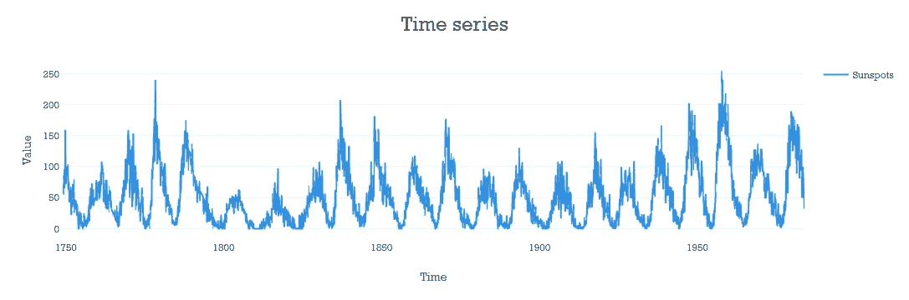
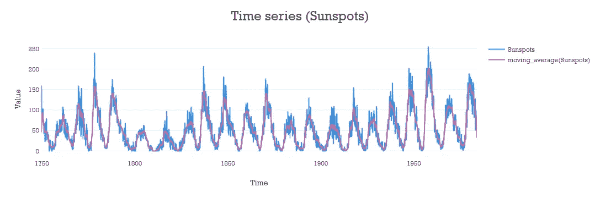
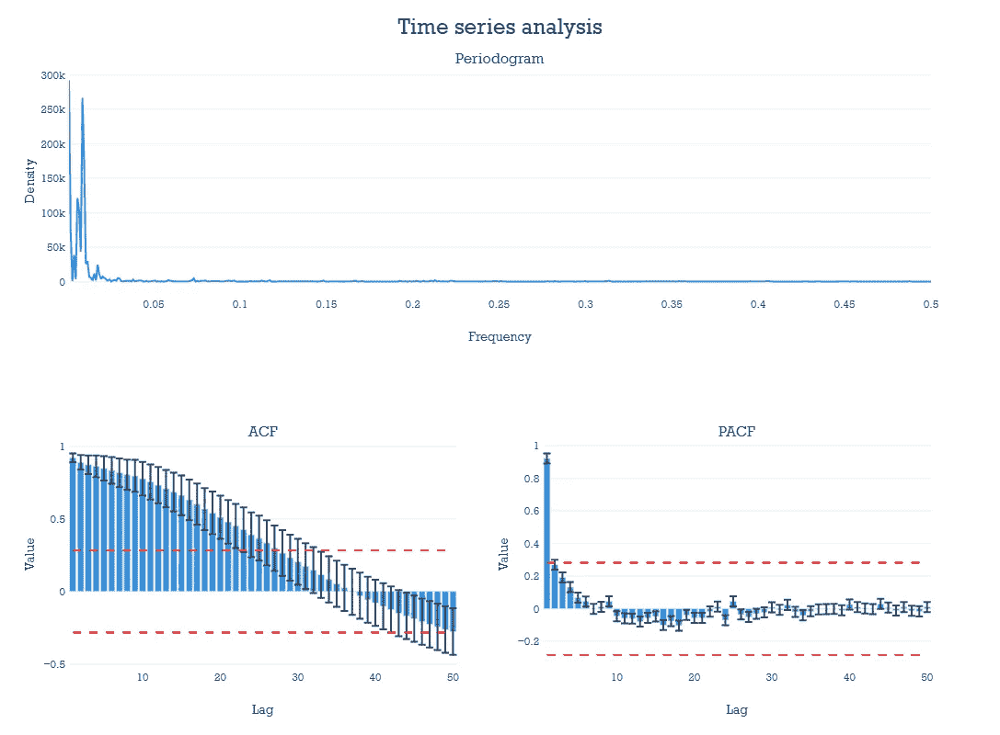
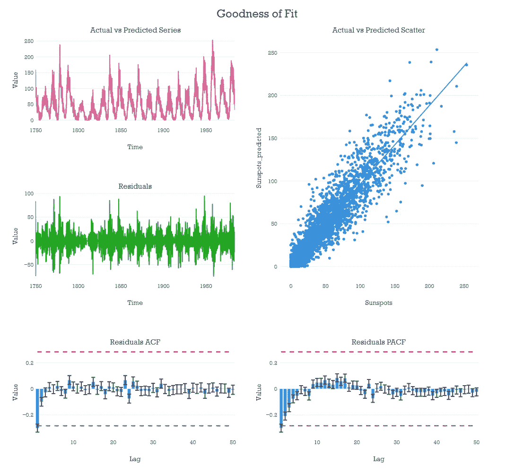

# pytsviz:使用 Plotly 和 Python 的交互式时间序列图表

> 原文：<https://towardsdatascience.com/pytsviz-interactive-time-series-charts-with-plotly-and-python-68cf30d9f822?source=collection_archive---------23----------------------->

## 引入新的库来加速时间序列分析

艾萨克·史密斯在 [Unsplash](https://unsplash.com?utm_source=medium&utm_medium=referral) 上拍摄的照片

# pytsviz 的案例

在数十亿参数模型主宰计算机视觉和 NLP 的时代，人们认为“传统”数据科学和机器学习已经死亡是情有可原的。

幸运的是，古老的*没有免费的午餐*定理仍然在现代研究中找到实验证实:在表格数据集中，基于树的机器学习模型，如 XGBoost，可以轻松胜过神经网络——例如，见 Ravid shw artz-齐夫，Amitai Armon， [*表格数据:深度学习不是你需要的全部*](https://arxiv.org/abs/2106.03253) ，arXiv，2021。

此外，在商业应用中，结果的准确性并不总是最重要的。可以通过简单的可视化或探索性分析来收集有价值的信息。通常，在一个合适的模型投入生产之前，这些知识会产生可操作的见解。

这为探索性分析和数据可视化的有效工具提供了论据。Python 已经有很多这样的工具:matplotlib、seaborn 和 plotly 只是一些例子。这些库很棒，但它们被设计成通用的:为了生成特定的图表，数据科学家必须建立在它们的原语之上。

例如，当处理时间序列数据时，就会发生这种情况。每次分析的开始包括创建一些有用的图表。在 [*xtream*](https://xtreamers.io/) 中，我们多次构建了这样的图形，最终我们开发了一个小型库来简化这个过程。

如果它对我们有用，对其他人也可能有用。

那么，为什么不开源呢？

# 使用 pytsviz

<https://github.com/xtreamsrl/pytsviz>  

为了展示 pytsviz 的一些特性，我们将假设在一个类似于文档中所示的[的笔记本上编写代码。](https://pytsviz.readthedocs.io/en/latest/notebooks/data_visualization_examples.html)

首先，让我们导入库并获取一些数据。我们将使用太阳黑子的单变量序列，但 pytsviz 也可以很好地处理多变量序列。然后，我们可以立即利用 pytsviz 创建一个折线图。

太阳黑子发生的线图。作者图片。

不是很令人印象深刻，是吗？

然而，我们注意到该系列是嘈杂的。出现了明显的季节性，但是被高频噪音掩盖了。因此，移动平均线有助于平滑序列并使模式看起来更清晰。

太阳黑子每月出现次数的年移动平均值。作者图片。

红线清楚地描述了一个大约 9 到 11 年长的周期。

pytsviz 支持一系列转换，包括对数、Box-Cox 等。

如果我们想深入挖掘序列的结构，一个好的选择是使用 ACF、PACF 和周期图。它们都可以与以下内容一起可视化:

ACF，PACF 和周期图。作者图片。

周期图的峰值正好在 10 年，表明这是该系列的主要周期。

pytsviz 提供了更多的方法来研究时间序列的结构，比如周期图、分解等等。请随意查看[文档](https://pytsviz.readthedocs.io/en/latest/index.html)以获取更多示例。

最后，让我们假设我们已经到了这个过程的末尾，并且我们已经有了一个模型来预测我们的时间序列。为了清楚起见，我们将使用该系列的 lag-1，一个公共基线。

pytsviz 提供图表来研究我们的模型的拟合优度。

拟合优度和残差分析。作者图片。

我们注意到，我们指示函数不绘制图表，而是返回 plotly 对象。这是该库中所有函数的一个共同特征，并且允许容易地个性化图表的布局。

# 贡献给 pytsviz

pytsviz 是一个开源项目。如果你发现它有任何价值，请随意投稿。

该项目仍处于非常早期的阶段，可以极大地利用每个领域的学者和从业人员的工作。查看 [Github 资源库](https://github.com/xtreamsrl/pytsviz)了解更多！

# 承认

pytsviz 由数据科学团队在 [*xtream*](https://xtreamers.io/) *设计和构建。Riccardo Nakamoto Maganza*、 [Riccardo Zoncada](https://medium.com/u/56f126975efb?source=post_page-----68cf30d9f822--------------------------------) 和 Gabriele Orlandi 是主要贡献者。

我的读者，谢谢你来到这里！

*如果你资助了故事中的任何价值，请考虑* [*免费订阅我的帖子*](https://medium.com/subscribe/@donlelef) *，成为* [*中等会员*](https://medium.com/@donlelef/membership) *无限制访问类似内容。*

*我们随时欢迎您的每一条评论、问题或总体反馈。如果你对* [*me*](https://www.linkedin.com/in/emanuelefabbiani/) *或*[*xtream*](https://xtreamers.io/)*感兴趣，可以上 LinkedIn 看看我们！*

如果你喜欢这篇文章，你可能会感兴趣:

</stop-copy-pasting-notebooks-embrace-jupyter-templates-6bd7b6c00b94>  </introducing-tsviz-interactive-time-series-visualization-in-r-studio-a96cde507a14>  </method-is-all-you-need-7-mistakes-to-avoid-in-data-science-a18bec2c5e99> 