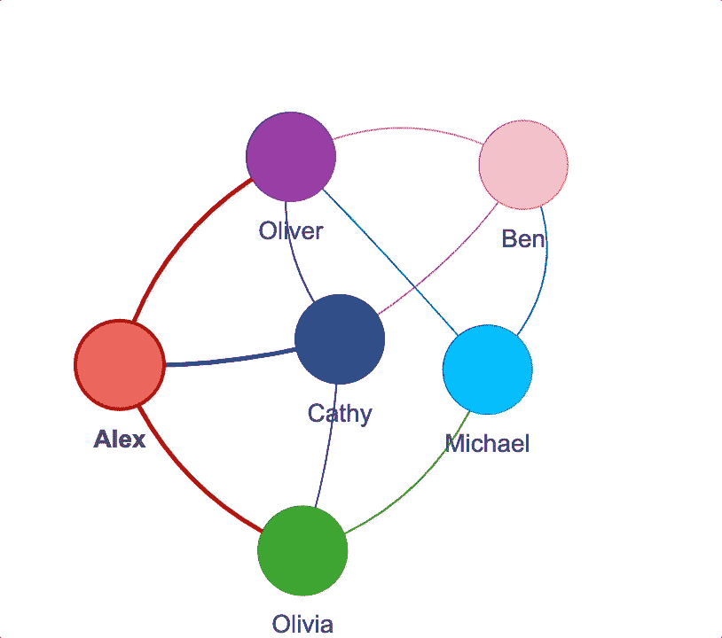
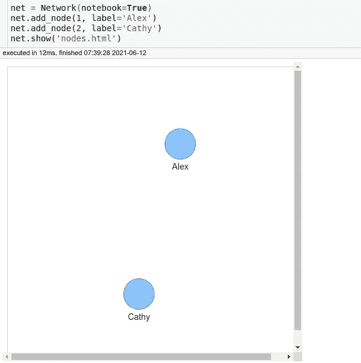
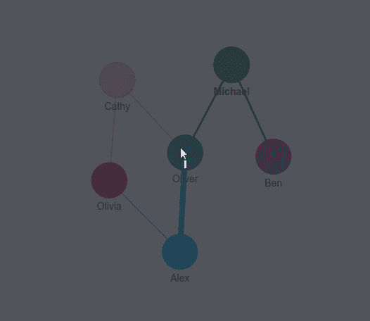
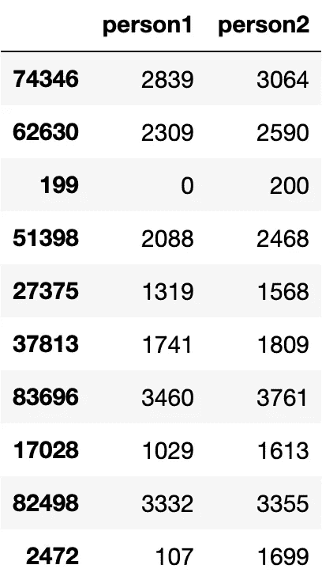
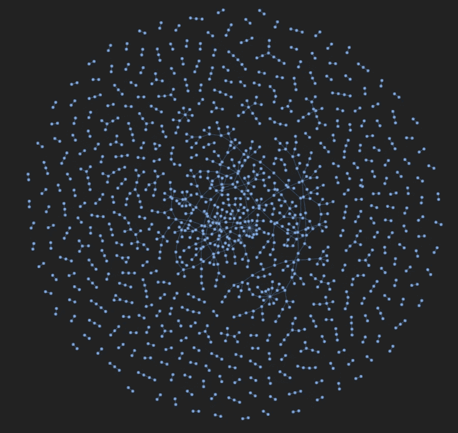
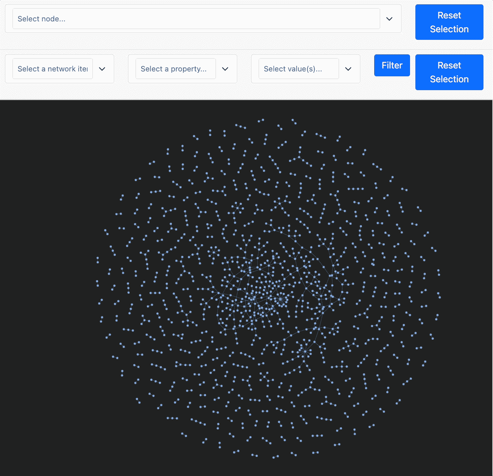
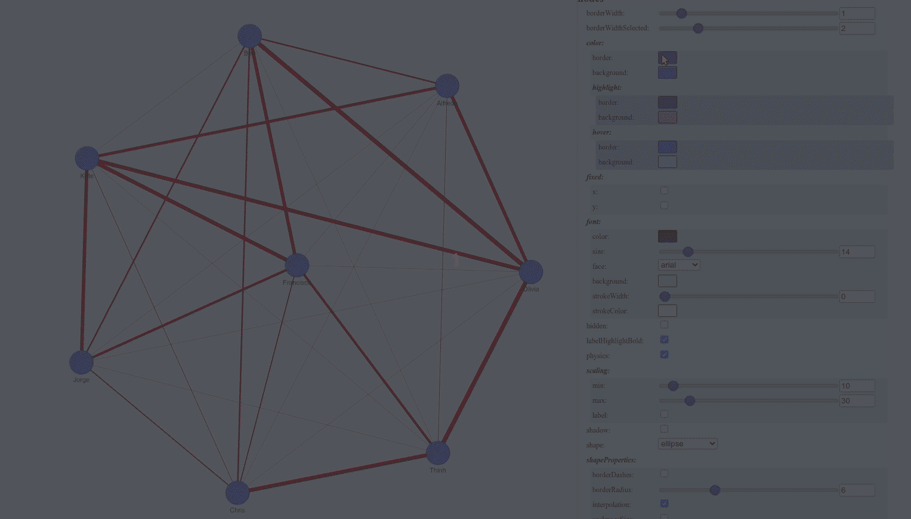
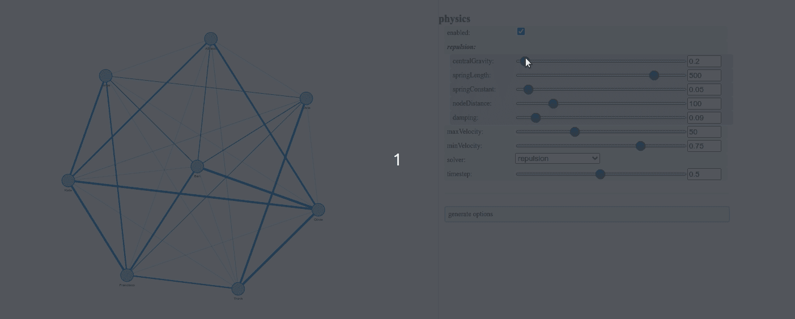

# Pyvis:用 Python 可视化交互式网络图

> 原文：<https://towardsdatascience.com/pyvis-visualize-interactive-network-graphs-in-python-77e059791f01?source=collection_archive---------2----------------------->

## 只需要几行代码

# 动机

给你一张显示一组人之间友谊的表格，你被要求把这个组分成两个一组。但是，通过查看表格很难做到这一点。

如果您可以使用如下的交互式网络图来可视化他们的联系，这不是很好吗？



作者 GIF

这时候 pyvis 就派上用场了。

# 皮维斯是什么？

Pyvis 是一个 Python 库，允许你用几行代码创建交互式网络图。

要安装 pyvis，请键入:

```
pip install pyvis
```

# 添加节点

要向网络图添加节点，只需使用`net.add_node(id, label)`。`id`是每个节点独有的。`label`用于显示图中节点的标签。

运行`net.show('nodes.html')`之后，一个名为 nodes.html 的文件应该会保存到您当前的目录中。你可以像下面这样和它互动。

要查看 Jupyter 笔记本中的图表，只需将参数`notebook=True`添加到`Network`。



作者图片

## 添加节点列表

如果您有许多节点，您可能希望添加一个节点列表。这可以用`add_nodes`方法来完成。

不错！让我们通过给节点添加颜色来让它们看起来更有趣一点。

单独拥有节点并不好玩。让我们弄清楚如何用边将这些节点连接在一起。

# 添加边缘

要给图表添加边，使用`add_edge`方法。该方法获取边的源和边的目的地。

要一次添加多条边，使用`add_edges`，它的参数是元组列表。

酷！但是，如果一些边的权重比其他边大(例如，奥利弗可能更喜欢亚历克斯而不是迈克尔)，该怎么办呢？

我们可以通过向`add_edge`添加参数`value`或者向`add_edges`的每个元组添加第三个值来指定每个边的权重。

现在，当您选择特定节点时，连接到该节点的边将高亮显示。



作者 GIF

# 调整节点距离和弹簧长度

节点距离是节点之间的距离。弹簧长度是边的剩余长度。

我们可以使用`repulsion`方法调整节点之间的距离和弹簧长度。让我们看看当我们改变参数`node_distance`和参数`spring_length`时，图是如何变化的。

默认值:

增加弹簧长度:

增加节点距离:

# 可视化脸书社交网络

让我们应用我们所学的知识来想象一个真实的社交网络。我们将使用[脸书数据，](https://snap.stanford.edu/data/ego-Facebook.html)由来自脸书的朋友列表组成。

脸书的数据是从调查参与者那里收集的，这些数据中的用户已经匿名。

你可以从[这里](https://snap.stanford.edu/data/facebook_combined.txt.gz)下载数据。下载完数据后，解压保存为`facebook_combined.txt`。

```
data = pd.read_csv("facebook_combined.txt", sep=" ", header=None)
data.columns = ["person1", "person2"]
```

由于这是一个大型数据集，我们将只可视化数据中的 1000 个样本。

```
sample = data.sample(1000, random_state=1)
sample.head(10)
```



可视化网络:

```
net = Network(
    notebook=True,
    cdn_resources="remote",
    bgcolor="#222222",
    font_color="white",
    height="750px",
    width="100%",
)
nodes = list(set([*sample.person1, *sample.person2]))
edges = sample.values.tolist()
net.add_nodes(nodes)
net.add_edges(edges)
```



## 过滤并突出显示节点

通过设置`select_menu=True`和`filter_menu=True`，可以高亮显示一个节点及其相邻的边和节点:

```
net = Network(
    notebook=True,
    cdn_resources="remote",
    bgcolor="#222222",
    font_color="white",
    height="750px",
    width="100%",
    select_menu=True,
    filter_menu=True,
)
net.add_nodes(nodes)
net.add_edges(edges)
```



## 动态调整`Network`设置

我们还可以使用配置 UI 来更改网络设置。这允许我们快速试验不同的布局和图形物理。



作者 GIF

设置`filter_=True`会显示三个控件(`nodes`、`edges`、`physics`)。如果您想只显示`physics`小部件，使用`filter_=['physics']`:



作者 GIF

# 结论

恭喜你！您刚刚学习了如何使用 pyvis 创建网络图。我希望这篇文章能激励你创建你的网络图。既然创建一个交互式网络图只需要几行代码，为什么不试试呢？

在这个回购中，您可以随意使用这篇文章的代码:

<https://github.com/khuyentran1401/Data-science/blob/master/visualization/pyvis_examples/pyvis.ipynb>  

我喜欢写一些基本的数据科学概念，并尝试不同的算法和数据科学工具。你可以在 LinkedIn 和 Twitter 上与我联系。

如果你想查看我写的文章的代码，请点击这里。在 Medium 上关注我，了解我的最新数据科学文章，例如:

</how-to-match-two-people-with-python-7583b51ff3f9>  </how-to-sketch-your-data-science-ideas-with-excalidraw-a993d049f55c> [## 如何用 Excalidraw 勾画您的数据科学想法

towardsdatascience.com](/how-to-sketch-your-data-science-ideas-with-excalidraw-a993d049f55c) </how-to-create-bindings-and-conditions-between-multiple-plots-using-altair-4e4fe907de37>  </introduction-to-yellowbrick-a-python-library-to-explain-the-prediction-of-your-machine-learning-d63ecee10ecc> 