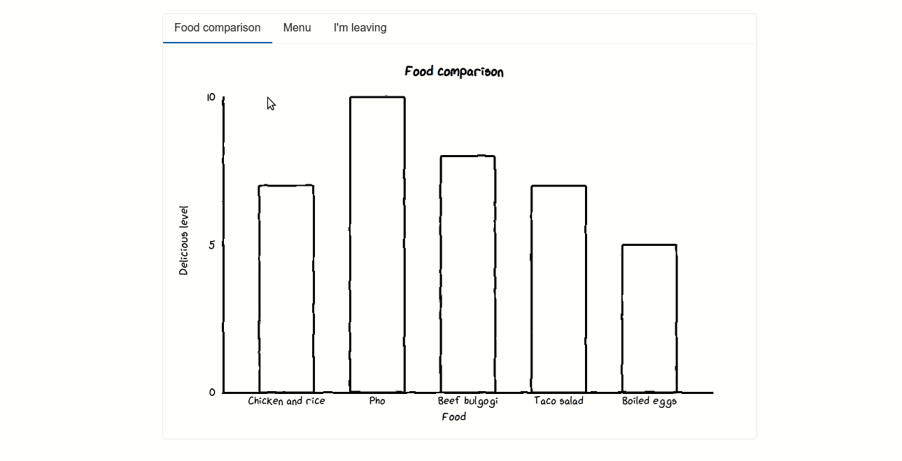
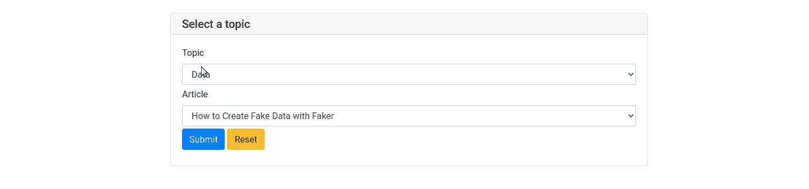
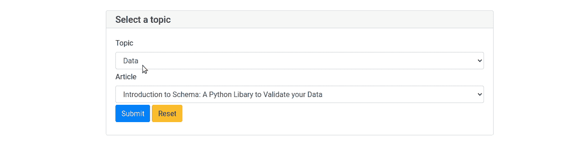
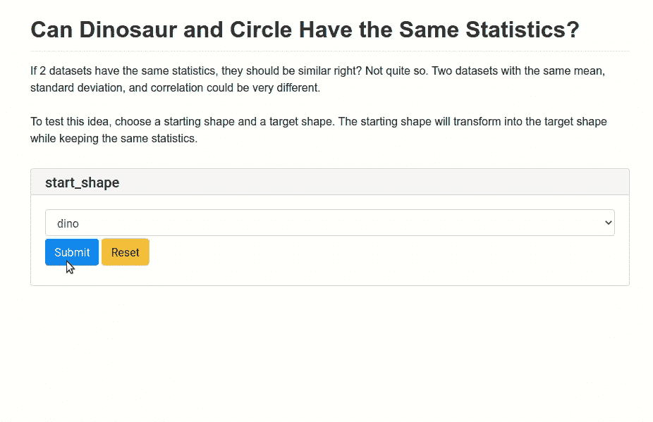
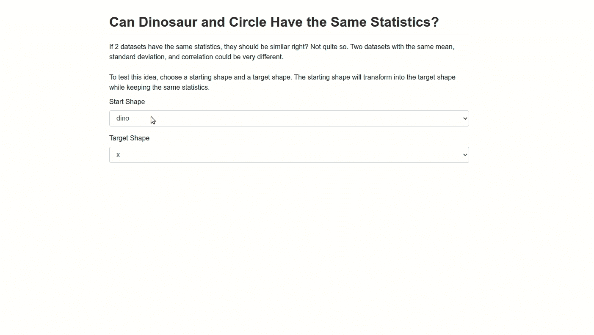
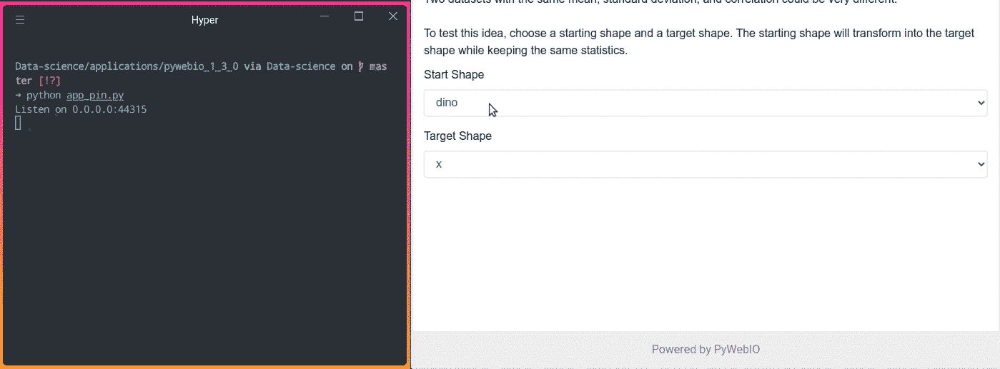

# PyWebIO 1.3.0:添加选项卡、锁定输入，并基于另一个输入更新一个输入

> 原文：<https://towardsdatascience.com/pywebio-1-3-0-add-tabs-pin-input-and-update-an-input-based-on-another-input-e81a139fefcb?source=collection_archive---------18----------------------->

## 用几行代码创建有用的 Python 应用程序

# 动机

PyWebIO 是一个 Python 库，它使您可以用几行代码轻松创建如下所示的 web 应用程序。


作者 GIF

在上一篇文章中，我介绍了 PyWebIO 的一些基本用法，但是您可能想做的不仅仅是这些基本功能。幸运的是，PyWebIO 1.3.0 引入了更有用的工具，可以用几行代码创建复杂的接口。

在本文中，您将学习如何:

*   添加选项卡以便更好地导航
*   根据一个输入的值更新另一个输入
*   持续输入

要安装 [PyWebIO](https://www.pyweb.io/) 1.3.0，请键入:

```
pip install pywebio==1.3.0
```

# put_tabs —添加选项卡以实现更好的导航

PyWebIO 1.3.0 允许你添加标签到你的应用程序，如下所示:



作者 GIF

要添加选项卡，只需使用`put_tabs`小部件。`put_tabs`的参数是如下的字典列表:

完整代码:

[源代码](https://github.com/khuyentran1401/Data-science/blob/master/applications/pywebio_1_3_0/tab_example.py)

# **输入 _ 更新—当一个输入改变时更新另一个输入**

有时，您可能希望一个输入的选项根据另一个输入的值而改变。

比如下面的 GIF，当我改变话题时，文章的选项也随之改变。



作者 GIF

我们如何在两个小部件之间创建这样的依赖关系？首先，让我们创建两个互不依赖的下拉菜单:

正如我们所料，当我们改变话题时，文章的选项不会改变。



作者 GIF

现在让我们添加一个组件，它将在这两个下拉列表之间创建依赖关系。那就是`input_update`。

`input_update`应该放在`onchange`回调的一个输入函数中。这意味着如果输入功能改变，将触发`input_update`:

代码`onchange=lambda t: input_update('article', options=topics_to_articles[t])`根据选择的主题更新输入 `'article'`的选项。

完整代码:

[源代码](https://github.com/khuyentran1401/Data-science/blob/master/applications/pywebio_1_3_0/input_update_example.py)

输出:


作者 GIF

# 固定—固定输入

PyWebIO 有很多有用的[输入法](https://pywebio.readthedocs.io/en/v1.3.0/input.html)比如`select`、`input`、`radio`、`checkbox`。通常，输入表单会在您提交输入后消失，如下所示:



作者 GIF

代码:

[完整代码](https://github.com/khuyentran1401/Data-science/blob/master/applications/pywebio_1_3_0/app_without_pin.py)

但是如果你不想让输入表单像下面这样提交输入后消失呢？



作者 GIF

这时候`pin`就派上用场了。为了让您的输入持久化，首先，用`pin.put_select`小部件替换`input.select`小部件。

提交成功后`pywebio.input`中的小部件会消失，而`pywebio.pin`中的小部件不会在提交后消失。

现在我们使用`pin_wait_change`来监听一个 pin 部件列表。如果任何小部件的值发生变化，该函数将返回该小部件的名称和值。

在下面的 GIF 中，每当我们改变一个小部件，形状就被打印到终端上。这意味着当我们改变一个小部件时，一个新的值被赋予。



作者 GIF

要获取新形状并将其分配给当前的`pin`小部件，请使用:

最后但同样重要的是，将上面的代码放入`with use_scope(..., clear=True)`中，以便在新图像出现之前旧图像被清除。

将所有东西放在一起:

[完整代码](https://github.com/khuyentran1401/Data-science/blob/master/applications/pywebio_1_3_0/app_pin.py)

输出:


作者 GIF

你可以在这里找到别针小工具[的完整列表](https://pywebio.readthedocs.io/en/v1.3.0/pin.html)。

# 结论

恭喜你！您已经了解了 PyWebIO 的 3 个新特性。PyWebIO 还有很多很酷的特性，我在这里无法一一列举。我推荐你去看看 [PyWebIO 网站](https://www.pyweb.io/)了解其他功能。

您可以在这里随意使用本文的源代码:

[](https://github.com/khuyentran1401/Data-science/tree/master/applications/pywebio_1_3_0) [## khuyentran 1401/数据科学

### 有用的数据科学主题以及代码和文章的集合- khuyentran1401/Data-science

github.com](https://github.com/khuyentran1401/Data-science/tree/master/applications/pywebio_1_3_0) 

我喜欢写一些基本的数据科学概念，并尝试不同的算法和数据科学工具。你可以在 LinkedIn 和 T2 Twitter 上与我联系。

星[这个回购](https://github.com/khuyentran1401/Data-science)如果你想检查我写的所有文章的代码。在 Medium 上关注我，了解我的最新数据科学文章，例如:

[](/pywebio-write-interactive-web-app-in-script-way-using-python-14f50155af4e) [## PyWebIO:使用 Python 以脚本方式编写交互式 Web 应用

### 在没有 HTML 和 JS 知识的情况下，用几行 Python 代码构建 Web 应用程序！

towardsdatascience.com](/pywebio-write-interactive-web-app-in-script-way-using-python-14f50155af4e) [](/how-to-solve-a-staff-scheduling-problem-with-python-63ae50435ba4) [## 如何用 Python 解决人员调度问题

### 尽可能减少每班的工人数量，同时为每个时间窗口分配足够的工人

towardsdatascience.com](/how-to-solve-a-staff-scheduling-problem-with-python-63ae50435ba4) [](/streamlit-and-spacy-create-an-app-to-predict-sentiment-and-word-similarities-with-minimal-domain-14085085a5d4) [## Streamlit 和 spaCy:创建一个应用程序来预测情绪和单词的相似性，最小域…

### 只需要 10 行代码！

towardsdatascience.com](/streamlit-and-spacy-create-an-app-to-predict-sentiment-and-word-similarities-with-minimal-domain-14085085a5d4) [](/simulate-real-life-events-in-python-using-simpy-e6d9152a102f) [## 使用 SimPy 在 Python 中模拟真实事件

towardsdatascience.com](/simulate-real-life-events-in-python-using-simpy-e6d9152a102f)