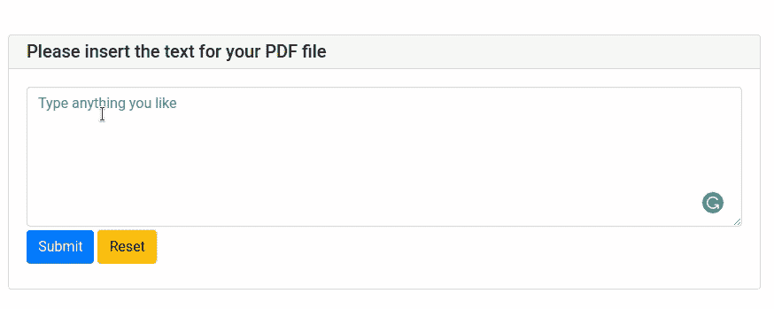

# PyWebIO:使用 Python 以脚本方式编写交互式 Web 应用

> 原文：<https://towardsdatascience.com/pywebio-write-interactive-web-app-in-script-way-using-python-14f50155af4e?source=collection_archive---------6----------------------->

## 在没有 HTML 和 JS 知识的情况下，用几行 Python 代码构建 Web 应用程序


作者 GIF

# 动机

您是否曾经希望只用几行 Python 代码创建一个 web 应用程序？Streamlit 允许您这样做，但是它没有提供很多选项来定制您的输入框、输出、布局和页面。

如果你正在寻找比 Django 和 Flask 更容易学习，但比 Streamlit 更容易定制的东西，你会喜欢 PyWebIO。

# PyWebIO 是什么？

PyWebIO 是一个 Python 库，允许你在没有 HTML 和 Javascript 知识的情况下构建简单的 web 应用。PyWebIO 也可以很容易地集成到 Flask 或 Django 等现有的 web 服务中。

要安装 PyWebIO，请键入

```
pip install -U pywebio
```

# 开始

## 投入

PyWebIO 提供了各种选项来获取用户的输入。下面的 GIF 展示了这些选项的样子。


作者 GIF

## 输出

PyWebIO 还提供了多种输出选项。点击查看输出[的完整列表。让我们看看这些输出选项是什么样子的。](https://pywebio.readthedocs.io/en/latest/output.html#pywebio.output.put_processbar)


作者 GIF

在上面的代码中，我们使用:

*   `put_markdown`写减价
*   `put_text`创建纯文本
*   `put_table`创建菜单表
*   `select`创建一个下拉栏
*   `put_image`输出食物图像
*   `put_file`输出下载文件的链接

我们可以用几行代码创建这样一个有趣的应用程序。多酷啊！

让我们应用我们到目前为止学到的知识来创造:

*   一个简单的应用程序，生成提供给定文本的 PDF
*   一个为我们上传的 CSV 文件生成美丽、高密度可视化效果的应用程序

# 创建应用程序以生成 PDF

我们将创建一个简单的应用程序来生成一个 PDF 格式的给定文本如下:


作者 GIF

让我们从创建应用程序的输入框和输出开始。

上面代码的解释:

*   `input`:创建一个文本输入框。
*   `textarea`:创建一个多行文本输入框。
*   `placeholder`:向用户建议可以在输入框中输入的内容
*   `required`:指定是否需要输入
*   `start_server`:启动服务器，将 PyWebIO 应用程序作为 web 服务提供。`debug=True`告诉服务器在代码改变时自动重新加载。

我们应该看到类似下面的内容:


作者图片

去 [http://0.0.0.0:36535/](http://0.0.0.0:36535/) 玩 app。现在我们有了一个简单的 web 应用程序，带有一个输入框，如下图所示！



作者 GIF

不错！现在我们知道了如何创建一个输入框和输出，让我们写下为输入文本生成 PDF 的代码。我们将使用 [PyFPDF](https://pyfpdf.readthedocs.io/en/latest/) 来完成这项工作。

```
pip install fpdf
```

输入所有信息后，一个名为 output.pdf 文件的文件将被保存到您当前的目录。如果你输入的文字是“你好”，你会看到下面有些像！


作者图片

现在我们已经了解了应用程序的基础知识。让我们添加更多的功能，让用户更容易使用。

## 添加一组按钮

用户可能希望在 PDF 中添加多个页面。因此，我们将添加一组按钮，使用户能够决定是否添加另一个页面。我们可以用`actions`方法做到这一点。

*   `label`:按钮名称
*   `value`:用户点击按钮时的值

我们将使用`while add_more`不断要求用户添加另一个页面，直到他们点击“否”。我们还将修改我们之前的函数`create_pdf`,这样它将接受一个页面列表作为输入。

我们来试试吧！


作者 GIF

酷！现在我们应该有一个 2 页的 PDF 文件，如下图所示！


作者图片

## 分组下拉和数字输入

我们还可以使用一个下拉框和一个数字输入框，使用户能够定制他们的文本大小和字体。但是，这一次，我们将把它们组合成一个表单，这样我们就可以立刻从用户那里请求一组输入。

现在我们可以使用`text_info['fonts']`和`text_info['size']`来访问`text_info`中字体和大小的值。使用这些值作为`create_page`功能的参数。


作者 GIF

而且我们在同一个表单中既有下拉框又有输入框！最终输出应该如下所示:


作者 GIF

# 创建一个应用程序，为上传的 CSV 文件生成美丽的可视化效果

您是否曾经想要创建一个 web 应用程序，为您上传的 CSV 文件自动生成漂亮的可视化效果？使用 PyWebIO 可以轻松做到这一点。下面是它的样子。


作者 GIF

上面生成 web 应用程序的代码。

我们只需要 3 个步骤来生成如上的 web 应用程序:

*   使用 [sweetviz](https://github.com/fbdesignpro/sweetviz) 生成熊猫数据帧的 HTML 报告
*   使用 PyWebIO 的`put_html`方法来呈现 HTML
*   使用`put_loading`方法输出加载提示

多酷啊！

# 结论

恭喜你！您刚刚学习了如何使用 PyWebIO 创建简单的 web 应用程序。通过使用 PyWebIO，您可以在短时间内构建一个有用的 web 应用程序！我鼓励你阅读 [PyWebIO 的文档](https://pywebio.readthedocs.io/en/latest/guide.html)，找到你可以用 PyWebIO 做的其他很酷的事情。

随意发挥，并在这里叉这篇文章的源代码:

<https://github.com/khuyentran1401/Data-science/tree/master/applications/pywebio_examples>  

我喜欢写一些基本的数据科学概念，并尝试不同的算法和数据科学工具。你可以通过 [LinkedIn](https://www.linkedin.com/in/khuyen-tran-1ab926151/) 和 [Twitter](https://twitter.com/KhuyenTran16) 与我联系。

如果你想查看我写的所有文章的代码，请点击这里。在 Medium 上关注我，了解我的最新数据科学文章，例如:

</streamlit-and-spacy-create-an-app-to-predict-sentiment-and-word-similarities-with-minimal-domain-14085085a5d4>  </introduction-to-datapane-a-python-library-to-build-interactive-reports-4593fd3cb9c8>  </i-scraped-more-than-1k-top-machine-learning-github-profiles-and-this-is-what-i-found-1ab4fb0c0474>  </create-a-beautiful-dashboard-in-your-terminal-with-wtfutil-573424fe3684> 