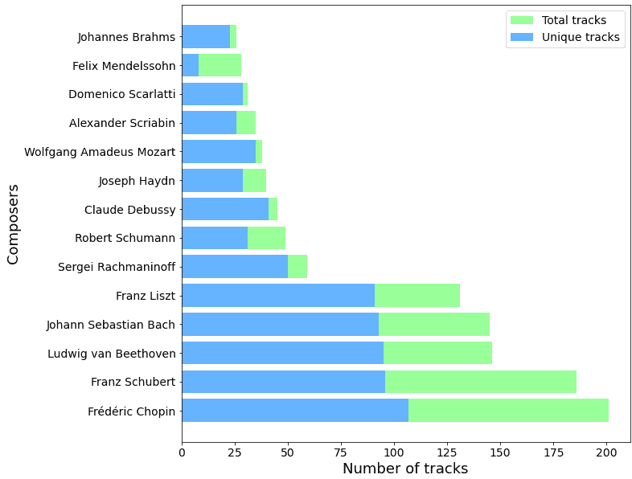
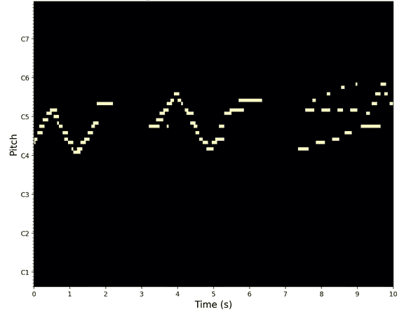
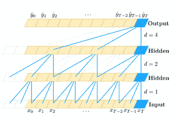
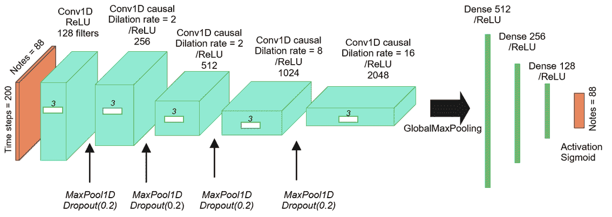
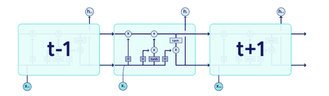
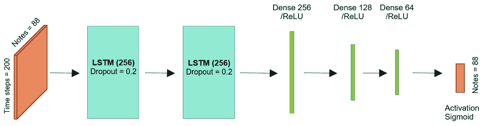
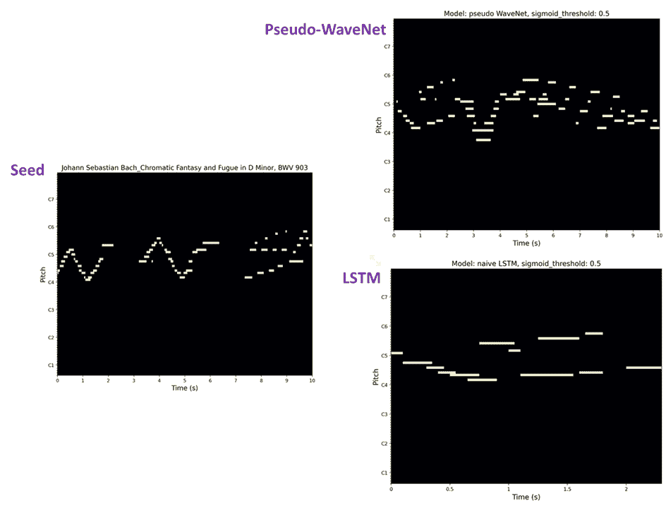
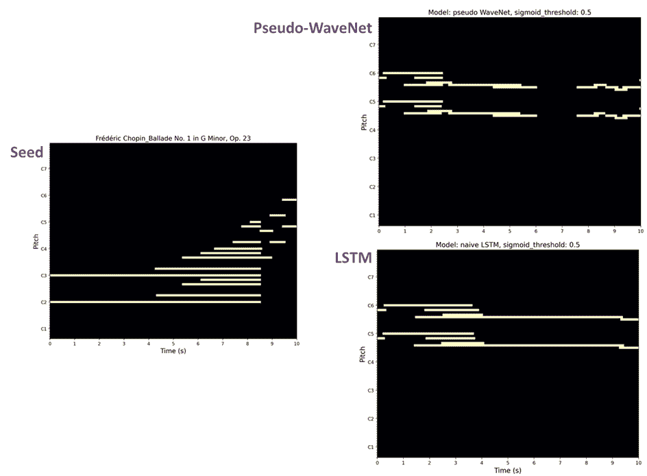

# 基于深度神经网络的钢琴器乐生成

> 原文：<https://towardsdatascience.com/pyzzicato-piano-instrumental-music-generation-using-deep-neural-networks-ed9e89320bf6?source=collection_archive---------23----------------------->

## 使用扩张卷积或 LSTM 网络构建一个有趣的制作钢琴器乐的网络应用程序

> 作者:[菲利普·帕特](https://www.linkedin.com/in/philippe-petit-64896960/)、[加廷·瓦瑟](https://www.linkedin.com/in/gatien-vassor-a5024040/)、[埃姆纳·拜拉姆](https://www.linkedin.com/in/emna-bairam-42415852/)和弗拉基米尔·雷蒙——2021 年 4 月

图片通过 CC0 许可下的[hippopx.com](https://www.hippopx.com/)

# 1.语境

> Pyzzicato 项目是我们为期三个月的数据科学家训练营的最后一部分。

该项目旨在构建一个 web 应用程序，允许用户根据他们选择的作曲家的风格生成新颖的音乐曲目(使用 streamlit)。基本上，这些模型通过使用一套深度学习技术和 midi 文件数据集，自动学习音乐风格，并基于现有的作品生成新的音乐内容。

在深度学习算法领域，生成模型有一个特殊的目标:它们旨在创建*原始*输出，这意味着*“不是一个精确的副本”*它们已经学会了复制。从这个意义上说，输出必须是原创的，但不能*过分原创*:评委(这里是:我们人类)必须至少在生成的输出中识别出模型训练输入数据的*主要特征*。

一言以蔽之:好的生成模型是其输入数据集的“精神孩子”，但不是专业的造假者。完美再现其输入数据的生成模型未能完成其使命，因为生成的内容*已经存在*。

著名的网站*thispersondoesnotexist.com*是这个定义的一个极好的例证，因为它产生了普通人类的图像——而不是现存的人类。

在音乐生成的背景下，生成模型的一个潜在目标是学习模仿他们已经得到的音乐数据的“风格”。所产生的音乐输出的听众必须感觉它可能是由人类作曲家写的，并且识别一种风格或音乐流派。

# 2.该项目

# 数据集和数据探索

即使对人类来说，创作音乐也不是一件容易的事情，音乐曲目是一个非常复杂的对象。为了简化模型化，我们选择生成单乐器音乐，因此选择了包含单乐器钢琴演奏记录的数据集。我们使用了作为 [Magenta 项目](https://magenta.tensorflow.org/)的一部分而创建的 [MAESTRO](https://magenta.tensorflow.org/datasets/maestro) 数据集(为同步轨道和组织而编辑的 MIDI 和音频)。

该数据集由 1276 首曲目组成，涵盖了 17 世纪至 20 世纪初大多数古典音乐作曲家的 200 多个小时的钢琴录音。这个数据集相当大，我们必须在合理的时间内选择子数据集来执行深度学习模型的训练。

图 1 示出了(I)每个作曲家在数据集中演奏和收集的作品的总数，以及(ii)数据集的 14 个主要作曲家的每个作曲家的独特作品的数量。

*图 1:每位作曲家的独特曲目和总曲目数(图片由作者提供)*

我们已经决定选择表现出非常独特的作曲风格的作曲家，这些作曲家的独特作品的总数足够大，可以在没有太多冗余输入的情况下训练模型。我们还选择了普通观众熟知的作曲家，以方便对结果的评估。基于此，我们选择了三位作曲家——肖邦、巴赫和德彪西——来训练我们的生成模型。

# 数据可视化和预处理

用 python 可以很容易地操作 MIDI 文件，例如使用 Colin RAFFEL 创建的 [Pretty_MIDI 包](https://craffel.github.io/pretty-midi/)。[1]

pretty_midi 对象的类将 midi 文件的音乐数据编码为音符形式的音符事件列表(start=0.000，end=0.124，pitch=76，velocity=80)。在本例中，音高编号为 76 的音符在 t=0 和 t=0.124 秒之间弹奏，力度(表示弹奏音符的力度)等于 80。音高和力度编码在 0 到 127 之间。

这种音乐轨迹的表示不太适合深度学习建模。因此，为了对数据进行编码，**我们使用了一种基于矩阵的方法**，该方法使用了音乐曲目的钢琴卷帘窗表示。

钢琴卷帘窗表示将 pretty-MIDI 对象的音符事件列表转换为[Pitches vs Timestep] 2d 矩阵(参见图 2)。

*图 2:用于生成的输出的数据可视化和视觉评估的音乐轨道(巴赫 D 小调半音阶幻想曲)的钢琴卷首表示。(图片由作者提供)*

下面是我们使用 Librosa 和 Pretty-MIDI(在 streamlit web 应用程序中)绘制钢琴卷帘窗矩阵的代码:

钢琴卷帘窗矩阵可以被视为维度为 128(MIDI 标准中不同音高的最大数量)的音高向量的串联，这些音高向量在表示时间流动的每个不同时间步长(这里是矩阵的一列)被连续播放。

时间步长的持续时间由采样频率 fs 决定，时间步长= 1/fs。fs=20 时，钢琴卷帘窗矩阵的每一列代表 1/20 秒的音乐。

使用这种表示，我们可以定义要给予深度学习模型的特征和目标(参见图 3):

特征将是长度为 n_feat 的音调向量序列

-目标将是 n_feat + 1 个音调向量，模型将基于特征序列学习预测该向量

*图 3:左图:音乐输入被编码为特征(基音向量序列)和相应的目标(下一个基音向量)。Nb_note = 88(而不是标准 MIDI 编码中的 128)，因为钢琴板只包含 88 个键。
右:将输入的 MIDI 文件分割成特征序列(音高向量序列)和目标序列(后续音高向量)。(图片由作者提供)*

# 3.深度学习模型

音乐曲目基本上是音符的时间序列。与噪音相反，音乐曲目中的音符不是随机播放的，而是通过和声、旋律等概念彼此紧密相连的。因此，我们用来生成音乐的深度学习模型必须能够学习**音乐“上下文】** *即*来跟踪被相对大量的时间分开的音符。然后，我们使用了两种已知在这项任务中有效的深度学习架构:**扩张卷积网络**和**递归神经网络。**

我们建立的深度学习模型还必须能够预测包含**零音符(静音)**、**或**、**几个音符(一个*和弦*)、**的音高向量，这是音乐曲目中非常常见和重要的特征。为了在我们的建模中以简单的方式允许它，我们在所有模型的输出层中使用了 **sigmoid 激活**函数。

# 扩张卷积模型

【图 4】核大小= 3，膨胀大小= 1，2，4 的膨胀因果卷积 1D 的例子(来源:[https://arxiv.org/pdf/1803.01271.pdf](https://arxiv.org/pdf/1803.01271.pdf))

图 4 给出了扩展卷积的原理。扩张卷积模型的主要优点是，通过适当选择层和超参数，它可以在合理的时间内产生像样的结果，可以用作比较的起点。我们首先设计了一个具有几层的简单卷积模型(在 Pyzzicato 应用程序中称为 Conv1D，但不在此讨论)，由于获得了相当好的结果，我们受著名的 WaveNet 架构(我们称之为“伪 wavenet”)的启发，构建了一个更复杂的卷积模型。该模型由五个卷积 1D 块(膨胀率在 2 和 16 之间)和一个分类块组成，如图 5 所示。注意最后一层的 **sigmoid 激活函数**允许在单个音高向量中生成多个一键编码音符事件。

*图 5:伪波网架构(图片由作者提供)*

请在此处查看代码:

# RNN (LSTM)模型

LSTM 是时间序列预测的有效模型，特别适合我们的目的。这是因为它们有选择性地短时间或长时间记忆模式的特性。

普通的 LSTM 单元由一个单元、一个输入门、一个输出门和一个遗忘门组成。该单元记忆任意时间间隔的值，并且三个门按照图 6 中描述的策略来调节进出该单元的信息流:

图 6:LSTM 电池原理(datascientest.com[)](https://datascientest.com/blog-data-ia-actualites)

我们的 LSTM 模型是一个序列模型，具有 2 个 LSTM 层和 3 个密集层，如图 7 所示。

图 Pyzzicato 中使用的(原始)LSTM 模型的架构(图片由作者提供)

请在此处查看代码:

由于 Google Colab 的免费 GPU 功能，模型得到了训练。

# 我们如何生成音乐曲目？

为了生成音轨，我们将输入序列(称为“种子”)提供给一个经过训练的模型，并要求它依次预测下一个音高向量，以便模型逐步生成一个新的音乐音轨。还可以调整一些参数，如生成轨道的总时间长度，或 sigmoid 输出层的阈值。

下面是我们使用的函数:

# 4.结果

# 生成模型的分析原理

评估生成模型的性能是一个**未解决的问题**，并且面对创造力的基本概念。总的来说，我们缺乏量化指标来评估产出的质量。的确，当我们听一首由生成模型产生的音乐曲目时，我们如何判断它的质量呢？

这个问题最常见的答案是主观评估法，基于以下标准:

- 1/ **音乐性:**音符和和弦的连续是否类似于普遍接受的“音乐”？(*即*我们能在其中分辨出一个“旋律”吗？它“听起来像”一首人类创作的音乐吗？)

- 2/ **保真度:**这首音乐是否包含一些特征模式？它属于预期的“音乐流派”(古典音乐、说唱、摇滚等)吗？

- 3/ **表现力:**一个非常主观的标准，对应的问题是“这首音乐是否在听者的头脑中实例化了“情绪？”

尽管评估这个项目成果的最好方法是听音轨(使用 pyzzicato 应用程序！)，则 **piano_roll** 表示允许对前两个定性标准 ***音乐性*** 和 ***保真度*** 进行视觉估计。

# 结果概述:

伪波网和朴素 LSTM 模型都能够在音乐性和保真度方面产生良好的结果，尽管在这两种模型之间可以发现一些微妙的行为差异。以下是一些生动的例子:

**例 1:**

图 8:使用从巴赫半音阶幻想曲和 D 小调赋格中提取的种子序列的输出。(图片由作者提供)

第一个例子使用 10 秒钟的巴赫半音阶幻想曲作为种子，说明了我们的模型生成可听音乐的能力:音符间隔相当规则，音高不同，与种子中看到的音符在同一范围内。半音阶的上升和/或下降唤起了种子中所看到的，在两个音轨中都可以看到。然而，伪波网似乎表现出更好的保真度，因为音符持续时间更接近于种子轨道中看到的音符持续时间。

单击此处收听种子序列:

以及使用伪波网模型生成的轨迹:

**例二:**

图 9:使用从肖邦 G 小调第一叙事曲中提取的种子序列的输出，作品 23。*(作者图片)*

第二个例子使用肖邦的叙事曲 n 1 的 10 秒钟作为种子，说明了这样一个事实，即与伪波网相比，天真 LSTM 更容易适应较慢的节奏和更持续的音符。尽管这两种模式在旋律方面产生了非常相似的输出，但 LSTM 设法再现了种子开始时可见的长时间持续的音符，而伪波网产生了一种沉默(在音轨的 6s 和 7s 之间)。

单击此处收听种子序列:

以及使用伪波网模型生成的轨迹:

**例 3:**

再来听一个例子，用的是从肖邦的玛祖卡舞曲(作品 17)中摘录的一个种子:

最有说服力的轨迹是由天真-LSTM 模型生成的:

# 限制

虽然相当令人满意，但上述生成轨迹的示例也凸显了我们的模型的主要局限性:

*   不太好的概括:输出强烈依赖于选择的种子，有时模型产生很少的音符，甚至完全无声，或有噪音的输出
*   生成长音轨的困难:当我们要求我们的模型生成超过训练序列长度(这里是 10s)的音轨时，我们的模型有困难。随着时间的推移，它们有“干涸”的趋势，产生越来越少的音符。

# 5.使用案例和潜在改进

# 潜在的使用案例

属于领域或者创作，为这个项目提出现实的用例不是一件容易的事情。然而，我们可以想象这项工作用于:

*   为呼叫中心或管理部门自动生成等待/等待音乐
*   音乐制作人/作曲家的旋律建议工具

# 潜在的改进

*   标准化 MIDI 数据集，以控制种子序列在速度、音高范围等方面的可变性。
*   使用最先进的生成对抗模型(gan)
*   通过使用生成器改进训练数据管理，以增加我们的训练数据集的大小(基于矩阵的方法在内存需求方面相当贪婪)
*   使用另一种数据编码模式，如 NLP 启发的方法，而不是一次性编码的钢琴卷帘窗矩阵
*   实施结果评估的量化指标。我们的方法主要基于主观评价，但文献中的一些参考文献提出了有趣的统计方法[2]。

# 6.概括起来

作为结论，我们首先要强调的是，尽管我们的三个模型化架构相对简单，但这里呈现的结果非常令人鼓舞。

在这个项目中，我们设法使用三种不同的生成模型制作音乐，从处理顺序数据的卷积模型到更高级的递归神经网络模型，这些模型考虑了数据结构中更长的路径依赖，如 RNN。

我们已经观察到种子和相应输出之间的真实音乐相干性，特别是对于伪波网和 LSTM 模型。

正如文章中所讨论的，更大的数据集肯定会改善我们的结果，首先是通过减少对训练数据的过度拟合。实现量化指标来评估生成轨迹的质量也是非常有趣的。由于时间不够，我们的分析仅限于主观评价方法。

使用人工智能深度学习模型的艺术创作是一个非常年轻的研究领域，未来将取得巨大成功。我们很高兴也很自豪有机会一睹这些创新算法的成果！

对题目感兴趣？以下是令人惊叹的项目的非详尽列表:

*   谷歌出品的洋红色
*   OpenAI 的 MuseNet
*   [索尼的流动机器](https://www.flow-machines.com)
*   [AIVA](https://www.aiva.ai/) 启动

还有[更多更多](https://medium.com/the-research-nest/ai-that-can-generate-music-fddc5813376a)！

# 7.下一步是什么？

首先，我们希望通过向读者提供一种生成他们自己的音乐曲目并评估结果的方式，来扩展这里呈现的结果的主观评估。多亏了我们开发的 Pyzzicato 网络应用程序，这才成为可能。它可以在 datascientest studio 上获得！

其次，我们对与任何对设计新型深度学习生成模型感兴趣的人合作持开放态度。用于预处理和模型训练的代码可以在 github 上找到，请随意查看！

在这里享受 streamlit 应用[带来的乐趣！](https://studio.datascientest.com/project/pyzzicato/)

*非常感谢*[*Juliette Voyez*](https://www.linkedin.com/in/juliette-voyez-81a24583/)*在整个冒险过程中对她的帮助！*

[1]科林·拉弗尔和丹尼尔·埃利斯。[使用 pretty_midi](http://colinraffel.com/publications/ismir2014intuitive.pdf) 对 MIDI 数据进行直观的分析、创建和操作。在 2014 年第 15 届音乐信息检索国际会议上的最新突破和演示论文。

[2]参见杨等*。，对音乐中的生成模型的评估*，神经计算和应用，2020 年 5 月，以及其中的参考文献以了解更多细节。