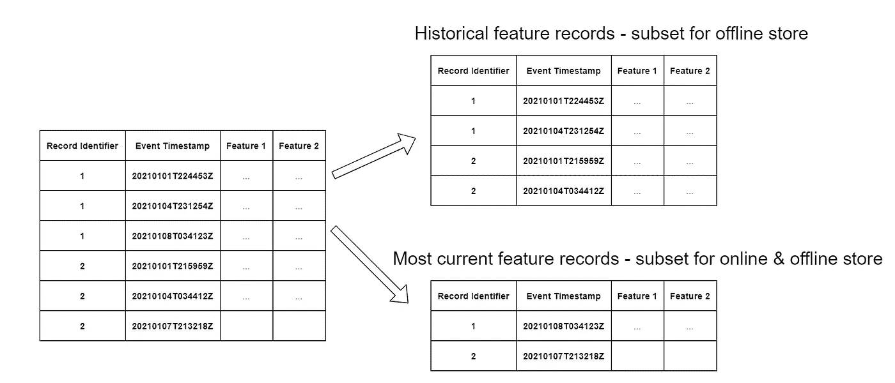

# 将历史数据纳入 SageMaker 特征库的问答

> 原文：<https://towardsdatascience.com/q-a-for-ingesting-historical-data-into-sagemaker-feature-store-239e918ec594?source=collection_archive---------35----------------------->

## 通过直接写信给 S3，回答如何将数据导入 SageMaker 离线功能商店的问题

艾米丽·莫特在 [Unsplash](https://unsplash.com?utm_source=medium&utm_medium=referral) 上的照片

在[之前的一篇博文](/ingesting-historical-feature-data-into-sagemaker-feature-store-5618e41a11e6#f950-d5882f6deacb)中，我展示了如何通过直接写入 S3 将数据导入 SageMaker 离线功能商店。我收到了关于高级场景的反馈和建议，我将在 Q & A 中讨论这些反馈和建议。

# 问:在要素记录具有不同时间戳的情况下，我如何获取历史数据？

我通过给每个特性记录分配相同的时间戳来简化我前面的例子。然而，在真实场景中，历史特征记录更有可能具有不同的时间戳。在这种情况下，我们可以使用相同的方法，但在设置 S3 文件夹结构时，我们必须更复杂一点，我们必须根据时间戳分割数据集。

让我们首先创建一个每个记录具有不同时间戳的要素数据集:

此代码创建将 2021 年 1 月 1 日晚上 8 点到 2021 年 1 月 2 日上午 10 点之间的随机时间戳追加到数据集。

关于离线商店的 S3 文件夹结构的[文档](https://docs.aws.amazon.com/sagemaker/latest/dg/feature-store-offline.html)告诉我们，我们必须为这些时间戳的年、月、日和小时的每个唯一组合创建不同的文件夹。它还告诉我们，每个特性子集的文件名需要文件中最新时间戳的时间戳:

S3 的命名惯例(图片由作者提供)

为此，我们需要为数据集中的每条记录创建一个键。该键的格式为 *YYYY-MM-DD-HH，*表示该记录时间戳的年、月、日和小时。然后，我们将所有具有相同关键字的特征记录组合在一起:

根据时间戳分割特征数据(按作者分类的图片)

对于每个子集，我们还需要识别相应的文件名。为此，我们需要识别每个子集内的最新时间戳。在上例中，关键字为*2021–01–01–22*的子集的文件名将以“ *20210101224453* _”开头，因为该子集中的最新条目来自 22:44:53。

以下代码为每个子集生成密钥以及 S3 路径和文件名:

为了根据时间戳键分割数据集并将它们保存到 S3 的相应 S3 路径中，我们可以简单地利用 pandas 的 [*groupby()* 方法:](https://pandas.pydata.org/docs/reference/api/pandas.DataFrame.groupby.html)

## 结论

在这个例子中，我们已经将带有不同时间戳的历史特征记录摄取到 SageMaker 离线特征存储中。我们根据特征记录时间戳分割数据，根据文档创建 S3 路径，并将每个子集存储在相应的 S3 位置。完整的例子和代码可以在[这本笔记本](https://github.com/marshmellow77/sm-feature-store-backfill/blob/main/s3-backfill_different-timestamps.ipynb)中找到。

# 问:我对每个特性记录都有几个版本。我希望将历史功能记录导入到离线商店，但也希望将每个功能记录的最新版本与在线商店同步。我该怎么做？

在这种情况下，我们必须根据事件时间戳来识别每个特性记录的最新版本。然后，我们将通过将这些记录直接写入 S3 来回填所有比最新版本旧的版本。包含我们将使用常规摄取 API 摄取的最新记录的子集。最终，我们将在在线和离线功能商店中获得每条记录的最新版本。所有其他(历史)记录将仅在离线商店中可用。

让我们首先创建一个数据集来反映这个场景。下面的代码为每笔交易创建 3 条记录，每条记录都有不同的时间戳:

结果数据集有 6，000 条记录，每笔交易三条。现在我们想将数据分成两组:

第一个子集( *df_online* )包含每个事务的最新版本。这一个我们将使用 API 调用摄取。第二个子集( *df_offline* )包含每个特征记录的旧版本。这一个我们将直接摄入 S3 以同样的方式在上面。

将要素数据分为历史子集和当前子集(按作者分类的图片)

因为填充线下商店的代码同上，这里就不赘述了，不过你可以在这个[笔记本](https://github.com/marshmellow77/sm-feature-store-backfill/blob/main/s3-backfill_sync-with-online-store.ipynb)里找到。我想明确指出的一个区别是，在创建功能组时，我们需要确保在线商店已启用:

一旦 S3 回填完成，我们就可以通过 API 获取每个要素记录的最新版本。这将把子集写入在线商店和离线商店:

写入在线商店是即时的，我们可以通过调用 GetRecord API 立即测试它:

通过 API 写入离线商店需要几分钟时间。等待大约 5-10 分钟后，我们可以测试离线商店现在是否已正确填充:

如果一切正常，您应该会看到三条记录，其中两条是我们通过直接写给 S3 获取的，另一条是通过 API 获取的:

作者图片

## 结论

在这一部分，我们通过直接写信给 S3，将历史特征记录回填到离线商店中。我们还通过使用摄取 API 将当前版本的功能记录与在线商店同步。最后，我们在离线商店中有所有的特性记录，在在线商店中有最新的版本。这个例子的完整代码可以在这个[笔记本](https://github.com/marshmellow77/sm-feature-store-backfill/blob/main/s3-backfill_sync-with-online-store.ipynb)中找到。

感谢所有提供反馈和建议的人。如果您还有任何问题或反馈，请随时联系我们。