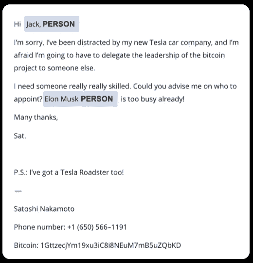

# 特定信息抽取的问答模型

> 原文：<https://towardsdatascience.com/q-a-models-for-specific-information-extraction-2a204f7f3521?source=collection_archive---------35----------------------->

## 从非结构化文本中获取相关实体提取的转换器的能力


作者图片

一天 121，一个月 3751，一年 44165。据[有人计算](https://www.campaignmonitor.com/resources/knowledge-base/how-many-emails-does-the-average-person-receive-per-day/#:~:text=Keeping%20all%20this%20in%20mind,will%20be%20closer%20to%20126.)，那是一般人收到的邮件数量。我不知道你怎么想，但对我来说，有很多邮件需要我花时间去处理…


作者图片

如果你能根据邮件的内容、他们是否想卖东西、你是否必须回覆某人等等，立即将他们分类，那不是很好吗？？我测试了一些传统的信息提取技术以及一种更具创新性(并且相当强大)的技术。下面是它们的工作原理和不同结果的总结。

# 示例电子邮件

为了保持一致，我们将使用以下示例电子邮件(主要使用 GPT-3 生成)来比较和观察当前针对此问题的不同解决方案:

> 嗨，杰克，
> 
> 对不起，我被我新的特斯拉汽车公司分散了注意力，恐怕我要把比特币项目的领导权交给别人了。
> 
> 我需要一个非常非常熟练的人。你能建议我任命谁吗？埃隆·马斯克已经忙得不可开交了！
> 
> 非常感谢，
> 
> Sat。
> 
> 附注:我也有一辆特斯拉跑车！
> 
> —
> 
> 中本聪
> 
> 电话号码:+1(650)566–1191
> 
> 比特币:1 gttzecjym 19 Xu 3 IC 8 neum 7 MB 5 uzqbkd

如果你很好奇，给 GPT-3 的输入是:“*这是中本聪给杰克的一封电子邮件，解释比特币网络似乎已经断开。邮件:“。*结果并不真正相关，但作为一个例子，效果很好。

# 技术

## 选项 1:正则表达式

信息提取问题最古老的解决方案是正则表达式。我们可以使用这些来从文本中提取匹配特定模式的字符串。为简单起见，我们将只提取我们应该联系的人的姓名(在许多情况下，不是发送电子邮件的人的姓名)。

让我们首先假设全名可以遵循以下格式:

```
Satoshi NakamotoSatoshi K. NakamotoSatoshi K NakamotoSatoshi Nakamoto-KoaSatoshi Nakamoto Koa
```

因此，一个可能的正则表达式可能是:

```
(?:[A-Z][a-z]+)+(?:[\- ][A-Z](?:[a-z\.]+)?)+
```

使用 regex 从电子邮件中获取所有匹配项，如下所示:

它将从我们的电子邮件中选择以下字符串:


正则表达式提取:按作者排序的图像

正如你所看到的，这种方法有利于减少可供选择的选项数量，但是我们仍然会得到不是名字的**字符串，并且我们没有一种有效的方法来识别重要的那个(我们不能总是选择最后一个)。**

## 选项 2:使用实体检测

解决前一个问题(检测不是名字的字符串)的常见方法是使用 [spaCy](https://spacy.io/) 。

> spaCy 是一个用于高级自然语言处理的开源软件库，用编程语言 Python 和 Cython 编写。

spaCy 将允许我们快速建立一个实体检测器模型，这将有望帮助我们从电子邮件中提取我们想要的信息。要下载您喜欢的型号，您需要运行:

```
python -m spacy download <MODELNAME>
```

由于我们将使用 spaCy 3.1 的 transformer 模型，我们需要运行:

```
python -m spacy download en_core_web_trf
```

完整的代码如下所示:

这将从我们的电子邮件中选择以下内容:



空间提取:作者提供的图像

如您所见，这个模型比 regex 做得好得多。它忽略了类似“*特斯拉 Roadster* ”或者“*嗨 Jack* ”这样的案例，却没有得到正确的称呼:*【中本聪】*！这可能是因为 spaCy 在其训练数据中从未遇到过此名称。

虽然这并没有真正改变结果…即使空间探测到了*“中本聪”*，我们仍然不知道哪个人实体是重要的。

怎么才能做到呢？这可能吗？这么多问题！嗯……问题。如果我们只问计算机哪个名字是重要的呢？！让我们试试那个。

**选项 3A: Q &变压器型号**

使用一个已经通过像 [SQuAD](https://rajpurkar.github.io/SQuAD-explorer/) 这样的问答数据集进行了微调的转换器，将允许我们向它询问任何关于它接收的上下文(在这种情况下是电子邮件)的问题。

令人欣慰的是，HuggingFace 库包含了许多预先训练好的模型，可以开箱即用。为简单起见，我们将使用其中的一个，因为不是每个人都能负担得起像伯特那样大的 TPU 现成模型。你可以随意看看他们的型号目录，选择你最喜欢的型号。我将使用*"*[Bert-large-un cased-whole-word-masking-fine tuned-squad](https://huggingface.co/bert-large-uncased-whole-word-masking-finetuned-squad)*"*模型，根据他们的说法，该模型实现了 93.15 的 F1 分数。

像 spaCy 一样，HuggingFace 也有一个 API，允许用户快速与预先训练好的模型进行互动，以完成特定任务:[管道](https://huggingface.co/transformers/main_classes/pipelines.html)。

在此之前，我们首先需要知道要问哪些问题。以下是我能想到的问模特的五个问题:

*   他叫什么名字？
*   她叫什么名字？
*   他们叫什么名字？
*   这是谁送的？
*   寄这个的人叫什么名字？

现在我们有了问题，我们的代码看起来像这样:

它为每个答案输出以下概率:


问答模型提取:作者图片

*【特斯拉汽车公司】**【聪】**【特斯拉】*？这里我们有一个类似于正则表达式提取(选项 1)的问题:我们得到的格式看起来不像我们想要的格式，并且实体不是一个名称。

要解决这个问题，我们有三个选择:我们可以使用 regex、spaCy，或者两者都用。因为我们已经看到 spaCy 不能检测名字*“中本聪”*作为一个人，我们将使用正则表达式。您应该尝试使用 spaCy，因为它在其他情况下也很有用。如果你想冒险，两者同时尝试。

**选项 3B: Q &变压器型号+正则表达式过滤**

加上我们在选项 1 中看到的过滤步骤，我们得到:

如果我们运行这个代码，我们会得到这些新的概率:


问答模型提取+正则表达式:作者图片

# 结果

我们走吧！跳出思维定势，我们能够从文本中提取相关信息。想想看:如果你有关于邮件的问题，直接问电脑！；)

以下是我问这位模特的其他问题，我觉得很有趣。尝试你自己的问题，看看模型给你什么答案，但是如果不是关于名字的话，记得移除/改变正则表达式检查！

```
Q: What is his phone number?
A: +1 (650) 566–1191 -- 91.74% SureQ: What does he need?
A: someone really really skilled -- 42.43% SureQ: What is his bitcoin wallet address?
A: 1GttzecjYm19xu3iC8i8NEuM7mB5uZQbKD -- 1.72% SureQ: What car does he have?
A: Tesla Roadster -- 75.22% SureQ: Who doesn't have time?
A: Elon Musk -- 95.99% Sure
```

# 结论

尝试非传统的方法有时能给你更好的效果！即使有数据集可以提取相关信息，如[安然人名注释数据集](https://www.cs.cmu.edu/~einat/datasets.html)，但它们都没有包含足够的信息用于此目的。

我很高兴看到机器学习社区的未来，以及这些超级强大的模型如何用于日常目的。

**全 Colab 笔记本**:[https://Colab . research . Google . com/drive/1 nctya 2 qwxov 77 gzbfua 9 nndv 3 quzinns？usp =共享](https://colab.research.google.com/drive/1nCTYA2QWxov77GzBFuA9nndv3QUZInns?usp=sharing)