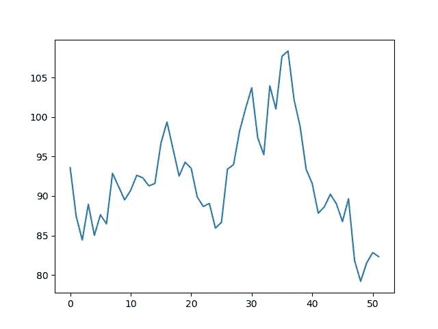

# q-Fin:Python 库

> 原文：<https://towardsdatascience.com/q-fin-a-python-library-84b611c44411?source=collection_archive---------21----------------------->

## 证券定价的工作库


Levi Meir Clancy 在 [Unsplash](https://unsplash.com/s/photos/greek-statue?utm_source=unsplash&utm_medium=referral&utm_content=creditCopyText) 上拍摄的照片

# 量化金融

在过去，我写了大量关于证券定价的文章…

*   [Black-Scholes 算法 Delta 对冲](https://medium.com/swlh/black-scholes-algorithmic-delta-hedging-c2cdd42ce175)
*   [什么是隐含波动率？](https://medium.com/swlh/what-is-implied-volatility-35a94b9afbef)
*   [鞅和马尔可夫过程](https://medium.com/swlh/martingales-and-markov-processes-724de97dab1c)
*   [随机积分](https://medium.com/swlh/stochastic-integrals-fe46b3753871)
*   [推导布莱克-斯科尔斯模型](https://medium.com/swlh/deriving-the-black-scholes-model-5e518c65d0bc)
*   [为外来物种定价的 Python](https://medium.com/swlh/python-for-pricing-exotics-3a2bfab5ff66)
*   [波动率交易 101](/volatility-trading-101-6f934cce5be3)
*   [风险中性投资组合管理](https://medium.com/swlh/risk-neutral-portfolio-management-e448ed2aa103)
*   [布莱克-斯科尔斯期权定价有误](/black-scholes-option-pricing-is-wrong-b62cd13baf42)
*   [几何布朗运动](/geometric-brownian-motion-559e25382a55)
*   [Python 中的选项希腊文](/option-greeks-in-python-97980df3ab0b)
*   [Python 中的量化金融](/quantitative-finance-in-python-e8d48e6b9c23)
*   [什么是波动风险溢价？](/what-is-the-volatility-risk-premium-634dba2160ad)
*   [什么是布莱克-斯科尔斯定价法？](https://medium.com/coinmonks/what-is-black-scholes-pricing-b59ea9398874)
*   [高级期权交易](https://medium.com/coinmonks/advanced-option-trading-341f631cfd67)
*   [算法投资组合对冲](/algorithmic-portfolio-hedging-9e069aafff5a)
*   [Python 中的蒙特卡洛定价](/monte-carlo-pricing-in-python-eafc29e3b6c9)
*   [Python 中的随机波动率定价](/stochastic-volatility-pricing-in-python-931f4b03d793)

在我的所有文章中，我使用 gists 或 GitHub 库以编程方式展开讨论。我决定是时候开始将所有这些主题和代码聚合到一个开源的 Python 库中了: **Q-Fin(定量金融)**。

# GitHub 存储库:

  

问 -Fin 是一个用于量化金融的(工作中的)Python 库，由不同的模块组成，用于帮助不同证券的定价。

# 从版本 0.0.19 起可用的模块

## 随机过程

*   几何布朗运动
*   赫斯顿的随机波动模型

## 期权定价

*   布莱克-斯科尔斯看涨/看跌期权和希腊人
*   普通期权的模拟定价

## 奇异期权定价

*   二元期权的模拟定价
*   障碍期权的模拟定价
*   亚式期权的模拟定价

# 模块即将推出

## 分析学

*   投资组合优化、模拟和分析
*   投资组合构建的随机优化

## 期权定价

*   动态对冲模拟

## 奇异定价

*   计算希腊人的数值方法

## 固定收益定价

*   债券定价、期限、凸度等…

## 未来定价

*   包含存储成本、股息等的资产的合同定价…

# 如何使用 Q 型鳍

Q-Fin 发布到 PyPi，可以用 pip 包管理器安装。

```
pip install qfin
```

安装后， *qfin* 可以与所需的定价模块一起导入。

当实例化 *BlackScholesCall* 或 *BlackScholesPut* 的对象时，会自动生成价格和希腊值…

```
12.361726191532611
0.5596176923702425
0.018653923079008084
39.447933090788894
-6.35319039407325
```

qfin 中的模型旨在易于实现和直观使用。如果对如何实现任何模型感到困惑，请参见 GitHub 上的[**Q-Fin**](https://github.com/RomanMichaelPaolucci/Q-Fin)**查看每个模型的示例。**

**如果我们想生成一个基于几何布朗运动的资产样本路径，我们可以从模拟模块导入*几何布朗运动***

```
[93.91122929151561, 91.6343053296407, 88.05914544360269, 93.59884276992683, 88.91826221393717, 96.24731044166496, 100.47778492860515, 101.67238049186874, 100.9417850393366, 96.82424825907334, 93.7151718797683, 92.49545149500011, 96.53263786045804, 89.28059081778505, 90.45872657119223, 86.93126385081307, 85.16673100265604, 79.15865514214676, 84.19274677422355, 85.24206893196425, 78.62525272868086, 83.54358623217077, 81.62201286740276, 82.42635804232602, 84.94263935198337, 83.33105946122816, 77.8595164393749, 80.27197581106154, 79.47579375600165, 82.71376020485647, 80.70778436356143, 80.05570601837579, 80.07619597627252, 79.20938156016103, 75.90700126416749, 78.48328669684636, 77.64791411275162, 81.39837629677785, 79.03009362423532, 79.7491267612585, 81.64910423114112, 83.09606367629651, 81.20209669000536, 82.12241299592519, 81.05241267445211, 78.94737177934881, 80.74689754653583, 83.62309595971432, 92.88481220356229, 95.76653063259874, 91.28249515120577, 93.13154530372866]
```

## **生成的样本路径的可视化结果**

****

**基于几何布朗运动的模拟资产路径**

**类似地，如果希望根据随机波动模型(赫斯顿模型)生成样本路径，也可以用类似的方式完成…**

```
[105.42093152811593, 104.59360758315175, 95.39486402258322, 95.4249148299477, 89.20333260783619, 91.19985569745064, 91.80869313310264, 94.26238888554938, 92.48431868124044, 94.29279102140633, 90.24378843974851, 95.45949462821744, 99.65404275857998, 99.37220075852828, 95.20171170639435, 95.69256680383415, 93.77186210135861, 99.27046893569022, 103.27587414833025, 106.655336480214, 109.69803170503143, 107.77485958774615, 107.53817208839943, 106.19690441993153, 105.39424156717143, 105.50808774366415, 93.98202958489428, 95.63909466199506, 92.14292356838752, 89.41142436545123, 86.09698832674296, 84.0572388626126, 84.63149048687042, 83.39001169580843, 87.13058171725491, 88.2510341053498, 87.83915958025074, 85.12312257176154, 80.6653790514404, 77.69004067122552, 79.58811490693624, 80.22513954798012, 81.19071476078733, 84.35002848454775, 80.88207502476948, 83.83626736045116, 85.01532060624201, 86.89395166366388, 84.31302211711235, 88.64369851332083, 86.47542281928952, 90.42790068755158]
```

## **生成的样本路径的可视化结果**

****

**基于随机波动模型的模拟资产路径**

**这个模型通常捕捉了经验观察到的资产收益的异方差性。**

**还有一些模块可用于模拟定价。很可能用户想要改变哪一个潜在的随机过程负责产生该外来物的公平价格。模拟定价总是需要几何布朗运动参数。然而，如果提供附加参数，将使用随机方差过程。**

```
12.73812121792851
23.195814963576286
```

**该库将证券定价中的抽象概念放入直观、易于实现的类和函数中。如果有任何建议、错误或一般意见，我希望听到任何反馈。**