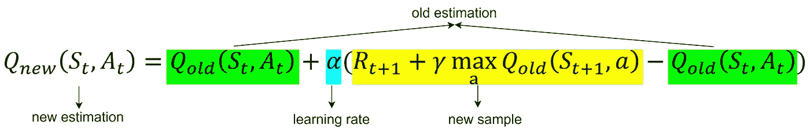
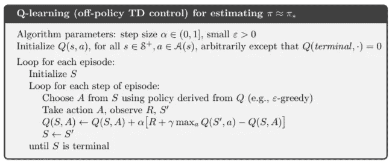
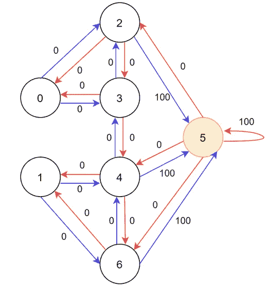
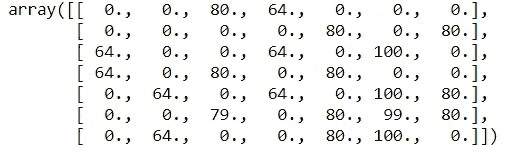
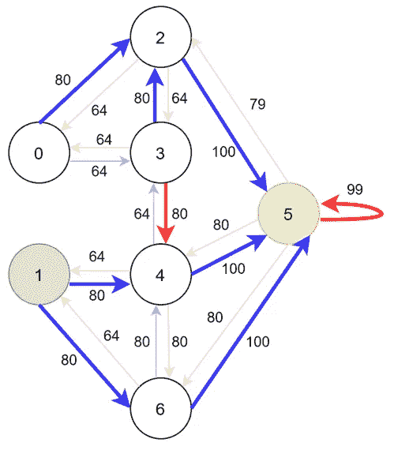
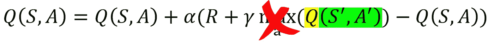
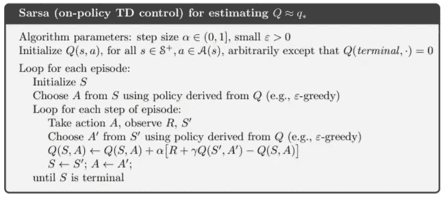

# Q-Learning 和 SARSA，使用 Python

> 原文：<https://towardsdatascience.com/q-learning-and-sasar-with-python-3775f86bd178?source=collection_archive---------3----------------------->

## 解释无模型 RL 算法的基础:Q-Learning 和 SARSA(带代码！)

法比奥·巴拉西纳在 [Unsplash](https://unsplash.com/?utm_source=medium&utm_medium=referral) 上拍摄的照片

强化学习(RL)是机器学习中的一种学习范式，它通过与环境交互来学习将状态映射到动作的最优策略，以实现目标。在本文中，我将介绍两种最常用的 RL 算法:Q-Learning 和 SARSA。

类似于蒙特卡罗算法(MC)，Q-Learning 和 SARSA 算法也是**无模型 RL 算法**，即**不使用与马尔可夫决策过程(MDP)相关的转移概率分布**。相反，他们从经验中学习最优政策。MC 与 Q-Learning 或 SARSA 算法的主要区别在于 **MC 需要采样整个轨迹**来学习价值函数，寻找最优策略。然而，对于一些问题来说，获得一个完整的轨迹可能是耗时的。因此，如果算法能够在每个动作之后更新策略，而不是在获得整个轨迹之后，这可能是好的。

在 Q-Learning 和 SARSA 中，我们只需要**一步轨迹** (𝑠,𝑎,𝑟,𝑠')而不是整个轨迹。此外，从这两个算法中，我们还可以突出显示出**符合策略的**和**不符合策略的**学习之间的差异，我将在本文稍后讨论这一点。

# q 学习

Q-Learning 中的更新规则如下:

作者图片

新样本和旧估计之间的差异用于更新旧估计。

图 1:Q-Learning——一种非策略学习算法[1]

## 一步一步的例子

假设一个 MDP 的 6 室环境。我们将每个房间编号为 0 到 6，房间由门/箭头连接，如下图所示。目标是让代理移动到房间 5。注意，只有 2 号房、4 号房、6 号房可以通往 5 号房(目的地)。

图 2: MDP 6 室环境。作者图片

**目标**:把一个代理放在任何一个房间里，从那个房间到 5 号房间。
**奖励**:直接通往目标的门有 100 的即时奖励。其他不直接与目标房间相连的门奖励为 0。

本教程将通过简单易懂的例子介绍 Q-learning 的概念性知识。它描述了智能体如何通过强化学习方法从未知环境中学习。

从上面的代码收敛后输出 Q 值表。作者图片

图 3:根据上述 Q 值矩阵，5 个房间环境的最佳策略。。作者图片

根据上面的 Q 表，我们可以根据最大 Q 值选择行动。例如，如果代理在房间 1，它将有两条不同的路线可以通向房间 5。代理可以从房间 1 移动到房间 4 或房间 6，这两个房间的最大 Q 值都是 80。之后，在两种情况下，代理将移动到房间 5，这给出了 100 的最大 Q 值。类似地，如果代理在房间 3，它可以移动到房间 1 或房间 4，这给出了相同的最大 Q 值。

# 萨尔萨

SARSA 中的更新规则如下:

作者图片

更新规则类似于 Q-Learning，但有一些不同。

图 3: SARSA —一种基于策略的学习算法[1]

**ε-贪婪**算法中的探索是指以ε概率，智能体随机采取行动。这种方法用于增加探索，因为没有它，代理可能会陷入局部最优。

**SARSA** 是 **on-policy** ，它用当前策略生成的(S，A，R，S’)样本更新 Q 表。(S’，A’)是转换样本中的下一个状态和下一个动作。在到达 S '之后，它将采取动作 A '并使用 Q(S '，A ')来更新 Q 值。而 **Q 学习**是**非策略**，其使用状态 S’中的最大 Q 可能值来更新未来的 Q 值。然而，具有最大 Q 可能值的动作可能不是代理在未来将采取的实际动作，因为以ε概率代理将采取随机动作。换句话说，用于在 Q-Learning 中更新策略的动作不同于代理将采取的真实动作。

我们将使用这个工具包来解决 [FrozenLake](https://gym.openai.com/envs/FrozenLake-v0) 环境。有各种各样的游戏，如雅达利 2600 游戏，基于文本的游戏等。点击查看全部[。](https://gym.openai.com/envs/)

下面的教程将使用 SARSA 算法来解决来自[健身房](https://gym.openai.com/)环境的 [FrozenLake](https://gym.openai.com/envs/FrozenLake-v0) 。

# 参考

[1]萨顿和巴尔托(2017 年)。[强化学习:简介](https://web.stanford.edu/class/psych209/Readings/SuttonBartoIPRLBook2ndEd.pdf)。麻省理工学院出版社