# 表格中的象限分析

> 原文：<https://towardsdatascience.com/quadrant-analysis-in-tableau-6a3ee42d26ff?source=collection_archive---------8----------------------->

## 了解如何在 Tableau 中以动态象限图的形式分析数据


作者图片

如果你是数据科学生态系统的一员，你一定听说过 [Gartner 的魔力象限](https://www.gartner.com/imagesrv/research/methodologies/magic_quad_faq.pdf) (MQ)。这些 MQs 是一系列包含几个技术公司的市场研究和分析的报告。它们是这一领域最受期待和期待的报告之一。这是针对分析和商业智能平台的 [2020 年魔力象限](https://www.qlik.com/us/gartner-magic-quadrant-business-intelligence)。您可以清楚地看到代表四个不同类别的四个不同象限。

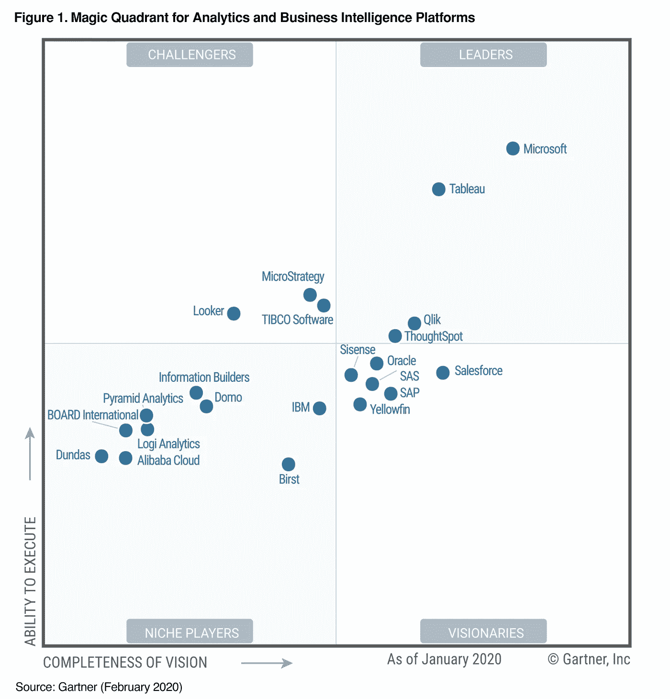

来源:[https://www . qlik . com/us/Gartner-magic-quadrant-business-intelligence](https://www.qlik.com/us/gartner-magic-quadrant-business-intelligence)

象限图在技术上是一个散点图，分为四个相等的部分或象限，因此得名。象限分析图组合了相似的数据点，从而将它们放在同一个象限中。 [Tableau](https://www.tableau.com/) 是当今业界广泛使用的一款出色的数据分析和可视化工具。在本文中，我们将学习如何在 Tableau 中创建象限图。我们将更进一步，让它也能响应。

# 个案研究

我们将使用著名的超市数据集进行演示。该数据是美国一家超市的数据，包含产品、销售、利润等信息。您可以使用它来确定这个虚构公司中需要改进的关键领域。第一步是导入数据集并浏览它。你可以从[这里](https://github.com/parulnith/Data-Visualisation-libraries/blob/master/Data%20Visualisation%20with%20Tableau/Quadrant%20Analysis%20in%C2%A0Tableau/Sample-Superstore%20.xls)下载数据。

## 先决条件

本教程假设您对 Tableau、它的属性以及它在分析中的用途有所了解。

## Python 中的基本 EDA

让我们使用 Python 来导入数据集并探索它。

```
import pandas as pd  
import numpy as np
superstore_data = pd.read_excel('Sample-Superstore .xls',header = 3)  
superstore_data.head()
```

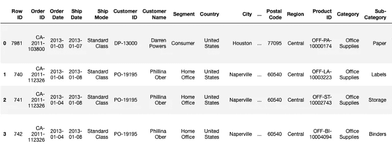

数据帧显示了包含不同属性的数据集的前五行。让我们检查是否有任何丢失的值:

```
superstore_data.info()
```

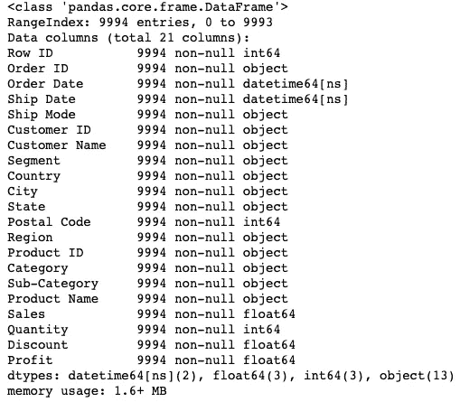

上面的信息显示没有空值，总共有 9994 条记录。我们现在将数据集导入 tableau 工作区。

## 连接到数据源

*   将数据从计算机导入 Tableau 工作空间。
*   在“工作表”选项卡下，三个工作表将变得可见，即。`Orders`、`People`和`Returns`。在本文中，我们将只关注`Orders`数据。双击`Orders`表单，它就会像电子表格一样打开。
*   我们观察到前三行数据看起来不同，并且不是期望的格式。我们将使用**数据解释器**，也在工作表标签下，来纠正这个问题。数据解释器将现有的工作表转换成格式良好的工作表。

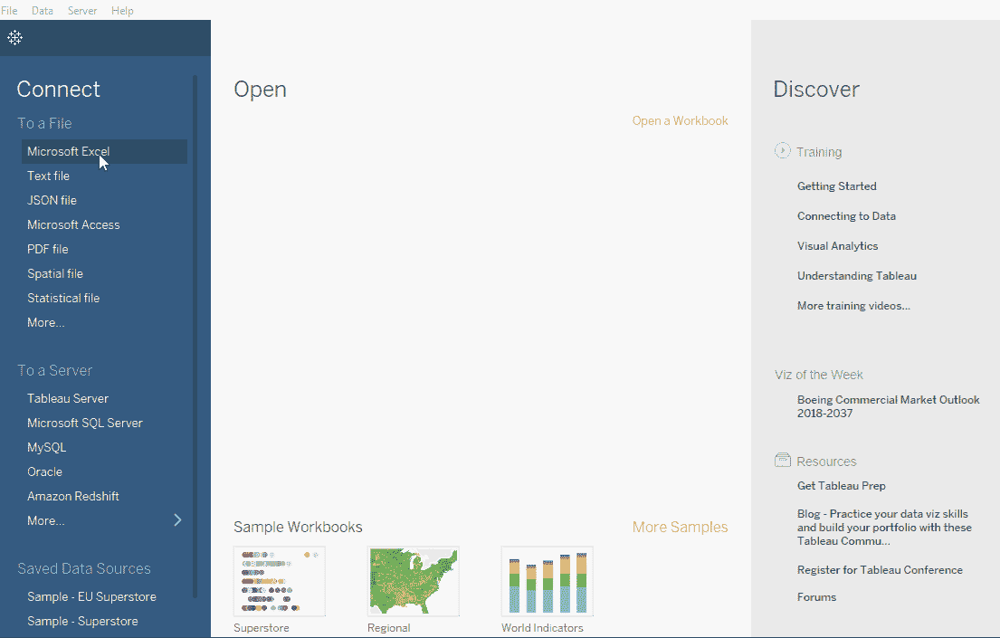

作者图片

## 创建散点图

假设我们想知道`Discount`与超市的`Profit`之间的关系，以及哪些产品比其他产品更有利可图。第一步是在折扣和利润率之间创建一个简单的散点图。`Profit Ratio`给人一种比利润单独领域更好的感觉。原始数据集中不存在利润率属性。因此，我们将如下创建它:

*   打开一个新工作表，使用下面提到的公式创建一个名为`Profit Ratio`的新计算字段。

`sum([Profit])/sum([Sales])`

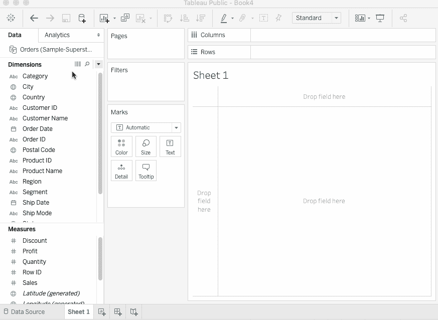

作者图片

*   将`Discount`拖至列，将`Profit Ratio`拖至行。然后将`Sub Category`拖到颜色架上。将`Discount`的测量值转换为`Average`。你会得到一个散点图，每个圆圈代表一个特定的产品。


作者图片

## 创建参数

现在我们有了一个基本的散点图，是时候创建两个参数了，它们将作为象限计算的参考。在我们的例子中，我们将创建一个`Discount Parameter`和一个`Profit Ratio Parameter`，它们将分别来自`Discount`和`Profit Ratio`字段。

*   **折扣参数**

点击**折扣字段** > **创建** > **参数**并填写如下图所示的数值。将当前值设置为**您选择的任何值。**(本例中为 0.2)。

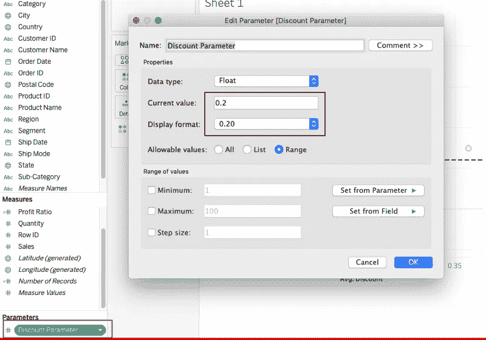

作者图片

*   **利润率参数**

使用利润率字段执行与上述相同的步骤。这将创建`Profit Ratio`参数。

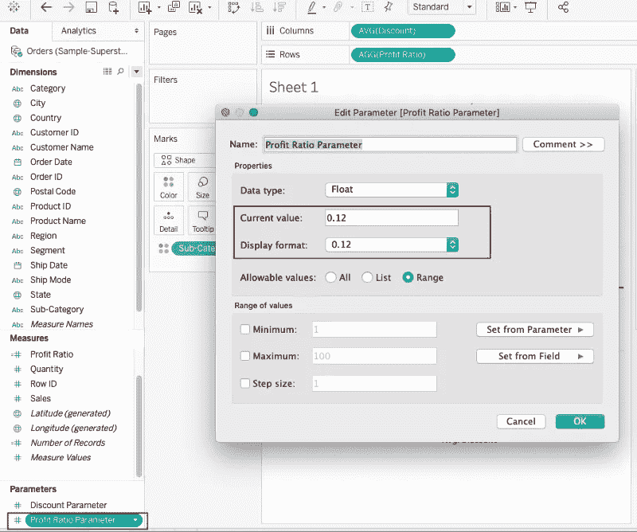

作者图片

一个名为`Parameters`的新标题现在出现在包含两个新创建参数的工作表中。

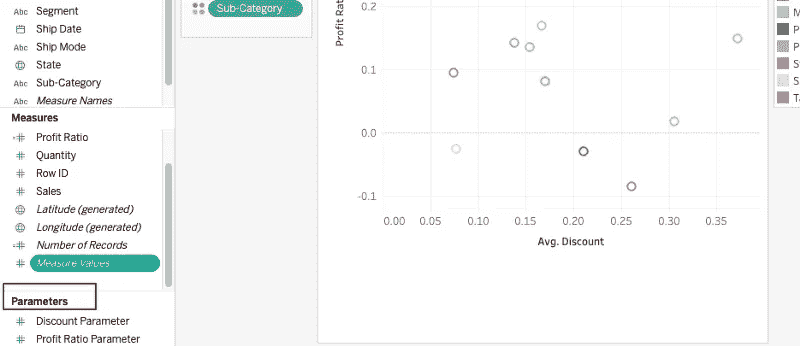

作者图片

## 添加参考线

Tableau 的参考线只是图形上代表参考点的一条垂直线或水平线。例如，在销售图表上画一条参考线可以很容易地区分高销售点和低销售点。我们将创建两条参考线，每个轴一条。

*   右击`Profit Ratio axis` (y)并选择**添加参考线**。
*   将参考线值设置为`Profit Ratio`参数。
*   保留其他字段的默认值，并点击**确定**。
*   右击`Avg Discount`轴(x)并选择**添加参考线**。
*   将参考线值设置为`Avg Discount`参数。
*   保留其他字段的默认值，并点击**确定**。

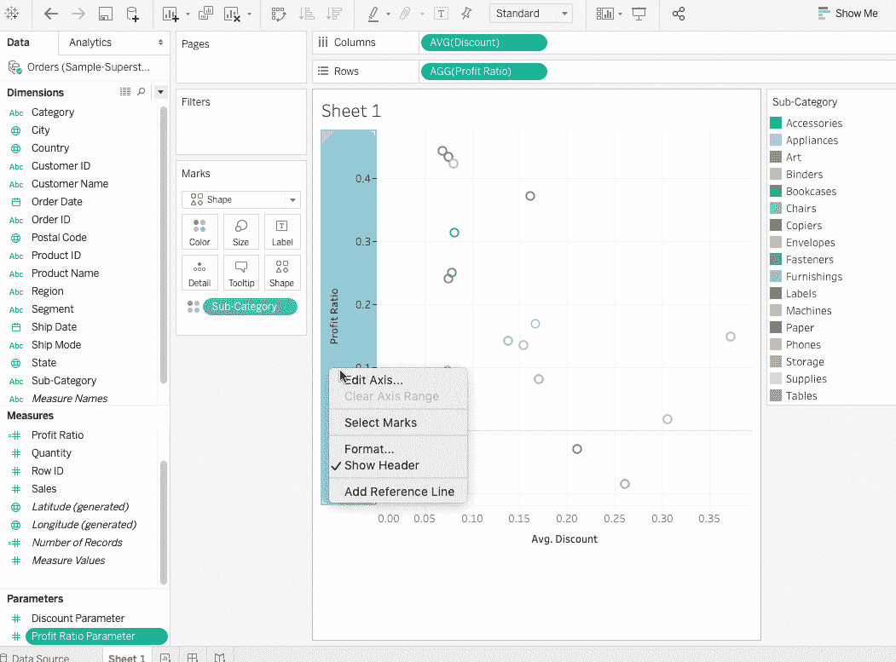

作者图片

## 给每个象限分配一种颜色

我们现在有了四个象限，但是每个象限中的数据点都是随机着色的。我们可以编写一个简单的计算，根据象限(即右上、左上、右下或左下)为数据点分配颜色。

*   点击**分析** > **创建计算字段**，并将该字段命名为**象限颜色**。
*   输入如下所述的公式:

```
IF AVG([Discount]) >= [Discount Parameter]  
AND [Profit Ratio] > [Profit Ratio Parameter] THEN 'UPPER RIGHT'  
ELSEIF AVG([Discount]) < [Discount Parameter]   
AND [Profit Ratio] > [Profit Ratio Parameter] THEN 'UPPER LEFT'  
ELSEIF AVG([Discount]) >[Discount Parameter]   
AND [Profit Ratio] < [Profit Ratio Parameter] THEN 'BOTTOM RIGHT'  
ELSE 'BOTTOM LEFT'  
END
```

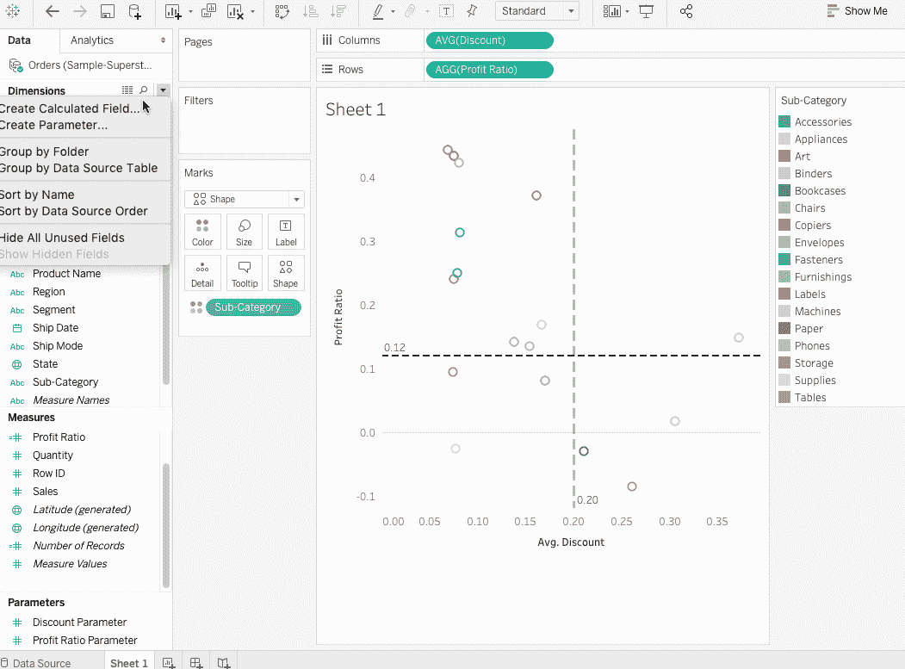

作者图片

*   数据点目前已经被子类别着色。然而，我们想用它们各自的象限来给它们着色。将`Sub-Category`字段拖到细节卡上，将`Quadrant Color`字段拖到颜色卡上。现在，所有数据点立即按照它们所在的象限进行着色。将`Shape`更改为圆形以获得填充的圆形，并相应地调整尺寸和工具提示偏好。

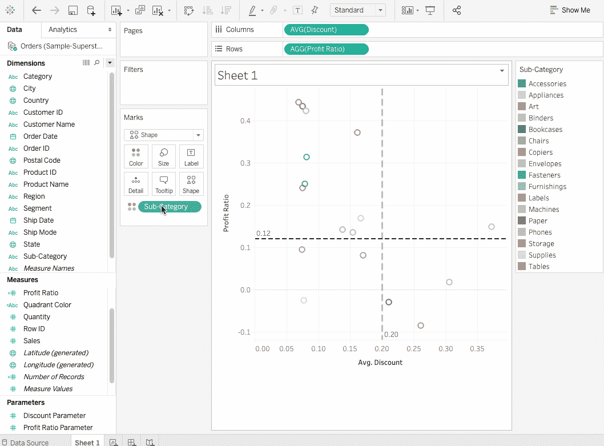

作者图片

所以这里我们有一个美国超市的折扣率和利润率的象限分析。从图中可以明显看出，位于`Bottom Right`的产品是利润最低的产品，而位于`Upper Left`的产品是利润最高的产品。

# 创建动态象限图

上图中的象限是固定的，只有当我们改变链接参考线的值时才能改变。如果我们想试验不同的阈值，看看产品如何实时改变它们的象限呢？这是可能的，被称为动态象限图，通过`Actions.`实现

## 行动

动作是 Tableau 中的一个特性，它允许我们为数据添加交互性。在这个特性的帮助下，我们可以通过选择、点击或悬停来与可视化交互。动作可以在可视化中执行以下任务:

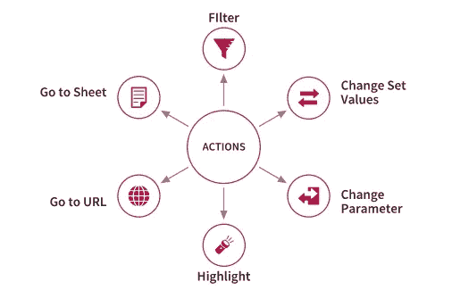

作者图片

现在，让我们通过以下步骤设置一个工作表操作:

*   转到**工作表>动作**并添加`Change Parameter`动作。这是因为我们想要创建一个相应地改变参数的动作。

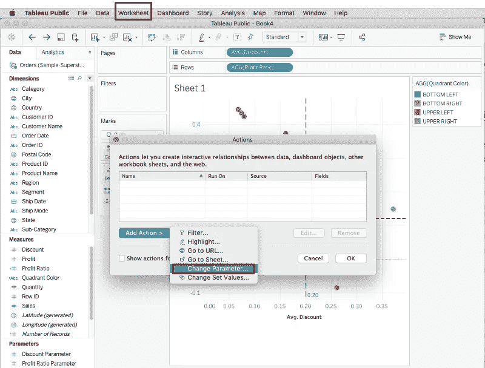

作者图片

*   接下来，我们将动作命名为`Update Discount Parameter`，并选择相应的`Target Parameter`和`Value`，在本例中分别为`Discount Parameter`和`AVG(Discount)`。

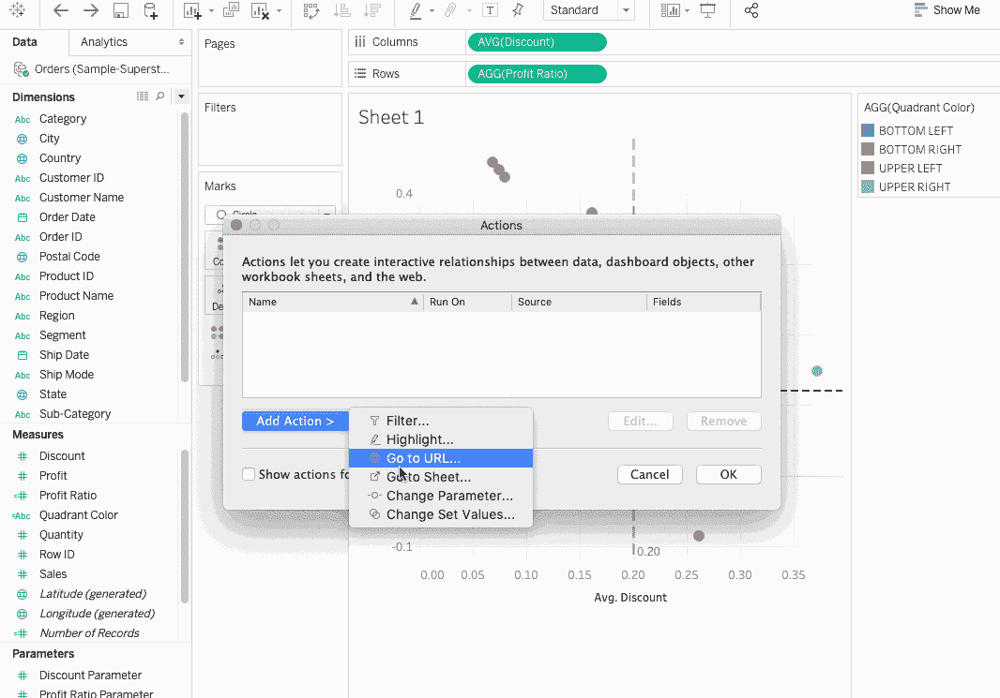

作者图片

*   类似地，我们将创建另一个名为`Update Profit Ratio Parameter`的动作。

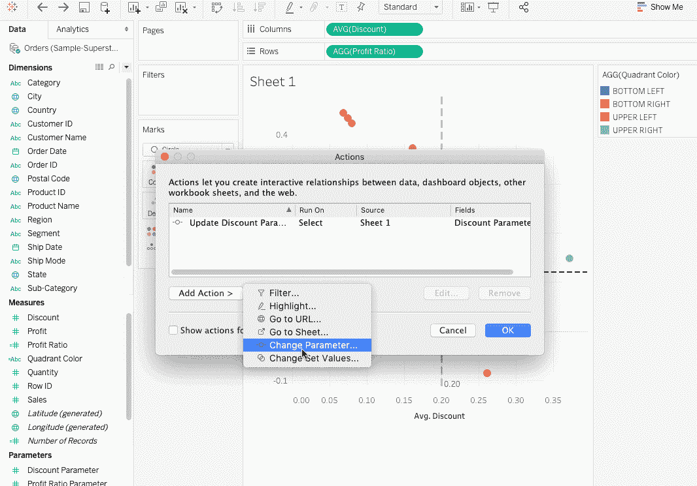

作者图片

现在，当我们单击一个数据点时，它就成为象限的中心。因此我们现在得到的是一个动态象限图。我们可以看到，改变利润率和折扣的值会改变产品在象限中的位置。

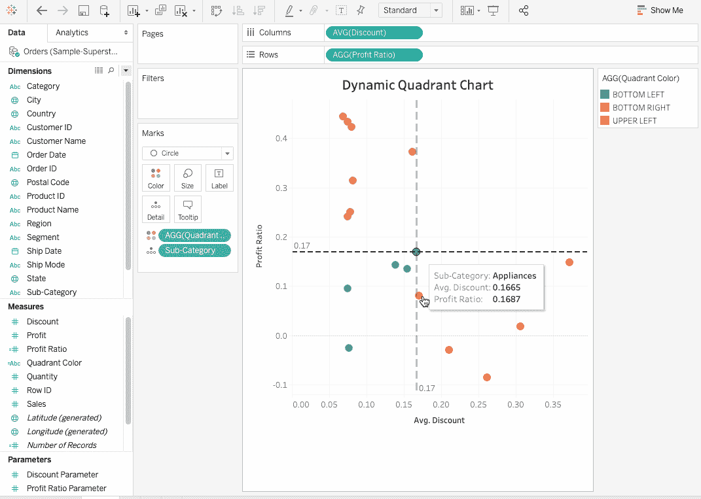

作者图片

# 结论

在本文中，我们学习了如何将散点图转换为交互式象限图。象限图给出了数据的总体视图。作为一项活动，您可以从现有数据集中选择两个字段，并在这些字段中执行象限分析来巩固这一概念。