# 二次判别分析

> 原文：<https://towardsdatascience.com/quadratic-discriminant-analysis-ae55d8a8148a?source=collection_archive---------5----------------------->

## 二次判别分析(QDA)理论和 Python 实现的深度介绍

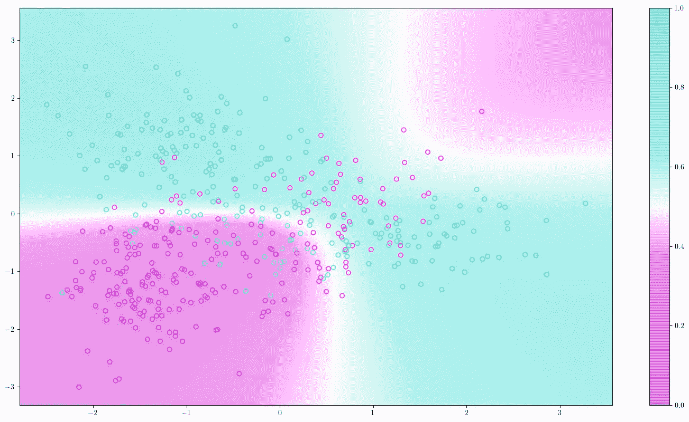

由 QDA 生成的决策边界的图示。图片作者。

# 内容

这篇文章是我将要发表的一系列文章的一部分。你可以通过点击[这里](https://cookieblues.github.io/guides/2021/04/01/bsmalea-notes-3b/)在我的个人博客上阅读这篇文章的更详细版本。下面你可以看到该系列的概述。

## 1.机器学习导论

*   [(一)什么是机器学习？](/what-is-machine-learning-91040db474f9)
*   [(b)机器学习中的模型选择](/model-selection-in-machine-learning-813fe2e63ec6)
*   [(c)维度的诅咒](/the-curse-of-dimensionality-5673118fe6d2)
*   [(d)什么是贝叶斯推理？](/what-is-bayesian-inference-4eda9f9e20a6)

## 2.回归

*   [(a)线性回归的实际工作原理](/how-linear-regression-actually-works-theory-and-implementation-8d8dcae3222c)
*   [(b)如何使用基函数和正则化改进您的线性回归](/how-to-improve-your-linear-regression-with-basis-functions-and-regularization-8a6fcebdc11c)

## 3.分类

*   [(a)分类器概述](/overview-of-classifiers-d0a0d3eecfd1)
*   **(b)二次判别分析(QDA)**
*   [(c)线性判别分析](/linear-discriminant-analysis-1894bbf04359)
*   [(d)(高斯)朴素贝叶斯](/gaussian-naive-bayes-4d2895d139a)

# 设置和目标

如[上一篇](/overview-of-classifiers-d0a0d3eecfd1)所述，生成分类器对输入和目标变量 *P* ( **x** ， *t* )的**联合概率分布**进行建模。这意味着，我们将最终得到一个可以生成(因此得名)具有各自目标的新输入变量的分布。

这个模型，我们将在这篇文章中看到，属于一个叫做**高斯判别分析(GDA)** 模型的类别。现在是术语开始变得棘手的时候了！注意，高斯*判别*分析模型是*生成*模型！尽管它的名字是歧视性的，但它不是歧视性的。

给定具有相应目标变量 *t* 的 *N* 输入变量 **x** 的训练数据集，GDA 模型假设**类条件密度**是正态分布的

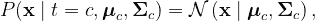

其中 ***μ*** 是**类特定均值向量**，而**σ**是**类特定协方差矩阵**。利用贝叶斯定理，我们现在可以计算后验概率

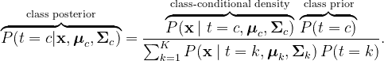

然后我们将把 x 分类到类中

# 衍生和培训

对于每个输入变量，我们定义了 *k 个*二进制指示变量。此外，让 **t** 表示我们所有的目标变量，并且 *π* 先验带有表示类的下标。假设数据点是独立绘制的，则似然函数由下式给出

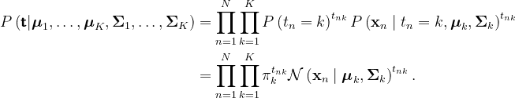

为了简化符号，让 ***θ*** 表示所有的类先验、类特定的均值向量和协方差矩阵。我们知道，**最大化似然相当于最大化对数似然**。对数可能性是

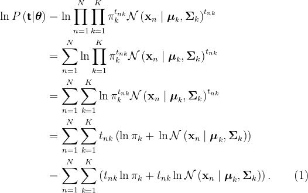

扩展(1)将在接下来的衍生中极大地帮助我们:

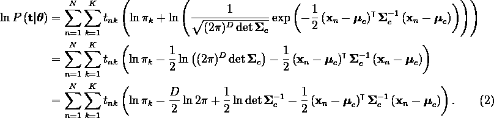

我们必须找到特定类别的先验、均值和协方差矩阵的最大似然解。从先验开始，我们必须对(2)求导，将其设为 0，并求解先验。然而，我们必须保持约束

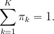

这是通过使用拉格朗日乘数 *λ* ，而不是最大化来实现的

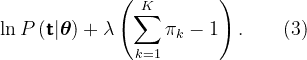

使用来自(2)的结果，我们然后对(3)关于类特定的先验求导，将其设置为等于 0，并且求解

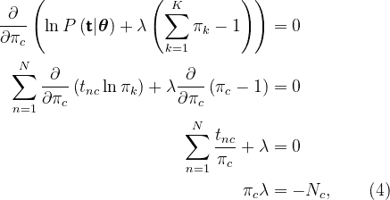

其中 *Nc* 是 c 类中数据点的数量。使用约束的知识，我们可以找到 *λ*

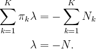

将*λ= N*代入(4)，我们得到

(5)告诉我们**类别先验仅仅是属于类别**的数据点的比例，这在直觉上也有意义。

现在我们转向最大化关于特定类别均值的对数似然。同样，使用(2)的结果使我们很容易求导，将其设为 0，并求解

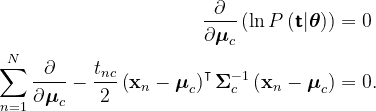

为了评估这个导数，我们使用一个[矩阵演算恒等式](https://en.wikipedia.org/wiki/Matrix_calculus#Scalar-by-vector_identities)。具体身份可以在我个人博客的[我更详细的帖子里找到。](https://cookieblues.github.io/guides/2021/04/01/bsmalea-notes-3b/)

然后我们得到

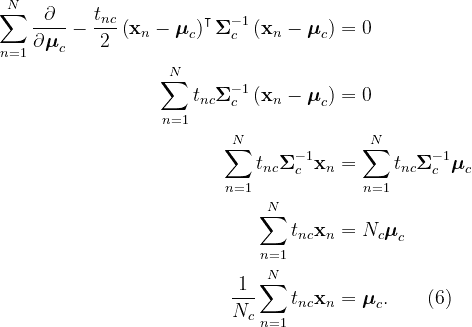

让我们花一点时间来理解(6)的意思。(6)左侧的总和仅包括属于类别 *c* 的输入变量 **x** 。然后，我们将向量的和除以类中数据点的数量，这与取向量的平均值相同。这意味着**特定类别的平均向量是属于类别**的输入变量的平均值。同样，这也有直观的意义。

最后，我们必须最大化关于特定类别协方差矩阵的对数似然。同样，我们使用(2)的结果求导，将其设为 0，然后求解

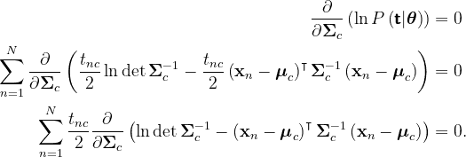

这个导数需要 3 个属性，我已经在我的个人博客上的[中列出了我这篇文章的更详细版本。然后我们得到](https://cookieblues.github.io/guides/2021/04/01/bsmalea-notes-3b/)

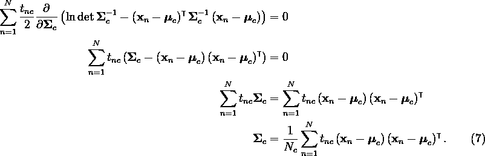

就像类特定的均值向量只是类的向量的均值一样，**类特定的协方差矩阵只是类**的向量的协方差，我们最终得到我们的最大似然解(5)、(6)、(7)。因此，我们可以使用以下内容进行分类

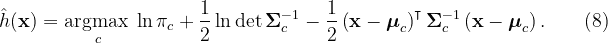

# Python 实现

让我们从一些数据开始——你可以在下面的图表中看到。你可以在这里下载数据[。](https://github.com/cookieblues/cookieblues.github.io/raw/master/extra/bsmalea-notes-3b/data.csv)

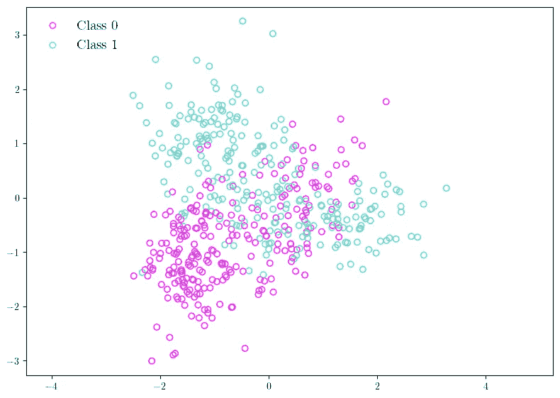

要分类的数据点被绘制成散点图。图片作者。

下面的代码是我们刚刚讨论过的 QDA 的简单实现。

我们现在可以用下面的代码进行预测。

这为我们提供了高斯分布以及预测，如下所示。

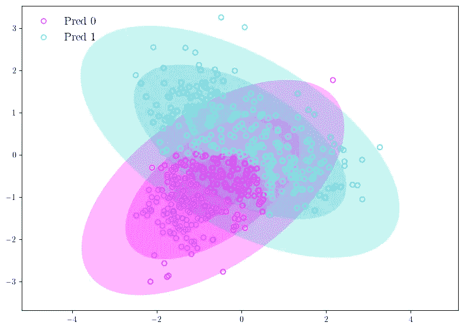

使用 QDA 发现的高斯分布图，以及数据点的预测类别。图片作者。

为了更容易地说明 QDA 是如何工作的，以及它工作得有多好，我们可以绘制决策边界上数据点的原始类别。这显示在下面。

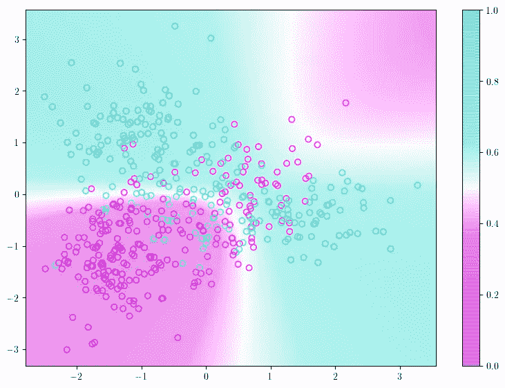

拟合 QDA 的判定边界以及数据点的原始类别。彩条显示属于类别 1 的概率。图片作者。

# 摘要

*   二次**判别**分析(QDA)是一个**生成型**模型。
*   QDA 假设每个类别都遵循高斯分布。
*   **特定于类别的先验**就是**属于类别**的数据点的比例。
*   **特定类别的平均向量**是属于类别的输入变量的**平均值。**
*   特定于类别的协方差矩阵就是属于类别的向量的**协方差。**