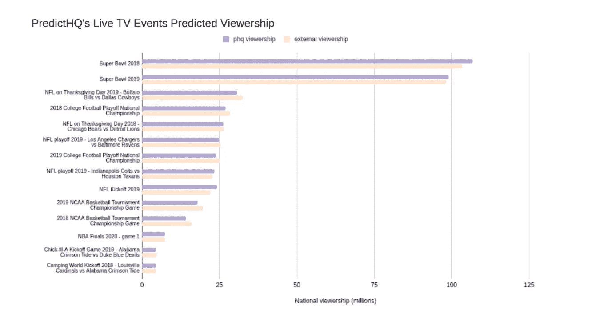
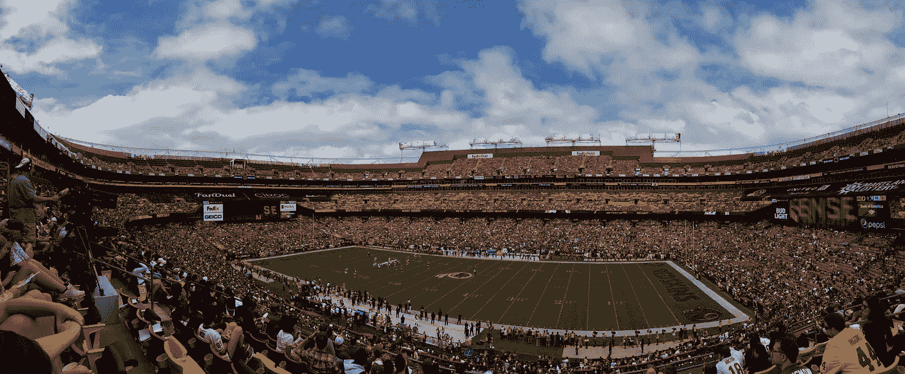

# 高质量的核心数据和非参数模型使得以前不可能的数据项目成为可能

> 原文：<https://towardsdatascience.com/quality-core-data-non-parametric-models-are-enabling-previously-impossible-data-projects-31aa3751b79f?source=collection_archive---------29----------------------->

## 我们建立了一个机器模型，预测超级碗将会有创纪录的低收视率。这是它必须首先学会的三件事。

对于任何雄心勃勃的数据科学家来说，“也许这是一个疯狂的想法”这句话是一个需要仔细聆听的线索。解决问题和创造力是优秀数据科学家最重要的特质之一，因此，随着数据科学每年取得的巨大进步，你总是会听到一些疯狂的想法。

去年，随着全世界努力遏制新冠肺炎，许多零售、食品和快递公司的最大需求驱动力之一变成了电视体育节目。对许多美国人来说，聚在一起看球赛成了他们一周的一大亮点。我的团队建立了聚合和预测需求驱动因素(如会议、音乐会和恶劣天气)影响的模型，因此我们决定建立一个能够预测电视体育节目收视率的模型。可用的收视率数据总是赛后收视率，并且在指定的营销区域级别，而不是按县。我们知道食品零售商、配送集团和食品杂货需要前瞻性的、更精细的数据，并决定建立一个模型来识别这些数据。

我们知道这会很困难。但我们也怀疑，我们以前建立的一系列模型可能会派上用场。我们开始建立模型，学到了很多东西，必须部署尖端技术，我们最终实现了对电视体育节目收视率的准确预测。我想与其他数据科学家分享我们是如何做到这一点的，但在我们深入研究如何构建模型之前，对于任何拥有预测模型的人来说，主要问题是:它有效吗？

# 超级碗 2021 成功:我们预测的 9600 万与美国消费者新闻与商业频道赛后 9690 万相符

距离 2021 年超级碗还有两周，我们的模型给出了一个令人惊讶的预测——20 年来最低的超级碗收视率。它预测观众人数为 9600 万，比 2020 年减少 600 万，是 1997 年以来的最低水平。来自美国消费者新闻与商业频道的赛后观众达到了 9690 万——所以我们的新模型做得很好！

数据科学家经常被要求解释他们的预测。深入研究这一结果，我们发现这主要是由三个因素造成的:

*   体育迷预测:由于 NFL 的受欢迎程度下降，体育观众人数低于去年。像大多数运动一样，它在 2020 年吸引了更少的观众。我们的模型考虑了几个因素，包括历史趋势和监测联赛受欢迎程度的变化。
*   超级碗比赛球队排名:由于两支进入决赛的球队的受欢迎程度，正如他们的常规赛排名所反映的那样，我们的模型预测收视率比去年略低。这是因为尽管堪萨斯城酋长队是今年最受欢迎的球队，但他们对阵的是排名第十的坦帕湾海盗队。去年，酋长队与旧金山 49 人队比赛，这是第三大最受欢迎的球队。受欢迎程度对收看的观众数量有很大影响。
*   游戏不确定性:这是我们模型中最有趣的特征之一——它计算了一个团队获胜的不确定性会对收视率产生多大的影响。一般来说，一场更不均衡的比赛会有更少的观众，因为每个人都认为他们已经知道结果了。鉴于今年酋长队对海盗队的不确定性较低，我们的模型预测粉丝收看今年比赛的概率较低，因此收视率也较低。

没有一个模型在第一次是完美的，虽然这个预测有 99.6%的准确性，但有很多死胡同，深夜和无尽的时间来努力思考。每一个机器学习模型都旨在提供比我们之前更多的上下文和智能，并在更多的时间内获得更智能、更准确的结果。我想分享我们一路走来学到的三大经验，这样任何致力于极具挑战性的新模式的团队都可以更快地获得更好的结果。

图片由 PredictHQ(作者)提供

# 1.当涉及到你的核心数据和假设时，要注重质量

在我们最初几周的实验后，我感到很失败。我们设计了一个基于外部历史收视率数据的监督机器学习架构，以预测未来游戏的收视率。我们调查了几个外部观众数据来源，这些数据虽然对一些用例非常有用，但并不适合我们的用例(预测)。它不起作用。我和我的团队尝试了十多种不同的方法来评估历史游戏的收视率，但我们运气不佳。

我已经让我们公司管理团队的其他人知道，周五的工作不尽如人意，并一直持续到周末。在网上冲浪时，我意识到有一种方法，我们可以在不依赖外部收视率数据的情况下进行预测，以建立有监督的机器学习模型。我们将估计每个县的体育迷数量，然后基于每场比赛的数百个因素建立一个概率模型，以确定粉丝群中有多大比例会收看某场比赛。

这是可能的，因为我们已经为 predict HQ 建立了一个广泛的实体系统，它跟踪全美的每一场体育比赛。为了准确地做到这一点，我们还使用超过五年的历史数据来跟踪团队、个人表演者、场地等等。例如，我们知道每个比赛场地的确切纬度和经度，因此很容易确定比赛场地距离其所在县的距离，我们确认这对于观众人数有重大影响。我们还知道哪些球队的球票售罄，比赛时间对门票销售的影响等等。

这为我们建立模型提供了可靠的基础。它支持深度分割，这对于高度复杂模型的准确性至关重要。但是，如果不采取一个飞跃，不使用新兴的数据科学方法，我们就无法创建我们的模型。

# 2.不要回避创新:我们的模型需要一个非参数模型来工作

长期以来，概率模型对数据科学家来说一直很有价值。我们想使用一个，因为可解释性对于数据科学家来说非常重要——特别是当他们的工作是为需求预测决策提供信息，可以产生数百万美元的额外收入和节省时。

但是，当你在处理一个全新的问题和大量的数据时，概率模型也会变得难以处理。我们需要创建一个可以从数据本身学习的模型，而不是我们的团队设置参数、测试和检查。

参数概率模型需要强有力的数据假设才能发挥作用。但实际上，真实的数据分布远比那些数据假设复杂，因此参数模型不足以正常工作。然后，您需要让模型自由地从数据中学习——纯粹地、直接地。这些传统的参数模型需要强大的学习曲线，在我数十年的数据科学生涯中，我确信这只能来自高级的非参数元素。将新方法整合到模型中可能令人望而生畏，但数据科学作为一种职业发展如此之快。几年前甚至几个月前都不可能实现的壮举现在都有可能实现。我们的非参数模型通过不对映射函数做出假设，从我们的深度变换的原始特征中捕获和学习非线性关系。

例如，我们需要准确地模拟球迷在赛季不同阶段的运动兴趣差异(这只是数百个具体因素中的一个)。我们的体育 SME 和研究表明，一般来说，我们认为人们的兴趣会随着赛季的进行而增长，在季前赛开始时会有所下降，到季后赛时会有所增加。但我们也意识到这种趋势是非线性的，因为其中存在一些局部极大值，如常规赛的开球比赛等。我们需要一种非参数方法来确定趋势和起作用的因素，例如团队表现和不确定性。不使用非参数方法会阻碍我们、模型和我们所有的客户。对于参数方法，我们需要做出假设，进行线性回归和假设，但我们必须重复数千次(数年的工作)才能得出结论，而对于非参数方法，我们的非参数模型在最初几周内就确定了结论。

# 3.以客户为中心:与精心挑选的用户一起测试你的模型

一旦我们有了一个模型，我们确信它运行良好，并正在达到激光般的精度，我们就联系了一些最积极参与的食品和送货客户，与我们的团队一起测试它。

这是至关重要的。作为一名数据科学家，很容易专注于科学以及实验和发现的乐趣。但是如果你不能让你的工作为你的公司和客户带来价值，你就不会长久地创造令人兴奋的工作。

我们使用双轨基准系统来评估我们的模型:

1.  在全国范围内，根据转播后的估计模型，我们对已经发生的比赛的预测观众人数与历史观众人数相差不大。从上面的图表中可以看出，我们的预测与外部赛后来源类似，如 NBC 的赛后收视率数据。
2.  我们还跟踪我们的收视率数据是否与对我们关键客户需求的预期影响相关。

跟踪这两个元素对于创建预测级别的数据至关重要。与客户交易数据不相关的准确预测表明，我们没有为更智能的需求预测识别相关信息。

# 大胆用数据解决问题

这只是三课，我们还学到了更多。但我想尽快分享这三个，因为我知道有这么多数据科学家正在展望 2021 年及以后，并面临重大挑战。随着我们进入一个期待已久的高度分散的复苏，企业需要数据驱动。数据科学家站出来宣传数据科学对于需求规划、公司效率和创新的真正力量从未像现在这样重要。

图片由[其他的高温层](https://unsplash.com/@anders_kj1?utm_source=unsplash&utm_medium=referral&utm_content=creditCopyText)上[不飞溅](https://unsplash.com/s/photos/nfl?utm_source=unsplash&utm_medium=referral&utm_content=creditCopyText)