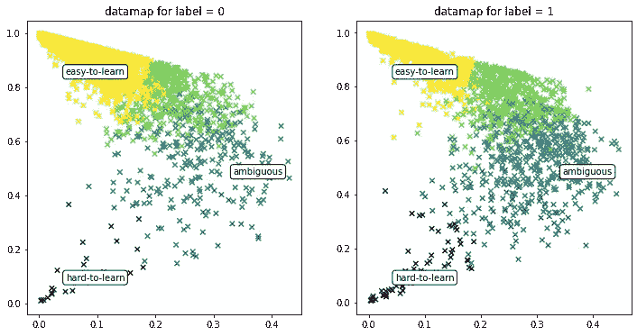
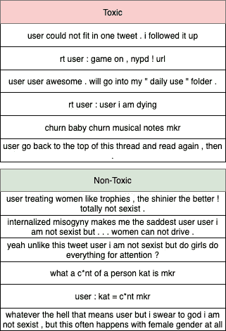

# 质量>数量:使用训练动力学清理噪声数据集

> 原文：<https://towardsdatascience.com/quality-quantity-cleaning-noisy-datasets-using-training-dynamics-97769b4aaa3f?source=collection_archive---------26----------------------->

## 看看最近的一篇论文，它利用一种新的信息源来清理分类数据集:**训练动态**。

由[纳吉布·卡利尔](https://unsplash.com/@nkalil?utm_source=unsplash&utm_medium=referral&utm_content=creditCopyText)在 [Unsplash](https://unsplash.com/s/photos/filter?utm_source=unsplash&utm_medium=referral&utm_content=creditCopyText) 上拍摄的照片

有了深度学习的掌舵，我们已经看到了 NLP 领域中使用的数据量的巨大增长。然而，控制这些数据集的质量成为一项具有挑战性的任务。例如，数据集设计者蜂拥至众包平台，以获得注释任务的帮助。然而，这种不受控制的环境也会降低注释的质量。

在[数据集制图](https://arxiv.org/abs/2009.10795)论文中，作者提出了一种诊断分类数据集的方法，承诺将数据集的大小减少多达 70%，同时保持分布内(ID，在同一数据集的测试分割上)和分布外(OOD)性能！

# 资料图

这个想法很简单，非常直观。让我们直接进入(简单的 4 步)算法。

**要求:**

1.  数据集应该已经针对二元或多类分类任务进行了标注。
2.  在该数据集上训练一些时期的神经网络(作者使用至少 5 个时期来帮助收集所需的统计数据)

**步骤:**

1.  训练:开始训练神经网络(使用 BCE 损失进行二元分类，使用 CCE 损失进行多类分类)。
2.  统计数据收集:跨所有时期，为每个数据样本计算真实标签的*概率(注意:不是预测标签)*
3.  最终统计计算:一旦训练结束，对每个数据样本计算**:**

a.**置信度**:所有时期真实标签的*概率的平均值*

b.**可变性**:所有时期真实标签的*概率的标准偏差*

c.**正确性**:占 *'* 预测标签==真实标签的总时期的比例

4.最后，在**数据图**上绘制所有数据样本:一个 x-y 图，其中(x 轴为**可变性**)**(y 轴为**置信度**)，也可选择(色调为**正确性**)。**

**我以推特上的有毒言论数据集为例。在 [roberta-base](https://huggingface.co/roberta-base) 模型上训练 5 个时期产生:**

****

**不同标签的不同图(0 =无毒，1 =有毒)。色调彩条:(黄色/浅色=高正确率，紫色/深色=低正确率)(注:图片由作者提供)**

**作为健全性检查，该图类似于作者在他们研究的数据集上看到的图。**

## **应用 1:发现错误标记的数据**

**现在最酷的部分来了。让我们看看如何使用这些数据图在数据中找到错误标记的样本。**

**在上面生成的数据图中，位于“难以学习”区域的样本是被分配了属于其标签的低概率的样本(**低置信度**)，并且模型也从未对此不确定(**低可变性**)！模型字面意思是告诉我们这些样品贴错标签了！**

**在手动检查示例数据集时，这些样本看起来确实被错误地标记了:**

****

**标签位于“难学”区域的样本。“有毒”的看似无毒，标着“无毒”的本质上明显是性别歧视(/有毒)。(注:图片由作者提供)**

## **应用 2:减少数据集大小**

**作者已经表明，仅在来自“模糊”区域的总训练数据的 33%上的训练模型产生了相等(甚至更好)的 ID 和 OOD 总体性能。考虑到数据量的巨大减少，这一发现意义重大。**

## **应用 3:发现意外偏差**

**对于“易于学习”区域中的样本，模型具有**高置信度**和**低可变性**。由于移除这些样本(仅保留“不明确的”样本)不会影响模型的性能，因此可以肯定的是，这些样本包含某些不需要的属性，这些属性会降低模型的可推广性，例如，非预期的偏差。**

## **密码**

**查看我的 GitHub 项目,该项目将该算法实现为 PyTorch Lightning⚡️回调。它超级容易使用，更多关于该项目的信息自述！**

**您也可以查看这个项目以找到 TensorFlow 回调实现。**

# **结论**

**通过使用统计方法的样本过滤或注释校正，数据集去噪是一个流行的概念。然而,[数据集制图](https://arxiv.org/abs/2009.10795)论文从利用训练动态的有趣角度来处理这个问题。它有一点开销:在完整的数据集上训练一个模型*一次*，但我认为与它提供的简洁应用程序相比，这并不算过分。此外，引入一种新的媒介(训练动力学)为同一方向的进一步研究打开了大门。**

# **参考**

**论文讨论:数据集制图:利用训练动力学绘制和诊断数据集，Swayamdipta 等人，2020 年**

**使用的示例数据集:可恶的符号还是可恶的人？Twitter 上仇恨言论检测的预测特征，Waseem 等人，2016 年**