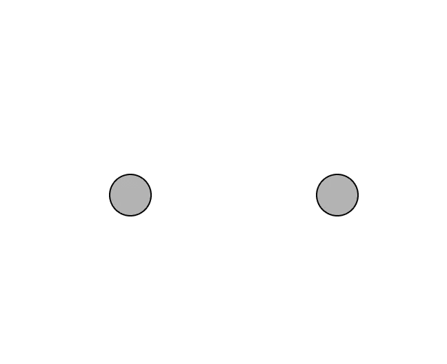
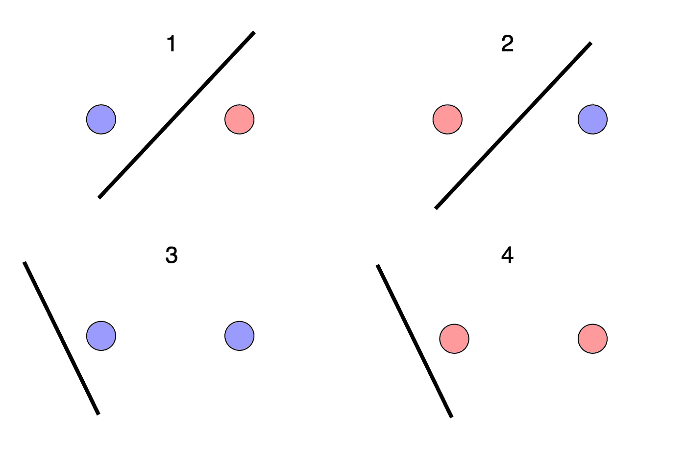
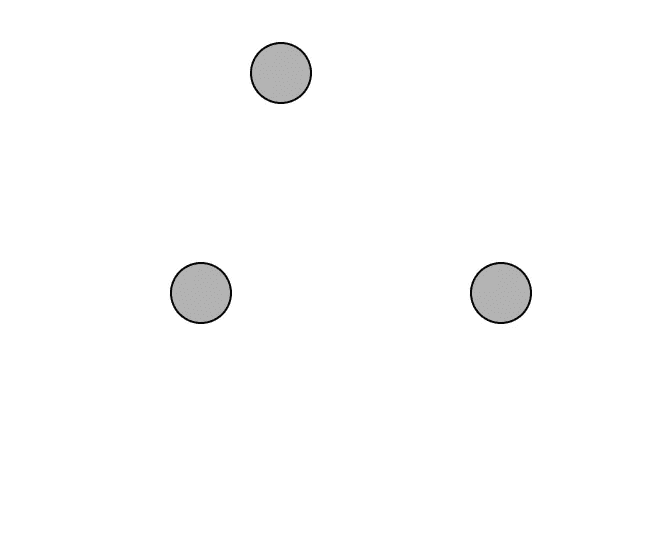
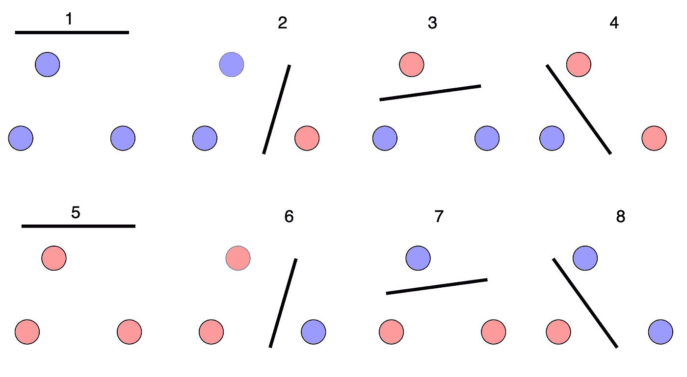
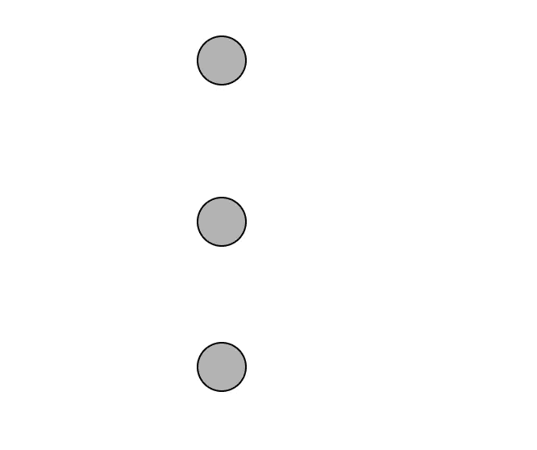
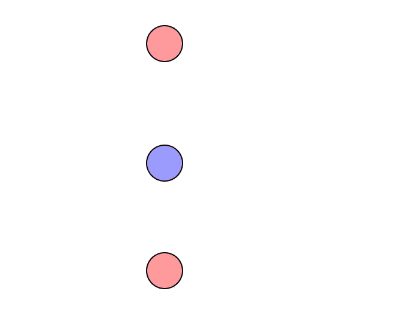
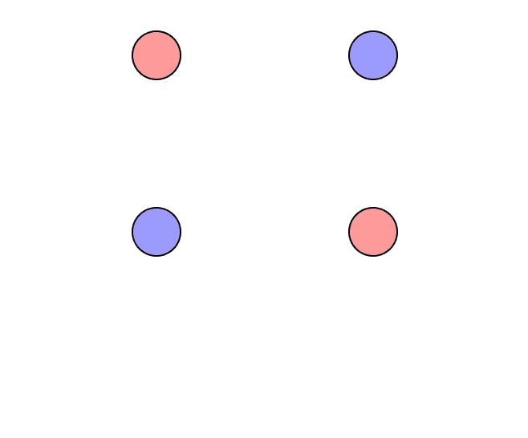
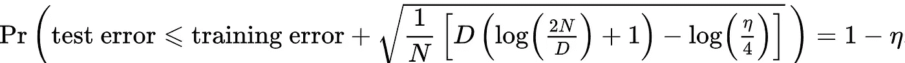

# 量化模型容量:VC 维度

> 原文：<https://towardsdatascience.com/quantifying-model-capacity-the-vc-dimension-d4eb76dd26f7?source=collection_archive---------24----------------------->

## VC 维是一种用数学方法来表示模型容量的方法。它也有实际的机器学习用途。请继续阅读，了解更多信息。

Ashkan Forouzani 在 [Unsplash](https://unsplash.com?utm_source=medium&utm_medium=referral) 上的照片

机器学习中的常识是，一些模型比其他模型具有更大的容量。例如，神经网络能够学习比线性模型多得多的各种功能。直觉上，这是有道理的。然而，拥有更高的容量在数学上意味着什么？模型容量如何影响测试集误差？幸运的是，有一个叫做“VC 维度”的重要量回答了这些问题。

我觉得理解 VC 维度最好的方法就是用例子，那就从一个开始吧。我们在 2D 的飞机上有两个点。我们有两种颜色，蓝色和红色。我们要问的问题是:我们的两个点是否有一种配置，使得无论我们赋予它们什么颜色，我们总能用一条线将蓝色和红色的点分开？让我们试一试。我们打算把这两点看成是这样:

图片作者。

现在，对于上述点的 2 = 4 种可能的颜色分配中的每一种，我们的目标是画一条线，使得所有的蓝色点在一边，所有的红色点在另一边。这很简单，我们可以展示所有 4 种颜色分配是如何完成的:

图片作者。

所以我们问题的答案是肯定的——存在两点的排列，因此有一种方法可以为所有可能的颜色分配分离颜色。在统计理论中，我们称之为**粉碎**。所以我们可以说**两点可以用一条线**击碎。

现在我们问同样的问题，只是带着三点。三分可以用一条线击碎吗？让我们用这三个点的排列来试试:

图片作者。

这种排列有 2 = 8 种可能的颜色。我们研究了所有 8 种安排，我们发现确实有三点可以打破:

图片作者。

在这一点上，我们应该澄清一些事情。看看这三个点的排列:

图片作者。

这种排列有一种颜色，因此无法用一条线将颜色分开:

图片作者。

那么为什么我们说 3 分可以粉碎呢？这不是反例吗？重点是**只要有一个**排列的 3 点可以粉碎，我们就说 3 点可以粉碎。不是所有的 3 点排列都要求是可破坏的。

最后，我们来考虑 4 点。在尝试了 4 个点的不同排列后，你会注意到，无论如何排列，这 4 个点总会有一种颜色，不能用一条线来区分。其中一种颜色是这样的:

图片作者。

换句话说，无论你怎么努力，都没有 4 点的排列是不可打破的。所以 4 分不能粉碎。

现在，我们已经介绍了粉碎的概念，我们可以谈谈风险资本的层面。简单来说，一组函数的 **VC 维就是可以粉碎的最高点数**。在我们上面的例子中，因为一条线可以粉碎 3 个点，但不能粉碎 4 个点或更高，所以线的 VC 维是 3。作为另一个例子，考虑所有常数分类器的集合。任何常量分类器甚至不能粉碎 1 个点，因为我们可以将该点的颜色设置为与分类器定义的常量颜色不同。因此，这个集合的 VC 维是 0。另一个例子是所有圆的集合。我们可以对这个集合进行非常类似的分析，就像我们对所有线的集合所做的那样，以显示圆的 VC 维度是 3(这是一个很好的练习，试试吧！).

对于更复杂的分类器，我们不能仅仅通过画一些图，试图分离彩色点来计算 VC 维数。然而，根据经验，VC 维度与模型的参数数量相关。例如，神经网络的 VC 维数与网络中的节点数和边数相关。更准确地说，已经表明，对于使用 sigmoid 激活函数的神经网络，VC 维数最多为 O(E * V)，其中 E 和 V 是网络中边和节点的数量。

现在我们已经看到了一些 VC 维的具体例子，我们能在高层次上解释一下什么是 VC 维吗？简单来说，VC 维度衡量的是一个模型的容量。“容量”是指可以学习的不同分类的数量，它与可以分解的点的数量以及模型的有用性直接相关。想一想行量词和常量量词的区别。常数分类器甚至不能粉碎 1 个点(VCdim = 0)，它们只能预测所有数据点的是/否。不是很有用，而且容量低。相比之下，线可以粉碎 3 点(VCdim = 3)，使他们能够学习非平凡的模式。这更有用，容量也更高。然后我们有神经网络，其具有比线和常数分类器高得多的 VC 维数，因此具有高容量和有用性。这就是神经网络能学会下棋和开车，而线性模型和常数分类器不能的原因。

我们已经看到了如何计算 VC 维以及直观地计算它与模型容量的关系，但是它可以直接使用吗？事实证明，VC 维将训练误差与测试误差联系起来。最著名的结果是这个不等式:

我们称之为“VC 绑定”。图片作者。

n 是训练集的大小，D 是 VC 维数，1 — η是任意概率。这个不等式表明，在高概率下(将 1-η设置为接近 1)，测试误差与训练误差相差一个常数，该常数取决于 VC 维数和样本大小。这是一个极其有力的声明。机器学习的一个基本问题是，你不知道你在训练集的良好表现是否会转化为测试集。这个不等式提供了解决这个问题的方法。如果你知道你的模型的 VC 维，你可以使用上面的不等式来保证你的测试误差不会超过一定的水平。

当然，一旦你代入 D、N 和η的值，你得到的界限可能太大而没有用。如果你的训练误差是 10%的错误分类，而界限说你的测试误差会比 50%的错误分类好，那并不能告诉你太多。这就是为什么我们在实践中很少听到 VC 维界限，因为通常测试误差超过 VC 界限。尽管如此，在你的脑海中保留这些类型的界限仍然是好的——因为它们仍然可能是有用的，并且因为在未来可能会找到更好的界限。

VC dimension 的另一个用途是它从数学上证明了模型容量和性能之间的权衡。我们已经讨论过低模型容量如何阻止我们学习有趣的东西。然而，高模型容量(VC 界中的高 D)也不都是好的。它导致平方根下的项增加，从而导致测试误差中更多的方差。这演示了**过度拟合**是如何发生的——模型的容量不必要的高。在我们还想用神经网络这样的高容量模型的情况下，该怎么做？VC 界也回答了这个问题:增加样本量 n

在本文中，我们讨论了粉碎和 VC 维的概念。我们看了几个简单的例子，通过一些分析可以找到 VC 维。然后，我们探讨了 VC 维度背后的直觉以及如何使用它，特别关注 VC 界限的后果。请留下任何问题/评论，感谢阅读！