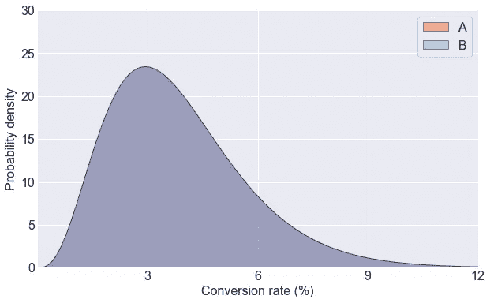
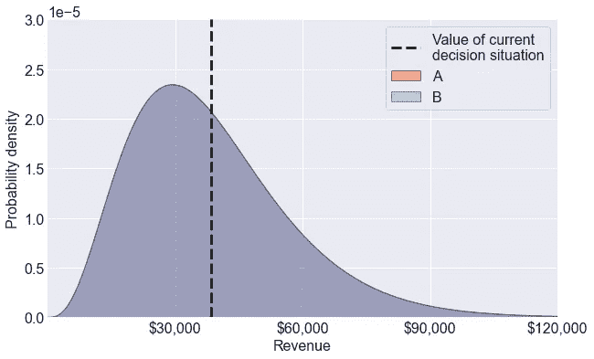
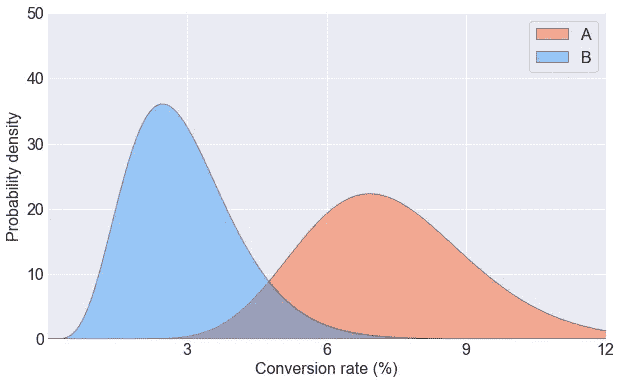
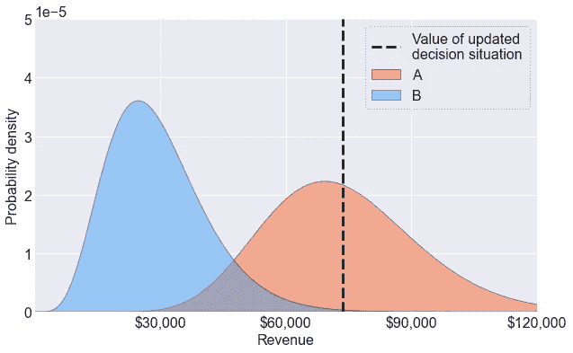
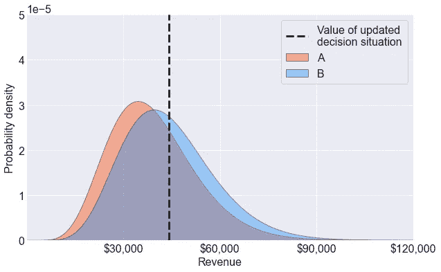
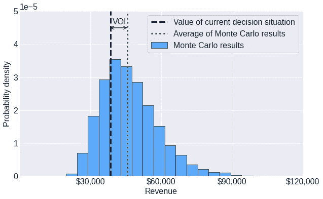
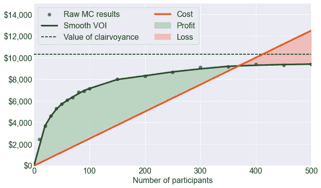
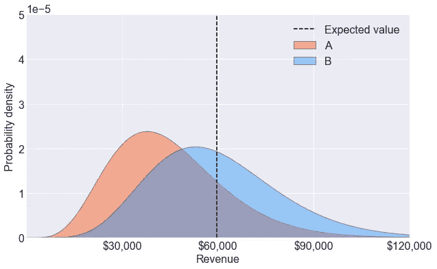
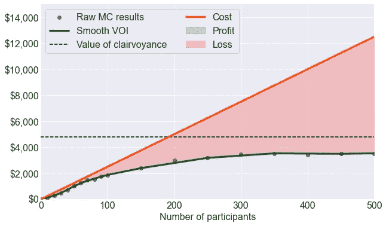

# 量化 A/B 测试的价值

> 原文：<https://towardsdatascience.com/quantifying-the-value-of-an-a-b-test-821aecfd2ef?source=collection_archive---------26----------------------->

## 在做决定之前，你应该付多少钱来获得更多的信息？


奈杰尔·塔迪亚恩多在 [Unsplash](https://unsplash.com?utm_source=medium&utm_medium=referral) 上拍摄的照片

# 介绍

数据科学的主要产品是信息。但是，这个产品是有成本的；收集、存储和分析数据需要时间和资源。那么，值得吗？

信息的[价值(VOI)](https://en.wikipedia.org/wiki/Value_of_information) 的概念可以说为这个问题提供了最好的答案。根据维基百科，VOI 是决策者在做出决定之前愿意为信息支付的金额。

人类的经验是由众多的决定形成的。决策的范围从相对琐碎的——比如某一天在哪里吃午饭——到非常重要的——比如如何应对气候变化的威胁。

决策的一个主要障碍是不确定性。当我们选择一个特定的*选项*(一系列行动)时，我们通常不知道会发生什么。相反，我们继承了一个结果*的*彩票*。有些结果比其他结果更好，因此有些彩票比其他彩票更有价值。当信息提供了一种可操作的手段来改善我们所面临的决策结果时，它就提供了价值。*

想了解更多关于 VOI 的信息，我强烈推荐埃里克·比克尔教授的演讲。计算 VOI 通常包括计算:

1.  **当前决定情况的值** *。*如果您不得不在没有额外信息的情况下做出决定，最佳行动方案是什么？结果抽签的价值是什么？
2.  **免费信息彩票的价值。**如果你可以免费收集这些信息，那么结果彩票的价值会是多少？

> 在大多数情况下，VOI 是具有自由信息的彩票的**值**和当前决策情况的**值**之间的差值。

# A/B 测试的背景

A/B 检验本质上是[双样本假设检验](https://en.wikipedia.org/wiki/Two-sample_hypothesis_testing)的别称。决策者(一家公司)必须选择推出一种产品的两种变体中的一种。这个产品可以是一个网站登录页面或广告。A 和 B 这两个变量都有一个未知参数θ，它描述了每个变量的功效。例如，θ可以是广告的转换率或点击率。为了了解哪个选项的θ更理想，决策者进行了一次控制实验。向一些用户显示变体 A，向一些用户显示变体 b。然后，实验的结果告知是否启动变体 A 或 b 的决定。

A/B 测试有频率主义和贝叶斯风格。布莱克·阿诺德的[博客文章](/exploring-bayesian-a-b-testing-with-simulations-7500b4fc55bc)很好地概括了这些方法之间的差异。我在这篇文章中提出的方法本质上是贝叶斯 A/B 测试的扩展，它使用 VOI 而不是显式损失函数。

# 方法学

让我们想象一下，我们正面临一个可能从 A/B 测试中受益的决定。例如，我们有两个不同版本的网站登录页面——A 和 B，我们希望选择转化率更高的选项。

## 详细说明前科

首先，我们需要考虑我们之前对 A 和 b 的转化率的信念。

例如，我们知道转换率必须在 0 到 100%之间，这表明 [beta 分布](https://en.wikipedia.org/wiki/Beta_distribution)适合表达我们对两个登录页面转换率的先验信念。此外，我们知道转换率通常是个位数，因此我们可以将此信息纳入我们之前的分布规范中。



两个重叠的 Beta 分布，描述了我们对变量 A 和 b 的转换率的先验信念。

## 把它和$$$联系起来

一个必要的步骤是定义*一个特定的转换率对我们的业务价值有多少*。这种规格可能取决于各种因素，如产品成本和网站流量。最终，我们必须回答这个问题，“我们的企业愿意支付多少来提高 1%的转化率？”为简单起见，我们假设转换率和价值之间存在线性关系。

假设转换率每增加 1 %,对我们的业务来说就值 10，000 美元。从那里，我们可以将先前的分布表示为货币彩票，如下所示。



在指定了转换率和价值之间的关系之后，我们基于 Beta 先验获得了两个重叠的货币彩票。

货币彩票值多少钱？这个问题的答案归结为决策者的[风险态度](https://en.wikipedia.org/wiki/Risk_aversion)。在这篇博文中，我们假设风险中性，这意味着货币彩票的价值等于彩票的预期价值或均值。当一个给定决策的风险金额相对于决策者的总财富较小时，风险中性是一个很好的工作假设。我想在使用 A/B 测试的决策中通常是这种情况。

另一个有用的概念是*当前* *决策情况*的值，这是在没有额外信息的情况下，如果我们必须选择 A 或 B，我们会选择的彩票值。在这种情况下，我们选择哪个选项并不重要；两种货币彩票的期望值约为 38，500 美元，这也是当前决策情况下的值。

换句话说，对我们的企业来说，部署其中一个变体而不进行任何测试的价值是 38，500 美元。

## 模拟 A/B 测试

既然我们已经指定了我们的先验信念，我们可以在收集任何数据之前模拟 A/B 测试的结果。为了模拟样本大小为 *n* 的 A/B 测试的结果(对于每个变量)，我们

1.  从先前的分布中提取转换率。
2.  给定绘制的转换率，使用二项式分布从模拟 A/B 测试中为每个变量绘制转换率。

使用这种方法，我们获得了以下结果:

```
Variant A: 11 conversions out of 100
Variant B: 2 conversions out of 100
```

## 用结果更新我们的信念

基于这些测试结果，变体 A 看起来比变体 B 好得多。最初，我们不知道是 A 还是 B 更好，但这个结果无疑更新了我们的信念。

利用贝叶斯法则，我们可以推导出 A 和 B 的转换率的*后验分布*，即贝塔分布。关于贝叶斯更新过程如何工作的更多信息，我强烈推荐 Shaw Lu 的[优秀博文](/visualizing-beta-distribution-7391c18031f1)。使用带有 Beta 先验的二项式似然的分析结果，我们得到如下所示的后验 Beta 分布:



如果我们获得了前面提到的测试结果，我们将更新我们对变量 A 和 b 的转换率的信念。

相应的后验货币彩票是这样的:



在观察测试结果和更新我们先前的信念后，更新的货币彩票。

在收集了这些假设的测试结果后，我们将选择选项 A，其更新的彩票的期望值约为 73，500 美元。

简而言之，这代表了 A/B 测试的可能结果之一——一个价值 73500 美元的决策情境。

## 模拟另一个测试

这次我们随机抽取这些结果:

```
Variant A: 4 conversions out of 100
Variant B: 5 conversions out of 100
```

然后，在更新我们的信念之后，我们将面临一个价值 44，100 美元的决策情况:



运行 A/B 测试可能会产生另一组可能的货币彩票。

请注意，这种“更新”的决策情况不如我们最初的决策情况有价值。这一发现并不令人惊讶，因为 A/B 测试可以告诉我们 A 和 B 的表现都很差。

## 模拟 10，000 次测试

所以我们随机抽取了两个可能的 A/B 测试结果——一个会给我们一个价值 73，500 美元的决策情境，另一个会给我们一个价值 44，100 美元的决策情境。接下来，让我们看看当我们以蒙特卡洛方式模拟 10，000 次 A/B 测试时会发生什么。下面显示了 10，000 个随机生成的 A/B 测试的决策情况值的直方图。



从 A/B 测试的 10，000 次模拟中得出的决策情况值(浅蓝色)的直方图。在每个模拟测试中，我们获得测试结果，更新我们的信念，并继承 A 和 b 之间更好的彩票。绿色虚线表示这次彩票的价值(期望值)。黑色虚线是我们当前决策情况的值。VOI 是经过测试的彩票价值和当前决策情况下的价值之间的差值。

上面的图表明 A/B 测试给了我们一个决策情况的抽签。

这张彩票的价值(平均值)大于我们当前决策情况的价值。为什么？因为我们可以收集数据并*然后*选择看起来更好的选项，而不是现在就选择 A 或 B(当前的决策情况)。

> 如果我们是风险中性的**，测试的价值就是有测试的彩票价值和没有测试的彩票价值之差。**

有可能在执行 A/B 测试后，我们将面临一个价值低于我们当前决策情况的决策情况。这并不意味着测试有负价值。**事实上，VOI 不能消极。**

## VOI 作为样本量的函数

之前，我们计算了一个 A/B 测试的值，每个变量有 100 个参与者。但是测试的价值是如何依赖于参与人数的呢？为了回答这个问题，我用不同的样本量进行了多次蒙特卡罗模拟，每个变量的样本量从 0 人到 500 人不等。我还对蒙特卡洛结果应用了一个 LOWESS 平滑器，以使趋势更加清晰。

据推测，参与者越多的测试越昂贵。因此，我假设每个参与者的成本为 25 美元，以在测试产生的价值和执行测试所需的成本之间建立权衡。测试的成本因各种因素而异，如数据收集服务的成本和推迟产品发布的成本。

结果如下所示。



使用蒙特卡罗技术计算的具有不同数量参与者的 voi 图。黑点是原始结果。绿线是拟合原始结果的平滑线。红线是假设的测试成本，随着参与者的增加而增加。当 VOI 大于测试成本时，测试是有利可图的(绿色区域)。当测试的成本超过它所提供的信息时，就会产生亏损(红色区域)。随着参与者数量的增加，随机误差趋近于零，使得 VOI 接近千里眼的数值。

正如所料，增加参与者的数量会增加测试的价值。这种趋势的存在是因为许多参与者的测试强烈地将我们的先验拉向真实的转换率值。因此，当我们对更多的参与者进行测试时，我们更有信心选择更好的变体。

请注意，测试的值似乎“变平”并收敛到一个特定的值。这个值被称为千里眼的*值，*本质上是完美测试的值。想象一下，去拜访一个透视者，他会看着水晶球，非常自信地告诉你变体 A 和 B 的转化率。在你拜访之前，你不知道透视者会告诉你什么，但是你知道在你拜访之后你一定会选择更好的变体。虽然计算千里眼的值超出了这篇博客的范围，但是我在我的存储库中的一个测试案例中使用了它。

透视的价值是数据科学中的一个重要概念，因为它建立了信息价值的上限。任何花费超过千里眼价值的分析或测试都不值得做。

最后，该图显示了使测试净值最大化的参与者数量，即 VOI 减去成本。

## 我们应该早点停止测试吗？

假设我们看了前面的图表，决定 100 个参与者的 A/B 测试使测试的价值最大化。在仅向 30 名参与者展示每个变体后，我们看到了以下结果:

```
Variant A: 2 conversions out of 30 
Variant B: 4 conversions out of 30
```

变体 B 看起来很有希望。因此，我们想知道我们是应该继续测试还是尽早停止测试并部署 B。在频繁的 A/B 测试中，尽早停止测试被认为是一种不好的做法。这是因为 frequentist 测试是以实现统计显著性为导向的，早于计划停止测试会增加假阳性率。

这里我们不关心假阳性；我们关心价值。因此，我们没有理由不能用目前收集的结果来更新我们的信念，给出如下所示的分布。



货币彩票在更新我们的信念后，每个变体有 30 个参与者。我们想知道继续测试是否有价值，或者我们是否应该只部署变体 b。

更新我们的信念后，我们可以像以前一样绘制 VOI 与参与者数量的关系图:



使用蒙特卡罗技术计算的 voi 图，从更知情的先验开始改变参与者的数量。在这种情况下，无论我们获得多少参与者，测试都是无利可图的。

在这里，我们可以看到，对于任何数量的参与者来说，成本都大于测试的价值。**因此，继续测试没有净值。**此时，最佳行动方案是部署 B，即使 A 和 B 之间的差异可能没有统计学意义。注意，这个结论取决于测试的成本。如果测试更便宜，继续测试以获取信息价值是值得的。

# 结论

这篇博文概述了量化 A/B 测试的经济价值的蒙特卡罗方法。一般方法如下:

1.  使用统计分布指定关于变量品质因数的先验信念。
2.  量化当前决策情况的值，这是我们在没有获得额外信息的情况下选择一个变体时所继承的彩票的期望值。
3.  使用先验分布，随机生成潜在 A/B 测试的结果。计算每个模拟测试得出的决策情况的值。
4.  取蒙特卡洛抽奖的决策情况值的平均值。将该平均值与当前决策情况的值进行比较(步骤 2 ),以获得测试值。

我希望这篇文章能提供信息，并展示如何通过价值创造的视角来看待统计测试。与其他只关注统计能力或显著性的方法相比，这种方法更符合 A/B 测试的实际目标。我认为 A/B 测试的目标不是*确定更好的选择，而是产生价值。虽然这些目标通常是同义的，但在有些情况下，人们很容易投入过多的资源来检测两个变量之间的微小差异。质疑我们的假设并优化最重要的东西总是好的。*