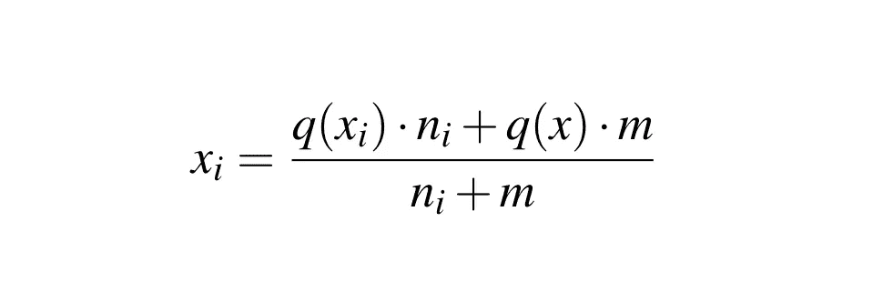
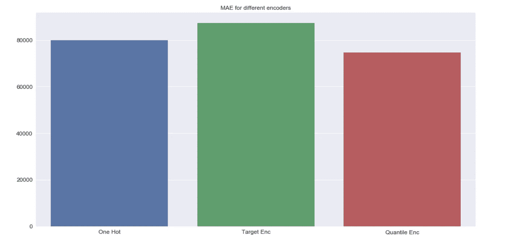
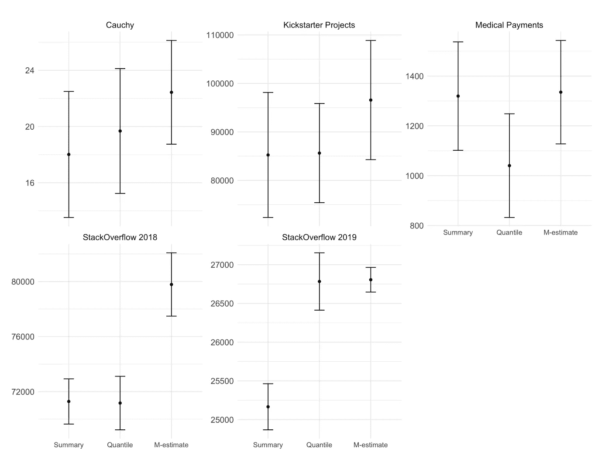

# 分位数编码器

> 原文：<https://towardsdatascience.com/quantile-encoder-eb33c272411d?source=collection_archive---------19----------------------->

## 在回归任务中处理高基数分类特征


帕特里克·拉兹洛在 [Unsplash](https://unsplash.com/?utm_source=medium&utm_medium=referral) 上的照片

在这篇博客中，我们介绍了分位数编码器和汇总编码器。这是与[大卫·马斯普](https://www.linkedin.com/in/david-masip-bonet-935a284b/)、[约尔迪·宁](https://www.linkedin.com/in/dataminion/)、[奥里奥尔·普约尔](https://www.linkedin.com/in/oriolpujolvila/) & [卡洛斯·穆根](https://www.linkedin.com/in/carlosmougan/)合作完成的一篇已发表论文的简短综合。该项目包括:

*   [一篇会议论文](https://link.springer.com/chapter/10.1007%2F978-3-030-85529-1_14#citeas)
*   在 [category_encoders](https://contrib.scikit-learn.org/category_encoders/) 库中的 python 实现
*   一个开放数据实验库

## TL；速度三角形定位法(dead reckoning)

我们修改了传统的均值目标编码(使用 M 估计正则化)以包含分位数而不是均值。这有助于推动机器学习模型。尤其是在使用广义线性模型和测量平均绝对误差(MAE)时。此外，这允许我们创建一组包含每个类别不同分位数的特征，从而进一步改进模型预测。关于会议[论文集](https://link.springer.com/chapter/10.1007%2F978-3-030-85529-1_14#citeas)和[类别编码器库](https://contrib.scikit-learn.org/category_encoders/)中的实现的更多信息。

## 引用

要引用这篇论文，请使用:

```
[@InProceedings](http://twitter.com/InProceedings){quantile2021,
author="Mougan, Carlos and Masip, David and Nin, Jordi and Pujol, Oriol",
editor="Torra, Vicen{\c{c}}
and Narukawa, Yasuo",
title="Quantile Encoder: Tackling High Cardinality Categorical Features in Regression Problems",
booktitle="Modeling Decisions for Artificial Intelligence",
year="2021",
publisher="Springer International Publishing",
address="Cham",
pages="168--180",
isbn="978-3-030-85529-1"
}
```

## 介绍

回归问题已经在机器学习文献中被广泛研究，导致了大量的回归模型和性能测量。然而，很少有技术专门致力于解决如何将分类特征结合到回归问题中的问题。通常，分类特征编码器足够通用，可以涵盖分类和回归问题。这种特异性的缺乏导致表现不佳的回归模型。

我们深入分析了如何用分位数处理高基数分类特征。当考虑平均绝对误差时，特别是在长尾或偏斜分布的情况下，我们的建议优于最先进的编码器，包括传统的统计平均目标编码器。

最后，我们描述如何通过创建一组具有不同分位数的特征来扩展编码值(汇总编码器)。这个扩展的编码器提供了关于所讨论的分类特征的更多信息输出，进一步提高了回归模型的性能

## 分位数编码器

我们提出的编码包括使用不同于平均值的编码函数。平均值只是一个特定的统计量，我们可以通过使用其他聚合函数给出更丰富、更有意义的编码。对于这项工作，我们使用分位数作为不同类别中聚合目标的替代方法。

**正则化:**使用目标编码对分类特征进行编码时的一个常见问题是对于某些类别没有足够的统计量。



分位数编码器 M 估计正则化

**x_i** 是应用于类别 **i** 的正则化分位数编码器。
**q(x_i)** 是应用于类别 **i** 的非正则化分位数编码器，其是第 I 个类别中目标的普通分位数。
**n_i** 是类别 **i** 中的样本数。
**q(x)** 是目标的全局分位数。
**m** 是一个正则化参数， **m 越高**分位数编码特征越趋向于全局分位数。它可以解释为使局部贡献(类别的分位数)等于全局贡献(全局分位数)所需的样本数。

# 结果

让我们来看看它应该如何工作的代码片段:

为了对这种方法进行基准测试，我们使用 StackOverflow 数据集对这三种方法进行了基准测试。



Stackoverflow 数据集不同编码器的 MAE 比较

## **汇总编码器**

分位数编码器的概括是计算对应于每个分类特征的不同分位数的几个特征，而不是单个特征。这允许模型具有关于该特性的每个值的目标分布的更广泛的信息，而不仅仅是单个值。这种更丰富的表示将被称为 Summary Encoder(也可以在 python 库中找到)。

汇总编码器方法提供了比分位数编码器更广泛的分类变量描述。在本实验中，我们根据经验验证了两者在应用于不同数据集时的 MAE 性能。在这个实验中，我们选择了 3 个分位数，将汇总编码器的数据分成相等的比例，即 p = 0.25、p = 0.5 和 p = 0.75。



使用交叉验证的 MAE 误差比较汇总、分位数和目标编码器。

上图描绘了实验的结果。请注意，与目标编码器相比，概要编码器的平均性能表现出更好的性能。在某些情况下，与分位数编码器相比，可以观察到相同的行为。必须注意的是，使用摘要编码器时需要格外小心，因为使用的分位数越多，过度拟合的风险就越大。分位数编码的这种使用需要更多的超参数，因为每个新编码需要两个新的超参数 m 和 p，这使得超参数搜索在计算上更加昂贵

# 结论

我们的第一个贡献是分位数编码器的定义，它是一种以比均值目标编码更鲁棒的方式对噪声数据集中的分类特征进行编码的方法。当类别以长尾或偏斜分布显示时，分位数编码使用比其他比较编码更合适的统计聚合来映射类别。

不同分位数的连接允许更广泛和更丰富的目标类别表示，这导致回归模型的性能提升，这种编码技术我们称之为汇总编码器

# 引用

要引用这篇论文，请使用:

```
[@InProceedings](http://twitter.com/InProceedings){quantile2021,
author="Mougan, Carlos and Masip, David and Nin, Jordi and Pujol, Oriol",
editor="Torra, Vicen{\c{c}}
and Narukawa, Yasuo",
title="Quantile Encoder: Tackling High Cardinality Categorical Features in Regression Problems",
booktitle="Modeling Decisions for Artificial Intelligence",
year="2021",
publisher="Springer International Publishing",
address="Cham",
pages="168--180",
isbn="978-3-030-85529-1"
}
```

## 参考

*..[1]分位数编码器:处理回归问题中的高基数分类特征，*[https://link . springer . com/chapter/10.1007% 2f 978-3-030-85529-1 _ 14](https://link.springer.com/chapter/10.1007%2F978-3-030-85529-1_14)

*..[2]分类和预测问题中高基数分类属性的预处理方案，等式 7，来自*[*https://dl.acm.org/citation.cfm?id=507538*](https://dl.acm.org/citation.cfm?id=507538)

*..[3]关于在树修剪中估计概率，等式 1，来自*[*https://link.springer.com/chapter/10.1007/BFb0017010*](https://link.springer.com/chapter/10.1007/BFb0017010)

*..[4]加法平滑，摘自*[*https://en . Wikipedia . org/wiki/Additive _ smoothing # Generalized _ to _ the _ case _ of _ known _ incidence _ rates*](https://en.wikipedia.org/wiki/Additive_smoothing#Generalized_to_the_case_of_known_incidence_rates)

*..[5]目标编码做对了*<https://maxhalford.github.io/blog/target-encoding/>

*..[6] Mougan，c .，Alvarez，J. M .，Patro，G. K .，Ruggieri，s .，和 Staab，S. (2022 年)。编码受保护分类属性的公平含义[https://arxiv.org/abs/2201.11358](https://arxiv.org/abs/2201.11358)*