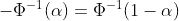

# 分位数是理解概率分布的关键

> 原文：<https://towardsdatascience.com/quantiles-key-to-probability-distributions-ce1786d479a9?source=collection_archive---------2----------------------->

## [实践教程](https://towardsdatascience.com/tagged/hands-on-tutorials)，数据科学家的数学复习

## 如果你在使用概率分布时感到困惑，这篇文章就是为你准备的。

由[约书亚·厄尔](https://unsplash.com/@joshuaearle?utm_source=medium&utm_medium=referral)在 [Unsplash](https://unsplash.com?utm_source=medium&utm_medium=referral) 上拍摄的照片

你多次遇到概率分布。你知道有几种不同的类型。但是在你内心深处，当你需要在实践中使用它的时候，你会感到困惑。概率分布和累积概率分布到底有什么区别？我应该检查 X 轴或 Y 轴上的置信水平或 alpha？如果是这样，这篇文章是给你的。最后，你会对使用离散或连续随机变量的概率分布感到舒适。让我们开始吧！

我们将在本文中讨论以下主题:

1.  概率密度函数
2.  概率质量函数(PMF)
3.  累积概率分布(CDF)
    3.1 离散随机变量的累积概率分布(CMF)
    3.2 连续随机变量的累积概率分布(CDF)
4.  概率分布汇总
5.  分位数函数
6.  感谢阅读和参考

# **1。概率密度分布(PDF)**

正态分布的概率密度分布是人们听到“分布”时大多想到的。它有一个特殊的钟形:

标准正态分布的 PDF(零均值和标准差为 1)。来源:图片由作者提供

概率密度函数(PDF)将一个值映射到其概率密度[1]。这是一个类似于物理学的概念，物质的密度是其每单位体积的质量。例如，1 升水重约 1 kg，因此水的密度约为 1 kg/L 或 1000 kg/m。类似地，概率密度测量单位 *x* 的概率。

PDF 指的是一个*连续随机变量*，这意味着该变量可以取实数定义范围内的任意值。*随机*显示变量取值的不确定性。它给出了无限多种可能性，例如 0.1，但也有 0.101、0.1001 等。所以，连续随机变量等于给定值的概率为零。

PDF 图上的概率由密度曲线下的面积表示。一个点下的面积等于零。这就是为什么 PDF 用于检查随机变量落在给定值范围内的概率，而不是取任何特定值。例如，我们投资于该基金而亏损，从而导致回报为负的可能性有多大？这里我们考虑所有小于零的收益。

直观上，PDF 近似于一条描述直方图的直线。例如，我们希望将实验中的 992 名参与者分成不同的年龄组(0-10 岁、11-20 岁等)。我们计算每个组中有多少成员，并在直方图上显示为条形:

992 名参与者分成不同年龄组的直方图。从正态分布生成的数据。图片作者。

我们随机选择的人成为特定年龄组成员的几率有多高？首先，我们必须将频率分布转换成概率分布。意思是根据每组参与人数计算概率密度。因为条形是矩形的，概率密度函数下的面积总是等于 1，所以我们可以使用一个简化的公式:

对于上图所示的频率，我们有:

现在，我们可以用密度代替 y 轴上的计数来绘制数据。红色曲线连接计算点，表示概率密度函数:

作者绘制的 PDF 图。红线是概率密度函数。

但是请注意，我从正态分布中为这个图生成了数据。这就是 PDF 和直方图如此吻合的原因。PDF 具有“封闭”形式，要求预先定义分布和参数(正态分布情况下的平均值和标准偏差)。直方图使用原始数据，所以它显示真实的分布。它允许检测异常，尤其是在有大量条形的情况下。

对用于描述分布的其他参数感兴趣(期望值、方差、偏度和峰度)？跳到这里:

</statistical-moments-in-data-science-interviews-bfecd207843d>  

根据上述分析，需要记住以下要点:

*   概率是概率密度曲线下的面积(PDF)。
*   连续随机变量取给定值的概率为零。所以，对于 x 的一个指定值，我们只能查概率密度，用处不大。
*   这就是为什么我们关注值的区间。它允许我们对一系列值进行概率陈述。例如，有 50%的可能性参与者将至少 40 岁。

# **2。概率质量函数(PMF)**

概率质量函数(PMF)指的是离散随机变量。与连续随机变量相比，离散随机变量只能取可数个离散值，如 0，1，2，…简单的例子是掷骰子、掷硬币或检测欺诈交易(要么有欺诈，要么没有欺诈)。

与连续随机变量类似，我们可以创建离散数据的直方图。但是不需要将值聚合到区间中。让我们考虑一对骰子的掷数总和。结果的数量是有限的，因为两个骰子上的值都是从 1 到 6。下图显示了 1000 卷公平骰子的直方图示例:

掷出 1000 次公平的一对骰子时的总和直方图。图片作者。

两个骰子都是公平的，这意味着从 1 到 6 滚动每个数字的概率是相同的，等于 1/6。所以最受欢迎的和是 7。类似于连续随机变量，我们可以将每个结果表示为一个概率。

如果我们掷一对骰子，有 36 种可能的结果(每个骰子有 6 个选项)。如果和等于 2，只有一种可能的组合:(1，1)。所以得到和等于 2 的概率是 1/36 = 0.0278。类似于 12 的和，只可能用于(6，6)。我们可以用同样的方法计算其他可能结果的概率。图中显示的结果创建了概率质量函数(PMF):

公平双骰子和的 PMF..图片作者。

总而言之，到目前为止，我们考虑了以下类型的情节:

*   **直方图**是描述每个数值范围在数据集中出现次数的图形。它不需要任何关于分布的假设，但是我们必须预先指定条形的数量。直方图是根据有限数量的样本绘制的。直方图中所有条形的值之和等于样本总数。
*   **概率密度函数(PDF)** 描述了*连续随机变量*的概率密度。PDF 上的概率是密度曲线下的面积。由于对于连续随机变量，给定值的概率为零，因此 PDF 用于检查变量落在给定区间内的概率。PDF 下的整个面积等于 1。
*   **概率质量函数(PMF)** 描述了*离散随机变量*的概率。这意味着变量只能取可计数的离散值，如 0、1、2 等等。PMF 中所有离散值的概率之和等于 1。

虽然都是非常有用的，在业界也是常用的，但是还有一个重要的概率分布——累积分布函数(CDF)。

# **3。累积分布函数**

随机变量 X 的累积分布函数(CDF)描述了 X 取值等于或小于 X 的概率(机会)。在数学上，我们可以将其表示为:

## **3.1。离散概率分布(CDF 或 CMF)的累积分布函数**

以前面掷骰子的公平对为例，我们可以问:两个骰子之和小于或等于 3 的概率是多少？我们需要将和等于 2 的概率(0.0278)和和等于 3 的概率(0.0556)相加，所以 x=3 的累积概率是 0.0278+0.0556=0.0834。然后，我们对每个离散值重复加法过程，以获得离散概率分布的累积分布函数:

离散概率分布的累积概率函数。图片由作者提供。

从图中可以看出，最高可能结果的累积概率函数等于 1。因为两个骰子的和只能取整数值，所以一个图可以用条形表示:

离散概率分布的累积概率函数。图片由作者提供。

## **3.2。**连续概率分布(CDF)的累积分布函数

连续变量的 CDF 的思想和离散变量是一样的。y 轴显示 X 取值等于或小于 X 的概率。不同之处在于，即使 X 轴上有微小的移动，概率也会发生变化。
考虑参与者年龄分组的例子，累积分布函数如下:

连续概率分布(CDF)的累积分布函数。图片由作者提供。

下图比较了均值为零且标准差为 1 的正态分布的 PDF 和 CDF:

正态分布 N(0，1)的 PDF 和 CDF。图片由作者提供。

我们可以得出结论:

*   CDF 是一个非减函数。它表示变量等于或小于 x 的概率，所以它只能随着 x 值的增加而上升。
*   我们可以从两个图中检查概率，但是使用 CDF 更简单。CDF 在 y 轴上显示概率，而 PDF 在 y 轴上显示概率密度。在 PDF 的情况下，概率是 PDF 曲线下的面积。
*   因为正态分布是对称的，所以 x=0(平均值)上的 CDF 是 0.5。
*   左侧的 CDF 渐近于图右侧的 0 和 1。x 的精确值取决于分布类型和参数(正态分布的平均值和标准偏差)。

# 4.概率分布汇总

到目前为止，我们回顾了三种描述概率分布的方法:概率密度函数(PDF)、概率质量函数(PMF)和累积分布函数(CDF)。下表总结了 PDF 和 PMF 之间的主要区别:

PDF 和 PMF 的主要区别。图片由作者提供。

累积分布函数显示 X 取最大值 X 的概率。它将所有较低值和等于 X 的概率相加。因为 y 轴是概率，所以 CDF 的使用通常比 pdf 更直接。

下面的图表显示了每个分布的典型图形，从左上方开始顺时针方向:PDF，PMF，CMF，CDF。它概括了高级特征，并描述了给定类型的分布函数之间的关系。

不同类型分布的比较。作者的图片受[1，2]启发。

从上面可以看出，显示概率分布的不同方法之间存在某种联系。

*   对于连续的随机变量，我们可以很容易地画出 PDF 和 CDF。PDF 下面的面积是一个概率，所以我们要积分才能把 PDF 变成 CDF 或者微分才能从 CDF 变成 PDF。
*   对于离散随机变量，PMF 表示概率，CDF (CMF)表示累积概率。为了从 PMF 得到 CMF，我们必须把概率加到给定的 x 上。反过来(从 CMF 到 PMF)，我们必须计算两个步骤之间的差。
*   如果我们把所有的值分成一组面元(见上面直方图的例子)，我们可以把 PDF 变成一种 PMF。它使用值/区间的范围，可以被认为是 PDF 的近似值。从离散累积分布到连续函数，需要某种形式的平滑。这可以通过假设数据来自特定的连续分布，如正态或指数分布，并估计该分布的参数来实现。以两种方式改变离散和连续的随机变量应该被认为是近似的。

# 5.分位数函数

让我介绍一下分布中的超级明星——分位数函数。它允许将分布用于许多实际目的，例如寻找置信区间和假设检验。

数学定义是分位数函数是分布函数在α的倒数。它指定随机变量的值，使得变量小于或等于该值的概率等于给定的概率:

其中 *F⁻ (α)* 表示 x 的α分位数

现在听起来可能有点玄乎，但细究一下就会释疑。假设我们要检查分布较低尾部总面积的 5%。我们称之为 x 的下 5%分位数，记为 F⁻ (0.05)。*分位数*是概率分布被分成等概率区域的地方。如果我们考虑百分比，我们首先将分布分成 100 块。当我们研究 PDF 时，第 5 个分位数是在分布的较低尾部切掉 5%区域的点:

正态分布 N(0，1)的下 5%分位数。图片由作者提供。

红线左侧 PDF 下的面积正好是曲线下总面积的 5%。这意味着有 5%的可能性。画红线的第一步是计算总面积的 0.05(这里 x=-1.645)。可以通过软件(例如 R 中的 *qnorm()* 函数或者 Python 中的 *scipy.stats.norm.ppf()* )或者手动使用 z-tables(这里的一个例子)来完成。

由于 CDF 在 y 轴上有概率(α),因此更容易在此找到该值:

正态分布 N(0，1)的下 5%分位数。图片由作者提供。

这表明 CDF 图是多么有用。我们可以通过两种方式使用 CDF:

*   如果我们有一个 z 值(或 X 值，X 轴上的值)，我们可以检查 X 取值等于或小于 X 的概率。例如，客户在网上商店花费的平均时间长度为半小时或更短的概率是多少？
*   如果我们有概率，我们就可以检查切割给定α的面积的值。例如，在 90%的置信度下，我们可以说客户在网上购物至少花费了 X 个小时。

在上面的例子中，我们只考虑了单侧的 5%分位数(较低的尾部)。我们可以对两边 5%的概率做同样的事情。这意味着我们在 PDF 下寻找总面积的 5%，但分成 2.5%的下分位数(在图的左侧)和 2.5%的上分位数(在图的右侧)。

双边 5%概率。图片作者。

因此，分位数是这些图之间的直接联系。

基于这些图，我们可以说，我们有 95%的信心，真实参数(平均值)位于-1.96 和 1.96 之间。或者有 5%的可能性它位于从-1.96 到 1.96 的范围之外。

上述解释突出表明:

*   置信水平告诉我们所考虑的事件发生的可能性有多大，或者给定参数在给定值范围内的可能性有多大。
*   α或显著性水平是一种概率。我们可以在 CDF 图上的 y 轴上检查它。阿尔法是一个负置信水平。

需要注意的几件事:

*   反函数φ⁻(α)是 *α分位数*
*   当α较小时，分位数也称为临界值
*   *一些分位数有特殊的名字。如果我们把概率除以 100，我们就有了百分位数。我们可以说第 5 百分位，而不是 5%分位数。4 分位数被称为四分位数，它们被分成 4 个部分，分别为 25%、50%(中间值)和 75%。*
*   *对于关于零对称的标准正态分布(具有零均值和一个 N(0，1)的标准差的正态分布)，我们有:*

**

*这在上面的图中得到了证明，因为我们在下尾部得到了-1.96，在上尾部得到了 1.96。*

*使用分位数、pdf、CDF，我们可以根据我们拥有的信息回答不同的问题，例如:*

*   *考虑样本均值，包含总体均值的值的范围是多少，我们有理由相信？“合理地”可能采用不同的百分比值，取决于我们研究的目标。*
*   *我们有多大的信心可以说回报不会是负的？*

# *感谢阅读！*

*我很高兴你看到了这篇文章的结尾。我们经历了不同类型的概率分布:概率密度函数(PDF)，概率质量函数(PMF)，和累积密度函数(CDF)。然后，我们讨论了数量函数。它链接了描述发行版的不同方式(PDF 和 CDF ),并允许我们以一种非常实用的方式使用这些发行版。我希望这对你来说是一次激动人心的旅行。*

*记住，学习(数学)技能最有效的方法是实践。所以不要等到你觉得“准备好了”，就拿起笔和纸(或者你最喜欢的软件)，自己尝试几个例子。我为你祈祷。*

*我很乐意在下面的评论区听到你的想法和问题，可以直接通过我在 [LinkedIn](https://www.linkedin.com/in/agnieszka-kujawska/) 的个人资料或者在*akujawska@yahoo.com 联系我。*后会有期！*

*您可能还喜欢:*

*</statistical-moments-in-data-science-interviews-bfecd207843d>  </math-refresher-for-data-scientist-part-1-matrices-88620a92d046>  </set-path-automatically-r-python-4dbc4963321e>  

# 参考

[1] A.B .唐尼:[“想统计。Python 中的探索性数据分析"](https://greenteapress.com/thinkstats/)

[2] C .亚历山大(2008):《市场风险分析》。第一卷:金融中的定量方法”。约翰·威利父子有限公司，国际标准书号 978-0-470-99800-7。*