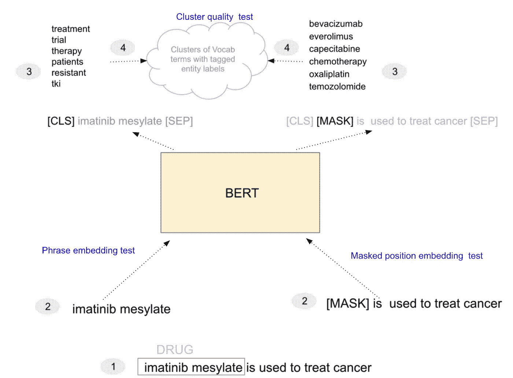
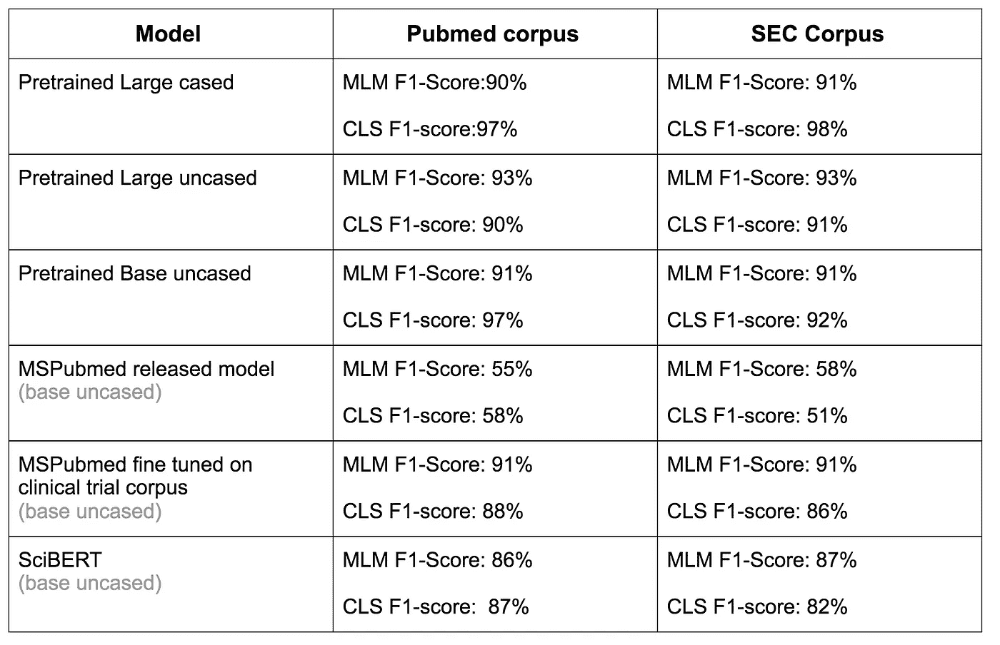
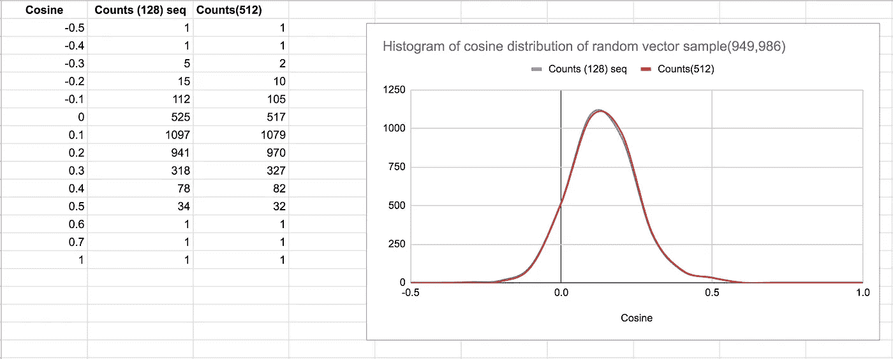
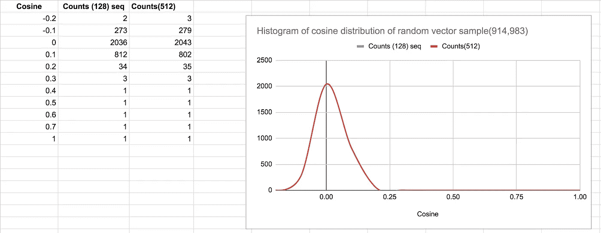
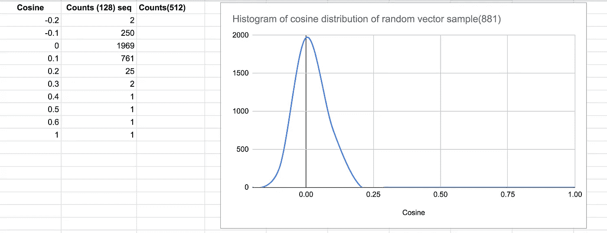
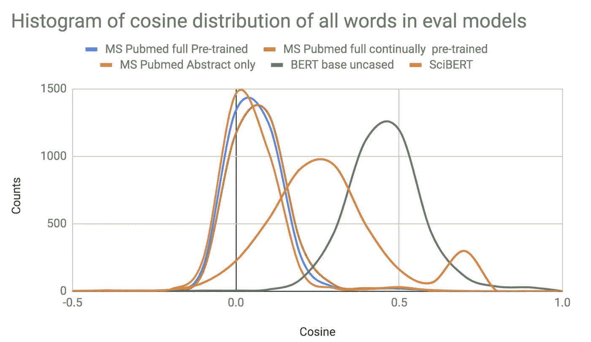
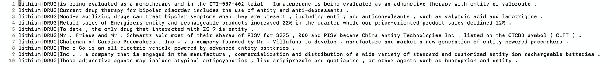

# 预训练 BERT 模型的定量评估

> 原文：<https://towardsdatascience.com/quantitative-evaluation-of-a-pre-trained-bert-model-73d56719539e?source=collection_archive---------15----------------------->

## [思想和理论](https://towardsdatascience.com/tagged/thoughts-and-theory)

## 一个**先决条件**使用一个**预训练模型**作为**，没有微调**

**图一。**对预训练的 BERT 模型进行定量评估。该测试定量地评估预训练模型的(a)通过模型预测屏蔽位置的能力的上下文敏感向量，以及(b)通过检查屏蔽短语的向量质量的[CLS]向量质量。底层词汇向量的聚类质量，尤其是实体类型到聚类的分离在其中起着隐含的作用。该测试通过使用三元组的测试数据集来完成(具有屏蔽短语的句子、句子中的屏蔽短语、句子上下文中的屏蔽短语的实体类型)。模型在句子上的性能由屏蔽位置的预测的实体类型和屏蔽短语的[CLS]向量来确定。屏蔽位置或[CLS]向量的预测的实体类型由上下文无关向量的聚类确定-其质量由聚类的性质定性地确定(实体类型的分离程度)。定量测试产生混淆矩阵和每种实体类型的 F1 分数。**作者创作的图像。**

# TL；速度三角形定位法(dead reckoning)

自我监督的学习正在使用变形金刚大规模使用，不仅用于文本，最近还用于图像 *(* [*剪辑*](https://openai.com/blog/clip/) *，* [*对齐*](https://arxiv.org/pdf/2102.05918.pdf) *)* ，以解决传统的监督任务*(例如分类)*，要么原样，要么进行后续微调。虽然大多数(如果不是全部的话)下游 NLP 任务被执行，但是迄今为止，随后对预训练的变压器模型进行微调，有可能照原样使用预训练的模型*，而没有随后的微调*。

例如，**一个预先训练好的 BERT 模型对于多种 NLP 任务**的效用**，**没有任何微调**就被大大忽略了。**直接使用预训练的 BERT 模型而无需微调的例子有

*   [**无人监管的 NER** 。](/unsupervised-ner-using-bert-2d7af5f90b8a) NER，传统的监督任务可以完成，而不必标记句子中的单个术语。相反，对于感兴趣的实体类型，一次性标记 BERT 词汇向量集群就足够了，其中词汇向量直接从预先训练的模型中获得。
*   **无监督的句子表述。**训练有素的关于下一句预测的 BERT 模型可用于创建短语、句子片段或完整句子表示，其表现与在监督下创建的句子表示一样好，甚至在某些任务中取代它们。
*   **U**[**n 监督同义词采集**](/unsupervised-synonym-harvesting-d592eaaf3c15) *(或一般关系抽取)。*预训练的 BERT 模型与依存解析器/位置标记器组合可用于关系提取基线，并为同一任务的下游监督模型创建弱监督标记数据。
*   **条件句分类。**在给定输入句子中指定的术语的情况下，与依存解析器/词性标注器组合协同工作的预训练 BERT 模型可用作选择句子分类任务的基线模型，并为同一任务的下游监督模型创建弱监督标记数据。
*   **弱监督带置信度评分。**为任何下游微调任务创建带有关联置信度得分的标记数据。下游微调模型可以学习使用置信度得分作为附加的输入特征。这对于选择性地手动处理那些低置信度的输入来提高模型性能也很有用。
*   **下游微调任务的训练集覆盖量化。**在训练鉴别器模型 p(y/x)时，量化训练集对底层分布 p(x)的覆盖。在为监督任务创建标记数据集时，这在实践中非常有用，在监督任务中，预先训练的模型被微调。
*   **相对于预训练模型量化微调模型的学习。**不仅根据测试集分数，而且根据底层输入分布样本*(由训练集捕获)**如何映射的相对方式，对微调模型的学习进行量化*(与预训练模型创建的聚类相比，微调可以改变从训练集创建的聚类的性质)。**
*   **在部署期间检测 OOD 或罕见输入。**为部署模型的输出*(可以是预训练模型或微调模型)*赋予置信度得分，特别是对于它很少或从未见过的输入。这在模型的生产部署中变得至关重要——以识别 OOD *(不在分布范围内)*或[在培训期间很少出现的情况](https://jmtomczak.github.io/blog/1/1_introduction.html)并检测错误分类/误报。

然而，预训练模型的这种直接用例突出了对定量 *(* [*)的需要，这与任务上的预训练模型的定性测量*](/maximizing-bert-model-performance-539c762132ab) *)* 评估方法相反，而不仅仅是模型训练损失*(或固定步数的训练)*。

本文的前半部分描述了这种定量测试的实现。文章的第二部分描述了预训练步骤——自定义词汇生成、数据准备、多 GPU 预训练、预训练的超参数选择等。下面描述的所有模型的预训练都是在托管[英伟达 DGX A100](https://www.nvidia.com/en-us/data-center/dgx-a100/) 机器的[核心科学云](https://www.corescientific.com/)上进行的。

# 需要评估的 BERT 组件

BERT 模型的自我监督训练产生

*   词汇向量。这些是上下文不敏感的向量，其中一个单词的所有含义都被压缩到一个向量中(*例如，细胞——其所有含义、手机、监狱细胞、生物细胞都被压缩到一个向量中)*
*   将由所学习的词汇向量表示的输入句子转换成每个符号化输入单词的上下文敏感向量的模型权重。模型权重也有助于为输入句子创建丰富的句子表示*(假设模型在下一个句子预测任务中被训练)*。

虽然在之前已经对预训练模型[进行了定性检查，但本文描述了一种同时测试所有三个输出的评估方法](/maximizing-bert-model-performance-539c762132ab)

*   句子中屏蔽短语的模型上下文敏感输出向量的定量度量
*   句子中屏蔽短语的[CLS]向量的定量度量
*   上下文无关词汇向量聚类的定性和定量测量，其计数是定量测量*(大量的单个聚类意味着不适当的/较差的预训练模型)*，并且聚类的实体分离水平是定性测量*(考虑到词汇向量的上下文无关性质，必然会有混合实体聚类)*。这些群集的质量对上面提到的两个定量测试有直接影响。

定量测试*(针对上述测试一和测试二)*产生一个混淆矩阵，其中包含每个实体类型的 F1 分数。

# 模型评估方法

从事实正确性的角度来看，BERT 对句子*(即使被删除的术语存在于底层词汇表中)*中被删除的确切术语的预测是不可靠的，就像对任何语言模型一样，不管它是自回归模型还是自动编码器模型。然而，如果模型是在语料库上用真正代表输入句子的自定义词汇预先训练的，则 BERT 对屏蔽位置的实体类型的预测始终是准确的。也就是说，如果我们输入句子*“_ _ _ 用于治疗癌症*”，一个训练有素的模型的最高预测将主要是药物和治疗。下面利用 BERT 的这种健壮的实体类型预测能力来评估模型*(这基本上是用于执行无监督的*[*NER*](/unsupervised-ner-using-bert-2d7af5f90b8a)*的相同方法，在* [*以前的文章*](/unsupervised-ner-using-bert-2d7af5f90b8a) *中有描述)。*

# 试验结果

三种实体类型*(药物、疾病和细胞类型)*的屏蔽位置预测的累积 F1 分数如下所示。对三种模型进行了预训练和评估——大套管、大无套管和基本无套管。

**图二。**通过下述方法预训练的模型的评估结果，以及可公开获得的预训练模型。作者创造的形象。

这篇文章的其余部分描述了完成上面列出的分数所遵循的训练前步骤。评估步骤也很详细。

# 培训前的步骤

从语料库预处理开始的预训练过程在实现良好的模型性能方面起着关键作用。

*   **语料预处理。**句子边界检测，在句子边界上分割句子，起到取得良好性能的作用。不在句子边界上折叠句子的缺点是在训练的最大 510 *(考虑到 CLS 和 SEP)* 边界限制时剪裁长序列的风险。对于超过句子长度限制的病态长句，一种方法是将它们以一定长度折叠成一个新行，其中换行的限制因素是句子的平均标记化长度。句子的标记化长度通常高于原始句子长度。理想情况下，可以使用用于训练的相同标记器对句子进行标记，然后基于它进行折叠，但对于大规模语料库来说，这可能是一个过于昂贵的操作——句子长度增加的平均度量(*~ 1.5–2x)*可能是一个实用的选择。使用额外的换行符*分隔段落和文档(即，两个换行符分隔文档，一个换行符分隔文档内的句子)*也是确保下一句预测的高准确度的关键，这反过来会影响[CLS]向量的质量
*   **词汇生成。**在感兴趣的语料库上创建自定义词汇也在模型性能中发挥作用。如果预训练的目标不是为了学习数字术语*(例如，年)*和外语句子的良好表示，则确保所学习的词汇真正代表基础语料库的一种方法是消除纯粹是数字术语*(不是任何其中含有数字的术语，如 CD20-a 基因)*和外语字符*(相对于感兴趣的语言)*的单词*(仅用于词汇生成)*。一种简单的方法是删除这些术语，然后只添加数字 0-9*(确保它们被重复足够的次数，以满足最小阈值，从而有资格被词汇生成挑选出来)*以确保它们出现在最终的词汇中。然而，请注意，生成训练记录的输入没有删除任何术语，它是应用了句子边界的原始原始语料库。这个原始语料库中的数字项将被转换成由数字项组成的子词。外语字符将被转换成[UNK]标记，保留它们穿插其中的句子结构。
*   **培训记录生成。** Google 的 Github 存储库有训练记录生成功能，支持全词屏蔽。PyTorch HuggingFace 也支持它——但是，它仍然不适合训练大型语料库，因为它将整个语料库读入内存。使用 Google code 生成训练记录可能需要很长时间，因为它是按顺序执行的*(甚至比实际训练时间还要长)* —所以最好通过拆分语料库*(使用 parallel 等)来并行生成训练记录。)*
*   **实际训练流程**。谷歌用于培训的 TensorFlow 版本不支持多 GPU*(NVIDIA-SMI 输出可能会产生误导，除非使用 dmon 选项来查看实际的多 GPU 使用情况)*。然而，Nvidia 有一个多 GPU 容器版本，它确实使用所有 GPU 进行训练 *(* [*在内部使用 Horovod*](https://horovod.ai/)*)*——所以这可能是一个理想的选择。然而，Nvidia release 迄今为止还不支持整个单词屏蔽来生成训练记录——所以我们可能必须使用谷歌的记录生成过程，然后用 Nvidia 的代码进行训练。此外，如果选择了正确的学习率，Nvidia 的优化器变化可能有助于更快的收敛。在 A100 上使用 4 个 GPU 在两天多一点的时间内完成了针对 BERT-Large 的 24 GB 大小的语料库的大约 500k 步的训练过程。批量是影响模型性能的一个关键超参数。A100 机器大 GPU 内存 40GB 有助于训练大批量 *(128 序列长度—批量 64，然后是 512 序列长度，批量 16)* 。使用 4 个 GPU 的 A100 上的吞吐量约为 1200 个序列/秒。学习率为 7.5 e-4 时，训练损失约为 1.5，NSP 损失约为 0.005。

**图三。**预训练的带全词屏蔽的 BERT base 未区分大小写词汇表中约 1000 个词的随机样本的余弦分布直方图。如图 2 所示，模型 F1 值在 90%左右。用于训练的较大批量对直方图分布图中间接捕获的模型性能有影响(较小批量的预训练产生较低的模型性能以及均值向右移动的直方图分布图-较小的尾部)。**以上图片作者**

**图 4。**预训练的带全词屏蔽的 BERT 大型未区分大小写词汇表中约 1000 个词的随机样本的余弦分布直方图。如图 2 所示，模型 F1 得分在 90 分左右。用于训练的较大批量对直方图中间接捕捉的模型性能有影响(较小批量的预训练产生较低的模型性能，以及均值向右移动的直方图——较小的尾部)。**以上图片作者**

**图五。**预训练 BERT 大容量词汇中约 1000 个词的随机样本的余弦分布直方图，具有全词掩蔽。如图 2 所示，模型 F1 值在 90%左右。用于训练的较大批量对直方图分布图中间接捕获的模型性能有影响(较小批量的预训练产生较低的模型性能以及均值向右移动的直方图分布图-较小的尾部)。**以上图片作者**

**图六。**本次评测使用的其他公共模型(MSPubmed，SciBERT)的词汇表中约 1000 个词的随机样本的余弦分布直方图。MSPubmed 的直方图类似于高性能的预训练模型，但在掩蔽测试中表现不佳，这表明底层词汇向量训练得足够好，但模型层没有将它们转换为上下文敏感向量。**以上图片由作者摘自文章** [**最大化 BERT 模型性能。**](/maximizing-bert-model-performance-539c762132ab)

# 评估步骤

通过将 Tensorflow 检查点转换为 PyTorch 模型进行评估。预训练模型的评估如下进行。

*   BERT 学习的词汇向量提取和聚类——这可以使用下面列出的库中的实用程序来完成。一旦聚类完成，需要为感兴趣的特定实体手动标记这些聚类。如果聚类通常产生大约 3000 个聚类，那么对于大约 30000 个词汇，这最多需要一个小时的人工标记。
*   运行评估脚本。这需要一个三元组(1)包含一个屏蔽短语的句子(2)屏蔽短语的句子(3)屏蔽短语的实体类型。测试数据的格式如下所示。评估产生带有感兴趣实体的混淆矩阵的输出。F1 得分报告的默认行为是所有被评估实体的最大 F1 得分值。

**图 3。**评估测试样本。**作者创建的图像**

# 最后的想法

当前标准方法的一个[最新替代方案](https://huggingface.co/blog/how_many_data_points/)是用特定任务的头部对预训练模型进行微调——[提示预训练模型进行少量镜头学习](https://huggingface.co/blog/how_many_data_points/)，这显示了前景。这种方法的灵感来自于由 GPT-3 推广的[提示，其中模型执行新任务而无需微调*(无梯度更新)*，只需与预训练的自回归模型进行文本交互。虽然基于提示的监督不同于传统的监督，但它仍然需要人工来为模型准备*(或者微调)*特定于任务的提示。本文中描述的 BERT 模型的使用为同一问题提供了一种不同的方法，其中人类的努力花费在标记几个聚类上，其大小受聚类过程的限制，与标记句子的传统监督或更近的基于句子提示的方法形成对比。](https://arxiv.org/abs/2005.14165)

## 承认

*用于评估的 Pubmed 和 SEC 测试数据集是由我的同事*[*Harish*](https://www.linkedin.com/in/harishashokkumar/?originalSubdomain=in)*通过从已知实体类型的选择术语中收集句子并在句子中屏蔽它们而用算法创建的。*

*代码用于* [*进行评估，此处可用*](https://github.com/ajitrajasekharan/pretrained_model_evaluation.git) *。准备用于评估* [*(集群创建)的模型的代码可在此处*](https://github.com/ajitrajasekharan/bert_vector_clustering) *获得。使用[CLS]向量创建句子表示的代码可在此处获得* *。*