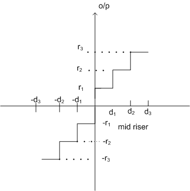
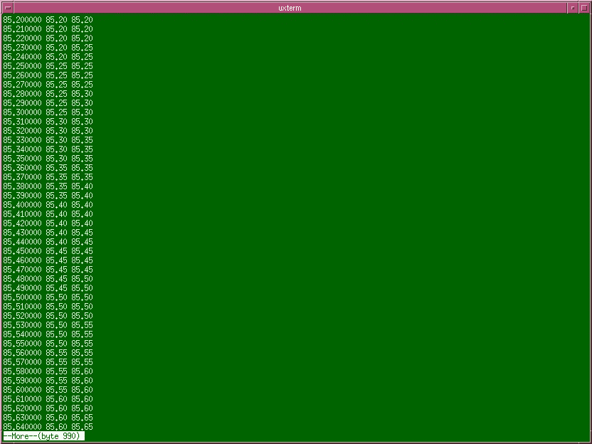

# 时间数据序列中的量化器

> 原文：<https://towardsdatascience.com/quantizers-in-time-data-series-8dc0149c4872?source=collection_archive---------22----------------------->

## 一个 C99 源代码的基本实现



图片来源: [NPTEL](https://nptel.ac.in/content/storage2/courses/117104069/chapter_5/5_1.html) 。许可知识共享 C-BY-NC-SA

在人工智能和人工智能项目中，数据准备预计占 80%的工作量。这一价值主要来自数据清理的需要，但也有与数据标准化相关的活动，这些活动需要相当长的时间，尤其是在找到正确的方法之前。

正如数据科学的许多其他方面一样，代码量方面的结果并不大，因为我们正在处理更精确、编写得更好的紧凑算法，而不是大型编程任务。

金融数据处理中经常发现的活动之一是对所涉及的不同时间序列进行标准化。例如，需要对不同资产的价格进行标准化，在某些情况下，还需要根据允许的步骤数进行标准化。

最后一个过程称为*量化、离散化或宁滨*，它在电气工程和数据信号处理等领域广为人知，允许处理实数以外的离散值。就数据科学而言，它允许我们减少数据集中离散值的数量。这并不完全是一种量化，因为输入序列本质上是不连续的，例如在电域中，但实际上可以这样认为。


连续信号的量化值。来源:维基百科

# 均匀量化器

虽然有几种离散化或量化信号的方法，但经典的方法是均匀量化器。公式如下:

```
Given:x :
a real number to be quantizeddelta : 
the quantization step, i.e. the bin size in which we want to divide the continuous value spaceQ(x) :
the quantized value for xQ(x) = delta * floor((x+delta/2)/delta)
```

# C99 量化功能定义

*注意:* `*inline*` *属性建议编译器用内嵌编码代替函数，节省函数调用的开销。该请求可以被接受，也可以不被接受，* `*gcc*` *和* `*clang*` *都允许使用* `*always_inline*` *属性来强制内联用法。这种技术可以用来在需要速度的地方更好地构建代码，例如数据科学例程中经常发生的情况。*

# 数据系列的完整示例

将输入值离散化为`0.05`值的步骤。第一列显示来自命令行的输入值。第二列显示使用`quantize`功能的输出，第三列显示使用`quantize_mid`功能的输出。



# 结论

将量化器应用于数据序列是一个简单的操作。如果数据序列的每个值都将作为累积输入(例如应用聚合值)应用于神经网络，则需要该参数。通过这一过程，我们有效地减少了神经网络的输入数量。这种操作在图像处理中很容易理解，在图像处理中，可以降低分辨率以减少所需的计算工作量，但其他数据科学数据集也有同样的需求，这些数据集的值本身被用作后续处理的输入。