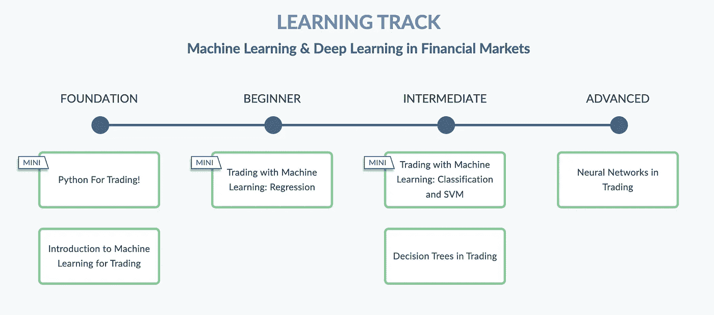

# quantra——学习量化金融的 Python 编码平台

> 原文：<https://towardsdatascience.com/quantra-a-python-coding-platform-to-learn-quantitative-finance-8e5e88c89120?source=collection_archive---------8----------------------->

[alevision.co](https://unsplash.com/@alevisionco?utm_source=unsplash&utm_medium=referral&utm_content=creditCopyText)在 [Unsplash](https://unsplash.com/s/photos/finance?utm_source=unsplash&utm_medium=referral&utm_content=creditCopyText) 上拍照

## 这是一个开始您的量化金融和 Python 冒险的好地方

老实说，这篇文章的标题很好地描述了 [**Quantra**](https://www.quantra.quantinsti.com/?ref=eryklewinson) 到底是什么。这是一个帮助潜在学生学习 Python 量化金融的平台。该平台提供各种难度的课程，所以我非常肯定，每个对该领域感兴趣的人都会找到适合自己的东西。

截至目前，我已经完成了两门课程——[动量交易策略](https://quantra.quantinsti.com/course/momentum-trading-strategies/?ref=eryklewinson)和[新手日内交易策略](https://quantra.quantinsti.com/course/day-trading-strategies/?ref=eryklewinson)。在本文中，我将尝试展示该平台的一些特性，并分享我个人的观点和经验。

*免责声明:本文包含附属链接*

# 平台概述

## 课程和学习路线

[来源](https://quantra.quantinsti.com/learning-track/machine-learning-deep-learning-in-financial-markets)

Quantra 提供独立课程(目前有 36 门课程)和专门的学习课程，后者是一系列课程的集合，旨在介绍从初级到高级的特定主题。我发现这个功能很有帮助，因为它可以为你的学习提供一种课程。

照片由[海拉戈斯蒂奇](https://unsplash.com/@heylagostechie?utm_source=unsplash&utm_medium=referral&utm_content=creditCopyText)在 [Unsplash](https://unsplash.com/s/photos/school?utm_source=unsplash&utm_medium=referral&utm_content=creditCopyText) 上拍摄

## **多样化的学习方式**

关于 Quantra 的课程包括以下类型的活动:

*   录像
*   专用环境中的编码练习—类似于 DataCamp 和 DataQuest 等新时代数据科学学习门户，您需要通过编写几行代码来完成一些简短的练习。万一卡住了，可以查看提示。
*   Jupyter 笔记本——课程的大多数部分都包含一些笔记本，允许更深入地研究实际编程。所以你不仅可以看到发生了什么，还可以进一步实验和尝试其他事情。
*   "琐碎问题
*   阅读材料——相关论文、博客文章等的链接。

我真正喜欢讲座内容的是它的近期性和相关性。例如，COVID 疫情经常被认为是一个重大事件，作者分析了它对金融市场的影响。

## 技术堆栈

Quantra 上的所有课程都无一例外地使用 Python。相当多的内容是基于流行的库，如`pandas`、`numpy`、`matplotlib`，但他们也引入了更多的金融专用库，如`yfinance`用于[下载股票价格](/a-comprehensive-guide-to-downloading-stock-prices-in-python-2cd93ff821d4)、`ta-lib`用于计算技术指标，以及`zipline`用于[创建交易策略并回溯测试它们](/introduction-to-backtesting-trading-strategies-7afae611a35e)。

## 不需要安装

该平台的另一个好处是，所有环境(纯 Python 和 Jupyter 笔记本)都集成在 Quantra 中，因此对于学生来说，一个浏览器就足以完成所有练习。这绝对是一个优势，因为在本地机器上安装 Python 并确保依赖项与所需的相一致没有任何麻烦。

安妮·斯普拉特在 [Unsplash](https://unsplash.com/s/photos/students?utm_source=unsplash&utm_medium=referral&utm_content=creditCopyText) 上拍摄的照片

## 社区

万一你卡住了，想不出什么办法(虽然这不太可能，因为笔记本上写满了描述+评论和编码练习的专用提示)，或者只是想讨论一下你的交易策略，你可以通过论坛联系 Quantra 社区(其他学生+员工)。

## 现场交易

大多数学生都对构建自己的算法感兴趣，并尽快开始交易(鉴于潜在的财务损失，自然不总是建议这样做……)，Quantra 提供了一个很好的功能，即 blue shift——他们基于`zipline`的专用实时交易平台。在这些课程中，你将学习如何创建交易策略，使用 Blueshift 上的历史数据进行回溯测试，并通过连接到你选择的经纪人开始实时交易。Blueshift 目前支持的一些券商包括羊驼、FXCM 和 MasterTrust。

这些课程还包括通过 IBridgePy API 在交互式经纪人、Robinhood 和 TDAmeritrade 上进行实时交易。

就我个人而言，我没有使用过这个功能，但我确信它对那些想玩算法交易的人会很有用。这肯定比从头开始构建自己的管道并直接连接到经纪人的 API 更容易。

## 对反馈的开放性

我真正喜欢 Quantra 的是他们对反馈的开放程度。我报告了一些在课程中可以改进的建议，团队实际上实施了这些建议。

# 个人观点

到目前为止，我已经在 Quantra 平台上完成了两门课程，我必须说，我很享受这种体验，我学到了一些有趣的东西。

至于目标受众，我想说该平台最适合初学者，他们希望有一种结构化的方式来研究 Python 在量化金融方面的应用。至少可以说，即使从经验上讲，从零开始，然后试图找出最好的课程或在哪里找到一些信息也是令人生畏的。初级到中级水平的课程包含专门的*介绍 Python* 的部分，因此，即使以前没有 Python 或库(如`pandas`)经验的人也可以快速上手并能够跟进。

对于更有经验的观众，我建议浏览一下课程大纲，看看你实际上能学到多少新东西。因为你可能会跳过相当多的章节，因为你已经知道了这些内容。在这种情况下，我建议尝试不同的课程，可能是针对更高级的用户。

此外，Quantra 的商业模式与 Udacity 和 Udemy 等其他 MOOC 平台类似，这意味着课程经常打折。至于 Udemy，可能不是 90%，但相当可观:)此外，如果你想参加 Quantra 的课程，你可以在 [Twitter](https://twitter.com/erykml1) 上联系我，获取折扣代码。

我不认为这些课程是完美的，仍然有一些地方可以改进，但我相信随着时间的推移，他们会变得更好，因为团队在实施建议的变化方面工作效率很高。

如果你对我可能回答的课程有任何问题，请在评论中自由提问。另外，我很想听听你对 Quantra 的体验。

喜欢这篇文章吗？成为一个媒介成员，通过无限制的阅读继续学习。如果你使用[这个链接](https://eryk-lewinson.medium.com/membership)成为会员，你将支持我，不需要额外的费用。提前感谢，再见！