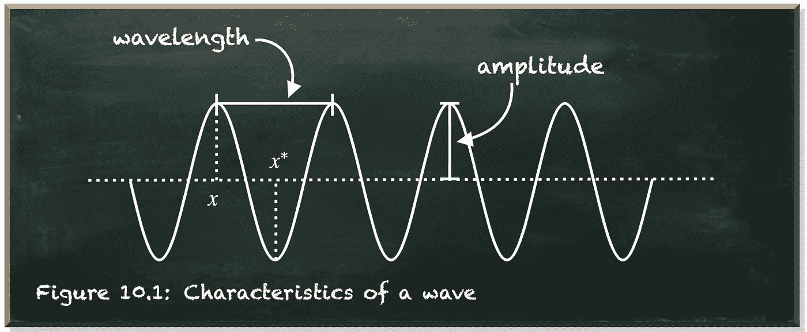
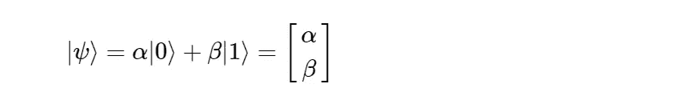
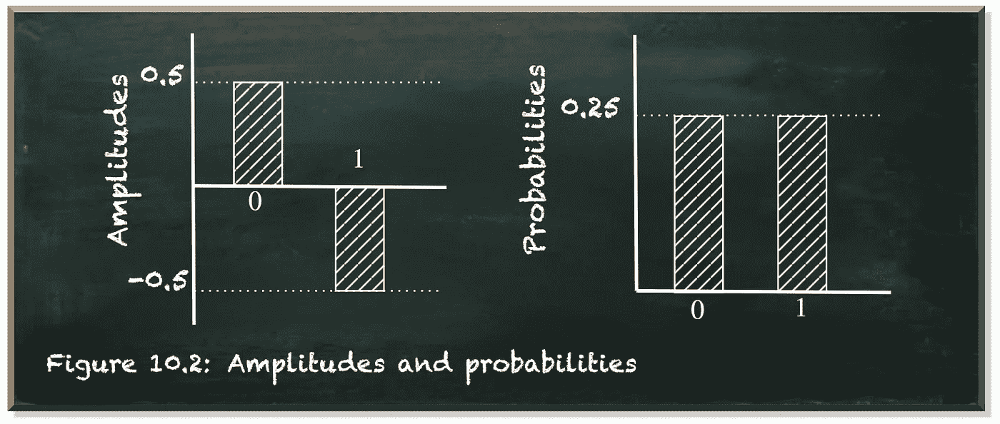
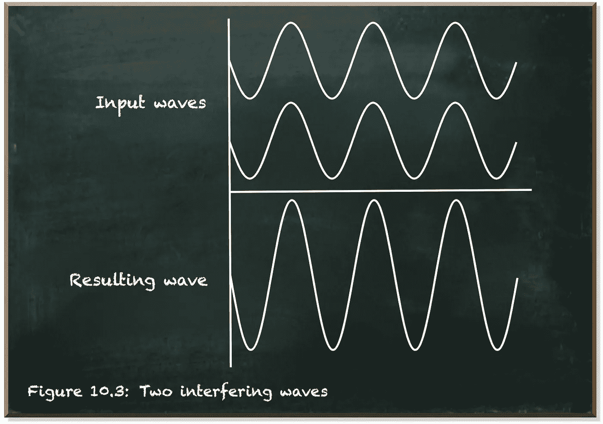
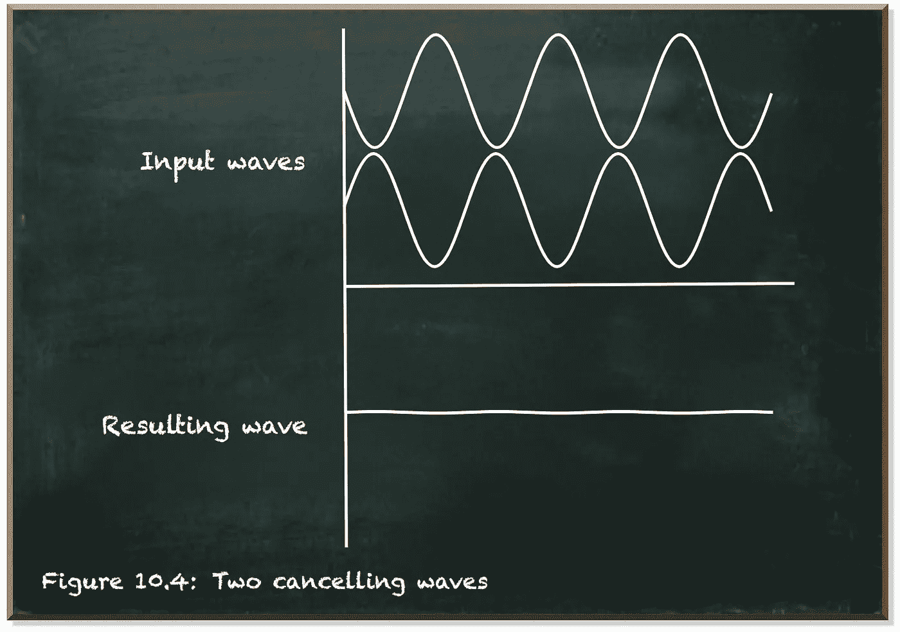
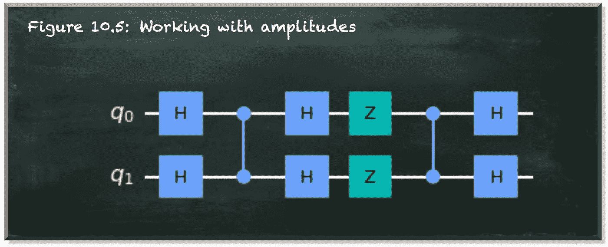
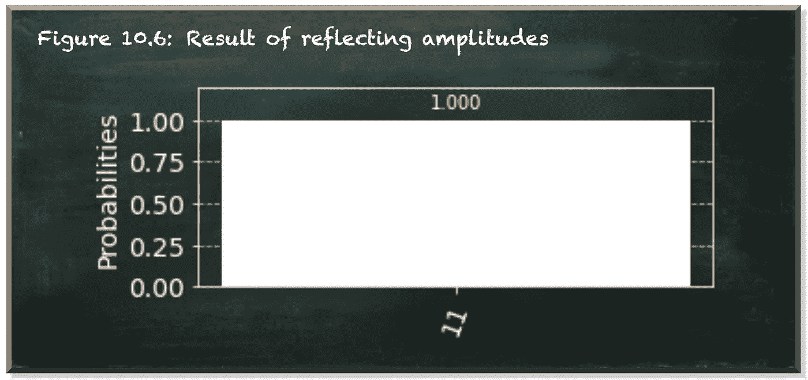
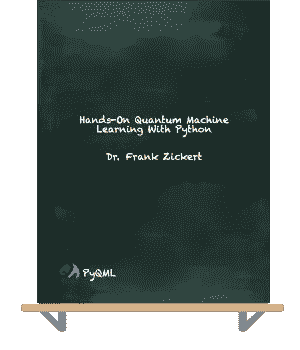

# 量子振幅和概率

> 原文：<https://towardsdatascience.com/quantum-amplitudes-and-probabilities-b49a6969b0b9?source=collection_archive---------29----------------------->

## 你看到的并不总是你得到的

本帖是本书的一部分: [**用 Python 动手做量子机器学习**](https://www.pyqml.com/page?ref=medium_amplitudes&dest=/) **。**

量子位状态向量包含振幅而不是测量概率。

振幅属于波。因为在量子力学中，量子粒子的行为是用波函数来描述的。

波浪有三个特征。

*   波长是波的形状重复的距离。
*   波的相位是波形周期上某一点的位置。
*   波的振幅是波的中心和波峰之间的距离。

下图描述了这三个特征。



作者弗兰克·齐克特的图片

正如我们在图中看到的，振幅可以是正的，也可以是负的。振幅是正还是负取决于虚点 x，如果你选择不同的点 x *,同样的波会有负振幅。

如果取两个相同但有位移的波，在 x 点，一个可能有正振幅，而另一个有负振幅，这两个波的相位不同。但是当你测量这两个波中的任何一个时，它们是一样的。你看不出有什么不同。它们对测量概率的影响是相同的。

数学上，量子位被测量为 0 或 1 的概率是相应振幅的平方。振幅是正还是负并不重要。



随着


```
In fact, the measurement probabilities are the squares of the amplitude absolutes ( |alpha|^2 + |beta|^2 = 1 ).
```

不过，幅度和概率是两回事。

到目前为止，我们只关心测量概率。我们只关心数学中的振幅。我们还没有研究量子位的振幅和相位。

但是我们也可以研究振幅。例如，Z 门切换幅度的符号。

当我们查看量子位的最终振幅时，我们看到量子位在状态 1 中具有负振幅。但是测量概率都是正的。



作者弗兰克·齐克特的图片

虽然振幅可以是负的，但概率不能。这是量子比特状态标准化α^2+β^2=1.的一个结果

归一化公式限制了测量概率可以获得的值。它不限制振幅。

但是，如果量子计算中一个态的振幅符号对结果概率无关紧要，我们为什么还要关心它呢？

答案是波干涉。波有一个明显的特点，就是它们会互相干扰。简单来说，它们加起来。如果有两个波在同一介质中传播，它们会形成第三个波，代表每个点的振幅之和。



作者弗兰克·齐克特的图片



作者弗兰克·齐克特的图片

量子位相应地工作。虽然量子位的振幅的符号和产生的相位不影响测量概率，但是一旦量子位相互干扰，它们产生的振幅可能不同，因此影响测量概率。

这就是所谓的振幅放大。它是我们量子计算工具箱中的一个重要工具。

我们来看看下图描绘的量子电路。



作者弗兰克·齐克特的图片

我们有两个量子位。在我们对它们中的每一个应用了第一个阿达玛门之后，它们都处于平衡的叠加态。

此时，我们有四种可能的状态，它们具有相等的振幅和相等的测量概率。

下面的受控 z 门仅切换状态|11⟩.的幅度符号除了应用门之外，它的工作原理和我们所知道的其他受控门一样。在这里，它是 Z 门。

以下 Z 门序列和封装在 H 门(HZH)中的另一个受控 Z 门称为 Grover 迭代。它是一个反射电路，将所有关于平均振幅(而不是平均概率)的状态反转。

对于四个状态中的三个具有正幅度(0.5)，但只有一个具有负幅度(0.5)，平均幅度为 0.25。

由于 0.5(2÷0.25)= 0，因此具有正幅度的这些状态的幅度为 0。

负幅度的一个状态导致幅度为 1，因为 0.5(2 ÷( 0.75))= 1。

即使量子位元状态向量的相位(振幅的符号)对结果的测量机率并不重要，但在量子电路内部却很重要。因为我们可以研究这些阶段。

以下代码显示了该电路的实现和测量概率。



作者弗兰克·齐克特的图片

# 结论

结果显示有 1.01.0 的几率测量系统为`11`。与以前不同，当我们直接处理测量概率时，我们只改变量子位的相位。

量子位类似于波的行为。因此，当它们相互作用时，它们的振幅很重要。简而言之，我们实现的电路首先改变了状态|11⟩的相位(通过对其幅度求反)。然后，它添加了另一个与|11⟩.州具有相同相位的波它使该状态的幅度加倍，从()0.5 到 1。因为这个相位与其他三个状态的相位正好相反，它们相互抵消。

本帖是本书的一部分: [**用 Python 动手做量子机器学习**](https://www.pyqml.com/page?ref=medium_amplitudes&dest=/) **。**



免费获取前三章[点击这里](https://www.pyqml.com/page?ref=medium_amplitudes&dest=/)。