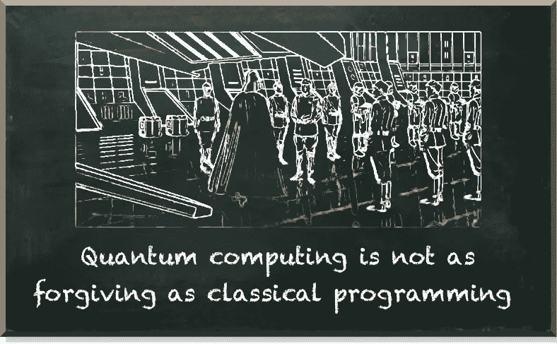
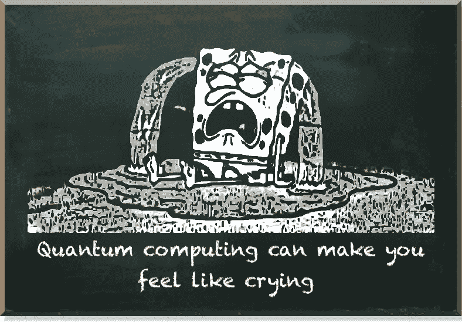
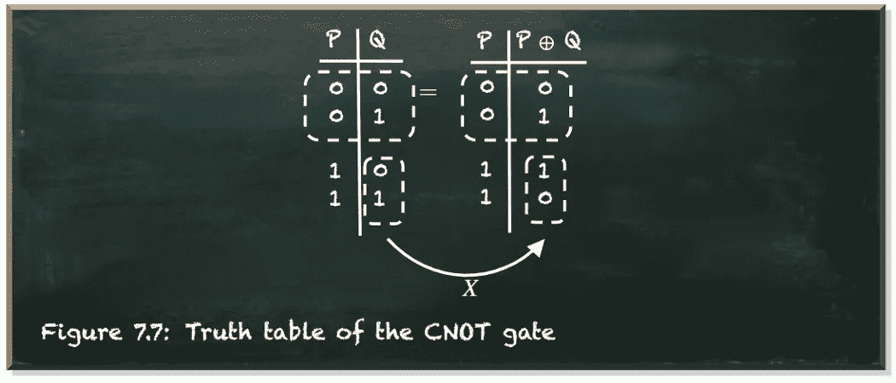
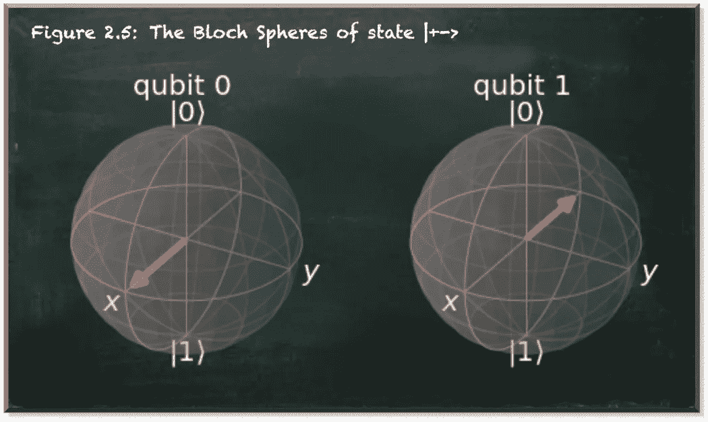
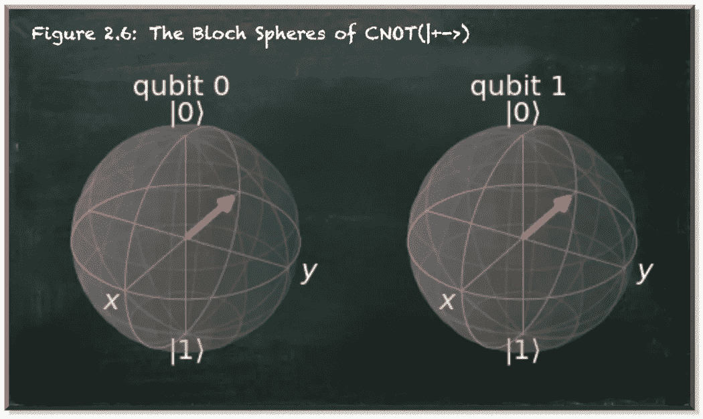
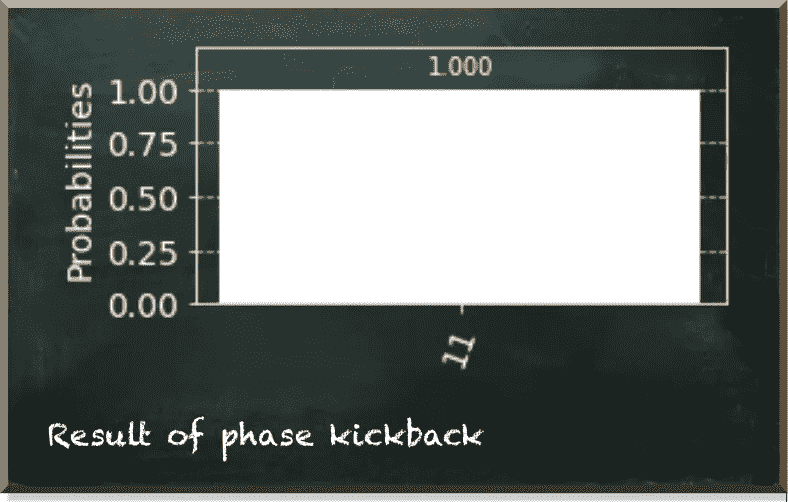
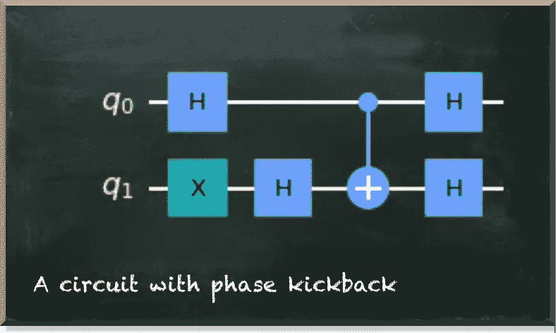
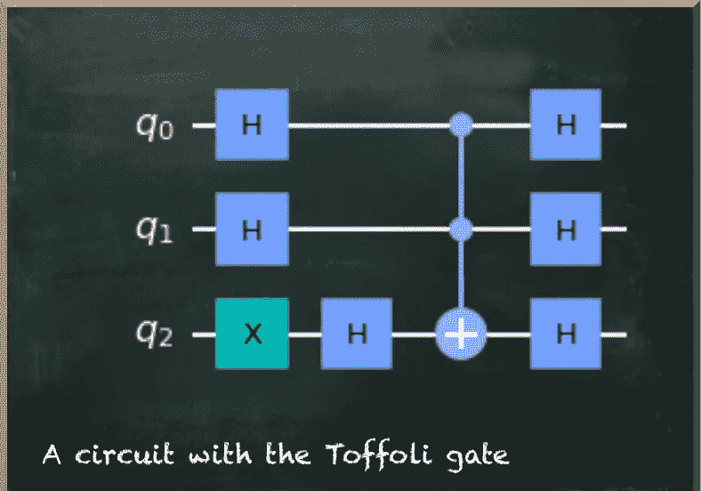
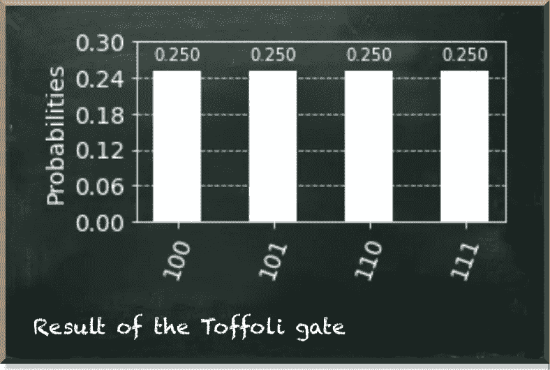
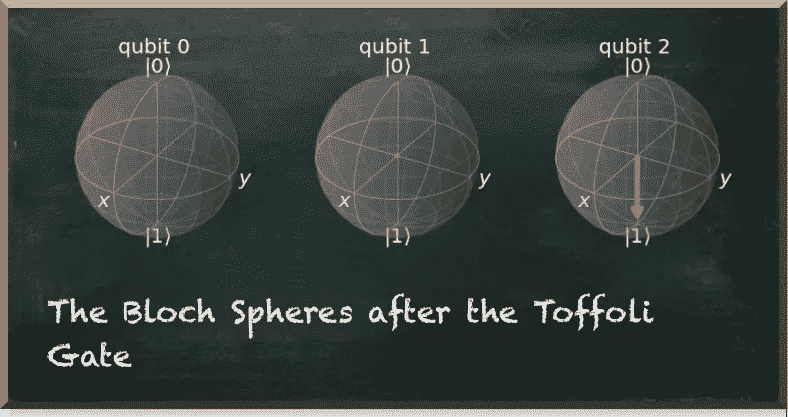

# 量子计算没有这么宽容

> 原文：<https://towardsdatascience.com/quantum-computing-is-not-as-forgiving-4b6b2e0c5074?source=collection_archive---------25----------------------->

## 您的经典编程方法将不起作用

量子机器学习要不要入门？看看 [**动手量子机器学习用 Python**](https://www.pyqml.com/page?ref=medium_forgiving&dest=/) **。**

量子计算是一块难啃的骨头。尤其是如果你习惯于编写经典计算机的程序。但是量子计算不像经典编程那样宽容。

作者图片

让我简单描述一下我是如何经典地开发软件的。我从一个简单的案例开始。一旦成功了，我就能应付边缘情况。另外，我从一个具体的案例开始。一旦成功了，我就把具体的东西抽象出来，找到一个通用的解决方案。

这在量子计算中不起作用。量子计算是个 b…这么说吧，有点反直觉。每当你认为你理解了它是如何工作的，并且你继续下一步，它就给你一条腿。在那里，你会发现自己在哭泣。

作者图片

先说量子纠缠。量子纠缠是量子力学的惊人特征之一。两个纠缠的粒子共享一个叠加态——不管它们相距多远。实际上，[我们纠缠量子位来构建超越单个量子位的有意义的量子系统](/towards-einsteins-spooky-action-at-a-distance-c32ca0148f8f)。你需要理解的只是 CNOT 门，即“受控而非转化”

假设你有两个量子位，P 和 Q，你对这两个量子位应用 CNOT 门，P 是控制量子位，Q 是目标量子位。然后，P 保持不变，Q 仅在 P 为 1 时翻转其状态，但在 P 为 0 时保持不变。换句话说，只有当控制量子位为 1 时，CNOT 门才像一个简单的 X(或非)门一样作用于目标量子位。

下面的真值表描述了这种影响。

作者图片

***就这样？*** “你以为。从物理角度来看，纠缠听起来很神秘，但从编程角度来看，它看起来简单而直观。很快，[你就用它来给其他量子比特变换添加控制](/adding-a-control-to-a-quantum-gate-7a28d8a8ec40)。更进一步，[你给控件](/composing-quantum-computing-controls-f1acd83c48a8)添加控件。CNOT 成为你最喜欢的创建概率量子系统的工具，比如[量子贝叶斯网络](/how-to-create-a-quantum-bayesian-network-5b011914b03e)。 ***命好*** ，“你想想。

然后，突然，它踢回来了！字面意思！

你偶然发现[量子相位反冲](/quantum-phase-kickback-bb83d976a448)。它否定了 CNOT 门明显的片面性。控制量子位不会保持不变。对于物理学中的每一个作用，都有一个相反的反应。所以，对控制量子位有影响。控制呈现目标量子位的相位。

虽然量子位相位对于 0 的量子位无关紧要，但是对于叠加态的量子位却很重要。例如，[相位显示了|+⟩态和|−⟩态](/the-qubit-phase-b5fea2026ea)量子位之间的差异。

当你从震惊中恢复过来后，你会爱上量子位相位和相位反冲。原来不仅仅是著名量子电路的一部分，比如多伊奇的算法。但事实上，它是[量子优势](/an-illustrative-case-of-quantum-advantage-6dd1a0168a73)的基石。

***人生好，再来，*** 你想想。

你是做什么的？你开始尝试。到目前为止，你已经学会了如何给你的量子转换门添加多重控制。而且，你已经学会了如何利用相位反冲效应。

如果把这两样东西结合起来岂不是很棒？如果我们有一个多控制相位反冲不是很好吗？

首先，让我们看看 CNOT 门的相位反冲。我们的量子电路有两个量子位。我们把第一个放在|+⟩，第二个放在|−⟩.

布洛赫球表明量子位处于不同的相位。

作者图片

接下来，我们对这个状态应用 CNOT 门，位置 1 的量子位是控制量子位，位置 1 的量子位是目标。

作者图片，

我们看到控制量子位改变了它的相位。当我们在量子位元上应用更多的哈达玛门时，我们测量两者都是 1。

作者图片

下图描绘了这种反冲情况下的量子电路。

作者图片

所以，CNOT 门的控制量子位接管了目标量子位的相位。如果我们有两个控制量子位，你认为会发生什么？让我们以下面的电路为例。我们也知道 CCNOT 门是 Toffoli 门。它有两个控制量子位，并且只有当两个控制量子位都处于|1⟩.状态时，才对目标量子位应用“非”门

作者图片

作为一个经典的程序员，我希望我们将目标量子位的相位应用于两个控制量子位。因此，电路应该产生测量结果 111——所有三个量子位都测量为 1。让我们看一看。

作者图片

哦，又来了！一旦你认为你理解了量子门，一些完全意想不到的事情发生了。我们看到目标量子位总是 1(左下方的数字)。但是控制量子位可以是 0 和 1 的任意组合。

让我们看看布洛赫球！

作者图片

哦，它们好像坏了。我们在|1⟩.态看到目标量子位但是我们没有看到控制量子位的任何东西。

问题是，托夫里门导致了一个纠缠的量子系统。虽然布洛赫球体关注的是单个的量子位，[我们不能再单独代表一个纠缠的量子系统了](/how-to-think-of-entangled-qubits-506aa1ac268c)！

# 结论

显然，在量子计算中，我们不能像在经典编程中那样，从一个简单具体的例子开始，然后增加更多的复杂性和抽象性。在这篇文章中的每个案例中，纠缠的行为都有很大的不同。

*   当我们将 CNOT 闸应用在|0⟩和|1⟩两个基本态的量子位元上时，我们可以在真值表中推论出它们的结果。
*   当我们在其他国家(如|+⟩和|−⟩)对量子位做同样的事情时，量子位的纠缠被解决了，我们看到了相位反冲。
*   最后，当我们使用多个控件时，就像我们在 Toffoli 门中所做的那样，我们最终会得到完全不同的结果。系统仍然纠缠不清！

量子机器学习要不要入门？看看 [**动手量子机器学习用 Python**](https://www.pyqml.com/page?ref=medium_forgiving&dest=/) **。**

免费获取前三章[这里](https://www.pyqml.com/page?ref=medium_forgiving&dest=/)。