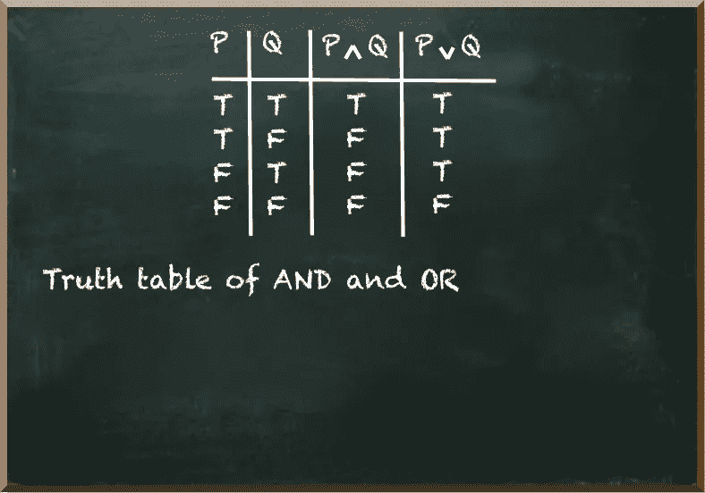
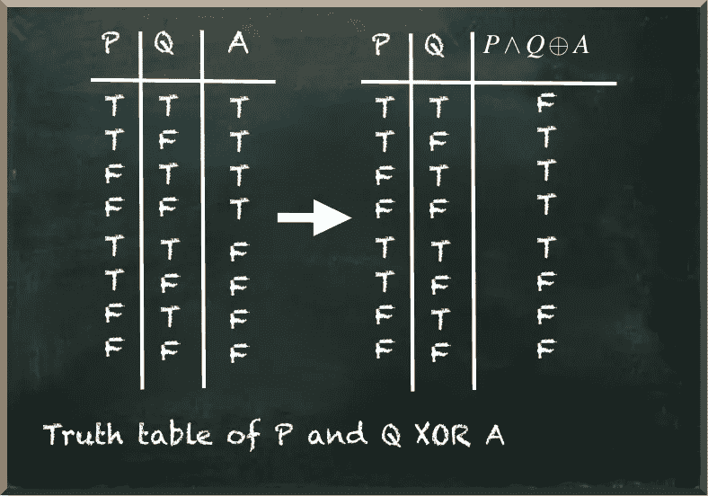
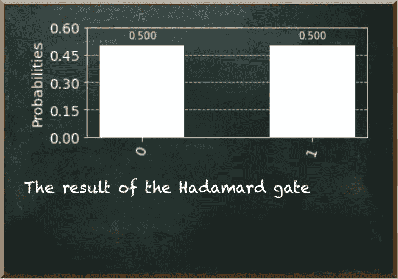
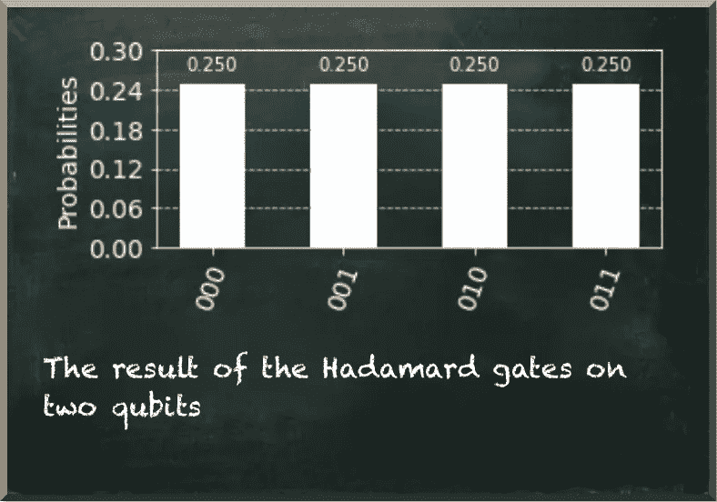
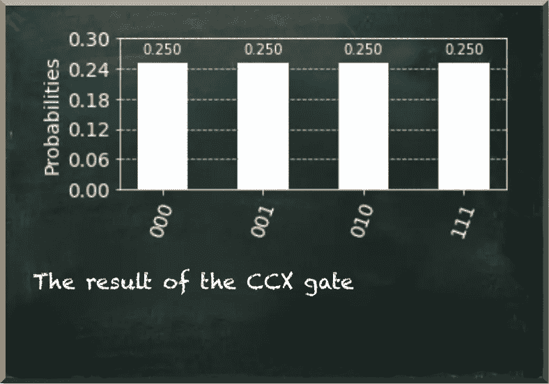
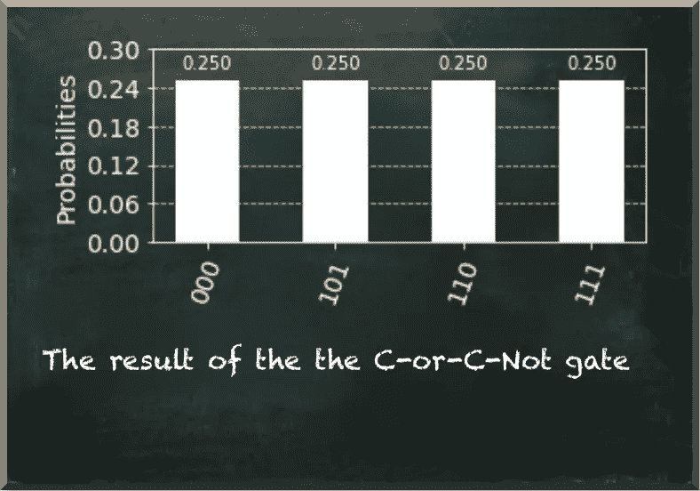

# 量子计算没什么不同，对吧？

> 原文：<https://towardsdatascience.com/quantum-computing-isnt-so-different-is-it-9db28842a4ea?source=collection_archive---------24----------------------->

## Qiskit 中如何实现“and”和“or”

量子机器学习要不要入门？看看 [**动手量子机器学习用 Python**](https://www.pyqml.com/page?ref=medium_different&dest=/) **。**

量子计算从根本上不同于经典计算。在经典计算中，我们使用布尔逻辑。我们评估变量的真值来决定是否执行一个动作或另一个动作。

标准的 if then else 结构最好地说明了这一点。

这种结构的 if 子句通常包含纯布尔逻辑。这里，我们大量使用布尔运算符，如*和*、*或*、*而不是*。

但是布尔逻辑在量子计算中不起作用。在量子计算中，一个量子位的所有转换必须是可逆的。这意味着你不仅需要在给定输入的情况下计算输出，还需要能够在给定输出的情况下计算输入。而这对于一些布尔运算符来说是不可能的，例如，*和*和*或*。

让我们看看代表这些运算符的真值表。

作者图片

真值表表明，我们不能总是告诉什么是输入，什么是输出。例如，如果我们应用`P or Q`，结果得到*真*，我们不知道是`P`为*真*，`Q`为真，还是`P`和`Q`都为*真*。而如果我们应用`P and Q`，如果我们得到*假*作为输出，我们就无法分辨出输入。

这些算符是不可逆的，因此，它们不适合量子比特变换。

幸运的是，我们可以把这些算符转换成可逆的。诀窍是保留原始输入，并将输出写入辅助量子位。让我们考虑一下*和*操作符。

我们用三个而不是两个量子位。我们评估前两个量子位是否*为真，*如果是，我们翻转第三个量子位的值。下图描绘了该运算符的真值表。

作者图片

技术上，我们计算𝑃∧𝑄⊕𝐴.这意味着“P 和 Q 异或 a”。*异或*运算符是异或运算符。只有当 P 或 Q 为真，而另一个为假时，它才为真。如果两者都为真或都为假，则为假。

因为我们有三个变量，每个变量有两个可能的值，所以有 2 =8 种不同的组合。如你所见，辅助变量 A 的输入也很重要。P 和 Q 的列保持不变，但是如果 P 和 Q 为真，辅助值的值会改变。最重要的是，给定任何输出，我们可以识别输入是什么。这种转变是可逆的。

在量子计算中，我们不处理真值，而是处理量子位状态。一个量子位的基本状态是|0⟩，我们测量为 0，|1⟩，我们测量为 1。

当我们在|0⟩态的量子位上应用哈达玛门时，会产生|+⟩.态在这种状态下，我们测量量子位为 0 或 1，各有 50%的概率。让我们看一看。

作者图片

所以，我们准备一个三个量子比特的量子电路。此外，我们将它们的引用存储在 Python 变量`P`、`Q`和`A`中。

当我们对 P 和 Q 应用 Hadamard 门时，我们看到四种不同的状态。在图中，量子位从右(P)到左(A)读取。我们测量量子位 A 总是为 0，因为我们没有接触它。

作者图片

应用𝑃∧𝑄⊕𝐴的量子变换门是托夫里门。它也被称为 CCNOT 门，其中 CC 代表“受控-受控”如果你再看看真值表，你可以看到，如果另外两个量子位(它们是控制量子位)处于|1⟩.状态，这个算符就改变了辅助量子位(也就是目标量子位)的值

作者图片

结果表明，只有当量子位 p 和 q 处于|1⟩态并且被测量为 1 时，我们才测量目标量子位 a(左手量子位)为 1。

接下来，我们来看看运营商𝑃∨𝑄⊕𝐴.如果量子位 p 或量子位 q 处于|1⟩.状态，这个操作者应该在目标量子位上应用非门

作者图片

正如我们在结果中看到的，如果一个或两个控制量子位处于|1⟩.状态，我们测量目标量子位 a 为 1 这里的技巧是应用两个额外的受控非门。单个受控非门将量子位𝑃⊗𝐴转换成𝑃⊗𝑃⊕𝐴.

如果𝑃在|1⟩.，第一个受控非门将𝐴从|0⟩切换到|1⟩如果𝑄不在|1⟩状态，其他两个门什么也不做，因此，留下量子位𝐴在|1⟩.状态

因此，如果只有量子位𝑄处于|1⟩状态，那么门`qc.cx(Q, A)`将𝐴从|0⟩切换到|1⟩，而其他两个门什么也不做。

最后，如果两个量子位都在|1⟩态，那么所有三个门都适用。第一扇大门把𝐴从|0⟩变成了|1⟩.第二扇门把它转回|0⟩，第三扇门又把它转回|1⟩。

# 结论

量子计算在许多方面不同于经典计算。我们需要处理的一个特性是转换门所需的可逆性。经典算符没有这个要求。而且不是所有的都是可逆的。

在这篇文章中，我们学习了一些技巧，让我们把一个不可逆的算符变成一个可逆的量子算符。但是我们必须谨慎对待这些知识。我们不应该试图在量子电路中复制经典逻辑。当我们想要挖掘量子优势时，我们需要换一种方式思考。

然而，即使在先进的量子算法中，我们也使用这样的基本结构来准备量子态，以代表我们要解决的问题。

量子机器学习要不要入门？看看 [**动手量子机器学习用 Python**](https://www.pyqml.com/page?ref=medium_different&dest=/) **。**

在这里免费获得前三章。