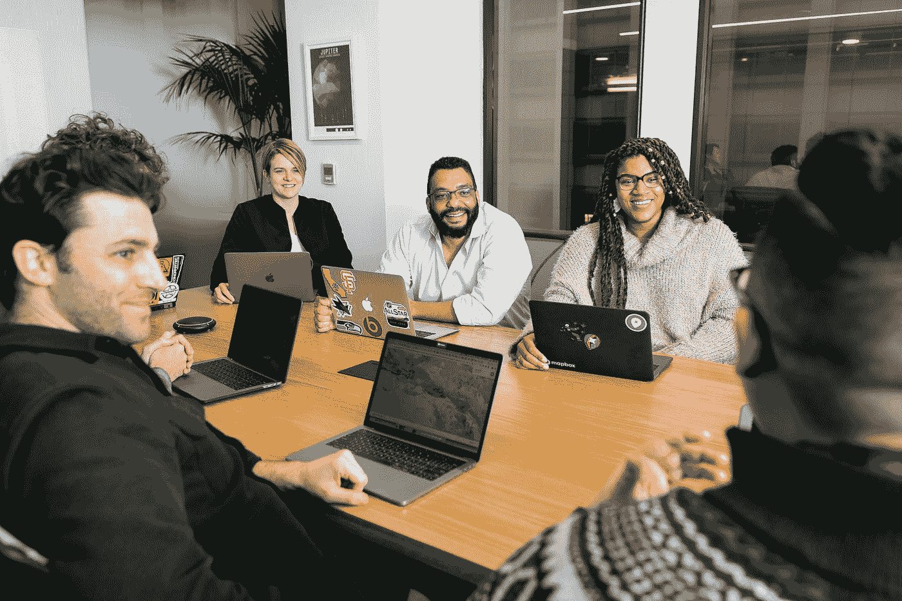

# 量子计算——为什么高管必须抽出时间

> 原文：<https://towardsdatascience.com/quantum-computing-why-executives-must-find-time-48a6f756d81d?source=collection_archive---------39----------------------->

## 量子计算:为什么你应该关心(不到 30 分钟)

## 围绕理解量子计算的潜力，向经理和高管们发出战斗号令

由 [Unsplash](https://unsplash.com?utm_source=medium&utm_medium=referral) 上的[地图框](https://unsplash.com/@mapbox?utm_source=medium&utm_medium=referral)拍摄

这是我最近关于量子计算商业相关性的电子书的第 3 部分。

第一部分([见此](/quantum-computing-whats-it-all-about-cf2482fd7583?sk=c35ee3538c10bf1c1b9c782886709ad4))简要概述了什么是量子计算。第二节([看这里](/quantum-computing-how-it-could-be-used-6f873dfb7cea?sk=4975f20dfd7e2f377b21b99cd811fd18))讲的是现实中的意思。本节讨论量子就绪性，并阐明为什么经理和高管需要今天就开始理解这一点，即使他们的第一步很小。

# 所以，我明白了，但是我有点忙！

在 2021 年第三季度，坐在这里很容易看到量子不可能成为优先事项。我的意思是，我们不仅担心未来的 Covid 浪潮，而且我们有十几个 ESG 优先事项，我们担心德克萨斯州停电向我们展示了二十世纪中叶的基础设施，我们有不确定的全球地缘政治局势，我们因苏伊士运河封锁而措手不及，我们受到来自各方的勒索软件的威胁，我们正在努力应对多样化、多代人工作场所的挑战，我们的社会动荡达到了一代人所未见的水平。

因此，很容易把这个话题抛到脑后。也许你在想“这个可以等”直到有更好的有现实价值的例子出现。人们也很容易反思最近的热门词汇，如人工智能、区块链、云，并考虑到尽管有所有董事会级别的会议，但大多数会议都是由数据和 It 人员处理的，所以为什么 quantum 应该有所不同？但我认为这个*与*不同。这不是某个特定团队的新工具，这就像台式电脑、互联网和智能手机的到来一样重要。正如我们在开始时所说的，你不想在每一次革命中更加积极主动吗？

当时棘手的是，很难真正讨论这些技术将如何改变事情。但是我们现在处于 20 多岁，当我们学习新事物时，数据和通信渠道不再是限制因素。事实上，限制因素是高管的经验和大胆的决策，这是剔除主题中多余噪音中的重要内容所必需的。然而，你的工作不是完全理解这个话题，而是将不同的人聚集在一起，给他们一个框架来回答‘这对我们有多重要？’以及‘我们应该何时以及如何开始参与？’。这是每一位经理和高管每周都应该考虑的两个问题。对于 quantum 来说，这没什么不同，只是奖励的规模和不作为的风险要大得多。

因此，在我们开始总结的时候，让我们来掩盖一些很容易让你忘记这个话题的话题。

# 仅仅是泡沫吗？

如今的高管们已经经历了所有商业领袖中最广泛的一系列由技术驱动的变革。世纪之交互联网的到来改变了许多企业的工作方式，即使互联网泡沫破灭，情况仍然明显不同。智能手机和社交媒体的同时到来同样具有破坏性。在技术方面，最近的流行语是人工智能和区块链。前者宽泛而模糊，通常与“计算机是智能的”这一概念混为一谈。英国首相鲍里斯·约翰逊在 2020 年提到了一种与英国考试成绩相关的“变异*算法*，这玷污了这个词整整一代人。很可能只有当无人驾驶汽车真正起飞的时候(一语双关非有意)，人们才会真正看到 AI 在生活中的真正影响。

有人会说区块链是一种明显的比较器技术。从一个“非技术”主管的角度来看，它的复杂性和深奥本质是表面相似的。2016 年至 2019 年期间，区块链在大多数主流媒体上受到尊敬，世界各地的高管团队和董事会为区块链大师支付了过高的价格，以举办关于“分布式账本技术”将如何彻底改变他们的业务的研讨会。

除了比特币会让一小部分人变得非常富有之外，区块链科技还没有带来任何实质性的东西。虽然它将在幕后变得越来越普遍，因为它在某些情况下确实有非常真实的用途，但它让许多高管不再认为他们应该投入任何时间(或金钱)来尽早接触复杂的新技术。

重要的是，量子计算不会因为变异算法或者毫无意义的区块链宣言的影响而受到冷遇。所谓的量子冬天，技术发展慢于预期，潜在买家不感兴趣，这不太可能，但也不是不可能，这是高管们认真考虑量子准备工作时机的真正原因

# 我能获得真正的竞争优势吗？

在某种程度上，最重要的问题是*行动更快的人会获得不容置疑的领先优势吗？*一般来说，量子算法在商业领域的应用将是渐进的——这既是因为量子计算机能力的不断进步，也是因为改变游戏规则的量子计算“杀手级应用”将需要数年才能出现。

因此，早期行动者可能会使用他们的算法在投资组合中生成几个基点，或者降低 0.1%的物流成本，或者减少能源消耗。这是无可争议的“真金白银”，但它不会从根本上改变竞争环境，也不能转化为有意义的长期竞争优势，因为它的竞争对手可以复制。

一个不同的思维领域表明，尽管网络优化问题的收益微不足道，但围绕建模的工作可能会导致专利保护这些发现的巨大不连续性，足以改变该行业的格局——如果一种新的汽车电池技术的效率提高 400%，并且工厂可以迅速转化为生产它们，会怎么样？如果化肥的生产成本只有竞争对手的 30%,而且可以快速实施流程变革，那会怎样？如果一家公司找到了在几个月而不是几年内开发新药的方法，会怎么样？这些都可能改变一个行业的动态，让新的领导者拥有不可撼动的地位。

最终，这些未知只是增加了高管的工作，即在 VUCA 世界中为他们的公司定义正确的方向和选择。波动性、不确定性、复杂性和模糊性已经存在了几个世纪，量子计算只是引发更多同样问题的最新导火索。与其他挑战一样，例如不断变化的竞争格局、地缘政治压力、不断变化的客户情绪或对可持续发展的预期，高管的工作是确保他们了解足够多的信息，以减少他们的选项集，使他们能够相对自信地做出正确的决定。

因此，在这一点上，任何高管都不应该真正试图决定他们的十年量子战略，但他们绝对应该考虑他们对量子准备的渴望，以及采取哪些措施来增加他们和他们的组织的知识，消除盲点，并确保当需要做出重要决定时，他们都尽可能地了解情况，而不是受到他们多年前没有做的事情的限制。

# 我的 IT 投资怎么办？

现在应该清楚的是，广泛的量子计算还有一段时间，在最初几年将非常专注于它将做什么。因此，您当前的硬件和软件投资没有快速过时的风险(除了提到的与加密相关的风险)，您的程序员、IT 专业人员和数据科学家的技能组合也没有过时的风险。量子计算与收发电子邮件、制作 PowerPoint、运营工厂、运营电子商务网站、在呼叫中心接听电话或在 Excel 上进行分析毫无关系。

就 IT 的近期变化而言，对新数据分析工具的关注、云的使用、混合工作和敏捷交付模式的实施对您和您的员工的影响将远远超过量子计算。

# 量子计算在打破互联网中的作用。

正如我在开始时提到的，量子计算越来越多地在主流出版物中被讨论的原因之一是因为量子计算机已被证明有能力破解用于保持互联网安全的大部分加密。麻省理工学院的彼得·肖尔在 1994 年提出了一种算法，肖尔的算法至今仍是最著名的质量控制算法。许多现代加密技术的基础是计算机分解非常大的数字的速度很慢。Shor 认为量子计算机非常适合这项任务。

*最近的分析表明，要在一天内破解 RSA 2048 位加密，需要一台数百万量子比特的量子计算机。即使我们离这种机器还有几年时间，也可能需要十年或更长时间来替换 it 和通信系统的核心元素，因此这个话题现在变得越来越重要。由于所涉及的成本和相关的战略问题，这个话题正从首席信息官& CISO(首席信息官&首席信息安全官)转移到首席运营官、首席财务官，并可能转移到高管团队和董事会。*

*在某些方面，令人沮丧的是，对于这些高管来说，第一次真正接触量子计算将是一场关于风险的讨论，以及以一种不创造新价值的防御性方式花费大量资金的讨论。如果我们能利用这些讨论让他们意识到 QC 对他们的行业和业务更广泛、更有益的方面，那将是一线希望。*

***今天收获，明天解密***

可以说，最直接的担忧是“今天收获，明天解密”攻击(HTDT)的概念，在这种攻击中，数据在正常的网络攻击中被悄悄渗透(即黑客不会公布它已被窃取)，并被保留，直到使用量子计算机解密变得经济划算。这可能是在 5 年、10 年或 15 年后，虽然大多数数据在这段时间内价值很小或没有价值，但某些类型的数据(例如健康数据、银行记录、政府和军事信息)可能有价值。这可能看起来不可思议，但越来越多的人认为，这种威胁正在增加，攻击可能已经发生。

# 量子冬天的风险？

许多 QC 实践者关心量子冬天的概念。这个短语，在 AI-winter 的上下文中使用得更广泛，是指在一个技术的快速和热情增长期之后，由于没有回报的期望，事情似乎变得缓慢。要获得发展一个新技术产业所需的投资，需要一种微妙的平衡，但不能过度承诺影响的速度(以及财务回报)。无论所有参与者如何意识到这种风险，这都是一个经典的博弈论问题，每个人(研究人员、初创企业等)都希望尽可能多地制造噪音，以获得关注，但更深思熟虑、近乎冷漠的方法会更好地服务于整体空间。

随着主流媒体和更广泛的投资圈越来越多地提到“量子计算”，这些担忧在 2020 年首次被提出。对于事情将如何发展，专家们有着强烈的不同观点，可能的道路是持续的、令人印象深刻的技术发展，但真正的业务影响有些滞后。

从高管思考量子就绪的角度来看，在 2021 年下半年考虑这个话题肯定比 18 个月前更容易。硬件、软件和算法的加速发展，以及顾问和咨询师生态系统的明显增长，意味着尽管预测时间表仍然是不可能的，但现在越来越适合考虑你的量子准备计划。

# 其他类型的量子技术

*科学家和工程师正在利用物质的量子特性取得多项其他技术进步。这些基本上与本入门书中的量子计算讨论无关，提及它们会分散注意力，而且在大多数情况下，尽管在利基领域非常重要，但在执行层面上并不相关。*

*这些其他术语包括*量子通信、量子光子学、量子传感器和量子随机数生成。

*更令人困惑的是，虽然大多数技术都不相关，但其中一些技术是“后量子密码术”的关键，它降低了我们之前讨论的量子计算机入侵通信网络的风险。*

*我的建议？忽略这一切；对你们中 99%的人来说，唯一重要的量子事物是量子计算。*

# 我就不能等到 QCs 正式可用吗？

尽管经典计算机可以更好地(也更便宜地)完成同样的工作，但公司开始开发和运行量子算法还有另一个很好的原因。这个原因是关于测试和证明，以及关于对正在开发的工具的信心

一旦我们有了真正的量子优势，就很难直接确认 QC 的计算结果。这种缺乏检查的情况让许多人感到不安——从将开发算法的数据科学家，到需要向监管机构确认他们的公司了解他们的技术如何运作的合规官。因此，通过开发和运行简单的量子算法，其输出可以与经典计算机的输出相比较，公司可以围绕他们的方法建立信心。

在许多情况下，公司会将这些早期量子算法的开发外包给第三方，因为他们没有内部技能。即使在这些情况下，尽早开始与这些公司合作也会让双方对合作充满信心，为未来更复杂的工作做好准备。

# 接下来呢？量子就绪和问自己的问题

所以，希望现在已经很清楚，没有人能准确预测什么时候会发生什么。因此，你的目标是找出那些让你以最小成本获得未来期权价值的无悔举措——如果你愿意，这是一个真正的优化和权衡问题！

我挑战你问这些相互关联的问题，这将有助于定义你的**量子准备**立场。

-哪些角色应该考虑这个问题？

-如果我要指定一个重点人物，那会是谁？

-这与哪些机会最相关？

-我所在的行业对新技术有什么看法？我们是领导还是跟随？

-我认为我的竞争对手会在多大程度上考虑这个问题？

-我应该采取什么步骤来确保我们稳步建立意识和知识？

-这在我们的风险规划、it 开发路径和创新路线图中处于什么位置？

最重要的是:

-明天我该做哪三件事？

*就这样结束了……*

([所有三章的链接请点击这里](https://medium.com/quantum-london/quantum-computing-primer-chapters-3e17a9a941fd?sk=3ef816f9c9bc74a1d3e615b7b7dca125))

# 阑尾在哪里？

我特意没有阑尾。我希望读者对已经达到这一点感觉很好，并且希望已经完全理解了每一部分。以一个高的、想要更多的结尾要比感觉不够好得多，因为就在你已经“理解”它的时候，你面对的是一页页的“更深的技术”、“进一步的阅读”和“额外的例子”。

相反，在我们结束时，让我围绕“下一步是什么”提出几点最后意见。

这 30 分钟阅读的目的是帮助你决定你是否需要关心。如果你决定不，那绝对没问题。如果你认为是，那么你需要计划和执行你的下一步，努力增加你的知识。

在这样一个快速发展的领域，指向特定资源从来都不是一件简单的事情。对于那些从正式的学术和研究的角度来看，有通常的出版物。对于希望与时俱进的企业高管来说，没有一个地方可以去。

到目前为止，还没有明确的出版物专注于商业方面(尽管这正是我们为量子伦敦所努力的方向)。对于持续不断的简短、易于理解的文章，尽管大部分是关于技术和投资方面的，你可以看量子日报和量子计算报告。对于更不敬的观点，塞尔吉奥·加戈在量子海盗上发表了文章，而量子伦敦的*量子计算*出版物可以在媒体上为你们中的成员关注

一些以商业为重点的量子会议已经举办了几年。这些显然是在过去的 12 个月里上线的。看到他们决定在后疫情时代追求什么样的模式将会很有趣。

就定期网络研讨会而言，请务必关注我们在 Quantum London 以及众多合作伙伴的成果。对于保险行业的人来说，Quantum London 负责人 Anahita Zardoshti 的必读书是最近关于保险行业量子计算的报告，其中也包括对技术方面的稍微深入的了解。所有的链接都可以在 [www.qubits.london](http://www.qubits.london) 找到。

如果这本入门书吊起了你的胃口，那么我们也推荐第一本关于量子计算的商业影响的完整书籍。这是 Quantum London 的一个朋友写的，他也是一名普通的技术作家，Brian Lenahan。

# 关于量子伦敦的一个注记

***量子伦敦*** *是一个由* [*伊曼纽·科隆内拉*](https://medium.com/u/e2ba90adfef0?source=post_page-----48a6f756d81d--------------------------------)*[*阿纳希塔·扎多什蒂*](https://medium.com/u/7ffef390c8be?source=post_page-----48a6f756d81d--------------------------------) *和我、* [*保罗·库莫*](https://medium.com/u/c6b925fddc7a?source=post_page-----48a6f756d81d--------------------------------) *经营的协会。在整个疫情，它举办了网络研讨会、量子 Stammtisch 讨论活动和在线编码会议。当我们回到一个更现实的世界，我们将继续我们的商业使命一个关注量子的商业影响的社区。这将通过我们的在线全球活动以及在伦敦、英国和意大利米兰的现场活动来实现。**

*请看这里之前的章节:第一节([见这里](/quantum-computing-whats-it-all-about-cf2482fd7583?sk=c35ee3538c10bf1c1b9c782886709ad4))简要概述了什么是量子计算。Section 2 ( [见此处](/quantum-computing-how-it-could-be-used-6f873dfb7cea?sk=4975f20dfd7e2f377b21b99cd811fd18))讲的是现实中的意思。*

***关于作者***

*Paolo Cuomo 在保险行业工作，但一直对新技术如何影响传统行业感兴趣。*

*Paolo 坚信通过简短、清晰的解释让对话进行下去。这本初级读本旨在为量子计算做些什么，让企业高管理解“量子就绪”的必要性。*

*Paolo 的大部分见解来自于他采访的专家，并通过他共同主持的网络研讨会系列听取了这些专家的意见，这是量子伦敦计划的一部分。*

*Paolo 拥有伦敦帝国理工学院的电子工程硕士学位和芝加哥附近凯洛格管理学院的 MBA 学位。他是工程技术学院的研究员。*